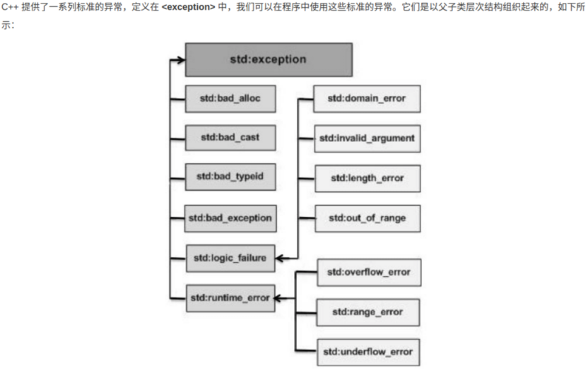

# C++ 语法

> 文件夹中 根目录下的为基础知识，top_course为高级知识

## 1.基本类型

## 2.枚举类型，类型命名

## 3.变量和常量

C++ 中有两种类型的表达式：

- 左值（lvalue）：指向内存位置的表达式被称为左值（lvalue）表达式。左值可以出现在赋值号的左边或右边。
- 右值（rvalue）：术语右值（rvalue）指的是存储在内存中某些地址的数值。右值是不能对其进行赋值的表达式，也就是说，右值可以出现在赋值号的右边，但不能出现在赋值号的左边。

变量作用域：
在程序中，局部变量和全局变量的名称可以相同，但是在函数内，局部变量的值会覆盖全局变量的值。

初始化局部变量和全局变量
当局部变量被定义时，系统不会对其初始化，您必须自行对其初始化。定义全局变量时，系统会自动初始化为下列值：

| 数据类型 | 初始化数据值 |
| :------: | :----------: |
| int      | ０           |
| char     | '\0'         |
| float    | 0            |
| double   | 0            |
| pointer  | NULL         |

常量是固定值，在程序执行期间不会改变。这些固定的值，又叫做字面量。

常量可以是任何的基本数据类型，可分为整型数字、浮点数字、字符、字符串和布尔值。

在 C++ 中，有两种简单的定义常量的方式：

- 使用 #define 预处理器。
- 使用 const 关键字。

## 4.修饰符类型

C++ 允许在 char、int 和 double 数据类型前放置修饰符。修饰符用于改变基本类型的含义，所以它更能满足各种情境的需求。
下面列出了数据类型修饰符：

- signed
- unsigned
- long
- short

修饰符 signed、unsigned、long 和 short 可应用于整型，signed 和 unsigned 可应用于字符型，long 可应用于双精度型。

修饰符 signed 和 unsigned 也可以作为 long 或 short 修饰符的前缀。例如：unsigned long int。

C++ 允许使用速记符号来声明无符号短整数或无符号长整数。您可以不写 int，只写单词 unsigned、short 或 unsigned、long，
int 是隐含的.

C++ 中的类型限定符:

| 限定符   | 含义 |
| -------- | ----------------- |
| const    | const 类型的对象在程序执行期间不能被修改改变。|
| volatile | 修饰符 volatile 告诉编译器不需要优化volatile声明的变量，让程序可以直接从内存中读取变量。
对于一般的变量编译器会对变量进行优化，将内存中的变量值放在寄存器中以加快读写效率。 |
| restrict | 由 restrict 修饰的指针是唯一一种访问它所指向的对象的方式。只有 C99 增加了新的类型限定符 restrict|

## 5.C++ 存储类

存储类定义 C++ 程序中变量/函数的范围（可见性）和生命周期。这些说明符放置在它们所修饰的类型之前。下面列出 C++ 程序中可用的存储类：

- auto
- register
- static
- extern
- mutable
- thread_local (C++11)

从 C++ 11 开始，auto 关键字不再是 C++ 存储类说明符，且 register 关键字被弃用

auto 存储类

自 C++ 11 以来，auto 关键字用于两种情况：声明变量时根据初始化表达式自动推断该变量的类型、声明函数时函数返回值的占位符。
C++98标准中auto关键字用于自动变量的声明，但由于使用极少且多余，在C++11中已删除这一用法。

register 存储类

register 存储类用于定义存储在寄存器中而不是 RAM 中的局部变量。这意味着变量的最大尺寸等于寄存器的大小（通常是一个词），
且不能对它应用一元的 '&' 运算符（因为它没有内存位置）。

static 存储类

static 存储类指示编译器在程序的生命周期内保持局部变量的存在，而不需要在每次它进入和离开作用域时进行创建和销毁。因此，使用 static 修饰局部变量可以在函数调用之间保持局部变量的值。
static 修饰符也可以应用于全局变量。当 static 修饰全局变量时，会使变量的作用域限制在声明它的文件内。

extern 存储类

extern 存储类用于提供一个全局变量的引用，全局变量对所有的程序文件都是可见的。当您使用 'extern' 时，对于无法初始化的变量，
会把变量名指向一个之前定义过的存储位置。
当您有多个文件且定义了一个可以在其他文件中使用的全局变量或函数时，可以在其他文件中使用 extern 来得到已定义的变量或函数的
引用。可以这么理解，extern 是用来在另一个文件中声明一个全局变量或函数。
extern 修饰符通常用于当有两个或多个文件共享相同的全局变量或函数的时候。

mutable 存储类

mutable 说明符仅适用于类的对象。它允许对象的成员替代常量。也就是说，mutable 成员可以通过 const 成员函数修改。

thread_local 存储类

使用 thread_local 说明符声明的变量仅可在它在其上创建的线程上访问。 变量在创建线程时创建，并在销毁线程时销毁。 每个线程都有其自己的变量副本。

thread_local 说明符可以与 static 或 extern 合并。

可以将 thread_local 仅应用于数据声明和定义，thread_local 不能用于函数声明或定义。

## 6.运算符

- 算术运算符
    假设变量 A 的值为 10，变量 B 的值为 20：
    | 运算符 | 描述 | 实例 |
    | ------ | ---- | ---- |
    | +    |把两个操作数相加|A + B 将得到 30
    | -   |从第一个操作数中减去第二个操作数|A - B 将得到 -10
    | *    |把两个操作数相乘|A * B 将得到 200
    | /    |分子除以分母|B / A 将得到 2
    | %    |取模运算符，整除后的余数|B % A 将得到 0
    | ++    |自增运算符，整数值增加 1|A++ 将得到 11
    | --    |自减运算符，整数值减少 1|A-- 将得到 9

- 关系运算符
    假设变量 A 的值为 10，变量 B 的值为 20，则：

    |运算符 |描述|实例|
    |---|---|---|
    |==|检查两个操作数的值是否相等，如果相等则条件为真。|(A == B) 不为真。
    |!=|检查两个操作数的值是否相等，如果不相等则条件为真。|(A != B) 为真。
    |>|检查左操作数的值是否大于右操作数的值，如果是则条件为真。|(A > B) 不为真。
    |<|检查左操作数的值是否小于右操作数的值，如果是则条件为真。|(A < B) 为真。
    |>=|检查左操作数的值是否大于或等于右操作数的值，如果是则条件为真。|(A >= B) 不为真。
    |<=|检查左操作数的值是否小于或等于右操作数的值，如果是则条件为真。|(A <= B) 为真。

- 逻辑运算符
    假设变量 A 的值为 1，变量 B 的值为 0，则：

    |运算符|描述|实例|
    |---|---|---|
    |&&|称为逻辑与运算符。如果两个操作数都非零，则条件为真。|(A && B) 为假。
    | \|\| |称为逻辑或运算符。如果两个操作数中有任意一个非零，则条件为真。|(A \|\| B) 为真。
    | !|称为逻辑非运算符。用来逆转操作数的逻辑状态。如果条件为真则逻辑非运算符将使其为假。|!(A && B) 为真。

- 位运算符
    位运算符作用于位，并逐位执行操作。&、 | 和 ^ 的真值表如下所示：

    |p|q|p & q|p \| q|p ^ q|
    |---|---|---|---|---|
    |0|0|0|0|0|
    |0|1|0|1|1|
    |1|1|1|1|0|
    |1|0|0|1|1|

- 赋值运算符

    |运算符|描述|实例|
    |---|---|---|
    |=|简单的赋值运算符，把右边操作数的值赋给左边操作数|C = A + B 将把 A + B 的值赋给 C|
    |+=|加且赋值运算符，把右边操作数加上左边操作数的结果赋值给左边操作数|C += A 相当于 C = C + A|
    |-=|减且赋值运算符，把左边操作数减去右边操作数的结果赋值给左边操作数|C -= A 相当于 C = C - A|
    |*=|乘且赋值运算符，把右边操作数乘以左边操作数的结果赋值给左边操作数|C *= A 相当于 C = C * A|
    |/=|除且赋值运算符，把左边操作数除以右边操作数的结果赋值给左边操作数|C /= A 相当于 C = C / A|
    |%=|求模且赋值运算符，求两个操作数的模赋值给左边操作数|C %= A 相当于 C = C % A|
    |<<=|左移且赋值运算符|C <<= 2 等同于 C = C << 2|
    |>>=|右移且赋值运算符|C >>= 2 等同于 C = C >> 2|
    |&=|按位与且赋值运算符|C &= 2 等同于 C = C & 2|
    |^=|按位异或且赋值运算符|C ^= 2 等同于 C = C ^ 2|
    |\|=|按位或且赋值运算符|C \|= 2 等同于 C = C \| 2|

- 杂项运算符

    |运算符|描述|
    |---|---|
    |sizeof|sizeof 运算符返回变量的大小。例如，sizeof(a) 将返回 4，其中 a 是整数。|
    |Condition ? X : Y|条件运算符。如果 Condition 为真 ? 则值为 X : 否则值为 Y。|
    |,|逗号运算符会顺序执行一系列运算。整个逗号表达式的值是以逗号分隔的列表中的最后一个表达式的值。|
    |.（点）和 ->（箭头）|成员运算符用于引用类、结构和共用体的成员。|
    |Cast|强制转换运算符把一种数据类型转换为另一种数据类型。例如，int(2.2000) 将返回 2。|
    |&|指针运算符 & 返回变量的地址。例如 &a; 将给出变量的实际地址。|
    |*|指针运算符 * 指向一个变量。例如，*var; 将指向变量 var。|

- 运算符优先级:

    |类别 |运算符 |结合性 |
    |---|---|---|
    |后缀 |() [] -> . ++ - - |从左到右 |
    |一元 |+ - ! ~ ++ - - (type)* & sizeof| 从右到左 |
    |乘除 |* / %|从左到右 |
    |加减 |+ - |从左到右 |
    |移位 |<< >> |从左到右 |
    |关系 |< <= > >= |从左到右 |
    |相等 |== != |从左到右 |
    |位与 AND| & |从左到右 |
    |位异或 XOR|^ |从左到右 |
    |位或 OR |\| |从左到右 |
    |逻辑与 AND| && |从左到右 |
    |逻辑或 OR| \|\| |从左到右 |
    |条件 |?: |从右到左 |
    |赋值 |= += -= *= /= %=>>= <<= &= ^= \|= |从右到左 |
    |逗号 |, |  |

## 7.循环和判断

循环类型：

|循环类型|描述|
|---|---|
|while 循环|当给定条件为真时，重复语句或语句组。它会在执行循环主体之前测试条件。|
|for 循环|多次执行一个语句序列，简化管理循环变量的代码。|
|do...while 循环|除了它是在循环主体结尾测试条件外，其他与 while 语句类似。|
|嵌套循环|您可以在 while、for 或 do..while 循环内使用一个或多个循环。|

循环控制语句：

|控制语句|描述|
|---|---|
|break 语句|终止 loop 或 switch 语句，程序流将继续执行紧接着 loop 或 switch 的下一条语句。|
|continue 语句|引起循环跳过主体的剩余部分，立即重新开始测试条件。|
|goto 语句|将控制转移到被标记的语句。但是不建议在程序中使用 goto 语句。|

判断语句
C++ 编程语言提供了以下类型的判断语句。点击链接查看每个语句的细节。

|语句|描述|
|---|---|
|if 语句|一个 if 语句 由一个布尔表达式后跟一个或多个语句组成。|
|if...else 语句|一个 if 语句 后可跟一个可选的 else 语句，else 语句在布尔表达式为假时执行。|
|嵌套 if 语句|您可以在一个 if 或 else if 语句内使用另一个 if 或 else if 语句。|
|switch 语句|一个 switch 语句允许测试一个变量等于多个值时的情况。|
|嵌套 switch 语句||

? : 运算符

## 8.函数

```C++
return_type function_name( parameter list )
{
   body of the function
}
```

- 返回类型：一个函数可以返回一个值。return_type 是函数返回的值的数据类型。有些函数执行所需的操作而不返回值，在这种情况下，return_type 是关键字 void。
- 函数名称：这是函数的实际名称。函数名和参数列表一起构成了函数签名。
- 参数：参数就像是占位符。当函数被调用时，您向参数传递一个值，这个值被称为实际参数。参数列表包括函数参数的类型、顺序、数量。参数是可选的，也就是说，函数可能不包含参数。
- 函数主体：函数主体包含一组定义函数执行任务的语句。

函数参数：

|调用类型|描述|
|---|---|
|传值调用|该方法把参数的实际值复制给函数的形式参数。在这种情况下，修改函数内的形式参数对实际参数没有影响。|
|指针调用|该方法把参数的地址复制给形式参数。在函数内，该地址用于访问调用中要用到的实际参数。这意味着，修改形式参数会影响实际参数。
|引用调用|该方法把参数的引用复制给形式参数。在函数内，该引用用于访问调用中要用到的实际参数。这意味着，修改形式参数会影响实际数。

默认情况下，C++ 使用传值调用来传递参数。一般来说，这意味着函数内的代码不能改变用于调用函数的参数。之前提到的实例，调用 max() 函数时，使用了相同的方法。

Lambda 函数与表达式

C++11 提供了对匿名函数的支持,称为 Lambda 函数(也叫 Lambda 表达式)。

Lambda 表达式把函数看作对象。Lambda 表达式可以像对象一样使用，比如可以将它们赋给变量和作为参数传递，还可以像函数一样对其求值。

Lambda 表达式本质上与函数声明非常类似。Lambda 表达式具体形式如下:

`[capture](parameters)->return-type{body}`

例如：

`[](int x, int y){ return x < y ; }`

如果没有返回值可以表示为：

`[capture](parameters){body}`

例如：

`[]{ ++global_x; }`

在一个更为复杂的例子中，返回类型可以被明确的指定如下：

`[](int x, int y) -> int { int z = x + y; return z + x; }`

`[]      // 沒有定义任何变量。使用未定义变量会引发错误`

`[x, &y] // x以传值方式传入（默认），y以引用方式传入。`

`[&]     // 任何被使用到的外部变量都隐式地以引用方式加以引用。`

`[=]     // 任何被使用到的外部变量都隐式地以传值方式加以引用。`

`[&, x]  // x显式地以传值方式加以引用。其余变量以引用方式加以引用。`

`[=, &z] // z显式地以引用方式加以引用。其余变量以传值方式加以引用。`

另外有一点需要注意。对于[=]或[&]的形式，lambda 表达式可以直接使用 this 指针。但是，对于[]的形式，如果要使用 this 指针，必须显式传入：

`[this]() { this->someFunc(); }();`

## 10.C++ 数字

在 C++ 中，除了可以创建各种函数，还包含了各种有用的函数供您使用。这些函数写在标准 C 和 C++ 库中，叫做内置函数。您可以在程序中引用这些函数。

C++ 内置了丰富的数学函数，可对各种数字进行运算。下表列出了 C++ 中一些有用的内置的数学函数。

为了利用这些函数，您需要引用数学头文件 <cmath>。

|序号|函数 | 描述|
|---|---|---|
|1|double cos(double);|该函数返回弧度角（double 型）的余弦。|
|2|double sin(double);|该函数返回弧度角（double 型）的正弦。|
|3|double tan(double);|该函数返回弧度角（double 型）的正切。|
|4|double log(double);|该函数返回参数的自然对数。|
|5|double pow(double, double);|假设第一个参数为 x，第二个参数为 y，则该函数返回 x 的 y 次方。|
|6|double hypot(double, double);|该函数返回两个参数的平方总和的平方根，也就是说，参数为一个直角三角形的两个直角边，函数会返回斜边的长度。|
|7|double sqrt(double);|该函数返回参数的平方根。|
|8|int abs(int);|该函数返回整数的绝对值。|
|9|double fabs(double);|该函数返回任意一个十进制数的绝对值。|
|10|double floor(double);|该函数返回一个小于或等于传入参数的最大整数。|

C++ 随机数
在许多情况下，需要生成随机数。关于随机数生成器，有两个相关的函数。一个是 rand()，该函数只返回一个伪随机数。生成随机数之前必须先调用srand()函数。

## 11.数组

|概念|描述|
|---|---|
|多维数组|C++ 支持多维数组。多维数组最简单的形式是二维数组。|
|指向数组的指针|您可以通过指定不带索引的数组名称来生成一个指向数组中第一个元素的指针。|
|传递数组给函数|您可以通过指定不带索引的数组名称来给函数传递一个指向数组的指针。|
|从函数返回数组|C++ 允许从函数返回数组。|

## 12.字符串

|序号|函数 | 目的|
|---|---|---|
|1|strcpy(s1, s2);|复制字符串 s2 到字符串 s1。|
|2|strcat(s1, s2);|连接字符串 s2 到字符串 s1 的末尾。|
|3|strlen(s1);|返回字符串 s1 的长度。|
|4|strcmp(s1, s2);|如果 s1 和 s2 是相同的，则返回 0；如果 s1<s2 则返回值小于 0；如果 s1>s2 则返回值大于 0。|
|5|strchr(s1, ch);|返回一个指针，指向字符串 s1 中字符 ch 的第一次出现的位置。|
|6|strstr(s1, s2);|返回一个指针，指向字符串 s1 中字符串 s2 的第一次出现的位置。|

## 13.指针

> 指针是一个变量，其值为另一个变量的地址，即，内存位置的直接地址。就像其他变量或常量一样，您必须在使用指针存储其他变量地址之前，
对其进行声明。指针变量声明的一般形式为：

    type *var-name;

在这里，type 是指针的基类型，它必须是一个有效的 C++ 数据类型，var-name 是指针变量的名称。用来声明指针的星号 * 与乘法中使用的星号是相同的。但是，在这个语句中，星号是用来指定一个变量是指针。以下是有效的指针声明：

```C++
int    *ip;    /* 一个整型的指针 */
double *dp;    /* 一个 double 型的指针 */
float  *fp;    /* 一个浮点型的指针 */
char   *ch;    /* 一个字符型的指针 */
```

所有指针的值的实际数据类型，不管是整型、浮点型、字符型，还是其他的数据类型，都是一样的，都是一个代表内存地址的长的十六进制数。不同数据类型的指针之间唯一的不同是，指针所指向的变量或常量的数据类型不同。

C++ 指针详解

|概念|描述|
|---|---|
|C++ Null 指针|C++ 支持空指针。NULL 指针是一个定义在标准库中的值为零的常量。|
|C++ 指针的算术运算|可以对指针进行四种算术运算：++、--、+、-|
|C++ 指针 vs 数组|指针和数组之间有着密切的关系。|
|C++ 指针数组|可以定义用来存储指针的数组。|
|C++ 指向指针的指针|C++ 允许指向指针的指针。|
|C++ 传递指针给函数|通过引用或地址传递参数，使传递的参数在调用函数中被改变。|
|C++ 从函数返回指针|C++ 允许函数返回指针到局部变量、静态变量和动态内存分配。|

## 14.引用

引用变量是一个别名，也就是说，它是某个已存在变量的另一个名字。一旦把引用初始化为某个变量，就可以使用该引用名称或变量名称来指向变量。

C++ 引用 vs 指针
引用很容易与指针混淆，它们之间有三个主要的不同：

- 不存在空引用。引用必须连接到一块合法的内存。
- 一旦引用被初始化为一个对象，就不能被指向到另一个对象。指针可以在任何时候指向到另一个对象。
- 引用必须在创建时被初始化。指针可以在任何时间被初始化。

|概念|描述|
|---|---|
|把引用作为参数|C++ 支持把引用作为参数传给函数，这比传一般的参数更安全。|
|把引用作为返回值|可以从 C++ 函数中返回引用，就像返回其他数据类型一样。|

## 15.日期 & 时间

|序号|函数 | 描述|
|---|---|---|
|1|time_t time(time_t *time);|该函数返回系统的当前日历时间，自 1970 年 1 月 1 日以来经过的秒数。如果系统没有时间，则返回 .1。|
|2|char *ctime(const time_t *time);|该返回一个表示当地时间的字符串指针，字符串形式 day month year  hours:minutes:seconds year\n\0。|
|3|struct tm *localtime(const time_t *time);|该函数返回一个指向表示本地时间的 tm 结构的指针。|
|4|clock_t clock(void);|该函数返回程序执行起（一般为程序的开头），处理器时钟所使用的时间。如果时间不可用，则返回 .1。|
|5|char * asctime ( const struct tm * time );|该函数返回一个指向字符串的指针，字符串包含了time 所指向结构中存储的信息，返 回形式为：day month date hours:minutes:seconds \|\|year\n\0。|
|6|struct tm *gmtime(const time_t *time);|该函数返回一个指向 time 的指针，time 为 tm 结构，用协调世界时（UTC）也被称为格   林尼治标准时间（GMT）表示。|
|7|time_t mktime(struct tm *time);|该函数返回日历时间，相当于 time 所指向结构中存储的时间。|
|8|double difftime ( time_t time2, time_t time1 );|该函数返回 time1 和 time2 之间相差的秒数。|
|9|size_t strftime();|该函数可用于格式化日期和时间为指定的格式。|

## 16.基本的输入输出

> C++ 的 I/O 发生在流中，流是字节序列。如果字节流是从设备（如键盘、磁盘驱动器、网络连接等）流向内存，这叫做输入操作。如果字节流是从内存流向设备（如显示屏、打印机、磁盘驱动器、网络连接等），这叫做输出操作。

I/O 库头文件

|头文件|函数和描述|
|---|---|
|\<iostream>|该文件定义了 cin、cout、cerr 和 clog 对象，分别对应于标准输入流、标准输出流、非缓冲标准错误流和缓冲标准错误流。|
|\<iomanip>|该文件通过所谓的参数化的流操纵器（比如 setw 和 setprecision），来声明对执行标准化 I/O 有用的服务。|
|\<fstream>|该文件为用户控制的文件处理声明服务。我们将在文件和流的相关章节讨论它的细节。|

## 17.C++ 数据结构

定义结构

``` C++
struct type_name {
    member_type1 member_name1;
    member_type2 member_name2;
    member_type3 member_name3;
    .
    .
} object_names;
```

typedef 关键字
下面是一种更简单的定义结构的方式，您可以为创建的类型取一个"别名"。例如：

```C++
typedef struct Books
{
    char  title[50];
    char  author[50];
    char  subject[100];
    int   book_id;
}Books;
```

`typedef long int *pint32;`

## 18.类 & 对象

> C++ 在 C 语言的基础上增加了面向对象编程，C++ 支持面向对象程序设计。类是 C++ 的核心特性，通常被称为用户定义的类型。
类用于指定对象的形式，它包含了数据表示法和用于处理数据的方法。类中的数据和方法称为类的成员。函数在一个类中被称为类的成员。

类定义是以关键字 class 开头，后跟类的名称。类的主体是包含在一对花括号中。类定义后必须跟着一个分号或一个声明列表。

```C++
class Box
{
    public:
        double length;   // 盒子的长度
        double breadth;  // 盒子的宽度
        double height;   // 盒子的高度
};
```

关键字 public 确定了类成员的访问属性。在类对象作用域内，公共成员在类的外部是可访问的。您也可以指定类的成员为 private 或protected

### 类成员函数:

> 类的成员函数是指那些把定义和原型写在类定义内部的函数，就像类定义中的其他变量一样。类成员函数是类的一个成员，它可以操作类的任意对象，可以访问对象中的所有成员。

```C++
class Box
{
    public:
        double length;         // 长度
        double breadth;        // 宽度
        double height;         // 高度
        double getVolume(void);// 返回体积
};
```

成员函数可以定义在类定义内部，或者单独使用范围解析运算符 :: 来定义。在类定义中定义的成员函数把函数声明为内联的，即便没有使用 inline 标识符。所以您可以按照如下方式定义 Volume() 函数：

```C++
class Box
{
    public:
        double length;         // 长度
        double breadth;        // 宽度
        double height;         // 高度
        double getVolume(void)
        {
            return length * breadth * height;
        }
};
```

您也可以在类的外部使用范围解析运算符 :: 定义该函数，如下所示：

```C++
double Box::getVolume(void)
{
    return length * breadth * height;
}
```

### 类访问修饰符

> 数据封装是面向对象编程的一个重要特点，它防止函数直接访问类类型的内部成员。类成员的访问限制是
通过在类主体内部对各个区域标记 **public、private、protected** 来指定的。关键字 **public、private、protected**
称为访问修饰符。

```C++
class Base {
    public:
    // 公有成员
    protected:
    // 受保护成员
    private:
    // 私有成员
};
```

- 公有（public）成员:公有成员在程序中类的外部是可访问的。您可以不使用任何成员函数来设置和获取公有变量的值，如下所示：
- 私有（private）成员:私有成员变量或函数在类的外部是不可访问的，甚至是不可查看的。只有类和友元函数可以访问私有成员。默认情下，类的所有成员都是私有的。
    > 实际操作中，我们一般会在私有区域定义数据，在公有区域定义相关的函数，以便在类的外部也可以调用这些函数。
- 保护（protected）成员:保护成员变量或函数与私有成员十分相似，但有一点不同，保护成员在派生类（即子类）中是可访问的。

### 类的构造参数

```C++
public:
    void setLength( double len );
    double getLength( void );
    Line();  // 这是构造函数
    Line(double len);  // 这是构造函数
private:
    double length;
```

使用初始化列表来初始化字段

```C++
Line::Line( double len): length(len)
{
    cout << "Object is being created, length = " << len << endl;
}
```

两者等同

```C++
Line::Line( double len)
{
    length = len;
    cout << "Object is being created, length = " << len << endl;
}
```

假设有一个类 C，具有多个字段 X、Y、Z 等需要进行初始化

```C++
C::C( double a, double b, double c): X(a), Y(b), Z(c)
{
  ....
}
```

### 类的析构函数

> 类的析构函数是类的一种特殊的成员函数，它会在每次删除所创建的对象时执行。析构函数的名称与类的名称是完全相同的，只是在前面加了个波浪号（~）作为前缀，它不会返回任何值，也不能带有任何参数。析构函数有助于在跳出程序（比如关闭文件、释放内存等）前释放资源。

### C++ 拷贝构造函数

> 拷贝构造函数是一种特殊的构造函数，它在创建对象时，是使用同一类中之前创建的对象来初始化新创建的对象。拷贝构造函数通常用于：

- 通过使用另一个同类型的对象来初始化新创建的对象。
- 复制对象把它作为参数传递给函数。
- 复制对象，并从函数返回这个对象。

如果在类中没有定义拷贝构造函数，编译器会自行定义一个。如果类带有指针变量，并有动态内存分配，则它必须有一个拷贝构造函数。拷贝构造函数的最常见形式如下：

```C++
classname (const classname &obj) {
   // 构造函数的主体
}
```

### 友元函数

> 类的友元函数是定义在类外部，但有权访问类的所有私有（private）成员和保护（protected）成员。尽管友元函数的原型有在类的定义中出现过，但是友元函数并不是成员函数。
> 友元可以是一个函数，该函数被称为友元函数；友元也可以是一个类，该类被称为友元类，在这种情况下，整个类及其所有成员都是友元。
如果要声明函数为一个类的友元，需要在类定义中该函数原型前使用关键字 friend。


```C++
class Box
{
    double width;

    public:
        double length;
        friend void printWidth( Box box );
        void setWidth( double wid );
};
```

`friend class ClassTwo;`

### 内联函数

> 通常与类一起使用。如果一个函数是内联的，那么在编译时，编译器会把该函数的代码副本放置在每个调用该函数的地方。
> 对内联函数进行任何修改，都需要重新编译函数的所有客户端，因为编译器需要重新更换一次所有的代码，否则将会继续使用旧的函数。
> 如果想把一个函数定义为内联函数，则需要在函数名前面放置关键字 inline，在调用函数之前需要对函数进行定义。如果已定义的函数多于一行，编译器会忽略 inline 限定符。
> 在类定义中的定义的函数都是内联函数，即使没有使用 inline 说明符。

### this 指针

> 在 C++ 中，每一个对象都能通过 this 指针来访问自己的地址。this 指针是所有成员函数的隐含参数。因此，在成员函数内部，它可以用来指向调用对象。
> 友元函数没有 this 指针，因为友元不是类的成员。只有成员函数才有 this 指针。

### 指向类的指针

> 一个指向 C++ 类的指针与指向结构的指针类似，访问指向类的指针的成员，需要使用成员访问运算符 ->，就像访问指向结构的指针一样。与所有的指针一样，您必须在使用指针之前，对指针进行初始化。

### 类的静态成员

> 我们可以使用 static 关键字来把类成员定义为静态的。当我们声明类的成员为静态时，这意味着无论创建多少个类的对象，静态成员都只有一个副本。
> 静态成员在类的所有对象中是共享的。如果不存在其他的初始化语句，在创建第一个对象时，所有的静态数据都会被初始化为零。我们不能把静态成员的初始化放置在类的定义中，但是可以在类的外部通过使用范围解析运算符 :: 来重新声明静态变量从而对它进行初始化，如下面的实例所示。

## 19.继承

### 基类 & 派生类

> 当创建一个类时，您不需要重新编写新的数据成员和成员函数，只需指定新建的类继承了一个已有的类的成员即可。这个已有的类称为**基类**，新建的类称为**派生类**。

格式如下

`class derived-class: access-specifier base-class`

> 其中，访问修饰符 access-specifier 是 public、protected 或 private 其中的一个，base-class 是之前定义过的某个类的名称。如果未使用访问修饰符 access-specifier，则默认为 private。

### 访问控制和继承

派生类可以访问基类中所有的非私有成员。因此基类成员如果不想被派生类的成员函数访问，则应在基类中声明为 private。

|访问|public|protected|private|
|---|---|---|---|
|同一个类|yes|yes|yes|
|派生类|yes|yes|no|
|外部的类|yes|no|no|

一个派生类继承了所有的基类方法，但下列情况除外：

- 基类的构造函数、析构函数和拷贝构造函数
- 基类的重载运算符
- 基类的友元函数

### 继承类型

> 当一个类派生自基类，该基类可以被继承为 public、protected 或 private 几种类型。继承类型是通过上面讲解的访问修饰符 access-specifier 来指定的。

我们几乎不使用 protected 或 private 继承，通常使用 public 继承。当使用不同类型的继承时，遵循以下几个规则：

- **公有继承（public）**：当一个类派生自公有基类时，基类的公有成员也是派生类的公有成员，基类的保护成员也是派生类的保护成员，基类的私有成员不能直接被派生类访问，但是可以通过调用基类的公有和保护成员来访问。
- 保护继承（protected）： 当一个类派生自保护基类时，基类的公有和保护成员将成为派生类的保护成员。
- 私有继承（private）：当一个类派生自私有基类时，基类的公有和保护成员将成为派生类的私有成员。

### 多继承

> 多继承即一个子类可以有多个父类，它继承了多个父类的特性。

```C++
class <派生类名>:<继承方式1><基类名1>,<继承方式2><基类名2>,…
{
    <派生类类体>
};
```

## 20.C++ 重载运算符和重载函数

> C++ 允许在同一作用域中的某个函数和运算符指定多个定义，分别称为函数重载和运算符重载。
> 重载声明是指一个与之前已经在该作用域内声明过的函数或方法具有相同名称的声明，但是它们的参数列表和定义（实现）不相同。
> 当您调用一个重载函数或重载运算符时，编译器通过把您所使用的参数类型与定义中的参数类型进行比较，决定选用最合适的定义。选择最合适的重载函数或重载运算符的过程，称为重载决策。

### 函数重载

### 运算符重载

您可以重定义或重载大部分 C++ 内置的运算符。这样，您就能使用自定义类型的运算符。

重载的运算符是带有特殊名称的函数，函数名是由关键字 operator 和其后要重载的运算符符号构成的。与其他函数一样，重载运算符有一个返回类型和一个参数列表。

`Box operator+(const Box&);`

声明加法运算符用于把两个 Box 对象相加，返回最终的 Box 对象。大多数的重载运算符可被定义为普通的非成员函数或者被定义为类成员函数。如果我们定义上面的函数为类的非成员函数，那么我们需要为每次操作传递两个参数，如下所示：

`Box operator+(const Box&, const Box&);`

可重载运算符/不可重载运算符

下面是可重载的运算符列表：
|||
|---|---|
|双目算术运算符|+ (加)，-(减)，*(乘)，/(除)，% (取模)|
|关系运算符|==(等于)，!= (不等于)，< (小于)，> (大于>，<=(小于等于)，>=(大于等于)|
|逻辑运算符|\|\|(逻辑或)，&&(逻辑与)，!(逻辑非)|
|单目运算符|+ (正)，-(负)，*(指针)，&(取地址)|
|自增自减运算符|++(自增)，--(自减)|
|位运算符|\| (按位或)，& (按位与)，~(按位取反)，^(按位异或),，<< (左移)，>>(右移)|
|赋值运算符|=, +=, -=, *=, /= , % = , &=, \|=, ^=, <<=, >>=|
|空间申请与释放|new, delete, new[ ] , delete[]|
|其他运算符|()(函数调用)，->(成员访问)，,(逗号)，[](下标)|

下面是不可重载的运算符列表：

- **.**：成员访问运算符
- **.\***,->*：成员指针访问运算符
- **::**：域运算符
- **sizeof**：长度运算符
- **?:**：条件运算符
- **#**： 预处理符号

类成员访问运算符（ -> ）可以被重载，但它较为麻烦。它被定义用于为一个类赋予"指针"行为。运算符 -> 必须是一个成员函数。如果使用了 -> 运算符，返回类型必须是指针或者是类的对象。

运算符 -> 通常与指针引用运算符 * 结合使用，用于实现"智能指针"的功能。这些指针是行为与正常指针相似的对象，唯一不同的是，当您通过指针访问对象时，它们会执行其他的任务。比如，当指针销毁时，或者当指针指向另一个对象时，会自动删除对象。

间接引用运算符 -> 可被定义为一个一元后缀运算符。也就是说，给出一个类：

```C++
class Ptr{
   //...
   X * operator->();
};
```

## 21.多态

> 多态按字面的意思就是多种形态。当类之间存在层次结构，并且类之间是通过继承关联时，就会用到多态。

### 虚函数

> 虚函数 是在基类中使用关键字 virtual 声明的函数。在派生类中重新定义基类中定义的虚函数时，会告诉编译器不要静态链接到该函数。
> 我们想要的是在程序中任意点可以根据所调用的对象类型来选择调用的函数，这种操作被称为动态链接，或后期绑定。

### 纯虚函数

您可能想要在基类中定义虚函数，以便在派生类中重新定义该函数更好地适用于对象，但是您在基类中又不能对虚函数给出有意义的实现，这个时候就会用到纯虚函数。

```C++
class Shape {
   protected:
      int width, height;
   public:
      Shape( int a=0, int b=0)
      {
         width = a;
         height = b;
      }
      // pure virtual function
      virtual int area() = 0;
};
```

## 22.数据抽象

> 数据抽象是指，只向外界提供关键信息，并隐藏其后台的实现细节，即只表现必要的信息而不呈现细节。
> 数据抽象是一种依赖于接口和实现分离的编程（设计）技术。

```C++
#include <iostream>
using namespace std;
int main( )
{
   cout << "Hello C++" <<endl;
   return 0;
}
```

在这里，您不需要理解 cout 是如何在用户的屏幕上显示文本。您只需要知道公共接口即可，cout 的底层实现可以自由改变。

### 访问标签强制抽象

在 C++ 中，我们使用访问标签来定义类的抽象接口。一个类可以包含零个或多个访问标签：

- 使用公共标签定义的成员都可以访问该程序的所有部分。一个类型的数据抽象视图是由它的公共成员来定义的。
- 使用私有标签定义的成员无法访问到使用类的代码。私有部分对使用类型的代码隐藏了实现细节。

访问标签出现的频率没有限制。每个访问标签指定了紧随其后的成员定义的访问级别。指定的访问级别会一直有效，直到遇到下一个访问标签或者遇到类主体的关闭右括号为止。

### 数据抽象的好处

数据抽象有两个重要的优势：

- 类的内部受到保护，不会因无意的用户级错误导致对象状态受损。
- 类实现可能随着时间的推移而发生变化，以便应对不断变化的需求，或者应对那些要求不改变用户级代码的错误报告。

如果只在类的私有部分定义数据成员，编写该类的作者就可以随意更改数据。如果实现发生改变，则只需要检查类的代码，看看这个改变会导致哪些影响。如果数据是公有的，则任何直接访问旧表示形式的数据成员的函数都可能受到影响。

### 设计策略

抽象把代码分离为接口和实现。所以在设计组件时，必须保持接口独立于实现，这样，如果改变底层实现，接口也将保持不变。

在这种情况下，不管任何程序使用接口，接口都不会受到影响，只需要将最新的实现重新编译即可。

## 23.C++ 数据封装

所有的 C++ 程序都有以下两个基本要素：

- 程序语句（代码）：这是程序中执行动作的部分，它们被称为函数。
- 程序数据：数据是程序的信息，会受到程序函数的影响。

> 封装是面向对象编程中的把数据和操作数据的函数绑定在一起的一个概念，这样能避免受到外界的干扰和误用，从而确保了安全。数据封装引申出了另一个重要的 OOP 概念，即数据隐藏。
> 数据封装是一种把数据和操作数据的函数捆绑在一起的机制，数据抽象是一种仅向用户暴露接口而把具体的实现细节隐藏起来的机制。

C++ 通过创建类来支持封装和数据隐藏（public、protected、private）。我们已经知道，类包含私有成员（private）、保护成员（protected）和公有成员（public）成员。默认情况下，在类中定义的所有项目都是私有的。例如：

```C++
class Box
{
   public:
      double getVolume(void)
      {
         return length * breadth * height;
      }
   private:
      double length;      // 长度
      double breadth;     // 宽度
      double height;      // 高度
};
```

### 数据封装设计策略

> 通常情况下，我们都会设置类成员状态为私有（private），除非我们真的需要将其暴露，这样才能保证良好的封装性。
> 这通常应用于数据成员，但它同样适用于所有成员，包括虚函数。

### 24.C++ 接口（抽象类）

> 接口描述了类的行为和功能，而不需要完成类的特定实现。

C++ 接口是使用抽象类来实现的，抽象类与数据抽象互不混淆，数据抽象是一个把实现细节与相关的数据分离开的概念。

如果类中至少有一个函数被声明为纯虚函数，则这个类就是抽象类。纯虚函数是通过在声明中使用 "= 0" 来指定的，如下所示：

```C++
class Box
{
   public:
      // 纯虚函数
      virtual double getVolume() = 0;
   private:
      double length;      // 长度
      double breadth;     // 宽度
      double height;      // 高度
};
```

设计抽象类（通常称为 ABC）的目的，是为了给其他类提供一个可以继承的适当的基类。抽象类不能被用于实例化对象，它只能作为接口使用。如果试图实例化一个抽象类的对象，会导致编译错误。

因此，如果一个 ABC 的子类需要被实例化，则必须实现每个虚函数，这也意味着 C++ 支持使用 ABC 声明接口。如果没有在派生类中重载纯虚函数，就尝试实例化该类的对象，会导致编译错误。

可用于实例化对象的类被称为具体类。

### 接口（抽象类）-设计策略

面向对象的系统可能会使用一个抽象基类为所有的外部应用程序提供一个适当的、通用的、标准化的接口。然后，派生类通过继承抽象基类，就把所有类似的操作都继承下来。

外部应用程序提供的功能（即公有函数）在抽象基类中是以纯虚函数的形式存在的。这些纯虚函数在相应的派生类中被实现。

这个架构也使得新的应用程序可以很容易地被添加到系统中，即使是在系统被定义之后依然可以如此。

## 25.C++ 文件和流 （这里往后为高级教程）

到目前为止，我们已经使用了 iostream 标准库，它提供了 cin 和 cout 方法分别用于从标准输入读取流和向标准输出写入流。

如何从文件读取流和向文件写入流。这就需要用到 C++ 中另一个标准库 fstream，它定义了三个新的数据类型：

|数据类型|描述 |
|---|---|
|ofstream|该数 据类型表示输出文件流，用于创建文件并向文件写入信息。|
|ifstream|该数 据类型表示输入文件流，用于从文件读取信息。|
|fstream|该数据类型通常表示文件流，且同时具有 ofstream 和 ifstream 两种功能，这意味着它可以创建文件，向文件写入信息，从文件读取信息。|

要在 C++ 中进行文件处理，必须在 C++ 源代码文件中包含头文件 \<iostream> 和 \<fstream>。

### 打开文件

在从文件读取信息或者向文件写入信息之前，必须先打开文件。ofstream 和 fstream 对象都可以用来打开文件进行写操作，如果只需要打开文件进行读操作，则使用 ifstream 对象。

下面是 open() 函数的标准语法，open() 函数是 fstream、ifstream 和 ofstream 对象的一个成员。

    void open(const char *filename, ios::openmode mode);

在这里，open() 成员函数的第一参数指定要打开的文件的名称和位置，第二个参数定义文件被打开的模式。

|模式标志|描述|
|---|---|
|ios::app|追加模式。所有写入都追加到文件末尾。|
|ios::ate|文件打开后定位到文件末尾。|
|ios::in|打开文件用于读取。|
|ios::out|打开文件用于写入。|
|ios::trunc|如果该文件已经存在，其内容将在打开文件之前被截断，即把文件长度设为 0。|

您可以把以上两种或两种以上的模式结合使用。例如，如果您想要以写入模式打开文件，并希望截断文件，以防文件已存在，那么您可以使用下面的语法：

    ofstream outfile;
    outfile.open("file.dat", ios::out | ios::trunc );

类似地，您如果想要打开一个文件用于读写，可以使用下面的语法：

    fstream  afile;
    afile.open("file.dat", ios::out | ios::in );

### 关闭文件

当 C++ 程序终止时，它会自动关闭刷新所有流，释放所有分配的内存，并关闭所有打开的文件。但程序员应该养成一个好习惯，在程序终止前关闭所有打开的文件。

下面是 close() 函数的标准语法，close() 函数是 fstream、ifstream 和 ofstream 对象的一个成员。

    void close();

### 写入文件

在 C++ 编程中，我们使用流插入运算符（ << ）向文件写入信息，就像使用该运算符输出信息到屏幕上一样。唯一不同的是，在这里您使用的是 ofstream 或 fstream 对象，而不是 cout 对象。

### 读取文件

在 C++ 编程中，我们使用流提取运算符（ >> ）从文件读取信息，就像使用该运算符从键盘输入信息一样。唯一不同的是，在这里您使用的是 ifstream 或 fstream 对象，而不是 cin 对象。

file_and_stream.cpp:的实例中使用了 cin 对象的附加函数，比如 getline()函数从外部读取一行，ignore() 函数会忽略掉之前读语句留下的多余字符。

### 文件位置指针

istream 和 ostream 都提供了用于重新定位文件位置指针的成员函数。这些成员函数包括关于 istream 的 seekg（"seek get"）和关于 ostream 的 seekp（"seek put"）。

seekg 和 seekp 的参数通常是一个长整型。第二个参数可以用于指定查找方向。查找方向可以是 ios::beg（默认的，从流的开头开始定位），也可以是 ios::cur（从流的当前位置开始定位），也可以是 ios::end（从流的末尾开始定位）。

文件位置指针是一个整数值，指定了从文件的起始位置到指针所在位置的字节数。下面是关于定位 "get" 文件位置指针的实例：

```C++
// 定位到 fileObject 的第 n 个字节（假设是 ios::beg）
fileObject.seekg( n );
// 把文件的读指针从 fileObject 当前位置向后移 n 个字节
fileObject.seekg( n, ios::cur );
// 把文件的读指针从 fileObject 末尾往回移 n 个字节
fileObject.seekg( n, ios::end );
// 定位到 fileObject 的末尾
fileObject.seekg( 0, ios::end );
```

## 26.C++ 异常处理

> 异常是程序在执行期间产生的问题。C++ 异常是指在程序运行时发生的特殊情况，比如尝试除以零的操作。异常提供了一种转移程序控制权的方式。C++ 异常处理涉及到三个关键字：try、catch、throw。

- throw: 当问题出现时，程序会抛出一个异常。这是通过使用 throw 关键字来完成的。
- catch: 在您想要处理问题的地方，通过异常处理程序捕获异常。catch 关键字用于捕获异常。
- try: try 块中的代码标识将被激活的特定异常。它后面通常跟着一个或多个 catch 块。

如果有一个块抛出一个异常，捕获异常的方法会使用 try 和 catch 关键字。try 块中放置可能抛出异常的代码，try 块中的代码被称为保护代码。使用 try/catch 语句的语法如下所示：

```C++
try
{
   // 保护代码
}catch( ExceptionName e1 )
{
   // catch 块
}catch( ExceptionName e2 )
{
   // catch 块
}catch( ExceptionName eN )
{
   // catch 块
}
```

如果 try 块在不同的情境下会抛出不同的异常，这个时候可以尝试罗列多个 catch 语句，用于捕获不同类型的异常。

### 抛出异常

您可以使用 throw 语句在代码块中的任何地方抛出异常。throw 语句的操作数可以是任意的表达式，表达式的结果的类型决定了抛出的异常的类型。

```C++
double division(int a, int b)
{
   if( b == 0 )
   {
      throw "Division by zero condition!";
   }
   return (a/b);
}
```

### 捕获异常

catch 块跟在 try 块后面，用于捕获异常。您可以指定想要捕捉的异常类型，这是由 catch 关键字后的括号内的异常声明决定的。

```C++
try
{
   // 保护代码
}catch( ExceptionName e )
{
  // 处理 ExceptionName 异常的代码
}
```

上面的代码会捕获一个类型为 ExceptionName 的异常。如果您想让 catch 块能够处理 try 块抛出的任何类型的异常，则必须在异常声明的括号内使用省略号 ...

### C++ 标准的异常



|异常|描述|
|---|---|
|std::exception|该异常是所有标准 C++ 异常的父类。|
|std::bad_alloc|该异常可以通过 new 抛出。|
|std::bad_cast|该异常可以通过 dynamic_cast 抛出。|
|std::bad_exception|这在处理 C++ 程序中无法预期的异常时非常有用。|
|std::bad_typeid|该异常可以通过 typeid 抛出。|
|std::logic_error|理论上可以通过读取代码来检测到的异常。|
|std::domain_error|当使用了一个无效的数学域时，会抛出该异常。|
|std::invalid_argument|当使用了无效的参数时，会抛出该异常。|
|std::length_error|当创建了太长的 std::string 时，会抛出该异常。|
|std::out_of_range|该异常可以通过方法抛出，例如 std::vector 和 std::bitset<>::operator[]()。|
|std::runtime_error|理论上不可以通过读取代码来检测到的异常。|
|std::overflow_error|当发生数学上溢时，会抛出该异常。|
|std::range_error|当尝试存储超出范围的值时，会抛出该异常。|
|std::underflow_error|当发生数学下溢时，会抛出该异常。|

### 定义新的异常

您可以通过继承和重载 exception 类来定义新的异常。

## 27.C++ 动态内存

了解动态内存在 C++ 中是如何工作的是成为一名合格的 C++ 程序员必不可少的。C++ 程序中的内存分为两个部分：

- 栈：在函数内部声明的所有变量都将占用栈内存。
- 堆：这是程序中未使用的内存，在程序运行时可用于动态分配内存。

在 C++ 中，您可以使用特殊的运算符为给定类型的变量在运行时分配堆内的内存，这会返回所分配的空间地址。这种运算符即 new 运算符。

如果您不再需要动态分配的内存空间，可以使用 delete 运算符，删除之前由 new 运算符分配的内存。

### new 和 delete 运算符

    new data-type;

在这里，data-type 可以是包括数组在内的任意内置的数据类型，也可以是包括类或结构在内的用户自定义的任何数据类型。让我们先来看下内置的数据类型。例如，我们可以定义一个指向 double 类型的指针，然后请求内存，该内存在执行时被分配。我们可以按照下面的语句使用 new 运算符来完成这点：

    double* pvalue  = NULL; // 初始化为 null 的指针
    pvalue  = new double;   // 为变量请求内存

如果自由存储区已被用完，可能无法成功分配内存。所以建议检查 new 运算符是否返回 NULL 指针，并采取以下适当的操作：

```C++
double* pvalue  = NULL;
if( !(pvalue  = new double ))
{
   cout << "Error: out of memory." <<endl;
   exit(1);
}
```

malloc() 函数在 C 语言中就出现了，在 C++ 中仍然存在，但建议尽量不要使用 malloc() 函数。new 与 malloc() 函数相比，其主要的优点是，new 不只是分配了内存，它还创建了对象。

在任何时候，当您觉得某个已经动态分配内存的变量不再需要使用时，您可以使用 delete 操作符释放它所占用的内存，如下所示：

    delete pvalue;        // 释放 pvalue 所指向的内存

### 数组的动态内存分配

    char* pvalue  = NULL;   // 初始化为 null 的指针
    pvalue  = new char[20]; // 为变量请求内存

    delete [] pvalue;        // 删除 pvalue 所指向的数组

下面是 new 操作符的通用语法，可以为多维数组分配内存，如下所示：

一维数组

```C++
// 动态分配,数组长度为 m
int *array=new int [m]；
 
//释放内存
delete [] array;
```

二维数组

```C++
int **array
// 假定数组第一维长度为 m， 第二维长度为 n
// 动态分配空间
array = new int *[m];
for( int i=0; i<m; i++ )
{
    array[i] = new int [n]  ;
}
//释放
for( int i=0; i<m; i++ )
{
    delete [] arrar[i];
}
delete [] array;
```

三维数组

```C++
int ***array;
// 假定数组第一维为 m， 第二维为 n， 第三维为h
// 动态分配空间
array = new int **[m];
for( int i=0; i<m; i++ )
{
    array[i] = new int *[n];
    for( int j=0; j<n; j++ )
    {
        array[i][j] = new int [h];
    }
}
//释放
for( int i=0; i<m; i++ )
{
    for( int j=0; j<n; j++ )
    {
        delete array[i][j];
    }
    delete array[i];
}
delete [] array;
```

### 对象的动态内存分配

```C++
#include <iostream>
using namespace std;
 
class Box
{
   public:
      Box() {
         cout << "调用构造函数！" <<endl; 
      }
      ~Box() {
         cout << "调用析构函数！" <<endl; 
      }
};
int main( )
{
   Box* myBoxArray = new Box[4];
   delete [] myBoxArray; // 删除数组
   return 0;
}
```

如果要为一个包含四个 Box 对象的数组分配内存，构造函数将被调用 4 次，同样地，当删除这些对象时，析构函数也将被调用相同的次数（4次）。

## 28.C++ 命名空间

### 创建命名空间

```C++
namespace namespace_name {
   // 代码声明
}
```

为了调用带有命名空间的函数或变量，需要在前面加上命名空间的名称，如下所示：

    name::code;  // code 可以是变量或函数

### using 指令

您可以使用 using namespace 指令，这样在使用命名空间时就可以不用在前面加上命名空间的名称。这个指令会告诉编译器，后续的代码将使用指定的命名空间中的名称。

using 指令也可以用来指定命名空间中的特定项目。例如，如果您只打算使用 std 命名空间中的 cout 部分，您可以使用如下的语句：

    using std::cout;

随后的代码中，在使用 cout 时就可以不用加上命名空间名称作为前缀，但是 std 命名空间中的其他项目仍然需要加上命名空间名称作为前缀，如下所示：

```C++
#include <iostream>
using std::cout;
int main ()
{
   cout << "std::endl is used with std!" << std::endl;
   return 0;
}
```

### 不连续的命名空间

命名空间可以定义在几个不同的部分中，因此命名空间是由几个单独定义的部分组成的。一个命名空间的各个组成部分可以分散在多个文件中。

所以，如果命名空间中的某个组成部分需要请求定义在另一个文件中的名称，则仍然需要声明该名称。下面的命名空间定义可以是定义一个新的命名空间，也可以是为已有的命名空间增加新的元素：

    namespace namespace_name {
        // 代码声明
    }

### 嵌套的命名空间

命名空间可以嵌套，您可以在一个命名空间中定义另一个命名空间，如下所示：

```C++
namespace namespace_name1 {
   // 代码声明
   namespace namespace_name2 {
      // 代码声明
   }
}
```

您可以通过使用 :: 运算符来访问嵌套的命名空间中的成员：

```C++
// 访问 namespace_name2 中的成员
using namespace namespace_name1::namespace_name2;
// 访问 namespace:name1 中的成员
using namespace namespace_name1;
```

在上面的语句中，如果使用的是 namespace_name1，那么在该范围内 namespace_name2 中的元素也是可用的，如下所示：

```C++
#include <iostream>
using namespace std;
// 第一个命名空间
namespace first_space{
   void func(){
      cout << "Inside first_space" << endl;
   }
   // 第二个命名空间
   namespace second_space{
      void func(){
         cout << "Inside second_space" << endl;
      }
   }
}
using namespace first_space::second_space;
int main ()
{

   // 调用第二个命名空间中的函数
   func();

   return 0;
}
```

## 28.C++ 模板

> 模板是泛型编程的基础，泛型编程即以一种独立于任何特定类型的方式编写代码。
>模板是创建泛型类或函数的蓝图或公式。库容器，比如迭代器和算法，都是泛型编程的例子，它们都使用了模板的概念。
>每个容器都有一个单一的定义，比如 向量，我们可以定义许多不同类型的向量，比如 vector \<int> 或 vector <string>。
>使用模板来定义函数和类。

### 函数模板

模板函数定义的一般形式如下所示：

```C++
template <class type> ret-type func-name(parameter list)
{
   // 函数的主体
}
```

在这里，type 是函数所使用的数据类型的占位符名称。这个名称可以在函数定义中使用。

### 类模板

正如我们定义函数模板一样，我们也可以定义类模板。泛型类声明的一般形式如下所示：

    template <class type> class class-name {
    .
    .
    .
    }

在这里，type 是占位符类型名称，可以在类被实例化的时候进行指定。您可以使用一个逗号分隔的列表来定义多个泛型数据类型。

## 29.C++ 预处理器

> 预处理器是一些指令，指示编译器在实际编译之前所需完成的预处理。
> 所有的预处理器指令都是以井号（#）开头，只有空格字符可以出现在预处理指令之前。预处理指令不是 C++ 语句，所以它们不会以分号（;）结尾。

### \#define 预处理

\#define 预处理指令用于创建符号常量。该符号常量通常称为宏，指令的一般形式是：

    #define macro-name replacement-text

当这一行代码出现在一个文件中时，在该文件中后续出现的所有宏都将会在程序编译之前被替换为 replacement-text。例如：

```C++
#include <iostream>
using namespace std;
#define PI 3.14159
int main ()
{
    cout << "Value of PI :" << PI << endl; 
    return 0;
}
```

### 参数宏

### 条件编译

有几个指令可以用来有选择地对部分程序源代码进行编译。这个过程被称为条件编译。

条件预处理器的结构与 if 选择结构很像。请看下面这段预处理器的代码

```C++
#ifndef NULL
   #define NULL 0
#endif
```

您可以只在调试时进行编译，调试开关可以使用一个宏来实现，如下所示：

```C++
#ifdef DEBUG
   cerr <<"Variable x = " << x << endl;
#endif
```

如果在指令 #ifdef DEBUG 之前已经定义了符号常量 DEBUG，则会对程序中的 cerr 语句进行编译。您可以使用 #if 0 语句注释掉程序的一部分，如下所示：

```C++
#if 0
   不进行编译的代码
#endif
```

### \# 和 ## 运算符

> \# 和 \#\# 预处理运算符在 C++ 和 ANSI/ISO C 中都是可用的。# 运算符会把 replacement-text 令牌转换为用引号引起来的字符串。

### C++ 中的预定义宏

|宏|描述   |
|---|---|
|__LINE__|这会在程序编译时包含当前行号。 |
|__FILE__|这会在程序编译时包含当前文件名。   |
|__DATE__|这会包含一个形式为 month/day/year 的字符串，它表示把源文件转换为目标代码的日期。   |
|__TIME__|这会包含一个形式为 hour:minute:second 的字符串，它表示程序被编译的时间。|
