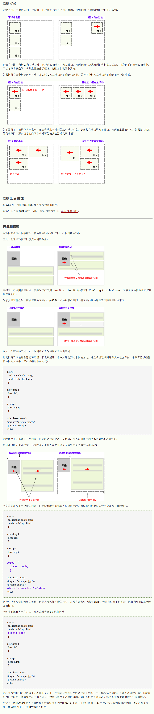

# CSS 定位

CSS 定位 (Positioning) 属性允许你对元素进行定位。

---

CSS 定位和浮动
CSS 为定位和浮动提供了一些属性，利用这些属性，可以建立列式布局，将布局的一部分与另一部分重叠，还可以完成多年来通常需要使用多个表格才能完成的任务。

定位的基本思想很简单，它允许你定义元素框相对于其正常位置应该出现的位置，或者相对于父元素、另一个元素甚至浏览器窗口本身的位置。。

---

> div、h1 或 p 元素常常被称为块级元素。这意味着这些元素显示为一块内容，即“块框”。与之相反，span 和 strong 等元素称为“行内元素”，这是因为它们的内容显示在行中，即“行内框”。

但是在一种情况下，即使没有进行显式定义，也会创建块级元素。这种情况发生在把一些文本添加到一个块级元素（比如
div）的开头。即使没有把这些文本定义为段落，它也会被当作段落对待：

```html
<div>
  some text
  <p>Some more text.</p>
</div>
```

在这种情况下，这个框称为无名块框，因为它不与专门定义的元素相关联。

CSS position 属性
通过使用 position 属性，我们可以选择 4 种不同类型的定位，这会影响元素框生成的方式。

position 属性值的含义：

|||
|---|---|
|static|元素框正常生成。块级元素生成一个矩形框，作为文档流的一部分，行内元素则会创建一个或多个行框，置于其父元素中。|
|relative|元素框偏移某个距离。元素仍保持其未定位前的形状，它原本所占的空间仍保留。|
|absolute|元素框从文档流完全删除，并相对于其包含块定位。包含块可能是文档中的另一个元素或者是初始包含块。元素原先在正常文档流中所占的空间会关闭，就好像元素原来不存在一样。元素定位后生成一个块级框，而不论原来它在正常流中生成何种类型的框。|
|fixed|元素框的表现类似于将 position 设置为 absolute，不过其包含块是视窗本身。|

提示：相对定位实际上被看作普通流定位模型的一部分，因为元素的位置相对于它在普通流中的位置。

## CSS 定位属性

CSS 定位属性允许你对元素进行定位。

|属性|描述|
|---|---|
|position|把元素放置到一个静态的、相对的、绝对的、或固定的位置中。|
|top|定义了一个定位元素的上外边距边界与其包含块上边界之间的偏移。|
|right|定义了定位元素右外边距边界与其包含块右边界之间的偏移。|
|bottom|定义了定位元素下外边距边界与其包含块下边界之间的偏移。|
|left|定义了定位元素左外边距边界与其包含块左边界之间的偏移。|
|overflow|设置当元素的内容溢出其区域时发生的事情。|
|clip|设置元素的形状。元素被剪入这个形状之中，然后显示出来。|
|vertical-align|设置元素的垂直对齐方式。|
|z-index|设置元素的堆叠顺序。|

> 绝对定位使元素的位置与文档流无关，因此不占据空间。这一点与相对定位不同，相对定位实际上被看作普通流定位模型的一部分，因为元素的位置相对于它在普通流中的位置。
> 绝对定位的元素的位置相对于最近的已定位祖先元素，如果元素没有已定位的祖先元素，那么它的位置相对于最初的包含块。
> 提示：因为绝对定位的框与文档流无关，所以它们可以覆盖页面上的其它元素。可以通过设置 z-index 属性来控制这些框的堆放次序。

- 相对定位是“相对于”元素在文档中的初始位置，
- 绝对定位是“相对于”最近的已定位祖先元素，如果不存在已定位的祖先元素，那么“相对于”最初的包含块。

## CSS 浮动

浮动的框可以向左或向右移动，直到它的外边缘碰到包含框或另一个浮动框的边框为止。由于浮动框不在文档的普通流中，所以文档的普通流中的块框表现得就像浮动框不存在一样。

