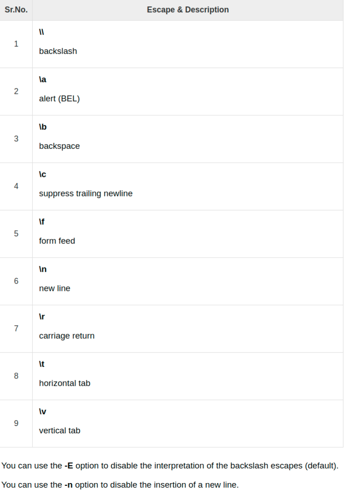

# The Tutorial of Shell Script

A shell script is a computer program designed to be run by the Unix/Linux shell
 which could be one of the following:

- The Bourne Shell The C Shell
- The Korn Shell
- The GNU Bourne-Again Shell

A shell is a command-line interpreter and typical operations performed by shell
 scripts include file manipulation, program execution, and printing text.

## Example Script

```shell
#!/bin/bash

# Author : Zara Ali
# Script follows here:
pwd
ls
```

Save the content and make the script executable

```shell
chmod +x test.sh
```

## Shell Variables

### Variable Names

The name of a variable can contain only letters(a to or A to Z),numbers(0 to 9)
 or underscore character(_)

```shell
# vaild Variables
_ALT
TOKEN_A
VAR_1
VAR_2

# invaild Variables
2_VAR
-VARIABLE
VAR1-VAR2
VAR_A!
```

### Defining Variables

`variable_name=variable_value`

For examples:

`NAME="Dongxian Gu"`

### Accesssing Values

```shell
#!/bin/sh
NAME="Dongxian Gu"
echo $NAME
```

### Read-only Variables

```shell
#!/bin/sh
NAME="Dongxian Gu"
readonly NAME
NAME="Gu"
```

The above script will generate the following result.

`/bin/sh: NAME: This variable is read only`

### Unsetting Variables

Unsetting or deleting a variable directs the shell to remove the variable from
 the list of variables that it tracks.

`unset variable_name`

```shell
NAME="Dongxian Gu"
unset NAME
echo $NAME
```

### Variable Types

When a shell is running,three main type of variables are present:

- Local Variables
- Environment Variables
- Shell Variables

## Special Variables

|Sr.No.|Variable & Description|
|---|---|
|1|\$0 The filename of the current script.|
|2|\$n These variables correspond to the arguments with which a script was invoked. Here n is a positive decimal number corresponding to the position of an argument (the first argument is \$1, the second argument is \$2, and so on).|
|3|\$# The number of arguments supplied to a script.|
|4|\$* All the arguments are double quoted. If a script receives two arguments, \$* is equivalent to \$1 \$2.|
|5|\$@ All the arguments are individually double quoted. If a script receives two arguments, \$@ is equivalent to \$1 \$2.|
|6|\$? The exit status of the last command executed.|
|7|\$\$ The process number of the current shell. For shell scripts, this is the process ID under which they are executing.|
|8|\$! The process number of the last background command.|

```shell
#!/bin/sh

echo "File Name: $0"
echo "First Parameter : $1"
echo "Second Parameter : $2"
echo "Quoted Values: $@"
echo "Quoted Values: $*"
echo "Total Number of Parameters : $#"
```

### Special Parameters \$* and \$@

\$* and \$@ both will act the same unless they are enclosed in double quotes, "".

```shell
#!/bin/sh

for TOKEN in $*
do
   echo $TOKEN
done
```

### Exit Status

```shell
$./test.sh Zara Ali
File Name : ./test.sh
First Parameter : Zara
Second Parameter : Ali
Quoted Values: Zara Ali
Quoted Values: Zara Ali
Total Number of Parameters : 2
$echo $?
0
$
```

## Using Shell Arrays

### Defining Array Values

`array_name[index]=value`

```shell
NAME[0]="Zara"
NAME[1]="Qadir"
NAME[2]="Mahnaz"
NAME[3]="Ayan"
NAME[4]="Daisy"
```

If you are using the ksh shell, here is the syntax of array initialization −

`set -A array_name value1 value2 ... valuen`

If you are using the bash shell, here is the syntax of array initialization −

`array_name=(value1 ... valuen)`

### Accesssing Array Values

`${array_name[index]}`

```shell
#!/bin/sh

NAME[0]="Zara"
NAME[1]="Qadir"
NAME[2]="Mahnaz"
NAME[3]="Ayan"
NAME[4]="Daisy"
echo "First Index: ${NAME[0]}"
echo "Second Index: ${NAME[1]}"
```

You can access all the items in an array in one of the following ways −

```shell
${array_name[*]}
${array_name[@]}
```

## Shell Basic Operators

the following operators:

- Arithmetic Operators
- Relational Operators
- Boolean Operators
- String Operators
- File Test Operators

Bourne shell didn't originally have any mechanism to perform simple arithmetic
 operations but it uses** external programs, either **awk** or **expr**.

```shell
#!/bin/sh

val=`expr 2 + 2`
echo "Total value : $val"
```

The following points need to be considered while adding −

- There must be spaces between operators and expressions. For example, 2+2 is not
 correct; it should be written as 2 + 2.

- The complete expression should be enclosed between ‘ ‘, called the backtick.

### Arithmetic Operators

Assume variable a holds 10 and variable b holds 20 then −


It is very important to understand that all the conditional expressions should be
 inside square braces with spaces around them, for example [ \$a == \$b ] is
 correct whereas, [\$a==\$b] is incorrect.

### Relational Operators

Assume variable a holds 10 and variable b holds 20 then −


It is very important to understand that all the conditional expressions should be
 placed inside square braces with spaces around them. For example, [ \$a <= \$b ]
 is correct whereas, [\$a <= \$b] is incorrect.

### Boolean Operators

Assume variable a holds 10 and variable b holds 20 then −


### String Operators

Assume variable a holds "abc" and variable b holds "efg" then −


### File Test Operators

Assume a variable file holds an existing file name "test" the size of which is
 100 bytes and has read, write and execute permission on −


## Shell Decision Making

### The if..else Statements

Unix Shell supports following forms of if...else statements.

- if...fi statement
- if...else...fi statement
- if..elif...else..fi statement

```shell
if [ expression 1 ]
then
   Statement(s) to be executed if expression 1 is true
elif [ expression 2 ]
then
   Statement(s) to be executed if expression 2 is true
elif [ expression 3 ]
then
   Statement(s) to be executed if expression 3 is true
else
   Statement(s) to be executed if no expression is true
fi
```

### The case...esac Statements

There is only one form of case...esac statement which has been described in detail
 here −

- case...esac statement

```shell
case word in
   pattern1)
      Statement(s) to be executed if pattern1 matches
      ;;
   pattern2)
      Statement(s) to be executed if pattern2 matches
      ;;
   pattern3)
      Statement(s) to be executed if pattern3 matches
      ;;
   *)
     Default condition to be executed
     ;;
esac
```

## Shell Loop Types

four types of loops as follow:

- The while loop
- The for loop
- The util loop
- The select loop

```shell
while command
do
   Statement(s) to be executed if command is true
done
```

```shell
for var in word1 word2 ... wordN
do
   Statement(s) to be executed for every word.
done
```

```shell
until command
do
   Statement(s) to be executed until command is true
done
```

```shell
select var in word1 word2 ... wordN
do
   Statement(s) to be executed for every word.
done
```

### Nesting Loops

```shell
while command1 ; # this is loop1, the outer loop
do
   Statement(s) to be executed if command1 is true

   while command2 ; # this is loop2, the inner loop
   do
      Statement(s) to be executed if command2 is true
   done

   Statement(s) to be executed if command1 is true
done
```

## Shell Loop Control

- The **break** statement
- The **continue** statement

```shell The infinite Loop
#!/bin/sh

a=10

until [ $a -lt 10 ]
do
   echo $a
   a=`expr $a + 1`
done
```

### The break statement

`break`

The break command can also be used to exit from a nested loop using this format −

`break n`

Here n specifies the n^{th} enclosing loop to the exit from.

### The continue statement

`continue`

Like with the break statement, an integer argument can be given to the continue
 command to skip commands from nested loops.

`continue n`

Here n specifies the n^th enclosing loop to continue from.

## Shell Substitution(替换)

The shell performs substitution when it encounters an expression that contains
 one or more special characters.



### Command Substitution

``command``

When performing the command substitution make sure that you use the backquote, not
 the single quote character.

### Variable Substitution


## Shell Quoting Mechanisms

### The Metacharacters

Unix Shell provides various metacharacters which have special meaning while using
 them in any Shell Script and causes termination of a word unless quoted.

For example, ? matches with a single character while listing files in a directory
 and an * matches more than one character. Here is a list of most of the shell
  special characters (also called metacharacters) −

`* ? [ ] ' " \ $ ; & ( ) | ^ < > new-line space tab`

A character may be quoted (i.e., made to stand for itself) by preceding it with
 a \\.


### The Single Quotes

There is an easy way to quote a large group of characters. Put a single quote (')
 at the beginning and at the end of the string −

`echo '<-$1500.**>; (update?) [y|n]'`

### The Double Quoteds

```shell
VAR=ZARA
echo '$VAR owes <-$1500.**>; [ as of (`date +%m/%d`) ]'
```

### The Backquotes

`var=`command``

```shell
DATE=`date`

echo "Current Date: $DATE"
```

## Shell Input/Output Redirections

A command normally reads its input from the standard input, which happens to be your
 terminal by default. Similarly, a command normally writes its output to standard
  output, which is again your terminal by default.

### Output Redirection

```shell
who > users
cat users

echo line 1 > users
cat users

echo line 2 >> users
cat users
```

### Input Redirection

```shell
wc -l users
wc -l < users
```

### Here Document

```shell
command << delimiter
document
delimiter
```

```shell
wc -l << EOF
    This is a simple lookup program 
    for good (and bad) restaurants
    in Cape Town.
EOF
```

```shell
#!/bin/sh

filename=test.txt
vi $filename <<EndOfCommands
i
This file was created automatically from
a shell script
^[
ZZ
EndOfCommands
```

### Discard the output

Sometimes you will need to execute a command, but you don't want the output displayed
 on the screen. In such cases, you can discard the output by redirecting it to the
 file /dev/null −

`command > /dev/null`

To discard both output of a command and its error output, use standard redirection to
 redirect STDERR to STDOUT −

`command > /dev/null 2>&1`

Here 2 represents STDERR and 1 represents STDOUT. You can display a message on to
 STDERR by redirecting STDOUT into STDERR as follows −

`echo message 1>&2`

### Redirection Commands


## Shell Functions

Using functions to perform repetitive tasks is an excellent way to create code reuse.
 This is an important part of modern object-oriented programming principles.

Shell functions are similar to subroutines, procedures, and functions in other
 programming languages.

### Creating Functions

```shell
function_name () {
    list of command
}
```

### Pass Parameters to a Function

You can define a function that will accept parameters while calling the function.
 These parameters would be represented by $1, $2 and so on.

```shell
#!/bin/sh

# Define your function here
Hello () {
   echo "Hello World $1 $2"
}

# Invoke your function
Hello Dongxian Gu
```

### Returning Values from Functions

`return code`

Capture value returned by last command

`ret=$?`

### Nested Functions

One of the more interesting features of functions is that they can call themselves
 and also other functions. A function that calls itself is known as a recursive function.

### Function Call from Prompt

You can put definitions for commonly used functions inside your .profile. These
 definitions will be available whenever you log in and you can use them at the
 command prompt.

To remove the definition of a function from the shell, use the unset command with
 the .f option. This command is also used to remove the definition of a variable
 to the shell.

`unset -f function_name`

## Shell Manpage Help

`man command`


### Useful Shell Commands

