# java_pattern
> java 设计模式

---

## create 创建型设计模式

### Abstract Factory 抽象工厂

1. 意图
    > 提供一个创建一系列相关或相互依赖对象的接口,而无需指定他们具体的类
    
2. 适用性:
    - 一个系统要独立于它的产品的创建,组合和表示.
    - 一个系统要由多个产品系列中的一个来配置时.
    - 当要强调一系列相关的产品对象的设计以便进行联合使用时.
    - 当提供一个产品类库,只想显示他们的接口而不是实现的时候.
 
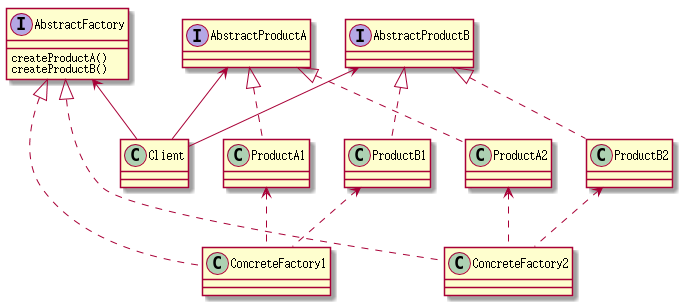

### Builder 生成器
1. 意图
    > 将一个复杂对象的构建与它的表示进行分离,使得同样的构建过程可以创建不同的表示.
  
2. 适用性:
    - 当创建复杂对象的算法应该独立于该对象的组成部分以及他们的装配方式时.
    - 当构造过程必须允许被构造的对象有不同的表示时.
    
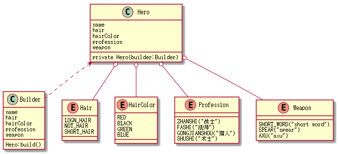
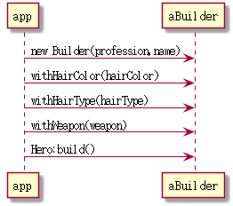

    
    
### Factory 工厂方法

1. 意图
    > 定义一个用于创建对象的接口,让子类决定事例化那一个类,Factory Method
    使一个类的实例化延迟要子类.
    
2. 适用性:
    - 当一个类不知道所必须创建的对象的类的时候.
    - 当一个类希望由它的子类来指定它所创建的对象的时候.
    - 当类将创建对象的职责委托给多个帮助子类中的某一个,并且你希望将哪一个帮助子类是代理
    者这一信息局部化的时候.
    
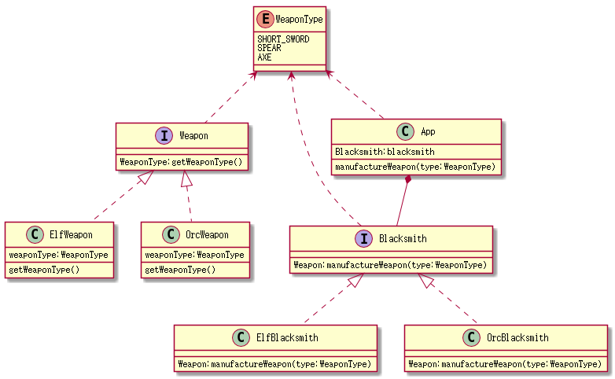
   
    
    
### Prototype 原型

1. 意图
    > 用原型实例指定创建类的种类,并且通过拷贝这些原型创建新的对象.
   
2. 适用性:
    - 当一个系统应该独立于它的产品的创建.构成和表示的时候.
    - 当要实例化的类是在运行时刻指定的时,如动态加载
    - 当要避免创建一个与产品类层次平行的工厂类层次时.
    - 当一个类的实例只能有几个不同状态组合中的一种时.建立相应数目的原型并克隆他们可能比每次用何时的状态手工实例化
    该类更加方便一些. 
    
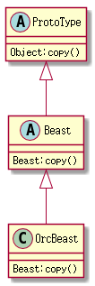

    
### Singleton 单件

1. 意图
    > 保证一个类仅有一个实例,并提供一个全局访问它的全局访问点.
    
2. 适用性:
    - 当类只能有一个实例,而且用户可以从一个众所周知的访问点访问它.
    - 当这个唯一的实例应该是通过子类化可以拓展的,并且用户应该无需更改代码就能使用一个扩展的实例.

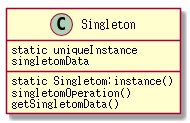

### 创建性模式总结
> 用一个系统创建的那些对象的类对系统进行参数化有两种常用方法:

1. 一种生产创建对象的子类,对应工厂方法模式.缺点是为了改变产品类,就可能需要创建一个新类.这样的改变可能是级联的.
    
2. 另一种对系统进行参数化的方法更多依赖于对象复合,定义一个对象负责明确产品对象的
    类,并将它作为系统的参数.这就是抽象工厂,Builder,Prototype的关键特征.
    所以这三个模式都涉及到创建一个新的负责创建产品对象的""工厂对象"
    
    1. Abstract Factory 由这个工厂对象产生多个类对象.
    2. Builder 由这个工厂对象使用一个相对复杂的协议,逐步创建一个复杂产品.
    3. Prototype 由该工厂对象通过拷贝原型对象来创建产品对象.因为由原型返回对象,
        所有工厂对象和原型是同一个对象. 
   
    
      

## structure 结构性模式
> 结构型设计模式涉及到如何组合类和对象以获得更大的结构,结构型类模式采用继承机制来组合接口或实现.

### Adapter 适配器

1. 意图
    > 将一个类的接口转换成客户希望的另一个接口,Adapter模式使得原本由于接口不兼容而不能一起
    工作的那些类可以一起工作.

2. 别名
    > 包装器 Wrapper
    
3. 适用性:
    - 你想使用一个已经存在的类,而它的接口不符合你的要求.
    - 你想创建一个可以复用的类,该类可以和其他不相关的类或不可预见的类协同工作.
    - 你想使用一些已经存在的子类,但是不可能对每一个都进行子类化以匹配它们的接口.对象适配器可以适配
    它的父类接口.
    
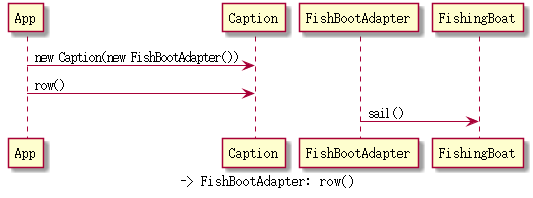

### Bridge 桥接

1. 意图
    > 将抽象部分与它的实现部分分离,使它们都可以独立的变化
    
2. 别名
    > Handle/Body
    
2. 适用性:
    - 不希望在抽象和它的实现部分之间有一个固定的绑定关系.
    - 类的抽象以及它的实现都应该可以 生成子类的方法加以扩充.
    - 对一个抽象的实现部分的修改对客户不产生影响
    - 想对客户隐藏抽象的实现部分.
    - 有许多类要生成的类层次结构
    - 想在多个对象间共享实现,但客户不知道这一点.
    
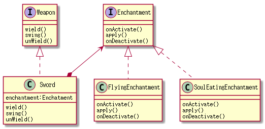
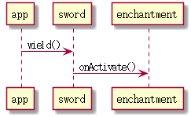

### Composite 组合

1. 意图
    > 将对象组合成树形结构以表示""部分-整体"的层次结构,Composite使用户对单个对象和组合对象的
    使用具有一致性.
    
2. 适用性:
    - 想表示对象部分--整体层次结构
    - 希望用户忽略组合对象和单个对象的不同,用户将统一的使用组合结构中的所有对象

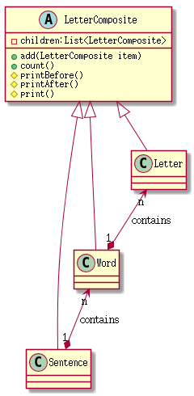

### Decorator 装饰

1. 意图
    > 动态的给一个对象添加一些额外的职责.就增加功能而言,装饰者模式比生成子类
    更加灵活
    
2. 适用性:
    - 在不影响其他对象的情况下,以动态,透明的方式给单个对象添加职责
    - 处理那些可以撤销的职责.
    - 当不能采用子类进行扩充的时候.
    
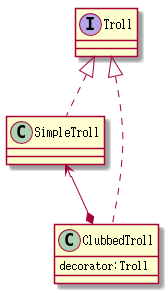

### Facade 外观

1. 意图
    > 为子系统中的一组接口提供一致的界面,Facade 模式定义了一个高层接口,
    这个接口使得子系统更加容易使用.
    
2. 适用性:
    - 要为一个复杂子系统提供一个简单接口时,子系统往往因为不断演化而变得越来越复杂.
    - 客户程序与抽象类的实现部分存在很大的依赖性.
    - 当需要构建一个层次结构的子系统时,使用facade,模式定义子系统的入口点.
    
    
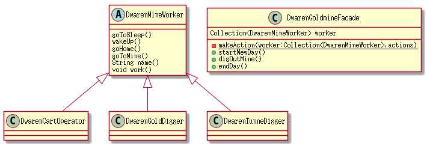

### Flyweight 享元

1. 意图
    > 运用共享技术有效地支持大量细粒度的对象.
    
2. 适用性:
    - 一个应用程序使用了大量的对象.
    - 完全由于使用了大量的对象,造成很大的存储开销.
    - 对象的大多数状态都可变为外部状态.
    - 如果删除对象的外部状态,那么可以用相对较少的共享对象取代很多对象.
    - 应用程序不依赖对象标识.

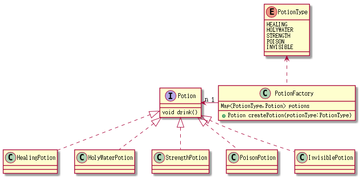

### Proxy 代理

1. 意图
    > 对其他对象提供一种代理以供其他对象访问
    
2. 适用性:
    - 

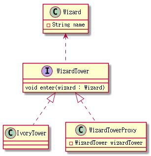

### 结构型模式总结
1. Adapter 模式主要解决两个一游接口之间的不匹配问题,不考虑接口如何实现,
也不考虑接口如何演化.

2. Bridge 模式对抽象接口与它的实现部分进行桥接.

3. Decorator 旨在不需要生成子类即可给对象添加职责.

4. Composite 旨在构造类,使多个相关的对象能够以统一的方式处理,多重对象可以被
当成一个对象来处理.

5. Proxy 模式构成一个对象并为用户提供一致的接口.

## 行为设计模式

---
> 行为设计模式设计算法和对象间职责的分配.行为模式不仅描述类和对象的模式,
还描述它们之间的通信模式.

### Chain of Responsibility 责任链

1. 意图
    > 使多个对象都有机会处理请求,从而避免请求的发送者和接受者的耦合关系.
    将这些对象连成一条链,并沿着这条链传递该请求,直到有一个对象处理它为止.
    
2. 适用性:
    - 有多个的对象可以处理一个请求,那个对象处理请求运行时刻自动确定.
    - 想在不明确指定接受者的情况下想多个对象中的一个提交请求.
    - 可以处理一个请求的对象集合被动态指定.

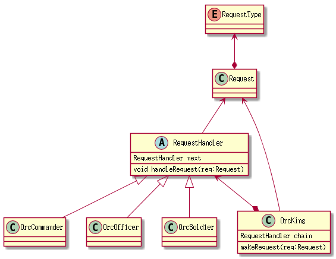

### Command 命令

1. 意图
    > 将一个请求封装成一个对象,从而使得可以用不同的请求对客户进行参数化,对请求
    排队或记录请求日志,以及支持可撤销操作.
    
2. 适用性:
    - 抽象出待执行的动作以参数化某对象.
    - 在不同的时刻指定,排列和执行请求.
    - 支持取消操作.
    - 支持修改日志.
    - 用构建在原语操作上的高层操作构造一个系统.

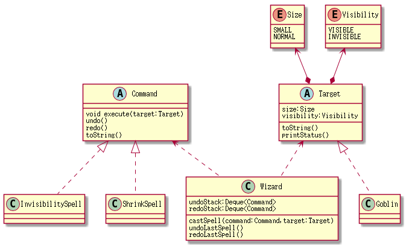

### Interpreter 解释器

1. 意图
    > 给定一个语言，定义它的文法的一种表示，并定义一个解释器，这个解释器使用该表示
    来解释语言的句子.
    
2. 适用性:
    > 解释器模式适用于当有一个语言需要解释执行，并且可将该语言的句子表示为一个抽象
    语法树时一下情况最好。
    
    - 该文法简单.
    - 效率不是关键问题.

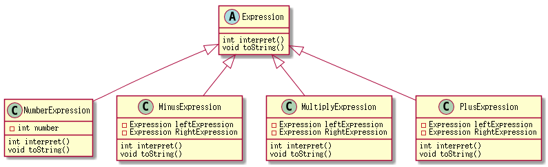

### Iterator 迭代器

1. 意图
    > 提供一种方法顺序访问一个聚合对象的各个元素，且不需要暴露该对象的内部表示。
    
    
2. 适用性:
    
    - 访问一个聚合对象的内容而无须暴露它的内部表示.
    - 支持对聚合对象的多种遍历.
    - 为遍历不同的聚合结构提供一个统一的接口。

### Mediator 中介者 

1. 意图
    > 用一个中介对象来封装一系列对象的交互。中介者使各对象不需要显示地互相
    引用，从而使其耦合松散，可以独立地改变它们之间的交互
    
    
2. 适用性:
    
    - 一组对象以定义良好但是复杂的方式进行通信，产生的相互依赖关系结构混乱且难以理解.
    - 一个对象引用其他 很多对象并且与这些对象通信，导致难以复用该对象。
    - 想定制一个分布在多个类中的行为，而不想生成太多的子类。

### Memento 备忘录 

1. 意图
    > 在不破坏封装性的前提下捕获一个对象的内部状态，并在对象之外保存这个状态。
    这样以后就可以将对象恢复到原先保存的状态。
    
    
2. 适用性:
    
    - 必须保存一个对象在某一个时刻的（部分）状态，这样以后需要时它才能恢复
    到先前的状态。
    
    - 如果一个用接口让其他对象直接得到这些状态，将会暴露对象的实现细节并破坏对象的封装性。
    

### Observer 观察者 

1. 意图
    > 定义对象间的一种一对多的依赖关系，当一个对象的状态发生改变时，所有依赖于它的对象都得到通知并被自动更新。
    
    
2. 适用性:
    
    - 当一个抽象模型有两个方面，一个方面依赖另一个方面。将这两者封装在独立的对象中以使他们可以
    各自独立的改变和使用。
    
    - 当对一个对象的改变需要同时改变其他对象，而不知道具体有多少对象有待改变。
    
    - 当一个对象必须通知其他对象，而它又不能假定其他对象是谁，即不希望这些对象是紧耦合的。
    

### State 状态 

1. 意图
    > 允许一个对象在其内部状态改变时改变它的行为。对象似乎修改了它的类。
    
    
2. 适用性:
    
    - 一个对象的行为决定于它的状态，并且它必须在运行时刻根据状态改变它的行为。
    
    - 一个操作中含有庞大的多分支的条件语句，并且这些分支依赖于该对象的状态。这个状态常用一个或多个枚举常量表示
    。

    

### Strategy 策略 

1. 意图
    > 定义一系列的算法，把它们一个个封装起来，并且使它们可以相互替换。
    
    
2. 适用性:
    
    - 许多相关的类仅仅行为有异。
    
    - 需要使用一个算法的不同变体。
    
    - 算法使客户不应该知道的数据。
    
    - 一个类定义了多种行为，并且这些行为在这个类的操作中以多个条件语句的形式出现，
    将相关条件的分支移入它们各自的Strategy类中，以替代这些条件语句。
    

### Template Method 模板方法 

1. 意图
    > 定义一个操作的算法骨架，而将一些步骤延迟到子类。
    
    
2. 适用性:
    
    - 一次性实现一个算法中不变的部分，将可变的部分留给子类实现。
    
    - 各子类的公共的行为应该被提取出来并集中到一个公共父类中，避免代码的重复。
    
    - 控制子类的扩展。模板方法旨在特点调用“hook”操作（默认的行为，子类可以在必要的时候进行重定义扩展），
    这就只允许在这些点进行扩展。
    

    

### Visitor  访问者 

1. 意图
    > 表示一个作用于某对象结构的各元素的操作，它允许在不改变各元素的类的前提下定义作用于这些元素
    的新操作。
    
    
2. 适用性:
    
    - 一个对象结构包含很多类对象，它们有不同的接口，而用户想对这些对象实施一些依赖于其具体类的操作。
    
    - 需要对一个对象结构中的对象进行很多不同并且 不相关的操作，而又想要避免这些操作“污染”这些对象的类。
    
    - 定义对象结构的类很少改变，但经常需要在此结构上定义新的操作。
    
    
### 行为模式比较

    - 一个Strategy 对象封装一个算法：
    
    - 一个State对象封装一个与状态相关的行为：
    
    - 一个Mediator 对象封装对象间的协议：
    
    - 一个Iterator对象封装访问和遍历一个聚合对象中的各个组件的方法。
    
    - Chain of  Responsibility 可以处理任意数目的对象（一条链）
    
    - 一个Visitor对象是一个多态的Accept操作的参数
    
    - 在Command 中，令牌代表一个请求
    
    - 在Memento 中，两台代表一个对象在某个特定时刻的内部状态 
    