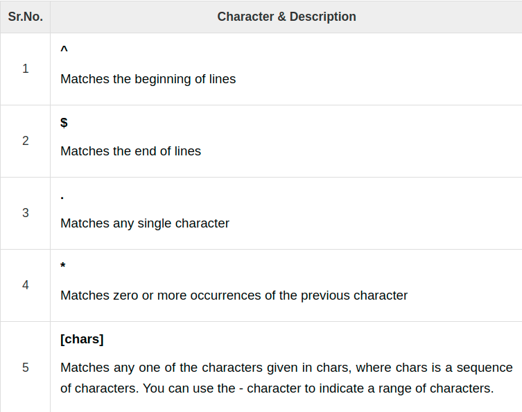
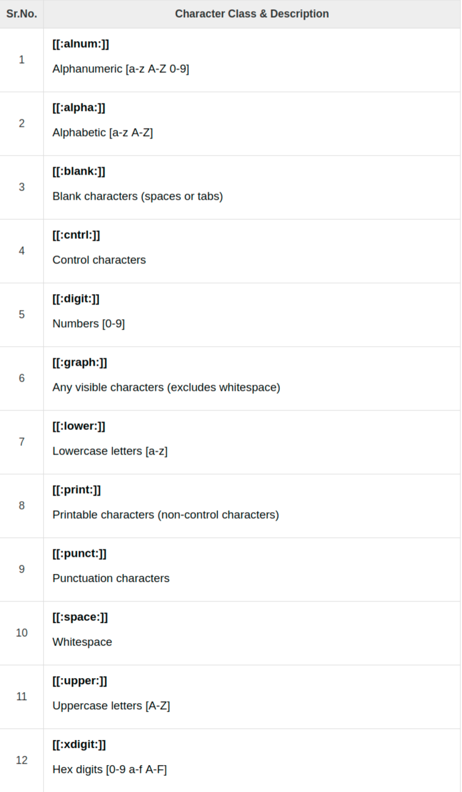
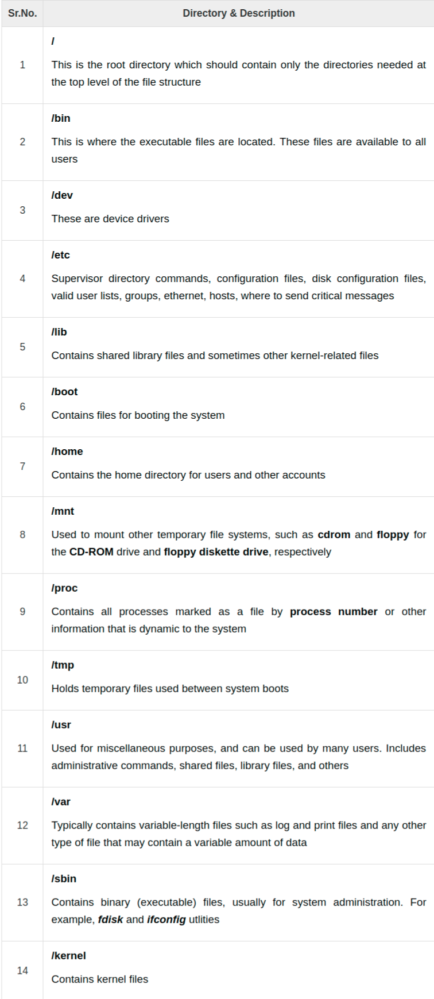
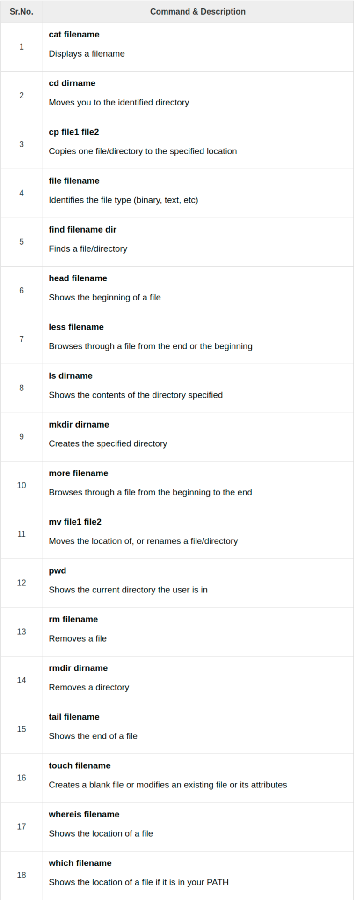

# Advanced Unix/Linux

## Regular Expressions

Regular expressions are used by several different Unix commands, including ed, sed,
 awk, grep, and to a more limited extent, vi.

Here SED stands for stream editor.

### Involing sed

`cat /etc/passwd | sed`

### The sed General Syntax

`/pattern/action`

Here, pattern is a regular expression, and action is one of the commands given in
 the following table. If pattern is omitted, action is performed for every line
  as we have seen above.

|Sr.No.|Range&Description|
|---|---|
|1|**p** Prints the line|
|2|**d** Deletes the line|
|3|**s/pattern1/pattern2/** Substitutes the first occurrence of pattern1 with pattern2|

### Deleting All Lines with sed

`cat /etc/passwd | sed 'd'`

or

`sed -e 'd' /etc/passwd`

### The sed Addressed

`cat /etc/passwd | sed '1d' |more`

Notice that the number 1 is added before the delete edit command. This instructs
 the sed to perform the editing command on the first line of the file. In this
 example, the sed will delete the first line of /etc/password and print the rest
 of the file.

### The sed Address Ranges

`cat /etc/passwd | sed '1, 5d' |more`

he above command will be applied on all the lines starting from 1 through 5. This
 deletes the first five lines.


While using the p action, you should use the -n option to avoid repetition of line
 printing. Check the difference in between the following two commands −

`cat /etc/passwd | sed -n '1,3p'`

### The Substitution Command

The substitution command, denoted by s, will substitute any string that you specify
 with any other string that you specify.

The following command substitutes the first occurrence on a line of the string
 root with the string amrood.

`cat /etc/passwd | sed 's/root/dx'`

Using the letter g to perform a global substitution.

`cat /etc/passwd | sed 's/root/dx/g'`

### Substitution Flags


### Using an Alternative String Separator

Suppose you have to do a substitution on a string that includes the forward slash
 character. In this case, you can specify a different separator by providing the
  designated character after the s.

`cat /etc/passwd | sed 's:/root:/amrood:g'`

we have used : as the delimiter instead of slash /.

### Replacing with Empty Space

`cat /etc/passwd | sed 's/root//g'`

### Address Substitution

If you want to substitute the string sh with the string quiet only on line 10,
 you can specify it as follows −

`cat /etc/passwd | sed '10s/sh/quiet/g'`

`cat /etc/passwd | sed '1,5s/sh/quiet/g'`

### The Matching Command

You would use the p option along with the -n option to print all the matching lines
 as follows −

`cat testing | sed -n '/root/p'`

### Using Regular Expression

Check the following example which matches all the lines starting with daemon and
 then deletes them −

`cat testing | sed '/^daemon/d'`

Following is the example which deletes all the lines ending with sh −

`cat testing | sed '/sh$/d'`



### Matching Characters


## Character Class Keywords

Some special keywords are commonly available to regexps, especially GNU utilities
 that employ regexps. These are very useful for sed regular expressions as they
 simplify things and enhance readability.

`cat /etc/syslog.conf | sed -n '/^[[:alpha:]]/p'`



### Aampersand Referencing

`sed -e 's/^[[:digit:]][[:digit:]][[:digit:]]/(&)/g' phone.txt`

### Using Multiple sed Commands

`sed -e 'command1' -e 'command2' ... -e 'commandN' files`

```shell
ed -e 's/^[[:digit:]]\{3\}/(&)/g'  \
-e 's/)[[:digit:]]\{3\}/&-/g' phone.txt
```

### Back References

```shell
cat phone.txt | sed 's/\(.*)\)\(.*-\)\(.*$\)/Area \
   code: \1 Second: \2 Third: \3/' 
```

## File System Basics

### Directory Structure

Unix uses a hierarchical file system structure, much like an upside-down tree,
 with root (/) at the base of the file system and all other directories spreading
 from there.

A Unix filesystem is a collection of files and directories that has the following properties −

- It has a root directory (/) that contains other files and directories.

- Each file or directory is uniquely identified by its name, the directory in
 which it resides, and a unique identifier, typically called an inode.

- By convention, the root directory has an inode number of 2 and the lost+found
 directory has an inode number of 3. Inode numbers 0 and 1 are not used. File inode
  numbers can be seen by specifying the -i option to ls command.

- It is self-contained. There are no dependencies between one filesystem and another.



### Navigating the File System



### The df Command

The first way to manage your partition space is with the df (disk free) command.
The command df -k (disk free) displays the disk space usage in kilobytes, as shown
 below −

`df -k`

You can use the -h (human readable) option to display the output in a format that
 shows the size in easier-to-understand notation.

### The du Command

The du (disk usage) command enables you to specify directories to show disk space
 usage on a particular directory.

`du -h /etc`

### Mounting the File System

A file system must be mounted in order to be usable by the system. To see what is
 currently mounted (available for use) on your system, use the following command.

`mount`

`mount -t file_system_type device_to_mount directory_to_mount_to`

Ex:
`mount -t iso9660 /dev/cdrom /mnt/cdrom`

### Unmounting the File System

`umount /dev/cdrom`

### User and Group Quotas

The user and group quotas provide the mechanisms by which the amount of space used
 by a single user or all users within a specific group can be limited to a value
  defined by the administrator.

## User Administration

## System Performance

## System Logging

## Signals and Traps