# 操作系统

[TOC]

<!-- @import "[TOC]" {cmd="toc" depthFrom=1 depthTo=6 orderedList=true} -->

<!-- code_chunk_output -->

1. [操作系统](#操作系统)
    1. [第一章 操作系统引论](#第一章-操作系统引论)
        1. [操作系统的目标和作用](#操作系统的目标和作用)
        2. [操作系统的发展过程](#操作系统的发展过程)
        3. [操作系统的基本特性](#操作系统的基本特性)
        4. [操作系统的主要功能：](#操作系统的主要功能)
        5. [OS结构设计](#os结构设计)
    2. [第二章 进程的描述和控制](#第二章-进程的描述和控制)
        1. [前趋图和程序执行](#前趋图和程序执行)
        2. [进程的描述](#进程的描述)
        3. [进程控制](#进程控制)
            1. [操作系统内核](#操作系统内核)
            2. [进程](#进程)
        4. [进程同步](#进程同步)
            1. [硬件同步机制](#硬件同步机制)
            2. [信号量机制](#信号量机制)
            3. [管程机制](#管程机制)
        5. [进程通信](#进程通信)
            1. [共享存储器系统$Shared-Memory\;System$](#共享存储器系统shared-memorysystem)
            2. [管道通信系统](#管道通信系统)
            3. [消息传递系统](#消息传递系统)
            4. [客户机-服务器系统](#客户机-服务器系统)
            5. [消息传递通信的实现方式](#消息传递通信的实现方式)
            6. [直接消息传递系统实例](#直接消息传递系统实例)
        6. [线程](#线程)
            1. [线程的引入](#线程的引入)
            2. [线程和进程的比较](#线程和进程的比较)
            3. [线程的状态和线程控制块](#线程的状态和线程控制块)
        7. [线程的实现](#线程的实现)
            1. [实现方式](#实现方式)
            2. [线程的实现实现](#线程的实现实现)
            3. [线程的创建和终止](#线程的创建和终止)
    3. [第三章 处理调度与死锁](#第三章-处理调度与死锁)
        1. [处理机调度的层次和调度算法的目标](#处理机调度的层次和调度算法的目标)
            1. [处理机调度的层次](#处理机调度的层次)
            2. [处理机调度算法的目标](#处理机调度算法的目标)
        2. [作业和作业调度](#作业和作业调度)
            1. [批处理系统中的作业](#批处理系统中的作业)
            2. [作业调度的主要任务](#作业调度的主要任务)
            3. [先来先服务和短作业优先调度算法](#先来先服务和短作业优先调度算法)
            4. [优先级调度算法和高响应比优先调度算法](#优先级调度算法和高响应比优先调度算法)
        3. [进程调度](#进程调度)
            1. [进程调度的任务、机制和方式](#进程调度的任务-机制和方式)
            2. [轮转调度算法](#轮转调度算法)
            3. [优先级调度](#优先级调度)
            4. [多队列调度算法](#多队列调度算法)
            5. [多级反馈$(multileved\;feedback\;queue)$调度算法](#多级反馈multilevedfeedbackqueue调度算法)
            6. [基于公平原则的调度算法](#基于公平原则的调度算法)
        4. [实时调度](#实时调度)
            1. [实现实时调度的基本条件](#实现实时调度的基本条件)
            2. [实时调度算法的分类](#实时调度算法的分类)
            3. [最早截止时间优先$EDF(Earliest\;Deadline\;First)$](#最早截止时间优先edfearliestdeadlinefirst)
            4. [最低松弛度优先$LLF(Least\;Laxity\;First)$算法](#最低松弛度优先llfleastlaxityfirst算法)
            5. [优先级倒置](#优先级倒置)
        5. [死锁概述](#死锁概述)
            1. [死锁的原因](#死锁的原因)
            2. [死锁](#死锁)
        6. [预防死锁](#预防死锁)
        7. [避免死锁](#避免死锁)
            1. [利用银行家算法避免死锁](#利用银行家算法避免死锁)
        8. [死锁的检测和解除](#死锁的检测和解除)
            1. [死锁的检测](#死锁的检测)
            2. [死锁的解除](#死锁的解除)
    4. [第四章 存储器管理](#第四章-存储器管理)
        1. [存储器的层次结构](#存储器的层次结构)
        2. [程序的装入和链接](#程序的装入和链接)
        3. [连续分配存储管理方式](#连续分配存储管理方式)
        4. [对换（Swapping）](#对换swapping)
        5. [分页存储管理方式](#分页存储管理方式)
            1. [分页存储管理的基本方法](#分页存储管理的基本方法)
            2. [地址变换机构](#地址变换机构)
            3. [访问内存有效时间](#访问内存有效时间)
            4. [两极和多级页表](#两极和多级页表)
            5. [反置页表$(Inverted\;Page\;Table)$](#反置页表invertedpagetable)
        6. [分段存储管理方式](#分段存储管理方式)
    5. [第五章 虚拟存储器](#第五章-虚拟存储器)
        1. [概述](#概述)
        2. [请求分页存储管理方式](#请求分页存储管理方式)
        3. [页面置换算法](#页面置换算法)
        4. [”抖动“和工作集](#抖动和工作集)
        5. [请求分段存储管理方式](#请求分段存储管理方式)
    6. [第六章 输入输出系统](#第六章-输入输出系统)
        1. [$I/O$系统的功能、模型和接口](#io系统的功能-模型和接口)
        2. [$I/O$设备和设备控制器](#io设备和设备控制器)
        3. [中断机构和中断处理程序](#中断机构和中断处理程序)
        4. [设备驱动程序](#设备驱动程序)
        5. [与设备无关的$I/O$软件](#与设备无关的io软件)
        6. [用户层的$I/O$软件](#用户层的io软件)
        7. [缓冲区管理](#缓冲区管理)
        8. [磁盘存储器的性能和调度](#磁盘存储器的性能和调度)
    7. [第七章 文件管理](#第七章-文件管理)
        1. [文件和文件系统](#文件和文件系统)
        2. [文件的逻辑结构](#文件的逻辑结构)
        3. [文件目录](#文件目录)
        4. [文件共享](#文件共享)
        5. [文件保护](#文件保护)
    8. [第八章 磁盘存储器的管理](#第八章-磁盘存储器的管理)
        1. [外存的组织方式](#外存的组织方式)
        2. [文件存储空间的管理](#文件存储空间的管理)
        3. [提高磁盘$I/O$速度的途径](#提高磁盘io速度的途径)
        4. [提高磁盘可靠性的技术](#提高磁盘可靠性的技术)
        5. [数据一致性控制](#数据一致性控制)
    9. [第九章 操作系统接口](#第九章-操作系统接口)
        1. [用户接口](#用户接口)
        2. [Shell命令语言](#shell命令语言)
        3. [联机命令接口的实现](#联机命令接口的实现)
        4. [系统调用的概念和类型](#系统调用的概念和类型)
        5. [UNIX系统调用](#unix系统调用)
        6. [系统调用的实现](#系统调用的实现)
    10. [第十章 多处理机系统](#第十章-多处理机系统)
        1. [多处理机系统的基本概念](#多处理机系统的基本概念)
        2. [多处理机系统的结构](#多处理机系统的结构)
        3. [多处理机操作系统的特征与分类](#多处理机操作系统的特征与分类)
        4. [多处理机操作系统的进程同步](#多处理机操作系统的进程同步)
        5. [多处理机系统的进程调度](#多处理机系统的进程调度)
        6. [网络操作系统](#网络操作系统)
        7. [分布式文件系统](#分布式文件系统)
    11. [第十一章 多媒体操作系统](#第十一章-多媒体操作系统)
        1. [多媒体系统简介](#多媒体系统简介)
        2. [多媒体文件中的各种媒体](#多媒体文件中的各种媒体)
        3. [多媒体进程管理中的问题和接纳问题](#多媒体进程管理中的问题和接纳问题)
        4. [多媒体实时调度](#多媒体实时调度)
        5. [媒体服务器的特征和接纳控制](#媒体服务器的特征和接纳控制)
        6. [多媒体存储器的分配方法](#多媒体存储器的分配方法)
        7. [高速缓存与磁盘调度](#高速缓存与磁盘调度)
    12. [保护和安全](#保护和安全)
        1. [安全环境](#安全环境)
        2. [数据加密技术](#数据加密技术)
        3. [用户验证](#用户验证)
        4. [来自系统内部的攻击](#来自系统内部的攻击)
        5. [来自系统外部的攻击](#来自系统外部的攻击)
        6. [可信系统$(Trusted\;System)$](#可信系统trustedsystem)

<!-- /code_chunk_output -->

## 第一章 操作系统引论

### 操作系统的目标和作用

在计算机系统上配置操作系统，其主要目标：方便性、有效性、可扩充性和开放性。

操作系统的作用：

1. 作为用户与计算机硬件系统之间的接口
2. 作为计算机系统资源的管理者
3. 实现了对计算机资源的抽象

### 操作系统的发展过程

1. 未配置操作系统的计算机系统

   - 人工操作方式。缺点：用户独占全机；CPU等待人工操作
   - 脱机输入/输出$(Off-Line\;I/O)$方式。优点：减少了CPU的空闲时间；提高了$I/O$速度

     > 脱机$I/O$技术：事先将装有用户程序和数据的纸带装入纸带输入机，在外围机的控制下，把纸带上的数据输入到磁带上。

2. 单道批处理系统

   缺点：系统资源得不到充分利用。

3. 多道批处理系统(为了提高资源利用率和系统吞吐量)

   1. 基本概念

      在系统中，用户提交的作业先存放在外存上，并排成一个队列，成为“后备队列”。然后由作业调度按照一定的算法，从后备队列中选择若干个作业调入内存，使它们共享CPU和系统的各种资源。

   2. 优缺点

      1. 资源利用率高
      2. 系统吞吐量大
      3. 平均周转时间长
      4. 无交互能力

4. 分时系统(为了满足人机交互的需求)

   1. 用户需求主要体现在：人机交互；共享主机

   2. 关键问题：及时接受；及时处理

   3. 分时系统的特征：

      - 多路性

      - 独立性

      - 及时性

      - 交互性

5. 实时系统

   > 实时：表示”及时“
   > 实时计算：系统的正确性，不仅由计算机的逻辑结果来确定，而且还取决于产生结果的实践。

   实时系统的类型：

   1. 工业（武器）控制系统。
   2. 信息查询系统
   3. 多媒体系统
   4. 嵌入式系统

   实时任务的类型：

   1. 周期性任务和非周期性任务
   2. 硬实时任务和软实时任务

   实时系统和分时系统特征的比较：
   - 多路性
   - 独立性
   - 及时性
   - 交互性
   - 可靠性

6. 微机操作系统

   > 配置在微型机上的操作系统被称为微机操作系统

   1. 单用户单任务操作系统
        1. CP/M
        2. MS-DOS

   2. 单用户多任务操作系统
        1. Windows

   3. 多用户多任务操作系统
        $UnixOS;Solaris OS;Linux OS$

### 操作系统的基本特性

- 并发 $Concurrence$
- 共享 $Sharing$
- 虚拟 $Virtual$
- 异步 $Asynchronism$

### 操作系统的主要功能：

1. 处理机管理功能

    - 进程控制
    - 进程同步
    - 进程通信
    - 调度：作业调度和进程调度

2. 存储器管理功能

    - 内存分配
    - 内存保护
    - 地址映射
    - 内存扩充
  
3. 设备管理功能

    - 缓冲管理
    - 设备分配
    - 设备处理
    > 设备管理的主要任务为完成用户进程提出的$I/O$请求，完成$I/O$操作；提高CPU和$I/O$设备的利用率，提高$I/O$速度，方便用户使用$I/O$设备

4. 文件管理功能

    - 文件存储的空间的管理
    - 目录管理
    - 文件读写管理和保护

5. 操作系统和用户之间的接口
    1. 用户接口
    2. 程序接口

6. 现代操作系统的新功能
    1. 系统安全
        - 认证技术
        - 密码技术
        - 访问控制技术
        - 反病毒技术

    2. 网络的功能和服务
        - 网络通信
        - 资源管理
        - 应用互操作

    3. 支持多媒体

### OS结构设计

1. 传统操作系统
    1. 无结构操作系统
    2. 模块化结构OS

        - 衡量模块独立性的两个标准：内聚性和耦合度
    3. 分层式结构OS

        优点：
        - 易保证系统的正确性
        - 易扩充性和易维护性

2. 客户/服务器模式

    > 三部分组成： 客户机、服务器和网络系统

3. 面向对象程序设计技术简介
4. 微内核OS结构

## 第二章 进程的描述和控制

### 前趋图和程序执行

> 前趋图：描述程序执行先后顺序。是一个有向无循环图$(DAG(Direct\;Acyclic\;Graph))$

1. 程序的顺序执行
   > 通常一个程序由若干个个程序段组成，每个程序段完成特定的功能，它们在执行时，都需要按照某种先后次序顺序执行，当前一段程序执行完后，才运行后一程序段。

   程序顺序执行的特征：
    - 顺序性：指处理机严格按照程序规定的顺序执行，即每一操作必须在下一操作开始之前结束。
    - 封闭性：指程序在封闭的环境下运行，即程序运行时独占资源，资源的状态（除初始状态）只有本程序才能改变它，程序一旦执行，其执行结果不受外界因素影响。
    - 可再现性：指只要程序执行时的环境和初始条件相同，当程序重复执行时，不论它是从头到尾不停顿的执行，还是“停停走走”地执行，都可获得相同的结果

2. 程序的并发执行
   程序并发执行的特征：
    - 间断性：程序在并发执行时，由于它们共享资源，以及为完成同一项任务而相互合作，致使这些并发执行的程序之间形成了相互制约的关系。
    - 失去封闭性：某一程序运行时，其环境都必然会受到其他程序的影响。
    - 不可再现性：程序在并发执行时，由于失去了封闭性，也将导致其又失去了可再现性。

### 进程的描述

> $PCB: Process\;Control\;Block$进程控制块，系统利用进程控制块来描述进程的基本情况和活动进程，从而控制和管理进程。
> 程序段、相关的数据段和PCB三部分构成了进程实体（进程映像）。

进程的定义：

1. 进程是程序的一次执行。
2. 进程是一个程序及其数据在处理机上顺序执行时所发生的活动。
3. 进程具有独立功能的程序在一个数据集合上运行的过程，它是系统进行资源分配和调度的一个独立的单位。

进程的特征：

1. 动态性：进程是实质是进程实体的执行过程，因此，动态性就是进程的最基本的特征。
2. 并发性：是指多个进程实体同存于内存中，且能在一段时间内同时运行。
3. 独立性：在传统的OS中，独立性是指进程实体是一个能独立运行、独立获得资源和独立接受调度的基本单位。
4. 异步性：是指进程是按异步方式运行的，即按各自独立、不可预知的速度向前推进。

进程的基本状态：就绪状态、执行状态以及阻塞状态。

三种状态(以及两种常见状态)的转换：
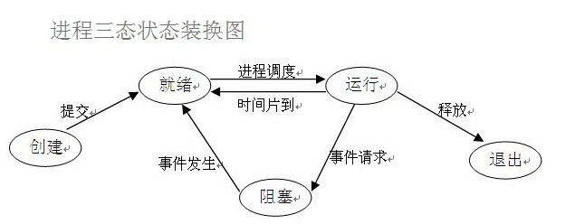

挂起操作和进程状态的转换

挂起操作：当该操作作用于某个进程时，该进程被挂起，意味着此时该进程处于静止状态。如果进程正在执行，它将暂停执行，若原本处于就绪状态，则该进程此时暂不接受调度。和挂起操作对应的操作是激活操作。

引入挂起操作的原因：

1. 终端用户的需要
2. 父进程请求
3. 负荷调节的需要
4. 操作系统的需要

在引入挂起原语$Suspend$和激活原语$Active$后，进程将可能发生一下几种状态的转化：

- 活动就绪->静止状态
- 活动阻塞->静止阻塞
- 静止就绪->活动就绪
- 静止阻塞->活动阻塞

在计算机系统中，对于每个资源和每个进程都设置了一个数据结构，用于表征其实体，称之为资源信息表或进程信息表，其中包含了资源或进程的标识、描述、状态等信息以及一批指针。

OS管理的这些数据结构一般分为四类：内存表、设备表、文件表和进程表，进程表又被称为进程控制块PCB。

PCB的作用：

- 作为独立运行基本单位的标志
- 能实现间断性运行方式
- 提供进程管理所需要的信息
- 提供进程调度所需要的信息
- 实现与其他进程的同步与通信

进程控制块中的信息主要包括四个方面

1. 进程标识符
    > 用于唯一的标志一个进程。通常有两种标识符
    - 外部标识符：为了方便用户（进程）对进程的访问。
    - 内部标识符：为了方便系统对进程的使用。
2. 处理机状态
    > 也称为处理机的上下文，主要是由处理机的各种寄存器的内容组成。
    - 通用寄存器:用于暂存信息。
    - 指令寄存器：存放了要访问下一条指令的地址
    - 程序状态字PSW：包含状态信息、如条件码、执行方式、中断屏蔽标志。
    - 用户栈指针：用于存放过程和系统调用参数及调用地址。
3. 进程调度信息
    - 进程状态
    - 进程优先级
    - 进程调度需要的其他信息
    - 事件：指进程由执行状态转变为阻塞状态所等待发生的事件，即阻塞原因。
4. 进程控制信息：指用于进程控制必须的信息
    - 程序和数据的地址
    - 进程同步和通信机制
    - 资源清单：列出了进程在运行期间所需要的全部资源
    - 链接指针，给出了本进程所在队列中下一个进程的PCB的首地址。

进程控制块的组织方式：
> 在系统中会有多个PCB,为了有效的管理，应该用适当的方式组织这些PCB
- 线性方式，将所有PCB放入一张线性表，将表的首地址存在内存的一个专用区域中。
- 链接方式：将相同状态进程的PCB分别通过PCB的链接字链接成一个队列。
- 索引方式：系统根据所有进程状态的不同，建立几张索引表，将各索引表的首地址记录在内存的一些专用单元中。

### 进程控制

> 进程控制是进程管理的基本功能，主要包括创建新进程、终止已完成的进程、将因发生异常情况而无法继续运行的进程置于阻塞状态，负责进程运行中的状态转换等功能。
> 进程控制一般由OS的内核中的原语来实现。

#### 操作系统内核

OS内核：通常将一些与硬件紧密关联的模块（如中断控制程序）、各种常用设备的驱动程序以及运行频率较高的模块（如时钟管理、进程调度和许多模块所公用的一些基本操作），都安排在紧靠硬件的软件层次，将它们常驻内存，即通常被成为的OS内核。这样安排的目的在于：

- 便于对这些软件进行保护，防止遭受其他应用程序的破坏
- 提高OS的运行效率

同时为了防止OS本身及关键数据遭受应用程序有意无意的破坏，通常也将处理机的执行状态分为系统态和用户态两种：

- 系统态：又称管态，也称内核态。具有较高的特权，能够执行一切指令，访问所有的寄存器和存储区。传统的OS都在系统态运行。
- 用户态：又称目态。它具有较低特权的执行状态，仅能执行规定的指令，访问制定的寄存器和存储区。

一般情况下，应用程序只能在用户态下运行，不能执行OS指令及访问OS区域。

OS内核的功能：

- 支撑功能
  > 该功能是为了提供给OS其他众多模块所需要的一些基本功能，以便支撑这些模块工作。其中三种最基本的支撑功能是：中断处理、时钟管理和原语操作。
    - 中断处理：中断是内核最基本的功能。
    - 时钟管理：
    - 原语操作：所谓原语，就是由若干个指令组成，用于完成一定功能的一个过程。它和一般过程的区别是：它们是“原子操作”。原语在执行过程中不允许中断。原子操作在系统态下执行，常驻内存。
- 资源管理功能
    - 进程管理
    - 存储器管理
    - 设备管理

#### 进程

进程的层次结构：在OS中，允许一个进程创建另一个进程，通常把创建进程的进程称为父进程。

引起创建进程的典型事件：

- 用户登录
- 作业调度
- 提供服务
- 应用请求：上述三种情况下，都是系统内核为用户创建新进程；而这类事件则是由用户进程自己创建新进程。

进程创建的过程：

1. 申请空白的PCB，为新进程申请获取唯一的数据标识符，并从PCB集合中索取一个PCD。
2. 为新进程分配其运行所需的资源，包括各种物理和逻辑资源，如内存、文件、IO设备和CPU时间等。
3. 初始化进程控制块：
    1. 初始化标志信息，将系统分配的标识符和父进程标识符填入新PCB中；
    2. 初始化处理机状态信息，使程序计数器指向程序的入口地址，使栈指针指向栈顶；
    3. 初始化处理机控制信息，将进程的状态设置为就绪状态或静止就绪状态。
4. 如果进程就绪队列能够接纳新进程，就将新进程插入就绪队列。

引起进程终止的事件：

- 正常结束
- 异常结束：发生某种异常事件，程序无法继续运行
    常见的异常事件：越界错；保护错；非法指令；特权指令错；运行超时；等待超时；算术运算错；I/O故障
- 外界干预，是进程应外界的请求而终止运行
    - 操作员或操作系统干预
    - 父进程请求
    - 因父进程终止，指当父进程终止时，它的所有子进程都应当结束。

进程的终止过程：
> 系统中发生了要求终止进程的事件，OS调用进程终止原语
1. 根据被终止进程的标识符，从PCB集合中检索出该进程的PCB，从中读取进程的状态。
2. 若被终止进程正处于执行状态，应立即终止该进程的执行，并置调度标志为真，用于指示该进程被终止后应重新进行调度；
3. 若该进程有子孙进程，还应当将其所有子孙进程都予以终止，防止它们成为不可控进程；
4. 将被终止进程所拥有的全部资源或者还给其父进程，或者还给系统；
5. 将被终止进程PCB从所在队列或链表中移出，等待其他程序来搜集信息。

引起进程阻塞和唤醒的事件：

- 向系统请求共享资源失败
- 等待某种操作的完成
- 新数据尚未到达。对于相互合作的进程，没有获得其他进程提供的数据，只有阻塞。
- 等待新任务的到达

进程阻塞过程：发生了上述的事件后，进程通过调用阻塞原语block将自己阻塞。阻塞是进程自身的一种主动行为。如果进程还处于执行状态，应先立即停止执行，把进程控制块中的现行状态由执行改为阻塞，并将PCB插入到阻塞队伍。

进程唤醒过程：当阻塞进程所期待的事件发生，则由有关进程调用唤醒原语wakeup，将等待该事件的进程唤醒。

进程的挂起：当系统中出现了引起进程挂起的事件时，OS利用挂起原语suspend将制定进程或处于阻塞状态的进程挂起。

进程的激活：当系统中发生激活进程的事件时，OS将利用激活原语active，将指定进程激活。

### 进程同步

单处理机系统中的进程同步机制：硬件同步机制、信号量机制、管程机制等。

进程同步机制的主要任务：是对多个相关进程在执行次序上进行协调，使得并发执行的主进程之间能按照一定的规则共享系统资源，并能很好地相互合作，从而使程序的执行具有可再现性。

在多道程序环境下，处于同一个系统中的多个进程，由于它们共享系统中的资源或为完成某一任务而相互合作，它们之间可能存在着以下两种形式的制约关系：

1. 间接相互制约关系

    > 多个程序并发执行，由于共享系统资源，如CPU、$I/O$设备等，致使在这些并发执行的程序之间形成相互制约的关系。
2. 直接相互制约关系

    > 某些应用程序，为了完成某个任务而建立了两个或多个进程。

临界资源：许多硬件资源如打印机、磁带机等都属于临界资源，诸进程间应采取互斥方式，实现对这种资源的共享。

临界区：人们把在每个进程中访问临界资源的那段代码称为临界区。

一个访问临界资源的循环进程描述如下：

```c
while(True)
{
    进入区//检查是否能够访问临界资源
    临界区
    退出区//将临界区正被访问的标志恢复为为被访问的标志
    剩余区
}
```

同步机制应该遵循的规则：

- 空闲让进
- 忙则等待
- 有限等待
- 让权等待

#### 硬件同步机制

1. 关中断
    > 关中断是实现互斥的最简单的方法之一。在进入锁测试之前关闭中断，指导完成锁测试并上锁之后才能打开中断。这样，进程在临界区执行期间，计算机系统不响应中断，从而不会引发调度，也就不会发生进程或线程切换。

    缺点：

    - 滥用关中断权利可能导致严重后果
    - 关中断时间过长，会影响系统效率
    - 关中断方法不适用与多CPU系统
2. 利用$Test-and-Set$指令实现互斥
    > 借助一条硬件指令--“测试并建立”指令TS以实现互斥的方法。

    TS的一般描述如下

    ```c
    boolean TS(boolean *lock)
    {
        boolean old;
        old = *lock;
        *lock = TRUE;
        return old;
    }
    ```

    这条指令可以当作一个函数过程，其执行过程是不可分割的，即是一条原语。当`*lock=FALSE`，表示该资源空闲；当`\*locak=TRUE`，表示资源正在被使用。

3. 利用$Swap$指令实现互斥
    > 该指令成为对换指令，在Intel 80x86 中又称XCHG指令，用于交换两个字的内容。

    处理过程如下：

    ```c
    void swap(boolean *a,boolean *b)
    {
        boolean temp;
        temp = *a;
        *b = *a;
        *b = temp;
    }
    ```

    用对换指令可以简单有效的实现互斥，方法是为每个临界资源设置一个全局的布尔变量lock，其初值为false，在每个进程中再利用一个局部布尔变量key。利用swap指令实现进程互斥的循环过程如下：

    ```c
    do{
        key = TRUE;
        do{
            swap(&lock,&key)
        }while(key!=FALSE);
        临界区操作；
        lock = FALSE;
        ...
    }while(TRUE);
    ```

#### 信号量机制

> 1965 年，荷兰学着$Dijkstra$提出的信号量机制是一种卓有成效的进程同步工具。现在信号量机制被广泛地应用于单处理机和多处理机系统以及计算机网络中。

1. 整型信号量
    > $Dijkstra$把整型信号量定义为一个用于表示资源数目的整型量S,它和一般整型量不同，除初始化操作外，仅能通过两个标准的原子才做$wait(S)$和$signal(S)$来访问。很长时间，这两个操作被分别成为P、V操作。

    wait和signal操作可描述如下：

    ```c
    wait(S){
        while(S<=0);
        S--;
    }
    signal(S){
        S++;
    }
    ```
2. 记录型信号量

    在整型信号量机制中的$wait$操作，只要信号量$S<=0$，就会不断的测试。没有遵循“让权等待”的准则，而是使进程处于“忙等”的状态，而记录型信号量机制不存在“忙等”现象的进程同步机制。

    除了一个代表资源数目的整型变量value，还增加一个进程链表指针list，用于链接访问同一临界资源所有等待进程。

    上述两个数据项可描述如下：

    ```c
    typedef struct{
        int value;
        struct process_control_block *list;
    }semaphore;
    ```

    相应的$wait(S)$和$signal(S)$可描述如下：

    ```c
    wait(semaphore *s){
        S->value--;
        if(S->value < 0) block(S->list);
    }
    signal(semaphore *s){
        S->value++;
        if(S->value <=0) wakeup(S->list)
    }
    ```

3. AND型信号量

    上面的所述的进程问题针对的是多个并发进程共享一个临界资源的情况。但有些场合，是一个进程往往需要获得两个或更多的共享资源后才能执行其任务。

    AND同步机制的思想：将进程在整个运行过程中需要的所有资源，一次性全部地分配给进程，待进程使用完后再一次释放。只要尚有一个资源未能分配给进程，其他所有有可能为之分配的资源也不分配给它。亦即，多若干个临界资源的分配采用原子操作方式：要么把它所请求的资源全部分配到进程，要么一个不分配。

    ```c
    Swait(S1,S2,...,Sn)
    {
        while(TRUE)
        {
            if(S1>=1 && ... && Sn>=1){
                for(i=1;i<=n;i++) Si--;
                break;
            }
            else
            {
                place the process in the waiting queue associated with the
                first Si found with Si<1,and set the program count of this
                process to the beginning of Swait operation
            }
        }
    }
    Ssignal(S1,S2,...,Sn)
    {
        while(TRUE)
        {
            for(i=1;i<=n;i++){
                Si++;
                Remove all the process waiting in the queue associated with
                Si into the ready queue.
            }
        }
    }
    ```

4. 信号量集

    前面的$wait(S)$和$signal(S)$操作仅能对信号量施以加1减1操作，意味着每次只能对某类临界资源进行一个单位的申请和释放。此外，在有些情况下，为确保系统的安全性，当所申请的资源数量低于某一下限值时，还必须进行管制，不予以分配。

    基于上述两点，可以对AND信号量机制加以扩充，对进程所申请的所有资源以及每类资源不同的资源需求量，在一次$PV$原语操作中完成申请和释放。
    进程对信号量$S_i$的测试值不再是1，而是资源分配的下限值$t_i$,即要求$S_i\ge t_i$,否者不予分配。一旦允许分配，进程对该资源的需求之为$d_i$,即表示资源占用量，进行$S_i=S_i-d_i$操作，而不是简单的$S_i=S_i-1$。由此形成一般化的“信号量集”机制。

#### 管程机制

> 虽然信号量机制是一种既方便、又有效的进程同步机制，但要每个访问临界资源的进程都必须自备同步操作$wait(S)$和$signal(S)$。这就使大量的同步操作分散在各个进程中。这样不仅给系统带来了麻烦，还会因同步操作的使用不当而导致系统死锁。这样就产生了新的进程同步工具--管程$(Monitors)$

管程：代表共享资源的数据结构以及由对该共享数据结构实施操作的一组过程所组成的资源管理程序共同构成了一个操作系统的资源管理模块，我们称之为管程。

管程被请求和释放资源的进程所调用。

$Hansan$为管程所下的定义是：“一个管程定义了一个数据结构和能为并发进程所执行的一组操作，这组操作能同步进程和改变管程中的数据”

管程由四部分组成：

- 管程的名称
- 局部于管程的共享数据结构说明
- 对该数据结构进行操作的一组过程
- 对于局部于管程的共享数据设置初始值的语句

管程的语法描述如下：

```c
Monitor monitor_name{ /*管程名*/
    share variable declarations;/*共享变量说明*/
    cond declarations;          /*条件变量说明*/
    public:                     /*能够被进程调用的过程*/
        void P1(...)            /*对数据结构操作的过程*/
        {...}
        void P2(...)
        {...}
        ...
        void (...)
        {...}
        ...
        {                       /*管程主体*/
            initialization code;/*初始化代码*/
            ...
        }
}
```

管程是一种程序设计语言的结构成分，从语言的角度看，管程具有一下特性：

- 模块化，即管程是一个基本程序单位，可以单独编译
- 抽象数据类型，指管程中不仅有数据，而且有对数据的操作
- 信息隐蔽，指管程中的数据只能被管程中的过程访问，这些过程也是在管程内部定义的，共管程外的进程调用，而管程中的数据结构以及过程（函数）的具体实现外部不可见。

管程和进程的不同：

- 虽然二者都定义了数据结构，但进程定义的是私有数据结构PCB,管程定义的是公共数据结构，如消息队列等
- 二者都存在对各自数据结构的操作，但进程是由顺序程序执行有关操作，而管程主要是进行同步操作和初始化操作
- 设置进程的目的在于实现系统的并发性，而管程的设置则是解决共享资源的互斥使用问题
- 进程通过调用管程中的过程对共享数据结构实行操作，该过程如通常的子程序一样被调用，因而管程是被动工作方式，进程则为主动工作方式
- 进程之间能够并发执行，而管程则不能与其调用者并发
- 进程具有动态性，由“创建”而诞生，由“撤销”而消亡，而管程则是操作系统中的一个资源管理模块，供进程调用。

在利用管程实现进程同步时，需要设置同步工具，如两个同步操作原语wait和signal。当某进程通过管程获取临界资源而未能满足时，管程便调用wait原语使该进程等待，并将其排在等待队列上，仅当另一进程访问完成并释放该资源之后，管程才又调用signal原语。唤醒等待队列中的队首进程。

除了同步工具是不够的，考虑一种情况，当一个进程调用了管程，在官陈中被挂起或被阻塞，直到阻塞或挂起的原因解除，而在此期间，如果该进程不释放管程，则其他进程就无法进入管程，被迫长时间等待。为了解决这个问题，引入条件变量$condition$。

### 进程通信

进程通信是指进程之间的信息交换。

进程通信的类型，高级通信机制可归结为四大类：共享存储器系统、管道通信系统、消息传递系统以及客户机-服务器系统。

#### 共享存储器系统$Shared-Memory\;System$

在共享存储器系统中，相互通信的进程共享某些数据结构或共享存储区，进程之间能够通过这些空间进行通信。分为一下两个类型：

- 基于共享数据结构的通信方式：要求诸进程公用某些数据结构，借以实现诸进程间的信息交换。这种方式仅适用于传递相对少量的数据，通信效率低下，属于低级通信。
- 基于共享存储区的通信方式：为了传输大量的数据，在内存中划出了一块共享存储区域，诸进程可通过对该共享区的读写交换信息，实现通信，数据的形式和位置甚至访问控制都是由进程负责，而不是$OS$,这种通信属于高级通信。

#### 管道通信系统

> 所谓“管道”，是指用于连接一个读进程和一个写进程以实现它们之间通信的一个共享文件，又名$pipe$文件。向管道（共享文件）提供输入的发送进程（即写进程）以字符流形式将大量的数据送入管道；而接受管道输出的接受进程（即读进程）则从管道中接受数据。由于发送进程和接受进程是利用管道进行通信的，故又称为管道通信。

为了协调双方的通信，管道机制必须提供三方面协调能力：

- 互斥：即当一个进程正在对$pipe$进行读/写操作时，另一进程必须等待
- 同步：指当写进程把一定数量的数据写入$pipe$，便去睡眠等待，指导读进程取走数据后再把它唤醒。当读进程读取一空$pipe$时，也应睡眠等待，直至写进程将数据写入管道后才将之唤醒。
- 确定对方是否存在：只有确定了对方已存在时才能进行通信

#### 消息传递系统

在该机制中，进程不必借助任何共享存储区或数据结构，而是以格式化的消息$(message)$为单位，将通信的数据封装在消息中，并利用操作系统提供的一组通信命令（原语），在进程间进行消息传递，完成进程间的数据交换。当前应用最广泛的一类进程间通信机制。例如：在计算机网络中，消息又称报文；在微内核操作系统中，微内核和服务器之间的通信无一例外是采用了消息传递机制；由于该机制能很好的支持多处理机系统、分布式系统和计算机网络，因而成为这些领域最主要的通信工具。

基于消息传递系统的通信方式属于高级通信方式，因其实现方式不同，可进一步分为两类：

- 直接通信方式，是指发送进程利用OS提供的发送原语，直接把消息发送给目标进程
- 间接通信方式：是指发送和接受进程，都通过共享中间实体（称为邮箱）的方式进行消息的发送和接受，完成进程的通信。

#### 客户机-服务器系统

前面的技术，虽然也应用于不同计算机间进程的双向通信，但客户机-服务器系统的通信机制，在网络环境的各种应用领域已经成为当前主流的通信实现机制，其主要的实现方法包括三类：套接字、远程过程调用$(RPC)$和远程方法调用。

1. 套接字 $Socket$
    > 套接字起源于20世纪70年代加州大学伯克利分校版本的$UNIX$(即$BSD Unix$)，是$UNIX操作系$统下的网络通信接口。

    一个套接字就是一个通信标识类型的数据结构，包括：
    1. 通信目的的地址
    2. 通信使用的端口号
    3. 通信网络的传输协议
    4. 进程所在的网络地址
    5. 针对客户或服务器程序提供的不同系统调用（或$API$函数）

    套接字是为客户/服务器模型而设计的，通常，套接字包括两类：

    - 基于文件型

        > 通信进程都运行在同一台机器的环境中，套接字是基于本地文件系统支持的，一个套接字关联到一个特殊的文件，通信双方通过这个文件的读写实现通信。
    - 基于网络型

        > 该类型通常采用非对称方式的通信，即发送者需要提供接受者的命名。

2. 远程过程调用和远程方法调用

    远程过程（函数）调用$(Remote\;Procedure\;Call)$是一个通信协议，用于通过网络连接的系统。该协议允许运行于一台主机（本地）系统上的进程调用另一台主义（远程）系统上的进程。如果设计面向对象编程，那么远程过程调用亦可称为远程方法调用。

    负责处理远程过程调用的进程有两个：一是本地客户进程，另一个是远程服务器进程，者两个进程通常也被称为网络守护进程，主要负责在网络间的消息传递，一般情况下，这两个进程都是处于阻塞状态，等待消息。

    为了使远程过程调用看上去和本地过程调用一样，即希望实现$RPC$的透明性，使得调用者感觉不到此次调用的过程是在其他主机（远程）上执行的，$RPC$引入一个存根$(stub)$的概念：
    在本地客户端，每个能够独立运行的远程过程都拥有一个客户存根$(client\;stubbord)$，本地进程调用远程过程实际是调用该过程相关联的存根；与此类似，在每个远程进程所在的服务器端，其所对应的实际可执行进程也存在一个服务器存根$(stub)$与其关联。本地客户存根和对应的远程服务器存根一般也是处于阻塞状态，等待消息。

    远程过程调用的主要步骤：

    1. 本地过程调用者以一般方式调用远程过程在本地关联的客户存根，传递相应的参数，然后将控制权转移给客户存根；
    2. 客户存根执行，完成包括过程名和调用参数等信息的消息建立，将控制权转移给本地客户进程；
    3. 本地客户进程完成与服务器的消息传递，将消息发送到远程服务器进程；
    4. 远程服务器进程接受消息后转入执行，并根据其中的远程过程名找到对应的服务器存根，将消息转给该存根；
    5. 该服务器存根接到消息后，由阻塞状态转入执行状态，拆开消息从中取出过程调用的参数，然后以一般方式调用服务器上关联的进程；
    6. 在服务器端远程过程运行完毕后，将结果返回与之关联的服务器存根；
    7. 该服务器存根获得控制权运行，将结果打包为消息，并将控制权转移给远程服务器进程；
    8. 远程服务器进程将消息发送回客户端；
    9. 本地客户进程接受到消息后，根据其中的过程名将消息存入关联的客户存根，在将控制权转移给客户存根；
    10. 客户存根从消息中取出结果，返回给本地调用进程，完成控制权的转移。

    上述过程的主要作用在于：将客户过程的本地调用转化为客户存根，再转化为服务器过程的本地调用，对于客户与服务器来说，它们的中间步骤是不可见的。

#### 消息传递通信的实现方式

1. 直接消息传递系统
    > 采用直接通信方式，即发送进程利用$OS$所提供的发送指令（原语）直接把消息发送给目标进程

    - 直接通信原语
        1. 对称寻址方式。该方式要求发送进程和接受进程必须以显式方式提供对方的标识符。

            ```c
            send(receiver,messsage)；发送一个消息给接受进程
            receiver(sender,message)；接受Sender发来的消息
            ```

        2. 非对称寻址方式。在某些情况下，接受进程可能需要和多个发送进程进行通信，无法事先指定发送进程。

            ```c
            send(P,message);发送消息给进程P
            receive(id,message);接受来自任何进程的消息，id变量可设置为进行通信的进程的id或名字
            ```
    - 消息的格式
    - 进程的同步方式
    - 通信链路：根据通信方式的不同：单向通信链路，双向通信链路。

2. 信箱通信
    > 信箱通信属于间接通信方式，即进程之间的通信，需要通过某种中间实体来完成。

    1. 信箱的结构

        信箱定义为一种数据结构。在逻辑上，可以分为两个部分
        - 信箱头，用于存放有关信箱的描述信息
        - 信箱体，若干个可以存放消息的信箱格组成，信箱格的数目以及每格的大小是在创建信箱是确定的。
    2. 信箱通信原语
        - 邮箱的创建和撤销
        - 消息的发送和接受
    3. 信箱的类型
        - 私用邮箱
        - 公用邮箱
        - 共享邮箱

    在邮箱通信时，发送进程和接受进程存在以下四种关系：
    - 一对一关系
    - 多对一关系
    - 一对多关系
    - 多对多关系

#### 直接消息传递系统实例

消息缓冲队列通信机制首先由美国的Hansan提出，并在RC4000系统上实现，后来被广泛应用于本地进程之间的通信中。在这种通信机制中，发送进程利用Send原语将消息直接发送给接受进程；接受进程则利用Receive原语接受消息

1. 消息缓冲队列通信机制中的数据结构
    1. 消息缓冲区

        ```c
        typedef struct message_buffer{
            int sender;发送者进程标识符
            int size;消息长度
            char *text;消息正文
            struct message_buffer *next;指向下一个消息缓冲区的指针
        }
        ```

    2. PCB中有关通信的数据项
        > 在进程的PCB中增加消息队列首指针，用于对消息队列操作，以及用于实现同步的互斥信号量mutex和资源信号量sm。

        ```c
        typedef struct processcontrol_block{
            ...
            struct message_buffer *mq;消息队列指针
            semaphore mutex;消息队列互斥信号量
            semaphote sm;消息队列资源信号量
        }PCB；
        ```
2. 发送原语

    发送原语描述如下：

    ```c
    void send(receiver,a){receiver为接受进程标识符，a为发送区首地址
        getbuf(a.size,i);           根据a.size申请缓冲区
        i.sender = a.sender;
        i.size = a.size;
        copy(i.text,a.text);        将发送区a中的消息复制到消息缓冲区i中；
        i.next = 0;
        getid(PCBset,receiver.j);   获得接受进程内部的标识符
        wait(j.mutex);
        insert(&j.mq,i);            将消息缓冲区插入消息队列
        signal(j.mutex);
        signal(j.sm);
    }
    ```
3. 接受原语

    接受原语描述如下：

    ```c
    void receive(b){
        j = internal name;          j为接受进程内部的标识符；
        wait(j.sm);
        wait(j.mutex);
        remove(j.mq,i)              将消息队列中的第一个消息移出；
        signal(j.mutex);
        b.sender = i.size;
        copy(b.text,i.text);        将消息缓冲区i中的消息复制到接受区b；
        releasebuf(i);              释放消息缓冲区；
    }
    ```

### 线程

#### 线程的引入

在OS中引入进程的目的是为了使多个进程并发执行，以提高资源利用率和系统吞吐量。

在操作系统中引入线程，则是为了减少程序在并发执行时所付出的时空开销，使OS具有更好的并发性。

1. 进程的两个基本属性
    1. 进程是一个可拥有资源的独立单位，一个进程要能独立运行，它必须拥有一定的资源，包括存放程序正文、数据的磁盘和地址空间，以及它在运行时所需要的I/O设备、已打开的文件、信号量等。
    2. 进程同时是一个可独立调度和分派的基本单位，一个进程要能独立运行，它还必须是一个可独立调度和分派的基本单位。
2. 进程并发执行所需要付出的时空开销

    为了使程序能够并发执行，系统必须进行以下一系列操作：
    1. 创建进程，系统创建一个进程时，必须为它分配其所需的，除处理机以外的所有资源。
    2. 撤销进程，系统在撤销进程时，又必须先对其所占的资源执行进行回收操作，再撤销PCB。
    3. 进程切换，对进程进行上下文切换，需要保留当前CPU环境，设置新选中进程的CPU环境，因而须花费不少处理机时间。

3. 线程--作为调度和分派的基本单位
    > 为了分开进程的两个属性分开，由OS分开处理，亦即不把作为调度和分派的基本单位也同时作为拥有资源的单位，以做到轻装上阵；而对于拥有资源的基本单位，又不对之施以频繁的切换，正是这种思想的指导下，形成了线程的概念。

    在OS中引入线程，以线程作为调度和分派的基本单位，则可以有效地改善多处理机系统的性能。

#### 线程和进程的比较

由于线程具有许多传统进程所具有的特征，所以又称之为轻型进程$(Light-Weight-Process)$或进程元，相应的，传统进程称为重型进程$(Heavy-Weight-Process)$。

1. 调度的基本单位

    - 在传统的OS中，进程是作为独立调度和分派的单位，因而进程是能独立运行的基本单位。在每次调度时，都需要进行**上下文切换，开销较大**。
    - 引入线程的OS中，把线程作为调度和分派的基本单位，因而线程是能独立运行的基本单位。当线程切换时，仅需保存和设置少量寄存器内容，切换代价远低于进程。
    - 在同一进程中，线程的切换不会引起进程的切换，但从一个进程的线程切换到另一个进程的线程，必须就引起进程的切换。

2. 并发性

    在引入线程的OS中，不仅进程之间可以并发执行，而且在一个进程中的多个线程之间亦可并发执行，甚至还允许在一个进程中所有的线程都能并发执行。同样，不同进程的线程也能并发执行。这使得OS具有更好的并发性，从而能更加有效地提高系统资源的利用率和系统吞吐量。

    例如：在网页浏览器中，可以设置一个线程来显示图像或文本，再设置一个线程用于从网络中接受数据。

    此外，有的应用程序需要执行多个相似的任务，例如，一个网页服务器经常会接受到许多客户的请求，如果采用传统的单线程的进程来执行任务，则每次只能为一个客户服务。但如果在一个进程中可以设置多个线程，将其中一个专用于监听客户的请求，则每当有一个客户请求，便立即创建一个线程来处理该客户的请求。

3. 拥有资源
4. 独立性
5. 系统开销
6. 支持多处理机系统

#### 线程的状态和线程控制块

线程和传统的进程一样，在各个线程之间存在着共享资源和相互合作的制约关系，致使线程在运行的时也具有间断性。

相应的，线程在运行时也由三种基本状态：

- 执行状态：表示线程已获得处理机而正在运行
- 就绪状态：线程已具备了各种执行条件，只需再获得CPU便可以立即运行
- 阻塞状态：指线程在执行中因某事件受阻而处于暂停状态

线程状态的转换和进程状态的转换是一样的。

线程控制块TCB：记录所有用于控制和管理线程的信息

组成部分：

- 线程标识符
- 一组寄存器：包括程序计数器PC、状态寄存器和通用寄存器的内容。
- 线程运行状态
- 优先级：描述线程的优先级
- 线程专有存储区：用于线程切换时存放线程保护信息，和该线程相关的统计信息
- 信号屏蔽：对某些信号加以屏蔽
- 堆栈指针：用来保存局部变量和返回地址，需要设置两个指向堆栈的指针
    - 指向用户自己的堆栈的指针：线程在用户态时，使用用户自己的用户栈来保存局部变量和返回地址
    - 指向核心栈的指针：线程在和核心态时使用系统的核心栈

多线程OS中的进程属性

> 通常在多线程OS中的进程都包含了多个线程，并为它们提供资源。
> OS支持在一个进程中的多个进程并发执行，但此时的进程不再作为一个执行的实体。

- 进程是一个可拥有资源的独立单位。
- 多个线程可以并发执行
- 进程已不是可执行的实体。在多线程OS中，是把线程作为独立运行或称调度的基本单位

### 线程的实现

#### 实现方式

- 内核支持线程$KST(Kernel\;Supported\;Threads)$
    - 优点：
        - 内核能够同时调用同一进程的多个线程并行执行
        - 如果进程中的一个线程被阻塞了，内核可以调用该进程的其他线程占用处理机运行，也可以运行其他进程的线程
        - 内核支持线程具有很小的数据结构和堆栈，线程的切换比较快，切换开销小
        - 内核本身也可以采用多线程基础，提高系统的执行效率和速度
    - 缺点：对于用户的线程来说，其模式切换的开销较大，线程的切换，需要从用户态转到核心态运行。
- 用户级线程$ULT(User\;Level\;Threads)$
    > 用户级线程在用户空间中实现的。对线程的创建、撤销、同步和通信等功能，都无序内核的支持，即用户级线程和内核无光。

    对于设置用户级线程的系统，其调度仍是以进程为单位进行的。
    对于内核支持线程，则调度是以线程为单位的。

    - 优点
        - 线程切换不需要转换到内核空间
        - 调度算法可以是进程专用的。
        - 用户级线程的实现和OS平台无光
    - 缺点
        - 系统调用的阻塞问题
        - 在单纯的用户级线程实现方式中，多线程应用不能利用多处理机进行多重处理的优点，内核每次分配给一个进程的仅有一个CPU，因此，进程中仅有一个线程能执行，在该线程放弃CPU之前，其他线程只能等待。
- 组合方式
    > 将用户级线程和内核支持线程两种线程方式进行组合。

    由于用户级线程和内核支持线程的连接方式的不同，从而形成了三种模型
    - 多对一模型，即将用户线程映射到一个内核控制线程。
    - 一对一模型，即将每一个用户级线程映射到一个内核支持线程。
    - 多对多模型，即将许多用户线程映射到同样数量或更少数量的内核现场上。

    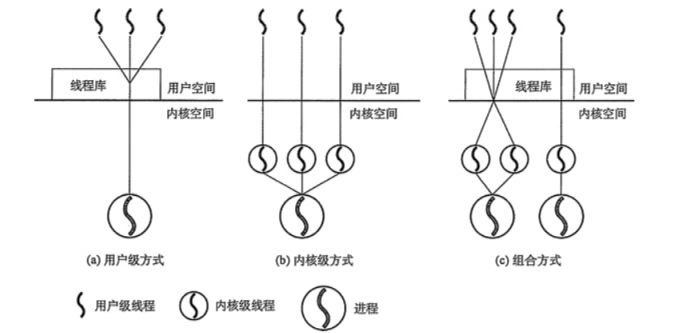

#### 线程的实现实现

1. 内核支持线程
    > 在仅设置了内核支持线程的OS中，一种可能的线程控制方法是，系统在创建一个新的进程时，便为它分配一个任务数据块PTDA(Per Task Data Area),其中包括若干个线程控制块TCB空间。

    内核支持线程的调度和切换与进程的调度和切换十分相似，也分抢占式方式和非抢占式方式两种。
    在线程的调度算法上，也可采用时间片轮转法、优先权算法等。
    当线程调度选中一个线程后，便将处理机分配给它。
2. 用户级线程
    > 用户级线程是在用户空间实现的。所有的用户级线程都具有相同的结构，它们都运行在一个中间系统上。当前有两种方式实现中间系统，即运行时系统和内核控制系统。
    1. 运行时系统
        > 运行时系统：实质上是用于管理和控制线程的函数（过程） 的集合，其中包括用于创建和撤销线程的函数、线程同步和线程通信的函数，以及实现线程调度的函数等。

        正因为上述的函数，才能使用户级线程与内核无关。运行时系统中的所有函数都驻留在用户空间，并作为用户级线程与内核的接口。

        在传统的OS中，进程的切换时必须先由用户态转为核心态，再由核心态执行切换任务；而用户级线程在切换的时候不需要转入核心态，而由运行时系统中的线程切换过程，来执行切换任务，该过程将线程的CPU状态保存在该线程的堆栈中，然后按照一定的算法，选择一个处于就绪状态的新线程运行，将新线程堆栈中的CPU状态装入到CPU相应的寄存器中，一旦将栈指针和程序计数器切换后，便开始了新线程的运行。

        不论在传统OS还是多线程OS，系统资源都是由内核管理的。

        - 在传统的OS中，进程是利用OS提供的系统调用来请求系统资源，系统调用通过软中断机制进入OS内核，由内核完成相应资源的分配
        - 用户级线程是不能利用系统调用的，当线程需要系统资源时，是将该要求传递给运行时系统，由后者通过相应的系统调用来获取系统资源。
    2. 内核控制线程
        > 又叫轻型进程$LWP(Light\;Weight\;Process)$。每个进程可拥有多个$LWP$，同用户级线程一样，每个$LWP$都有自己的数据结构。

        $LWP$可通过系统调用来获得内核提供的服务，这样，当一个用户级线程运行时，只须将它连接到有个$LWP$上，此时它便具有了内核支持线程的所有属性，。这种线程的实现方式是**组合方式**。

        在一个系统的用户级线程可能很大，为了节省系统开销，不可能设置太多的$LWP$，而是把这些$LWP$做成一个缓冲池。称为“线程池”。

        用户进程中的任意用户线程可以链接到$LWP$池中的任一$LWP$上，为了使每个用户线程都能利用$LWP$与内核通信，可以使多个用户线程多路复一个$LWP$,但是只有当前连接到LWP的线程能够和内核通信，其余进程或者阻塞，或者等待$LWP$.

        由L$WP$实现了内核与用户级线程之间的隔离，从而使用户级线程与内核无关。

#### 线程的创建和终止

1. 线程的创建

    应用程序启动时，通常仅有一个线程在执行，称为“初始化线程”，它的主要功能是用于创建新线程。

    在创建新线程时，需要利用一个线程创建函数（或系统调用），并提供相应的参数，如指向线程主程序的入口指针、堆栈的大小，以及用于调度的优先级等。创建完成后，返回一个线程标识符供使用。
2. 线程的终止

    当一个线程完成任务后，或者在线程运行中出现异常情况而须强行终止时，由终止线程通过调用相应的函数对它执行终止操作。但有些线程（主要是系统线程），它们一旦被建立起来之后，便会一直运行而不被终止。

    在大多数的OS中，线程被终止后并不立即释放它占有的资源，只有当进程中的其他线程执行了分离函数，被终止的线程才能和资源分离，此时的资源才能被其他线程利用。

## 第三章 处理调度与死锁

### 处理机调度的层次和调度算法的目标

> 在多道程序系统中，调度的实质就是资源的分配，处理机调度是对处理机资源进行分配。

处理机调度算法：指根据处理机分配策略所规定的处理机分配算法。

#### 处理机调度的层次

- 高级调度$(High\;Level\;Scheduling)$
    - 长程调度或作业调度
    - 调度对象：作业
    - 主要功能：根据某种算法，决定将外存上处于后备队列中的几个作业调入内存，为它们创建进程，分配必要的资源，并放入就绪队列。
    - 高级调度主要用于多道批处理系统中，而在分时和实时系统中不设置高级调度
- 低级调度。$(Low\;Level\;Scheduling)$
    - 进程调度或短程调度
    - 调度对象：进程或内核级线程
    - 主要功能：根据某种算法，决定就绪队列中的哪个进程获取处理机，并分派程序将处理机分配给被选中的进程。
    - 进程调度是一种基本调度，在多道批处理、分时和实时三个类型的OS中，都必须配置这级调度。
- 中级调度$(Intermediate\;Scheduling)$
    - 内存调度
    - 主要目的：提高内存的利用率和系统的吞吐量。
    - 将那些暂时不能运行的进程，调至外存等待，此时进程的状态是就绪驻外存状态（或挂起状态）。当它们具备运行条件且内存空闲时，由内存调度决定，把外存的那些已具备条件的就绪内存调入内存，修改状态为就绪状态，挂载就绪队列等待。中级调度实际上就是存储器管理中的对换功能。

进程调度的运行频率最高。作业调度往往发生在一批作业已运行完毕并退出系统，有需要重新调入一批作业进入内存时，作业调度周期较长，大约几分钟一次，所以又叫长程调度。

#### 处理机调度算法的目标

1. 处理机调度算法的共同目标
    - 资源利用率。使系统尽可能忙碌

        CPU利用率：$R$;CPU有效工作时间:$E$;CPU空闲等待时间:$F$ $R=\frac{E}{E+F}$

    - 公平性：指使诸进程都获得合理的CPU时间
    - 平衡性

        > 系统中可能具有多种类型的进程，有的属于计算型作业，有的属于I/O型作业。为了使系统的CPU和外部设备经常处于忙碌状态，调度算法应尽可能保持系统资源的平衡性。
    - 策略强制执行:对所制定的策略其中包括安全策略，只要需要，就必须予以准确的执行，即使或造成某些工作的延迟也要执行。
2. 批处理系统的目标
    - 平均周转时间短
        > 指作业被提高系统开始，到作业完成为止的这段时间间隔（称为作业周转实践）

        包括四部分时间：作业在外存后备队列上等待调度的时间，进程在就绪队列等待进程调度的时间，进程在CPU执行的时间以及进程等待I/O操作完成的时间。后三项在一个作业的处理过程，可能发生多次。

        平均周转时间：$T=\frac{1}{n}\sum_{i=1}^n{Ti}$

        帯权周转时间，即作业的周转时间Ti和系统为它提供的服务的时间Ts之比：$W=\frac{Ti}{Ts}$

        平均带权周转时间：$W=\frac{1}{n}\sum_{i=1}^n{\frac{Ti}{Ts}}$

    - 系统吞吐量高

        > 吞吐量：单位时间内系统所完成的作业数，因而与处理机作业的平均长度有关。
    - 处理机利用率高
3. 分时系统的目标
    - 响应时间快
    - 均衡性
4. 实时系统的目标
    - 截止时间的保证

        > 截止时间：某任务必须开始执行的最迟时间，或必须完成的最迟时间
    - 可预测性

### 作业和作业调度

操作员把用户提交的作业通过相应的输入设备输入到磁盘存储器，并保存在一个后备作业队列中。再由作业调度程序将其从外存调入内存。

#### 批处理系统中的作业

1. 作业和作业步
    1. 作业$Job$

        > 作业是一个比程序更加广泛的概念，它不仅包含了通常的程序和数据，而且还应配有一份作业说明书，系统根据该说明书来对程序的运行进行控制。在批处理系统中，是以作业为基本单位从外存调入内存的。
    2. 作业步$Job\;Step$
        > 作业运行期间，每个作业都必须经过若干个相对独立又相互关联的顺序加工步骤才能得到结果。我们把每一个加工步骤称为一个作业步，各作业步之间存在着相互联系，往往是上一个作业步的输出作为下一个作业步的输入。

        如：一个典型的作业可分为：“编译”作业步，“链接装配”作业步和“运行”作业步
2. 作业控制块 $JCB(Job\;Control\;Block)$

    > 作业控制块是作业在系统存在的标志，$JCB$的内容有：作业标识、用户名称、用户帐号、作业类型（CPU繁忙型、$I/O$繁忙型，批量型、终端型）、作业状态、调度信息（优先级、作业运行实践）、资源需求（预计运行实践、要求内存大小等）、资源使用情况等。

3. 作业运行的三个阶段和三种状态
    1. 收容阶段。操作员提交作业通过某种输入方式或$SPOOLing$系统输入到硬盘，为作业建立$JCB$,并放置到后备作业中，此时作业的状态为“后备状态”。
    2. 运行阶段。作业被作业调度选中后，便为它分配必要的资源和建立进程，并放入就绪队列。一个作业从第一次进入就绪状态开始，直到结束，这个期间为“运行状态”。
    3. 完成阶段。作业运行完成或发生异常情况退出，作业进入完成阶段，相应的状态为“完成状态”。

#### 作业调度的主要任务

作业调度的主要任务是：根据JCB的信息，检查系统的资源能否满足作业对资源的需求，以及按照一定的调度算法，从外存的后备队列中选取某些队列调入内存，并为它们创建进程、分配必要的资源。
然后将新创建的进程排在就绪队列等待调度。因此作业调度也称为接纳调度$（Admission Scheduling）$

每次执行作业调度，都需要做出以下两个决定

- 接纳多少个作业
- 接纳那些作业

#### 先来先服务和短作业优先调度算法

1. 先来先服务$（first-come first-served,FCFS）$调度算法
    最简单的算法，该算法既可用于作业调度，也可以用于进程调度。

    FCFS算法已经很少作为主调度算法，经常和其他调度算法组合使用，形成一个更有效的调度算法。
2. 短作业优先$（short\;job\;first,SJF）$的调度算法
    1. 短作业优先算法
        按照作业的长短来计算优先级，作业越短，优先级越高。作业的长短是以作业所要求的运行时间来衡量的。

        SJF算法可分别用于作业调度和进程调度。

    2. 短作业优先算法的缺点
        - 必须预知作业的运行时间。
        - 对长作业非常不利。
        - 在采用SJF算法，人机无法实现交互。
        - 未考虑作业的紧迫程度，不能保证紧迫性作业能得到及时处理。

#### 优先级调度算法和高响应比优先调度算法

1. 优先级调度算法$（priority-Scheduling algorithm，PSA）$
    - 对于先来先服务调度算法，作业等待的时间就是优先级
    - 对于短作业优先调度算法，作业的长短就是优先级
    - 优先级调度算法，则是基于作业的紧迫程度，由外部赋予作业的对的优先级。
2. 高响应比优先调度算法$（Highest\;Response\;Ratio\;Next,HRRN）$

    高响应比优先调度算法既考虑了作业的等待时间，有考虑了作业的运行时间，因此既照顾了短作业，又不致使长作业等待时间过长。

    优先权：$P$
    等待时间：$W$
    要求服务时间：$Q$

    $P=\frac{W+Q}{Q}$

    由于等待时间(W)和服务时间(Q之和就是系统对该作业的响应时间，故优先级有相当于响应比$R_p$,优先级又可以表示为：

    $R_p=\frac{W+Q}{Q}$

### 进程调度

进程调度是必不可少的一种调度。在三种OS中都配置了进程调度。它还是对系统性能影响最大的一种处理机调度

#### 进程调度的任务、机制和方式

1. 进程调度的任务
    1. 保存处理机的现场信息。在进程调度时首先需要保存当前进程的处理机的现场信息，如程序计数器、多个通用寄存器的内容等。
    2. 按某种算法选取进程。调度程序按照某种算法从就绪队列中选取一个进程，将其改为运行状态，并准备把处理机分配给它。
    3. 把处理机分配给进程。
2. 进程调度机制

    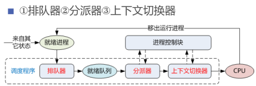

    进程调度机制分为三个部分：

    - 排队器:将就绪进程按照一定的策略排成一个或多个队列。
    - 分派器：依据进程调度程序所选定的进程，将其从就绪队列中取出，然后进行从分派器到新选出进程间的上下文切换，将处理机分给新的进程。
    - 上下文切换器

        对处理机进行切换时，会发生两对上下文的切换操作：
        - 第一对上下文切换时，OS将保存当前进程的上下文，即把当前进程的处理机寄存器内容保存到该进程的进程控制块的相应单元，再装入分派程序的上下文，以便分派程序运行；
        - 第二对上下文切换是移出分派程序的上下文，而把新选进程的CPU现场信息装入处理机的各个相应的寄存器中，以便选取进程运行。

        在进程上下文切换时，需要执行大量的load和store等操作指令命令，以保存寄存器的内容。
        即使现代计算机，每次上下文切换所花费的时间大约可执行上千条指令。
        为次，现在已有靠硬件实现的方法来减少上下文切换时间。
        一般采用两组或多组寄存器，一组寄存器供处理机在系统态时使用，而另一组寄存器供应用程序使用。
3. 进程调度方式
    1. 非抢占方式
    2. 抢占方式

#### 轮转调度算法

在分时系统中，最简单也是最常用的是基于时间片的轮转$(round\;robin,RR)$调度算法

1. 基本原理

    系统根据FCFS策略，将所有的就绪进程排成一个就绪队列，并可设置每隔一定时间间隔即产生一次中断，激活系统中的进程调度程序，完成一次调度，将CPU分给队首进程，令其执行。当该进程的时间片耗尽或运行完毕，系统再次将CPU分配给新的队首进程（或新到达的紧迫进程）。

2. 进程切换时机
    - 若一个时间片尚未用完，正在运行的进程便已经完成，就立刻激活调度程序，将它从就绪队列删除，再调度就绪队列队首的进程运行，并启动一个新的时间片。
    - 在一个时间片用完，计时器中断处理程序被激活。如果进程尚未运行完毕，调度程序把它送到就绪队列的末尾。
3. 时间片大小的确定

    时间片的大小对系统的性能有很大的影响。

    选择很小的时间片，有利于短作业，但时间片小，意味着会频繁地执行进程调度和进程上下文的切换，增加系统的开销。反之，时间片较长，$RR$算法退化为$FCFS$算法，无法满足短作业和交互式用户的需求。

    一个较为可取的时间片大小是略大于一次典型的交互所需要的时间，使大多数交互式进程能在一个时间片内完成，从而获得很小的响应时间。

#### 优先级调度

在时间片轮转算法中，做了一个隐含的假设，即系统中的所有进程的紧迫性都是相同的。但实际情况并非如此。为了满足实际情况的需要，在进程调度算法中引入了优先级，形成了优先级调度算法。

1. 优先级调度算法的类型
    - 非抢占式优先级算法

        > 一旦把处理机分配给就绪队列中优先级最高的进程后，该进程一直执行下去直至完成，或者因该进程发生某事件而放弃处理机时，系统方可将处理机重新分配给另一优先级最高的进程。
    - 抢占式优先级算法
        > 把处理机分配给优先级最高的进程，使之执行。但在其执行期间，只要出现了另一优先级更高的进程，调度程序就将处理机分配给新到的优先级最高的进程。

        抢占式优先级算法常用于对实时性要求较高的系统中。
2. 优先级的类型
    1. 静态优先级
        > 静态优先级是在创建进程时确定的，在进程的整个运行期间保持不变。优先级是利用某一个范围内的一个整数来表示的，例如0-255中的某个整数，又把该整数成为优先数。

        确定优先级的大小的依据有如下三个：
        - 进程类型。通常系统进程的优先级高于一般用户进程的优先级。
        - 进程对资源的需求。对资源要求少的进程应赋予较高的优先级。
        - 用户要求。根据进程的紧迫程度及用户所付费用的多少确定优先级。
    2. 动态优先级

        > 动态优先级是在创建进程之初，先赋予其一个优先级，然后其随着进程的推进或等待时间的增加而改变，以便获得更好的调度性能。

#### 多队列调度算法

将系统中的进程就绪队列从一个拆分为若干个，将不同类型和性质的进程固定分在不同的就绪队列，不同的就绪队列采用不用的调度算法，一个就绪队列中的进程可以设置不同的优先级，不同的就绪队列本身也可以设置不同的优先级。

多队列调度算法由于设置多个就绪队列，因此对每个就绪队列就可以实施不同的调度算法，因此，系统针对不同用户进程的需求，很容易提供多种调度策略。

#### 多级反馈$(multileved\;feedback\;queue)$调度算法

前面的各种用于进程调度的算法都有一定的局限性。如果未指明进程长度，则短进程优先和基于进程长度的抢占式调度算法都将无法使用。

多级反馈队列调度算法则不必事先知道各种进程所需的执行时间，还可以较好地满足各种类型进程的需要，因而它是目前公认的一种较好的进程调度算法

1. 调度机制
    1. 设置多个就绪队列。
        - 为每个队列赋予不同的优先级。第一个队列的优先级最高，其余队列优先级逐个降低。
        - 为每个队列的进程所赋予的执行时间片大小也各不相同，在优先级越高的队列中，其时间片越小。
    2. 每个队列都采用FCFS算法。
        - 当新进程进入内存后，首先将它放入第一队列的末尾，按FCFS原则等待调度。
        - 当轮到该进程执行时，如果它能在该时间片内完成，便可撤离系统。否则，即它在一个时间片结束时尚未完成，调度程序将其转入第二队列的末尾等待调度，以此类推。当进程最后被降到第n队列后，在第n队列中便采取按RR方式运行。
    3. 按队列优先级调度。
        - 调度程序首先调度最高优先级队列中的诸进程运行，仅当第一队列空闲时才调度第二队列中进程运行；换言之，仅当第1~(i-1)所有队列均空闲时，才会调度第i队列中的进程运行。
        - 如果处理机正在第i队列为某个进程服务时，又有新进程进入任一优先级较高的队列，此时须立即把正在运行的进程放回第i队列的末尾，而把处理机分配给新到的高优先级进程。
2. 调度算法的性能

    在多级反馈调度算法中，如果规定第一个队列的时间片略大于多数人机交互所需之处理时间时，便能较好地，满各种类型用户的需要。

    - 终端型用户
    - 短批处理作业用户
    - 长批处理作业用户

#### 基于公平原则的调度算法

以上算法所保证的只是优先运行，如优先级算法是优先级最高的作业先运行，但不保证作业占用了多少处理机时间。另外也为未考虑调度的公平性。

1. 保证调度算法
    > 保证调度算发，向用户做出的保证不是优先运行，而是明确的性能保证，该算法可以做到调度的公平性。

    一种比较容易实现的性能保证是处理机分配的公平性。

    如果在系统中有n个相同类型的进程同时运行，为公平起见，须保证每个进程都获得相同的处理机时间1/n。在实施公平调度算法系统中必须具有这样一些功能：

    - 跟踪计算每个进程自创建以来以及执行的处理时间。
    - 计算每个进程应获得的处理机时间，即自创建以来的时间处理n。
    - 计算进程获得处理机时间的比率，即进程实际执行的处理时间和应获得的处理机时间之比。
    - 比较各进程获得处理机时间的比率。
    - 调度程序应选择比率较小的进程将处理机分配给它，并让该进程一直运行，直到超过最接近它的进程比率位置。
2. 公平分享调度算法

    在该调度算法中，调度的公平性主要是针对用户而言，使所有用户能获得相同的处理机时间，或要求的时间比例。然而调度又是以进程为基本单位，为此，必须考虑到每一个用户所拥有的进程数目。

### 实时调度

#### 实现实时调度的基本条件

1. 提供必要的信息

    系统应向调度程序提供有关任务的信息：

    - 就绪时间
    - 开始截止时间和完成截止时间
    - 处理时间
    - 资源要求
    - 优先级
2. 系统处理能力强

    在实时系统中，若处理机的处理能力不够强，则有可能因处理机忙不过，而致使某些实时任务不能得到及时处理，从而导致无法预料的后果。

    假定系统中有m个周期性的硬实时任务HRT，它们的处理时间可表示为$C_i$,周期时间表示为$P_i$，则在单处理机情况下，必须满足下面的限制条件系统才是可调度的：$\sum_{i=1}^{m}\frac{C_i}{P_i}<1$

    上述的限制条件下未考虑任务切换花费的时间，因此，当利用上述限制条件时，还应适当地留有余地。

    提高系统处理能力的途径：

    - 采用单处理系统，但须增强其处理能力，以显地减少对每个任务的处理时间
    - 采用多处理机系统

    假定处理机数为N，则上述限制条件改为：$\sum_{i=1}^{m}\frac{C_i}{P_i}<N$
3. 采用抢占式调度机制
4. 具有快速切换机制

    该机制应该具备如下两方面能力：

    - 对中断的快速响应能力
    - 快速的任务分派能力

#### 实时调度算法的分类

1. 非抢占式调度算法
    - 非抢占式轮转调度算法
    - 非抢占式优先调度算法
2. 抢占式调度算法
    - 基于时钟中断的抢占式优先级调度算法
    - 立即抢占的优先级调度算法

#### 最早截止时间优先$EDF(Earliest\;Deadline\;First)$

> 根据任务的截止时间确定任务的优先级，任务的截止时间越早，其优先级越高，具有最早截止时间的任务排在队列的队首。

1. 非抢占式调度方式用于非周期实时任务
2. 抢占式调度方式用于周期任务

#### 最低松弛度优先$LLF(Least\;Laxity\;First)$算法

> 根据任务的紧急或松弛程度确定任务的优先级，任务紧急程度越高，赋予该任务的优先级越高，以使之优先执行。

例如，一个任务在200ms时必须完成，而它本身需要的运行时间是100ms，因此调度程序必须在100ms之前执行，该任务的紧急程度（松弛程度）为100ms。

该算法要求系统中有一个按松弛度排序的实时任务就绪队列，松弛度最低的任务排在最前面，调度程序选择队列中的队首任务执行。

该算法主要用于可抢占式调度算法中。

#### 优先级倒置

1. 优先级倒置的形成

    优先级倒置现象：即高优先级的进程（或线程）被低优先级的进程延迟或阻塞。

    原因：当前的OS中广泛采用优先级调度算法和抢占方式，然而在系统中存在着影响进程运行的资源而可能产生”优先级倒置“的现象。

2. 优先级倒置的解决办法

### 死锁概述

资源问题：

1. 可重用性资源和消耗性资源
    - 可重用性资源
        具有的性质：
        - 每个可重用性资源中的单元只能分配给一个进程使用，不允许共享。
        - 进程在使用可重用性资源时，必须按照这样的顺序
            1. 请求资源。请求失败，请求进程将会被阻塞或循环等待。
            2. 使用资源。对资源进行操作。
            3. 释放资源。
        - 系统中每一类可重用性资源的单元数目是相对固定的，进程在运行期间既不能创建也不能删除它。

        对资源的请求和释放通常利用系统调用实现的。

    - 可消耗性资源
        > 可消耗性资源又称临时资源，它在进程运行期间，由进程动态地创建和消耗的。

        性质：
        - 每一类可消耗资源的单元数目在进程运行期间是可以不断变化的
        - 进程在运行过程中，可以不断地创造可消耗性资源的单元，将它们放入该资源类的缓冲区中，以增加该资源类的单元数目。
        - 进程在运行过程中，可以请求若干个可消耗性资源单元，用于进程的消耗，不再将它们返回给该资源类中。

        最典型的可消耗性资源就是用于进程间通信的消息等。

2. 可抢占式性资源和不可抢占式资源
    - 可抢占式资源
        > 某进程在获得这类资源后，该资源可以再被其他进程或系统抢占。

        CPU和主存都属于可抢占性资源。对于这类资源是不会引起死锁的。
    - 不可抢占式资源
        > 即一旦系统把某个资源分配给该进程后，就不能将它强行收回，只能在进程使用完后自行释放。

        刻录机、磁盘带、打印机等都属于不可抢占性资源。

#### 死锁的原因

1. 竞争不可抢占性资源引起死锁
2. 竞争可消耗资源引起死锁
3. 进程推进顺序不当引起死锁

#### 死锁

1. 定义

    > 如果一组进程中的每一个进程都在等待仅由该组进程中的其他进程才能引发的事件，那么该组进程是死锁的$(Deadlock)$

2. 死锁产生的必要条件

    产生死锁的四个必要条件：

    - 互斥条件
    - 请求和保持条件
    - 不可抢夺条件
    - 循环等待条件

3. 死锁的处理方法

    - 预防死锁
    - 避免死锁
    - 检测死锁
    - 解除死锁

### 预防死锁

1. 破坏”请求与保持“条件

    系统必须保证：当一个进程在请求资源时，它不能持有不可抢占资源。
    该保证可通过如下两个不同的协议实现：
    - 第一种协议
        > 规定，所有进程在开始运行之前，必须一次性地申请其在整个运行过程中所需的所有资源。（破坏”请求“条件）,分配资源的时候，只要一种资源不能满足该进程的要求，即使其他资源空闲也不分配给该进程，让该进程等待。（破坏”保持“条件）

        该协议的优点是简单、易行且安全，但缺点也及其明显：

        - 资源被严重浪费，严重恶化了资源的利用率。
        - 使个别进程经常会发生饥饿现象。
    - 第二种协议

        > 对第一种协议进程改进，它允许一个进程只获得允许初期所需的资源后，便开始允许。

2. 破坏”不可抢占“条件
3. 破坏”循环等待“条件

### 避免死锁

系统安全状态
> 在死锁避免方法中，把系统的状态分为安全状态和不安全状态。当系统处于安全状态时，可避免发生死锁。反之，当系统处于不安全状态，则可能进入到死锁状态。

#### 利用银行家算法避免死锁

实现银行家算法，每一个新进程在进入系统时，它必须申明在运行过程中，可能需要每种资源类型的最大数目，其数目不能超过系统所拥有的资源总量。当进程请求一组资源时，系统必须首先确定是否有足够的资源分配给该进程。若有，再进一步计算在将这些资源分配给进程后，是否会使系统处于不安全状态。如果不会，才将资源分配给它，否则让进程等待。

1. 银行家算法中的数据结构

    - 可利用资源向量$\vec{Available}$。这是一个含有m个元素的数组，其中的每一个元素代表一类可利用的资源数目，其初始值是系统中所配置的该类全部可用资源的数目，其数值随着该类资源的分配和回收而动态的地改变。
    - 最大需求矩阵Max。这是个$n*m$的矩阵，它定义了系统中n个进程中的每一个进程对m类资源的最大需求。
    - 分配矩阵Allocation。这也是个$n*m$的矩阵，它定义了系统中每一类资源当前已分配给每一个进程的资源数。
    - 需求矩阵Need。这也是个$n*m$的矩阵，用以表示每一个进程尚需的各类资源数。

    上述三个矩阵间存在下属关系：

    $$Need[i,j]=Max[i,j]-Allocation[i,j]$$

2. 银行家算法

    设$\vec{Request_i}$是进程$P_i$的请求向量，如果$\vec{Request_i}[j]=K$,表示进程$P_i$需要$K$个$R_j$类型的资源。当$P_i$发出资源请求后，系统按下述步骤进程检查：

    1. 如果$Request_i \leq Need[i,j]$,便转向步骤2；否则任务出错，因为它所需要的资源数已超过它所宣布的最大值。
    2. 如果$\vec{Request_i} \leq Available[j]$，便转向步骤3；否则，表示尚无足够资源，$P_i$须等待。
    3. 系统试探着把资源分配给进程$P_i$，并修改下面数据结构中的数值：
        $\vec{Available}[j]=\vec{Available}[j]-\vec{Request_i}[j];$
        $Allocation[i,j]=Allocation[i,j]+\vec{Request_i}[j];$
        $Need[i,j]=Need[i,j]-\vec{Request_i}[j];$
    4. 系统执行安全性算法，检查此次资源分配后系统是否处于安全状态。若安全，才正式将资源分配给进程$P_i$,以完成此次分配；否则，将本次的试探分配作废，恢复原来的资源分配状态，让进程$P_i$等待。
3. 安全性算法

    系统所执行的安全性算法可描述如下：

    1. 设置两个向量：
        - 工作向量$\vec{Work}$，它表示系统可提供给进程继续运行所需的各类资源数目，它含有$m$个元素,在执行安全算法开始时，$\vec{Work}=\vec{Available}$
        - $Finish$:它表示系统是否有足够的资源分配给进程，使之运行完成。开始先做$Finish[i]=false$;当有足够资源分配给进程时，再令$Finish[i]=true$。
    2. 从进程集合中找到一个能满足下述条件的进程
        - $Finish[i]=false$
        - $Need[i,j] \leq \vec{Work}[j]$
        若找到，执行步骤3，否则，执行步骤4。
    3. 当进程$P_i$获得资源后，可顺序执行，直至完成，并释放出分配给它的资源，故执行
        $\vec{Work}[j] = \vec{Work}[j] + Allocation[i,j];$
        $Finish[i] = true;$
        $go to step 2;$
    4. 如果所有进程的$\quad Finish[i] = true\quad$都满足,则表示系统处于安全状态，否则，系统处于不安全状态。

### 死锁的检测和解除

如果系统中，既不采取死锁预防和死锁避免算法，系统很可能发生死锁，在这种情况下，系统应当提供两个算法：

- 死锁检测算法
- 死锁解除算法

#### 死锁的检测

为了能对系统中是否已发生了死锁进行检测，在系统中必须：

- 保存有关资源的请求和分配信息；
- 提供一种算法，它利用这些信息来检测系统是否进入死锁状态。

1. 资源分配图 $Resource\;Allocation\;Graph$

    由一组结点$N$和一组边$E$所组成一个对偶$G=(N,E)$，它具有下述形式的定义和限制：
    1. 把$N$分为互斥的子集，即一组进程结点$P=\{P_1,P_2,...,P_n\}$
    和一组资源结点$R=\{R_1,R_2,...,R_n\},N=P \cup R$。
    2. 凡属于$E$中的一个边$e \in E$,都连接着$P$中的一个结点和$R$中的一个结点，$e=\{R_1,R_2\}$是资源请求边，由进程$P_i$指向资源$R_j$，它表示进程$P_i$请求一个单元的$R_j$资源。$E=\{R_j,P_i\}$是资源分配边，由资源$R_j$指向进程$P_i$，它表示把一个单位的资源$R_j$分配给进程$P_i$。
2. 死锁定理
3. 死锁检测中的数据结构

#### 死锁的解除

常用的解除死锁的方法

- 抢占资源
- 终止或撤销进程

1. 终止进程的方法
    - 终止所有死锁进程
    - 逐个终止进程：逐个的终止进程，直至有足够的资源，以打破循环等待，把系统从死锁状态解除出来。
2. 付出代价最小的死锁解除算法

## 第四章 存储器管理

> 存储器一直是计算机的重要组成部分。存储器管理的主要对象是内存。

### 存储器的层次结构

1. 多层结构的存储器系统
    1. 存储器的多层结构
        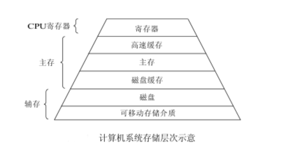
    2. 可执行存储器

        寄存器和主存储器被成为可执行存储器。对于存放于其中的信息，与存放于辅存中信息相比较而言，计算机所采用的访问机制是不同的，所需耗费的时间也是不同的。

        进程可以在很少的时钟周期内使用一条load和store指令对可执行存储器进程访问，但对辅存的访问则需要通过$I/O$设备实现，因此，在访问中涉及到中断、设备驱动程序以及物理设备的运行，所需要的时间远远高于访问可执行存储器的时间。
2. 主存储器与寄存器

    - 主存储器简称为内存或主存，是计算机系统中的主要部件，用于保存进程运行时的程序和数据，也称为可执行存储器。

        - 通常，处理机都是从主存储器中取得指令和数据，并将所取得的指令放入指令寄存器中，而将其所读取的数据装入数据寄存器；或者反之，将寄存器的数据存入到主存储器中。

        - 由于主存储器的速度远远低于CPU的执行指令速度，为了缓和这个矛盾，引入了寄存器和高速缓存。

    - 寄存器，具有和处理机相同的速度，故对寄存器的访问速度最快，完全能与CPU协调工作，但价格很贵，因此容量不可能做的很大。

        - 主要用于存放处理机运行时的数据，加快存储器的访问速度，如使用寄存器存放操作数，或用作地址寄存器加快地址转换速度等。

3. 高速缓存和磁盘缓冲

    - 高速缓存：介于寄存器和存储器之间的存储器，主要用于备份主存中较常用的数据，以减少处理机对主存储器的访问次数，这样可大幅度地提高程序的执行速度。
        - 高速缓存容量远大于寄存器
        - 访问速速快于主存储器。
        - 为了缓和内存和处理机速度之间的矛盾。

        当CPU访问一组特定信息时，须检查它是否在高速缓存中，如果已存在，便可直接从中取出，避免访问主存，否则，就须从主存中读出信息。

        由于高速缓存的速度越高价格越贵，故在有的计算机系统中设置了两级或多级高速缓存。紧靠内存的一级高速缓存的速度最高，故容量最小，二级高速缓存的容量稍大，速度也稍低。

    - 磁盘缓存：目前磁盘的$I/O$速度远低于对主存的访问速度，为了缓和两者之间在速度上的不匹配，而设置了磁盘缓存。
        - 暂存频繁使用的一部分磁盘数据和信息，以减少磁盘的访问速度。
        - 并不是实际存在的存储器，而是利用主存中的部分存储空间暂时存放从磁盘中读出或写入的信息。
        - 主存可以看作是辅存的高速缓存，
        - 辅存中的数据必须复制到主存才能使用，
        - 数据也必须先存在主存，才能输出到辅存。

### 程序的装入和链接

1. 引入
    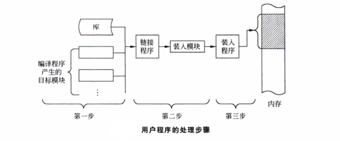
    用户程序要系统中运行，必须将它装入内存，然后将其转变为一个可执行程序，通常需要一下几个步骤
    1. 编译，由编译程序对用户源程序进行编译，形成若干个目标模块；
    2. 链接，由链接程序将编译后的程序形成的一组目标模块以及它们所需要的库函数链接在一起，形成一个完整的装入模块；
    3. 装入，由装入程序将装入模块装入内存。

2. 程序的装入

    1. 绝对装入方式$Absoulte\;Loading\;Mode$当计算机系统很小的时候，且仅能运行单道程序时，完全有可能知道程序将
        驻留在内存的什么位置。此时可采用绝对装入方式。用户程序经编译后，将产生绝对地址（即物理地址）的目标代码。
    2. 可重定位装入方式$Relocation\;Loading\;Mode$对于用户程序编译形成的若干个目标模块，它们的起始位置通常都是从0开始的，程序中的其他地址也都是相对于起始地址计算的。此时不可能再用绝对装入方式，而应采用可重定位装入方式。
    3. 动态运行时的装入方式$Dynamic\;Run-time\;Loading$可重定位装入方式可将装入模块装入到内存中的任何允许的位置，故可用于多道程序环境。但该方式不允许程序在运行时在内存中移动位置。

        例如，在具有对换功能的系统中，一个进程可能被多次换出，又多次被换入，每次换入后的位置通常是不同的。在这种情况下，就应该采用动态运行时的装入方式。
3. 程序的链接

    在对目标模块进行链接时，根据进行链接的时间不同，可把链接分为三种：
    1. 静态链接$(Static\;Linking)$方式
        在程序运行之前，先将各目标模块及它们所需的库函数链接成一个完整的装配模块，以后不在拆开。这就是静态链接方式。

        将几个目标模块装配成一个装入模块时，须解决一下两个问题：
        - 对相对地址进程修改
        - 交换外部调用符号
    2. 装入时动态链接$(Load-time\;Dynamic\;Linking)$
        在装入内存时，采用边装入边链接的链接方式。即在装入一个目标模块时，若发生一个外部模块的调用事件，将引入装入程序去找出相应的外部目标模块，并将它装入内存，还要修改目标模块中的相对地址。

        优点：
        - 便于修改和更新
        - 便于实现对目标模块的共享
    3. 运行时动态链接$(Run-time\;Dynamic\;Linking)$
        将对某些模块的链接推迟到程序执行时才进行。即，在执行过程中，当发现一个被调用模块尚未装入内存时，立即由OS去寻找该模块，并将之装入内存，将其链接到调用者模块上。

### 连续分配存储管理方式

1. 单一连续分配
    在单道程序环境下，当时的存储器管理方式是把内存分为系统区和用户区两部分，系统区仅提供给OS使用，它通常是放在内存的低址部分。而在用户区内存中，仅装有一道用户程序，即整个内存的用户空间由该程序独占。这样的存储器分配方式被称为单一连续分配方式。
2. 固定分区分配
    1. 划分分区的方法
        用下述两种方法将内存的用户空间划分为若干个固定大小的分区
        - 分区大小相等：指所有的内存分区大小相等。缺点是缺乏灵活性。
        - 分区大小不等。
    2. 内存分配
        为了便于内存分配，通常将分区按其大小进行排队，并建立一张分区使用表，其中各表项包括每个分区的起始地址、大小及状态。

    固定分区分配是最早出现的，可用于多道程序系统的存储管理方式，现在很少用于通用的$OS$中，但在某些用于控制多个相同对象的控制系统中，由于每个对象的控制程序大小相同，仍可采用固定分区式存储管理方式。
3. 动态分区分配
    动态分区分配又称可变分区分配，根据进程的实际需要，动态地为之分配内存空间。设计三方面问题：数据结构、分区分配算法和分区的分配和回收操作。

    1. 动态分区分配中的数据结构
        常用的数据结构有一下两种形式：
        - 空闲分区表
        - 空闲分区链
    2. 动态分区分配算法
    3. 分区分配操作
        主要的操作是分配内存和回收内存。
4. 基于顺序搜索的动态分区分配算法

    为了实现动态分区分配，通常是将系统中的空闲分区链接成一个链。

    顺序搜索：指依次搜索分区链上的空闲分区，去寻找一个其大小能满足要求的分区。

    基于顺序搜索的动态分区分配算法主要有四种：首次适应算法、循环首次适应算法、最佳适应算法和最坏适应算法。

    1. 首次适应$(First\;fit,FF)$算法
        FF算法要求空闲分区链以地址递增的次序链接。在分配内存时，从链首开始顺序查找，直至找到一个大小能满足要求的空闲分区位置。然后在按照作业的大小，从该分区划分一块内存空间，分配给请求者，余下空闲分区仍留在空闲链中。若找不到满足条件的分区，内存分配失败，返回。

        该算法倾向于优先利用内存中低址部分的空闲分区，保留了高址部分的大空闲分区，为以后的大作业分配大的内存空间创造了条件。缺点是低址部分不断被划分，会留下许多难以利用的。很小的空闲分区，成为碎片。
    2. 循环首次适应$(next\;fit,NF)$算法
        为了避免低址部分留下很多很小的空闲分区以及减少查找可用空闲分区的开销，NF算法不是每次从链首开始查找，二次在上次找到的空闲分区的下一个空闲分区开始查找。

        为实现该算法，应设置一起始查寻指针，用于指示下一次起始查寻的空闲分区，并采用循环查找方式，如果最后一个不能满足要求，则返回到第一个空闲分区，比较大小是否符合要求。

        该算法使内存中的空闲分区分布的更加均匀，从而减少了查找空闲分区的开销，但缺乏大的空闲分区。

    3. 最佳适应$(best\;fit,BF)$算法
        每次作业分配内存时，总是把能满足要求，又是最小的空闲分区分配给作业。为了加速查找，该算法要求将所有的空闲分区按其从小到大的顺序形成一空闲分区链。缺点是会留下很多许多难以利用的碎片。
    4. 最坏适应$(worst\;fit,WF)$算法
        与最佳适应算法相反，该算法要求将所有的空闲分区按其从大到小的顺序形成一空闲分区链，查找时，只要看第一个分区是否能满足作业要求即可。
5. 基于索引搜索的动态分区分配算法

    基于顺序搜索的动态分区分配算法适用于不太大的系统。当系统很大时，系统的内存分区可能很多，相应的空闲分区链可能很长，采用顺序搜索分区方法会很慢。在大中型系统中往往会采用基于索引搜索的动态分区分配算法。

    目前常用的有：快速适应算法、伙伴系统和哈希算法。

    1. 快速适应$(quick\;fit)$算法
        又称分类搜索算法，将空闲分区根据容量大小进行分类，对于每一类具有相同容量的所有空闲分区，单独设立一个空闲分区链表，这样系统中存在多个空闲分区链表。同时在内存中设立一张管理索引表，其中的每一索引表项对应了一种空闲分区类型，并记录了该类型空闲分区链表表头的指针。

        空闲分区的分类是根据进程常用的空间大小划分的。

        步骤：
        - 根据进程长度，从索引表中去寻找能容纳它的最小空闲区链表；
        - 然后从链表中取下第一块进行分配即可。

        该算法在进行空闲分区分配时，不会对任何分区产生分割，所以能保留大的分区，满足对大空间的需求，也不会产生碎片，优点是查找效率高。

        缺点在于为了有效合并分区，在分区归还主存时的算法复杂，系统开销大。该算法在分配空闲分区时，是以进程为单位，一个分区只属于一个进程，分区存在或多或少的浪费。这是典型的以空间换时间的做法。

    2. 伙伴系统$(buddy\;system)$
        规定，无论已分配分区或空闲分区，其大小均是$2^k$（$k$为整数，$1 \leq k \leq m$）。通常$2^m$是整个可分配内存的大小。

        当为进程分配一个长度为$n$的存储空间时，，首先计算一个$i$值，使$2^{i-1} < n \leq 2^i$,然后在空闲分区大小为$2^i$的空闲分区链中查找。若找到就分配给该仅，否则，表示长度为$2^i$的空闲分区已经耗尽，则在分区大小为$2^{i+1}$的空闲分区链表中寻找，若存在$2^{i+1}$，则把该空闲分区分成相等的两个分区，这两个分区称为一对伙伴，其中一个分区用于分配，另一个加入分区大小为$2^i$的空闲分区链中。若$2^{i+1}$不在则查找$2^{i+2}$，再分割，以此类推。

        与一次分配可能要进行多次分割一样，一次回收也可能要进行多次合并。

        在伙伴系统中，对于一个大小为$2^k$，地址为$x$的内存块，其伙伴块的地址则用$buddy_k(x)$表示，其通式为：

        $$
        buddy_k(x)=\begin{cases}x+2^k(if \; x \;MOD \; 2^{k+1}=0)\\
        x-2^k(if \; x \; MOD \; 2^{k+1}=2^k)\end{cases}
        $$

        伙伴系统中，其分配和回收的时间性能取决与查找空闲分区的位置和分割、合并空闲分区所花费的时间。

    3. 哈希算法
        哈希算法就是利用哈希快速查找的优点，以及空闲分区在可利用空闲区表中的分布规律，建立哈希函数，构造一张以空闲分区大小为关键字的哈希表，该表的每一个表项记录了一个对应的空闲分区链表表头指针。

        当进行空闲分区分配时，根据所需空闲分区大小，通过哈希函数计算，即得到在哈希表中的位置，从而得到相应的空闲分区链表，实现最佳分配策略。

6. 动态可重定位分区分配

    1. 紧凑
        连续分配分配方式的特点，一个系统或用户程序必须被装入一片连续内存空间。产生大量的碎片，造成作业无法装入，若想将大作业装入，可采用的一种方法：将内存中的所有作业进行移动，使它们全都相邻拼接。

        这种通过移动内存中作业的位置，把原来多个分散的小分区拼接成一个大分区的方法，称为拼凑或紧凑。

        带来新的问题，紧凑后的用户程序在内存的位置发生变化，若不对程序和数据的地址加以修改或变换，则程序必将无法执行。为此，在紧凑后，都必须对移动了的程序或数据进行重定位。
    2. 动态重定位

        前面介绍的动态运行时装入的方式中，作业装入内存的地址仍然是相对地址，将相对地址转变为绝对地址的工作被推迟到程序指令真正执行时执行。

        为了使地址的转换不影响到指令的执行速度，必须有硬件地址变换机构的支持。须在系统中增加一个重定位寄存器，用来存放程序（数据）在内存中的起始地址。

        程序执行时，访问的内存地址是相对地址与重定位寄存器相加而形成的。

        地址变换过程是在程序执行期间，随着对每条指令或数据的访问自动进行，故成为动态重定位。

        在系统对内存进行了紧凑后，不需要改变程序，只需在内存的新起始地址置换原来的起始地址。

        

    3. 动态重定位分区分配算法
        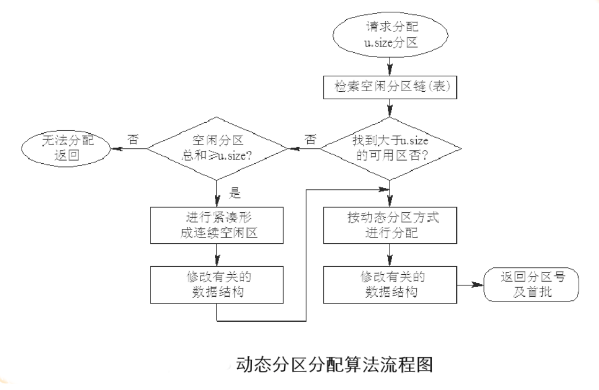

### 对换（Swapping）

> 对换技术又称为交换技术

为了==实现外存和内存之间==的对换，系统中必须有一台$I/O$速度较高的外存，其容量也要足够大，能够容纳分时运行的所有用户作业，目前最常用的大容量磁盘存储器。

1. 多道程序环境下的对换技术
    1. 对换的引入
        在多道环境下系统通存在如下两种情况：
        - 内存中进程由于某些事件为发生而陷入阻塞状态，但占用了大量的内存，甚至导致无可运行的内存，迫使$CPU$停止下来等待。
        - 有着许多作业，但是内存不足，一直驻留在外存，而不能进入内存运行。
        > **对换**：指把内存中暂时不能运行的进程或者暂时不用的程序和数据换出到外存上，以便腾出足够的内存空间，再把已具备运行条件的进程或进程所需要的数据换入内存。

        **对换**是改善内存利用率的有效措施，可以直接提高处理机的利用率和系统的吞吐量。
    2. 对换的类型
        根据每次对换所对换的数量，可分为两类：
        - 整体对换
        - 页面(分段)对换

    为了实现对换，系统必须实现：

    - 对对换空间的管理
    - 进程的换出
    - 进程的换入

2. 对换空间的管理
    1. 对换空间的目标
        对具有对换功能的$OS$中，通常把磁盘空间分为**文件区**和**对换区**两部分。
        1. 对文件区管理的主要目标
            - 主要目标：提高文件存储空间的利用率，然后才是提高对文件的访问速度。
            - 方式：采用离散分配的方式。
        2. 对对换空间管理的主要目标
            - 主要目标：提高进程换入和换出的速度，其次才是提高文件存储的利用率。
            - 方式：采用连续分配的方式，较少考虑外存的碎片问题。
    2. 对换区空闲盘块管理中的数据结构
        其数据结构的形式与内存在采用动态分区分配方式中所用数据结构相似，采用空闲分区表或空闲分区链。
        在空闲分区表每个条目中，包含：对换空间的首址及其大小，分别用盘块号和盘块数表示。

    3. 对换空间的分配和回收
        对换分区的分配采用连续分配的方式，因而对换空间的分配与回收与动态分区方式时的内存分配和回收方法雷同。
        其分配算法可以是：
        - 首次适应算法
        - 循环首次适应算法
        - 最佳适应算法等。

        对换区的回收操作可分为四种情况：
        - 回收分区与插入点的前一个空闲分区$F_1$相邻接；
        - 回收分区与插入点的后一个空闲分区$F_2$相邻接；
        - 回收分区同时与插入点的前、后分区邻接；
        - 回收分区既不与$F_1$邻接，又不与$F_2$邻接。

3. 进程的换出和换入
    1. 进程的换出
        换出进程分为两步：
        1. 选择被换出的进程
        2. 进程换出过程(注：不能换出共享的程序和数据段，其他的程序可能还需要使用)
    2. 进程的换入
        - 换入的步骤：对换进程将定时执行换入操作,它首先查看$PCB$集合中所有进程的状态，从中找出“就绪”状态但已换出的进程。当有许多这样的进程时，它将选择其中已换出到磁盘上时间最久的进程作为换入进程，为它申请内存。如果申请成果，可直接将进程从外存调入内存；如果失败，则需先将内存中的某些进程换出，腾出足够的内存空间，再将进程调入。若还有可换入的进程则继续换出换入，直到外存中再无“就绪且换出”状态的进程为止，或者无足够的内存来换入进程，此时对换进程才停止换入。
        - 由于交换内存需要较长时间，为了提高内存的利用率，目前采用的比较多的方案：在处理机正常运行的时，并不启动对换程序。但如果发现有许多进程在运行时经常发现缺页且显现出内存紧张的情况，才启动对换程序，将一部分进程调至外存。如果发现所有进程的缺页率明显减少，而系统的吞吐量已经下降，则可暂停运行对换程序。

### 分页存储管理方式

连续分配方式会形成很多的“碎片”，虽然可通过“紧凑”方法将许多碎片拼接成可用的大块空间，但需要付出很大的开销。

如果允许将一个进程直接分散的装入到许多不相邻接的分区，便可以充分利用内存空间。基于这个思想，产生了离散分配方式。
主要有如下三种离散分配方式：

- 分页存储管理方式
    - 将用户程序的地址空间分为若干个固定大小的区域，称为“页”或“页面”。
    - 相应地，也将内存空间分为若干个物理块或页框$(frame)$，页和块的大小相同。
    - 这样可将用户程序的任一页放入任一物理块中，实现离散分配。
- 分段存储管理方式
    - 将拥护程序的地址空间分为若干个大小不同的段，每段可定义一组相对完整的信息。
    - 在存储器分配时，以段为单位，这些段在内存中可以不相邻接，所以也实现了离散分配。
- 段页式存储管理方式
    - 将分页和分段两种存储器管理方式相结合的产物。
    - 当前较广泛的一种存储方式

----------

#### 分页存储管理的基本方法

1. 页面和物理块
    - 页面
        - 将进程的逻辑地址空间分为若干个页，并为各页加以编号；
        - 将内存的物理地址空间分成若干个块同样也为它们加以编号。
        - 在为进程分配内存时，以块为单位，将进程的若干个页装入到多个可以不相邻的物理块中。
        - 由于进程的最后一页经常装不满一块，形成了不可利用的碎片，称为“页内碎片”。
    - 页面大小
        - 过小的页面大小
            - 减少内存碎片，有利于内存利用率的提高
            - 造成进程占用较多的页面，导致页表过长，占用大量内存。
        - 过大的页面大小
            - 减少页表长度，提高页面换进换出的速度
            - 使页内碎片增大
        - 页面大小应该适中，且页面大小为2的幂，通常为$1KB\sim8KB$。
2. 地址结构
    分页地址中的地址结构如下：

    $$\boxed{P\;|W\;}$$

    - 页号P
    - 位移量W，即页内地址
    假如地址长度为$32$，$0\sim11$位为页内地址。即每页的大小为$4KB$；$12\sim31$位为页号，地址空间最多允许有$1M$页
    对于某特定及其，其地址结构是一定的。若给定一个逻辑地址空间中的地址为$A$，页面的大小为$L$，则页号$P$和页内地址$d$可按下式求得：

    $$P=INT[\frac{A}{L}],d=[A]\;MOD\;L$$

    其中，$INT$是整除函数，$MOD$是取余函数。例如，其系统页面大小为$1KB$，设$A=2170B$,则由上式可以求得$P=2，d=122$。
3. 页表
    在分页系统中，允许将进程的各个页面离散的存储在内存的任一物理块中，为保证进程仍能正确的运行，即**能在内存中能找到每个页面对应的物理块**，系统为每个进程创建一张页面映像表，简称页表。

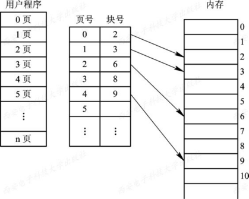

#### 地址变换机构

基本任务：实现从逻辑地址到物理地址的转换。

1. 基本的地址变换机构

    由于地址变换的执行频率很高，采用硬件实现。页表功能由一组专门的寄存器实现；页表大多驻留在内存中，在系统中只设置一个页表寄存器$PTR(Page-Table\;Register)$，存放页表在内存的初始地址和页表的长度。

    由于页表是存放在内存中，每次存取一个数据，都要访问两次内存，第一次是访问内存中的页表，找到指定页的物理块号，将块号和内偏移量拼接形成物理地址。第二次访问内存，才是从第一次获取的地址中获得或写入数据。采用这种方式，使计算机的处理速度降低$\frac{1}{2}$。

    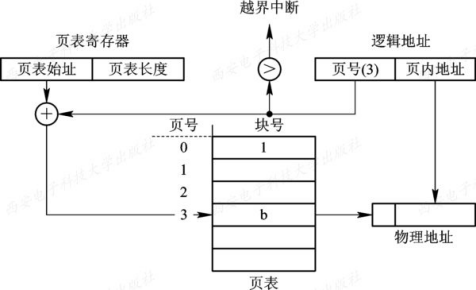

2. 具有快表的地址变换机构

    为了提高地址变换速度，在地址变换机构中增设一个具有并行查询能力的特殊高速缓存寄存器，即联想寄存器$Associative\;Memory$或称“快表”。

    此时的地址变换过程：在$CPU$给出有效地址，由地址变换机构将页号送入高速缓存寄存器，将页号和高速缓存的页号比较，存在相匹配，表示访问的页表项在快表中。直接从快表中读出物理块号，并送到物理地址寄存器中。不存在相匹配的话，查找内存的页表，同时将查找结果存入快表，如果快表满了，由$OS$换出认为不需要的页表项。

    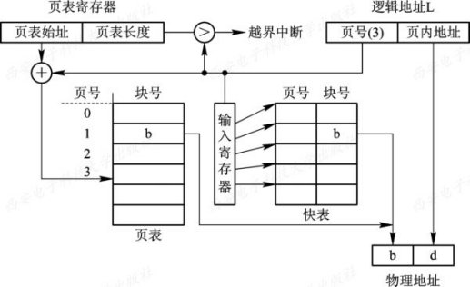

#### 访问内存有效时间

> 内存的有效访问时间：$Effective\;Access\;Time\;EAT$：从进程发出指定逻辑地址的访问请求，经过地址变换，到在内存中找到对应的实际物理地址单元并取出数据，所需要花费的总时间。

假设访问一次内存的时间为t

- 基本分页存储管理：$EAT=t+t=2t$
- 引入快表的分页存储管理：$EAT=a*\lambda + (t+\lambda)(1-a)+t=2t+\lambda - t*a$，其中$\lambda$表示产找快表的时间，$a$为命中率。

#### 两极和多级页表

现代计算机系统支持非常大的逻辑地址空间$2^{32}B\to2^{64}B$，在这中情况下，页表变得非常大，需要占用很大内存空间，还要求连续的。为了解决这个问题的两种方式：

- 对页表所需的内存空间采用离散分配方式，解决难以找到一块连续的大内存空间问题。

- 调入部分页表项进入内存，其余页表项驻留磁盘，需要时调入

1. 两级页表$(Two-Level\;Page\;Table)$

    针对难于找到连续的内存空间存放页表问题，将页表进行分页，使每个页面的大小和内存物理块的大小相同，并为它们进行编号，然后离散地将各个页面分别存放在不同的物理块中。同样为离散分配的页表再建立一张页表，称为外层页表$(Outer\;Page\;Table)$，在每个页表项中记录了页表页面的物理块号。

    $$
    \boxed{外层页号|外层页内地址|页内地址}
    $$

    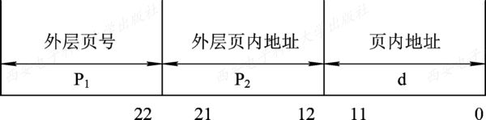

    为了方便实现地址变换，在地址变换机构中，同样需要增设一个外层页表寄存器，用于存放外层页表的始址，并利用逻辑地址中的外层页号作为外层页表的索引，从中找到指定页表分页的始址，再利用P2作为指定页表分页的索引，找到指定的页表项，其中即含有该页在内存的物理块号，用该块号P和页内地址d即可构成访问的内存物理地址。

    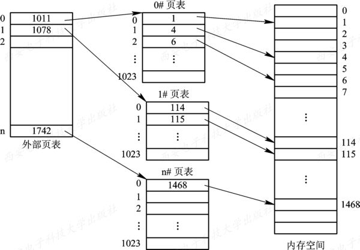

2. 多次页表

    对于32位的机器，采用两级页表结构是合适的，但对于64位的机器，采用两级页表是否仍然合适，须做以下简单分析。
    如果页面大小仍采用4 KB即212 B，那么还剩下52位，假定仍按物理块的大小(212位)来划分页表，则将余下的42位用于外层页号。
    此时在外层页表中可能有4096 G个页表项，要占用16 384 GB的连续内存空间。

#### 反置页表$(Inverted\;Page\;Table)$

1. 反置页表的引入

   在分页系统中，为每个进程配置了一张页表，进程逻辑地址空间中的每一页，在页表中都对应有一个页表项。在现代计算机系统中，通常允许一个进程的逻辑地址空间非常大，因此就需要有许多的页表项，而因此也会占用大量的内存空间。

2. 地址变换

   在利用反置页表进行地址变换时，是根据进程标识符和页号，去检索反置页表。如果检索到与之匹配的页表项，则该页表项(中)的序号i便是该页所在的物理块号，可用该块号与页内地址一起构成物理地址送内存地址寄存器。若检索了整个反置页表仍未找到匹配的页表项，则表明此页尚未装入内存。对于不具有请求调页功能的存储器管理系统，此时则表示地址出错。对于具有请求调页功能的存储器管理系统，此时应产生请求调页中断，系统将把此页调入内存。

### 分段存储管理方式

1. 分段存储管理的引入

   分段存储管理方式符合用户和程序员下述的需要：

     1. 方便编程
     2. 信息共享
     3. 信息保护
     4. 动态增长
     5. 动态链接

2. 分段系统的基本原理

   1. 分段

      分段地址中的地址结构：$\boxed{段号|段内地址}$，假如为一个32位地址，0-15为段内地址，16-31为段号

   2. 段表

      段表：每个段在表中占有一个表项，其中记录了该段在内存中的起始地址即基址和段的长度。

3. *分页和分段的区别

   - 页是信息的物理单位。采用分页存储管理是为了实现离散分配方式，以消除内存的外零头，提高内存的利用率。分段存储管理方式的段则是信息的逻辑单位，它通常包括一组意义相对完整的信息。分段的目的主要在于能更好的满足用户的需要。
   - 页的大小固定且由系统决定。直接由硬件实现的，因而在系统中只能有一种大小的页面。而段的长度不固定，决定于用户所编写的程序，通常由编译程序在对源程序进行编译时，根据信息的性质区分的。
   - 分页的用户程序地址空间是一维的。分页是系统的行为，故在分页系统中，用户的程序的地址是属于单一的线性地址空间。而分段是用户的行为，故在分段系统中，用户地址空间是二维的，程序员标识一个地址时，既需要给出段名又要给出段内地址。

4. 信息共享

   分段系统的一个突出优点：易于实现段的共享，即允许若干个进程共享一个或多个分段，且对段的保护页十分简单易行。

5. 段页式存储管理方式

   1. 基本原理

      将分段和分页原理结合，即先将用户程序分成若干个段，在把每个段分为若干个页、并为每一个段赋予一个段名。

      其地址结构为：$\boxed{段号(S)|段内页号(P)|页内地址(W)}$

      为了实现逻辑地址到物理地址的变换，需要同时配置段表和页表。段表的内容不再是初始地址和段长，而是页表始址和页表长度。

## 第五章 虚拟存储器

> 虚拟存储器是现代操作系统中存储器管理的意向重要技术，实现了内存扩充功能。但并非从物理上实际的扩大内存容量，而是从逻辑上实现对内存容量的扩充。

### 概述

第四章的各种存储管理都有一个共同的特点，，都需要将一个作业全部装入内存才能运行。

可能出现如下两种情况：

- 有的作业很大，要求的内存空间超过内存总量，作业无法装入，导致作业无法运行
- 有大量的作业要运行，但内存容量不足以容纳这些作业，只能将少数作业装入内存运行，其他大量作业只能在外存等待。

传统存储器管理方式的特征：

- 一次性，指作业必须一次性地装入内存后才能运行。
- 驻留性，指作业装入内存后，整个作业都一直驻留内存中，直至作业结束

1. 虚拟存储器的定义和特征

   虚拟存储器：指具有请求调入功能和置换功能，能从逻辑上对内存容量加以扩充的一种存储器系统。

   虚拟存储器的逻辑容量由内存容量和外村容量之和决定，其运行速度接近于内存速度，而每位的成本接近于外存。

   虚拟存储器的特征：

   - 多次性：指一个作业中的程序和数据无需在作业运行时一次性地全部装入内存，允许分成多次调入内存。
   - 对换性：指作业中的程序和数据无需常驻内存，运行在作业运行期间换进换出。
   - 虚拟性：指从逻辑上扩充容量，使用户看到的内存容量远大于实际容量。

   虚拟性以多次性和对换性为基础，而多次性和对换性必须建立在离散分配的基础上。

2. 实现方法

   虚拟存储器的实现是建立在离散分配存储管理方式的基础上。目前的虚拟存储器采用下述方式之一实现的。

   1. 分页请求系统、

      在分页系统的基础上增加了请求调页功能和页面置换功能所形成的页式虚拟存储系统。

      1. 硬件支持

         - 请求分页的页表机制。在纯分页的页表机制上增加若干项形成，作为请求分页的数据结构。
         - 缺页中断机构。当用户访问的页面未调入内存时，便产生缺页中断，请求$OS$将所缺的页调入内存。
         - 地址变换机构：同样实在纯分页地址变换机构的基础上形成的。

      2. 实现请求分页的软件

         包括实现请求调页的软件和实现页面置换的软件，在硬件的支持下，实现对应的功能。

   2. 请求分段系统

      在分段系统的基础上，增加了请求调段及分段置换功能后形成的段式虚拟存储系统。

      1. 硬件支持

         - 请求分页的页表机制。在纯分段的段表机制上增加若干项形成，作为请求分段的数据结构。
         - 缺页中断机构。当用户访问的段未调入内存时，便产生缺段中断，请求$OS$将所缺的段调入内存。
         - 地址变换机构：同样实在纯分段地址变换机构的基础上形成的。

      2. 实现请求分页的软件

         包括实现请求调段的软件和实现段置换的软件，在硬件的支持下，实现对应的功能。实现具有一定的难度，请求分页系统的换进和换出的基本单位都是固定大小的页面，所以实现下要容易些。而请求分段换进换出的基本单位是段，其长度是可变的，分段的分配类似动态分区分配，在内存分配和回收上都比较复杂。

### 请求分页存储管理方式

1. 硬件支持

   1. 请求页表机制

      基本作用：将用户地址空间中的逻辑地址映射为内存空间的物理地址。

      请求分页系统中的每个页表含有：

      $$
      \boxed{页号|物理块号|状态为P|访问字段A|修改为M|外存地址}
      $$

      - 状态位$P$：指示该页是否已调入内存，供程序访问参考。
      - 访问字段$A$：记录本页在一段时间内被访问的次数，或记录本页最近已有多长时间未被访问，提供给置换算法在选择换出页面作为参考。
      - 修改位$M$：标识该页在调入内存后是否被修改过。若为修改，就不需在将该页写回外存。供换页面时参考。
      - 外存地址：指出该页在外存上的地址，通常是物理块号，供调入该页时参考。

   2. 缺页中断机构

      缺页中断作为中断，需要经历诸如保护$CPU$环境、分析中断原因、转入缺页中断处理程序进行处理，以及在中断处理完成后在恢复$CPU$环境等几个步骤。

      缺页中断又是一种特殊的中断，和一般的中断的区别在于：

      - 在指令执行期间产生和处理中断信号。通常$CPU$都是在一条指令完成后，才检查是否有中断请求到达。而缺页中断实在指令执行期间，若发现所要访问的指令或数据不在内存时，立即产生和处理缺页中断信号，以便及时将所缺页面调入内存。
      - 一条指令可能产生多次缺页中断。系统中的硬件系统应该能保存多次中断时的状态，并保证最后能返回到中断产生缺页中断的指令处继续执行。

   3. 地址变换机构

        在分页系统地址变换机构的基础上，增加了如产生和处理缺页中断以及从内存中换出页的功能等。
        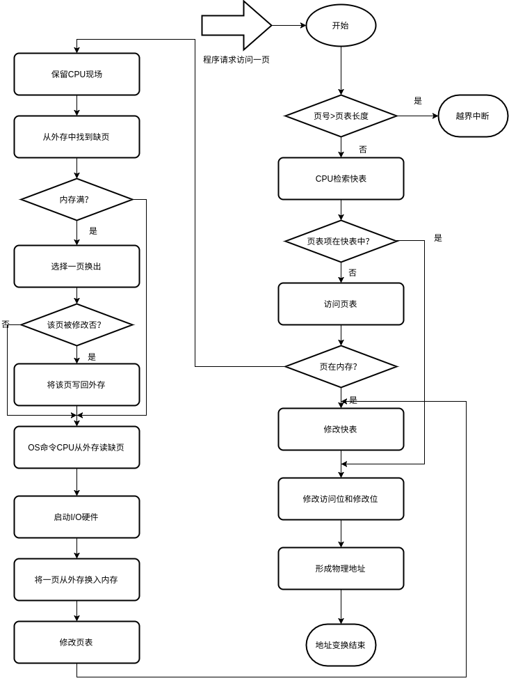

2. 请求分页的内存分配

   1. 进程分配内存时，三个问题：
      1. 为保证进程能正常运行，所需要的最小物理块数的确定。
      2. 在为每个进程分配物理块时，采用什么样的分配策略，即所分配的物理块是固定的还是可变的。
      3. 为不同进程分配物理块数，是采取平均分配算法，还是根据进程的大小按比例分配。

   2. 最小物理块的确定

      事实：随着物理块的减少，会使进程在执行中的缺页率上升，从而降低进程的执行速度。

      **最小物理块**：保证进程正常运行的最小物理块数，当系统为进程分配的物理块数少于此值时，进程将无法运行。

   3. 内存分配策略

      在请求分页系统中，可采用两种内存分配策略，即固定和可变分配策略。在进行置换时，可采用两种策略，即全局置换和局部置换。可组合成下述三种策略。

      1. 固定分配局部置换$(Fixed\;Allocation,\;Local\;Replacement)$

         固定分配：为每个进程分配一组固定数目的物理块，在进程运行期间不再改变。

         局部置换：如果进程在运行中发现缺页，则只能从分配给该进程的n个页面中选出一页换出，然后再调入一页，以保证分配给该进程的内存空间不变。

         缺点：分配的物理块，太少，缺页率高，降低系统吞吐量。太多，驻留进程减少，造成CPU空闲或其他资源空闲的情况。

      2. 可变分配全局置换$(Variable\;Allocation,\;Global\;Replacement)$

         可变分配：先为每个进程分配一定数目的物理块，在进程运行期间，可根据情况做适当的增加和减少。

         全局置换：如果进程在运行中发现缺页，则将OS所保留的空闲物理块(一般组织为一个空闲物理块队列)取出一块分配给该进程，或者以所有进程的全部物理块为标的，选择一块换出，然后将所缺页调入。

         缺点：导致缺页率增加

      3. 可变分配局部置换$(Variable\;Allocation,\;Local\;Replacement)$

   4. 物理块分配算法

      1. 平均分配算法，即将系统中所有可供分配的物理块平均分配给各个进程。

      2. 按比例分配算法，即按进程的大小按比例分配物理块。

         如果系统中有n个进程，每个进程的页面数为$S_i$,则系统中各进程页面数总和为：

         $$
         S=\sum_{i=1}^nS_i
         $$

         又假定系统中可用的物理块总数为m，则每个进程所能分配的物理块数为$b_i$，可由下式计算得到：

         $$
         b_i=\frac{S_i}{S}*m
         $$

         $b_i$应该取整，它必须大于最小物理块数。

      3. 考虑优先权的分配算法

         为了照顾重要的、紧迫的作业，采取的方法是：将内存中可供分配的所有物理块分成两部分：一部分按比例地分配给各进程；另一部分则根据进程的优先权进行分配。

3. 页面调入策略

   1. 何时调入页面

      - 预调页策略：将预计不久被访问的页面预先调入内存
      - 请求调页策略：当进程在运行中访问的程序和数据，若发现对应的页面不在内存，便提出请求，由OS调入内存。

   2. 从何处调入页面

      将请求分页系统中的外存分为两部分：用于存放文件的文件区和用于存放对换页面的对换区。

      通常，对换区采用连续分配方式，文件区采用离散分配，所以对对换区的数据存取速度比文件区的高。

      每当发生缺页请求，系统从何处将缺页调入内存，分为三种情况：

      - 系统拥有足够的对换区空间，这时可以全部从对换区调入所需页面，提高调页速度。为此在进程运行前，便需要将该进程相关的文件从文件区拷贝到对换区。
      - 系统缺少足够的对换区，凡是不会被修改的文件，直接从文件区调入；而当换出这个页面，由于未被修改，则不必写入磁盘。对于可能被修改的部分，换出时须调到对换区，以后再从对换区调入。
      - UNIX方式。由于进程有关的文件都放在文件区，故凡是未运行过的页面，都应从文件区调入。曾经运行过但又被换出的页面，由于是被放在对换区，因此在下次调入时应从对换区调入。由于UNIX系统允许页面共享，因此，某进程请求的页面有可能被其他进程调入内存。

   3. 页面调入过程

      1. 当程序访问的页面未在内存时(存在位为“0”),向CPU发出一缺页中断。
      2. 中断处理程序保留CPU环境，分析中断原因转入中断处理程序。
      3. 中断处理程序查找该页在外存的物理块后，如果内存能够容纳新页，启动磁盘I/O，将所缺页调入内存，修改页表。
      4. 如果内存已满，则按照某种置换算法，从内存选出一页换出；
      5. 如果该页未被修改过(修改位为“0”)，可不必写入磁盘，如果此页已被修改(修改位为"1")，则必须将它吸入磁盘，再将缺的页调入内存，并修改页表对应存在位为"1"，并将此页表项写入快表。
      6. 在缺页调入内存后，利用修改后的页表形成所要访问数据的物理地址，再去访问内存数据。

   4. 缺页率

      假设一个进程的逻辑空间为n页，系统为其分配的内存物理块数为m$(m \le n)$。

      进程运行过程，访问页面成功的次数为$S$，访问页面失败的次数为$F$，则该进程总的页面访问次数为$A=S+F$，那么该进程再其运行过程中的缺页率为

      $$
      f=\frac{F}{A}
      $$

      缺页率受一下因素影响：

      - 页面大小
      - 进程所分配的物理块的数目
      - 页面置换算法
      - 程序固有特性

      假设被置换的页面修改的概率为$\beta$，其缺页中断处理时间为$t_a$，被置换页面没有被修改的缺页中断时间为$t_b$，那么缺页中断处理时间的计算公式为：

      $$
      t=\beta *t_a+(1-\beta)*t_b
      $$

### 页面置换算法

- 页面置换算法$(Page-Replacement\;Algorithms)$：选择换出页面的算法。
- “抖动”：刚被换出的页很快又要被访问，需要将它重新调入，此时又需要再选一页调出；而此刚被调出的页很快又被访问，又需将它调入，如此频繁地更换页面，以至于一个进程运行中把大部分时间花费在置换工作上。

1. 最佳置换算法和先进先出置换算法

   1. 最佳$(Optimal)$置换算法

      最佳置换算法是一种理想化算法，它具有最好的性能，但实际上是无法实现的。

      其选择淘汰的页面将是以后永不使用的，或许是在最长(未来)时间内不再被访问的页面。

      采用最佳置换算法通常可以保证获得最低的缺页率。但由于人们无法预知，一个进程在内存的若干个页面中，哪一个页面是未来最长时间内不再被访问的，因此该算法是无法实现的，但可以利用该算法区评价其他算法。

   2. 先进先出$(FIFO)$页面置换算法

      淘汰最先进入内存的页面，即选择在内存中驻留时间最久的页面予以淘汰。

2. 最近最久未被使用和最少使用算法

   1. $LRU(Least\;Recently\;Used)$置换算法的描述

      选择最近最久未使用的页面予以淘汰。

   2. $LRU$置换算法的硬件支持

      为了了解一个进程在内存中的各个页面各有多少时间未被进程访问，以及如何快速知道哪一页是最近最久未使用的页面，需要寄存器和栈两类硬件之一的支持。

      1. 寄存器

         为了记录进程在内存中各页的使用情况，为每个在内存中的页面配置一个移位寄存器，表示为

         $$
         R=R_{n-1}R_{n-2}R_{n-3}\cdots R_2R_1R_0
         $$

         当进程访问某物理块时，将相应寄存器的$R_{n-1}$位置成1。

         定时信号将每隔一定时间将寄存器右移一位。把n为寄存器看做一个整数，那么最小数值寄存器所对应的页面，就是最近最久未使用的页面。

      2. 栈

         保存当前使用的各个页面的页面号。每当进程访问某页面，便将该页面的页面号从栈中移出，将它压入栈顶。因此栈顶始终是最新被访问页面的编号，栈底是最近最久未使用页面的页面号。

   3. 最少使用$(Least\;Frequently\;Used,LFU)$置换算法

      在内存中的每个页面设置一个移位寄存器，用来记录该页面被访问的频率。

      该算法选择在最近时期使用最少的页面作为淘汰页。

3. $Clock$置换算法

   $LRU$需要较多的硬件支持，成本较高。

   1. 简单的$Clock$置换算法

      为每页设置一位访问位，将内存中所有页面都通过链接指针链接成一个循环队列。

      当某页被访问时，其访问位被置1。置换算法在选择一页淘汰时，只需检查页的访问位，如果是0，就选择该页换出；若为1，则重新将它置0，暂不换出，给予该页第二次驻留内存的机会，再按照$FIFO$算法检查下一个页面。当检查到队列中最后一个页面时，其访问位仍为1.则在返回到队首检查第一个页面。

      因该算法只有一位访问位，只能用它表示该页是否以及使用过，而置换时是将未使用过的页面换出去，故又把该算法称为最近未用算法或$NRU(Not\;Recently\;Used)$

      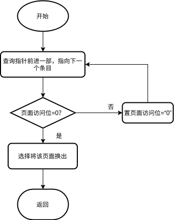

   2. 改进型的$Clock$置换算法

      在选择页面，既要是未使用过的页面，又要是未被修改过的页面。同时满足这两个条件的页面作为首选淘汰的页面。由访问位$A$和修改位$M$组合成下面四种类型的页面：

      - 1类$(A=0,M=0)$：表示该页最近既未被访问，又未被修改，是**最佳淘汰页**。
      - 2类$(A=0,M=1)$：表示该页最近未被访问，但已被修改，并不是很好的淘汰页。
      - 3类$(A=1,M=0)$：表示最近已被访问，但未被修改，该页有可能再被访问。
      - 4类$(A=1,M=1)$：表示最近已被访问且被修改，该页可能再被访问。

      置换的过程和简单$Clock$算法相类似，其差别在于该算法同事检查访问位和修改位，确定该页是四类页面中的哪一种。执行步骤分成一下三步：

      1. 从指针所指示的当前位置开始，扫描循环队列，寻找$A=0$且$M=0$的第一类页面，将所遇到的第一个页面作为所选中的淘汰页。在第一次扫描期间不改变访问位$A$。
      2. 如果第一步失败，即查找一轮后未遇到第一类页面，则开始第二轮扫描，寻找$A=0$且$M=1$的第二类页面，将所遇到的第一个页面作为所选中的淘汰页。在第二轮扫描期间，将所有扫描过的页面的访问位都置0.
      3. 如果第二步也失败，则将指针返回到开始的位置，并将所有的访问位置0.然后重复第一步，如果仍失败，必要时再重复第二步，此时就一定能找到被淘汰的页。

4. 页面缓冲算法$(Page\;Buffering\;Algorithm,PBA)$

   1. 影响页面换进换效率的若干因素
      - 页面置换算法
      - 写回磁盘的频率
      - 读入内存的频率

   2. 页面缓冲算法$PBA$

      $PBA$算法的特点：

      - 降低了页面换进换出的频率
      - 可以采取一种简单的置换策略，如$FIFO$。

      为了降低页面换进换出频率，设置了两个链表

      - 空闲页面链表

        实际上是一个空闲物理块链表，用于分配给频繁发生缺页的进程，降低该进程的缺页率。

        当进程读入一个页面，便利用空闲物理块链表中的第一个物理块装入该页。

        当有一个未被修改的页要换出时，不换出到外存，将它所在的物理块挂在空闲链表的末尾。

        在需要这些页面的数据，可以直接取下，避免从磁盘读入数据的操作，减少了页面换进的开销。

      - 修改页面链表

        由已修改的页面形成的链表。为了减少已修改页面换出的次数。

        当进程将一个已修改的页面换出时，不立即换出到外存上，将它所在的物理块挂在修改页面链表的末尾。目的：降低已修改页面写会磁盘的频率。

5. 访问内存的有效时间

   1. 被访问页在内存中，其对应的页表项也在快表中。

      $$
      EAT=\lambda + t
      $$

      查找快表的时间：$\lambda$和访问实际物理地址的时间$t$

   2. 被访问页在内存中，且其对应的页表项不在快表中。

      两次访问内存，一次读取页表，一次读取数据还有修改快表的时间。

      $$
      EAT=\lambda + t + \lambda + t = 2*(\lambda + t)
      $$

   3. 被访问页不在内存中。

      假设缺页中断处理时间为$\varepsilon$：

      $$
      EAT = \lambda + t + \varepsilon + \lambda + t = \varepsilon + 2(\lambda + t)
      $$

   加入缺页率$f$和命中率$a$:

$$
   EAT=\lambda + a*t +(1-a)*(t+f*(\varepsilon + \lambda +t)+(1-f)*(lambda + t))
$$

### ”抖动“和工作集

> 请求分页虚拟存储器系统是目前最常用的系统。但如果系统运行的进程过多，进程会频繁的发生缺页。

1. 多道程序度和“抖动”

   在一个坐标轴中，横轴表示多道程序的数量，纵轴表示相应的处理机利用率。

   在处理机开始的部分，随着进程数目的增加，处理机的利用率急剧增加；但达到某个点$N_1$时，其增速就明显减慢了，当到达$N_{max}$时，处理机的利用率达到了最大，以后开始缓慢降低，当达到另一点$N_2$点时，若继续增加进程数目，利用率急速下降到0。

   之所以在后面阶段趋于0的情况，因为系统发生了“抖动”。

   产生“抖动”的原因：

   同时在系统中运行的进程太多，由此分配给每一个进程的物理块太少，不能满足进程正常运行的基本要求，频繁的出现缺页。造成进程大部分时间用来页面的换进换出。几乎不能做任何有效的工作，从而导致发生处理机的利用率急剧下降趋于0的现象。这就是进程的“抖动”状态。

   解决抖动的方案：

   1. 增加内存的物理空间。
   2. 减少内存中的进程数目。

2. 工作集

   1. 工作集的基本概念

      “抖动”的发生与系统为进程分配的物理块的多少有关，由此提出了关于进程“工作集”的概念。

      进程发生缺页率的时间间隔和进程所获得的物理块数有关，缺页率随着所分配的物理块的增加明显地减少，当物理块数目超过某个数目时，再为进程增加一物理块，对缺页率的改善已不明显。可见不需要在分配更多物理块。反之，当某进程所分配的物理块数低于某个数目时，每减少一块，对却也懒得影响变得十分明显。

      基于程序运行的局部性原理可知，当进程在运行期间，对页面的访问是不均匀的，可能仅局限于较少的页面进行访问，这些页面称为活跃页面。

      如果能够预知程序在某个时间间隔内要访问哪些页面，并调入内存，将大大降低缺页率，从而显著提高处理机的利用率。

   2. 工作集的定义

      **工作集**：指某段时间间隔$\Delta$里，进程实际所要访问页面的集合。

      某进程在时间$t$的工作集记为$W(t,\Delta)$，其中变量$\Delta$称为工作集的“窗口尺寸”，由此，工作集定义为，进程在时间间隔$(t-\Delta,t)$中引用页面的集合。

      工作集$W(t,\Delta)$是二元函数，即在不同时间$t$的工作集大小不同，所含的页面数也不同；工作集和窗口尺寸$\Delta$有关，是窗口尺寸的非降函数$(nondecreasing\;function)$，即

      $$
      w(t,\Delta)\subseteq w(t,\Delta + 1)
      $$

3. “抖动”的预防方法
   - 采用局部置换策略：当进程发生缺页，只能在分配给自己的内存空间内进行置换，不允许从其他进程区获得新的物理块。这样进程发生“抖动”，也不会对其他进程产生影响。
   - 把工作集算法融入到处理机调度中：在调入作业时，检查每个进程在内存驻留页面是否足够多。足够多就调入新作业，不会因为新作业的调入而导致缺页率的增加。
   - 利用“L=S”准则调节缺页率：L是缺页之间的平均时间，S是平均缺页服务时间，即置换一个页面需要的时间。当L与S接近，磁盘和处理机可达到它们的最大利用率。
   - 选择暂停的进程：基于某种原则选择暂停某些当前活动的基础。

### 请求分段存储管理方式

1. 硬件支持

   1. 请求段表机制

      $$
      \boxed{段名|段长|段基址|存取方式|访问字段A|修改位M|存在位P|增补位|外存始址}
      $$

      在段表项中，除了段名、段长、段在内存的起始地址外，增加了如下字段：

      - 存取方式：根据该信息的属性对段实施保护，如果该字段为两位，则存储属性是只执行、只读和允许读写。
      - 访问字段$A$：记录该段被访问的频繁程度，提供给置换算法选择换出页面参考
      - 修改位$M$：表示该段进入内存后是否被修改过。
      - 存在位$P$：指示该段是否已调入内存。
      - 增补位：请求分段式管理的特有字段，表示本段在运行时是否有过动态增长。
      - 外存始址：指示本段在外存中的起始地址，即起始盘块号。

   2. 缺页中断机构

      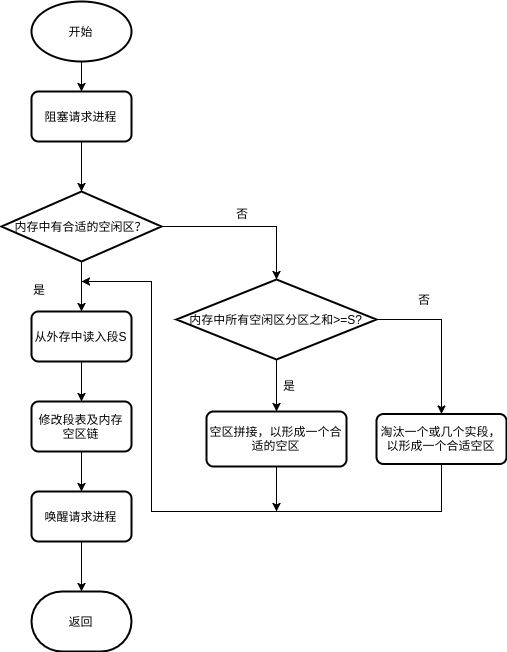

   3. 地址变换机构

      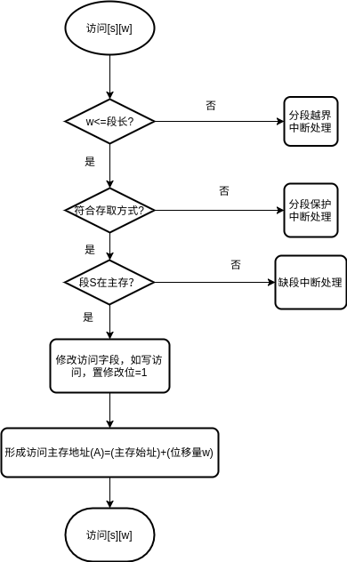

2. 分段的共享和保护

   1. 共享段表

      为了实现分段共享，在系统中配置一张共享段表，所有的共享段都在共享段表中有一表项。

      共享段表项包括：共享段的段号、段长、内存始址、状态位、外存始址以及共享计数等信息。

      - 共享进程计数$count$记录有多少个进程正在共享该分段，当某进程不需要而释放它时，不立即回收，而是检查$count$是否为0，当为0，才由系统回收该段所占内存区。
      - 存取控制字段
      - 段号

   2. 共享段的分配和回收

      1. 共享段的分配

         当共享段的$count$不为0，说明已经调入内存，只需在共享段表项中修改对应记录。

         当共享段$count$结果为0，则需要系统回收该共享段的物理内存，以及取消在共享段表中该段对应的表项；如果不为0，取消调用者进程在共享段表中的有关记录。

      2. 分段保护

         1. 越界检查：利用地址变换机构完成。

         2. 存取控制检查：访问段表的表项中的存取控制字段。

         3. 环保护机制

            该机制规定：低编号的环具有高优先级。

            $OS$核心处于0号环内，某些重要的实用程序和操作系统服务占居中间环；而一般的应用程序则被安排在外环上。

            在环系统中，程序的访问和调用应当遵循一下规则：

            - 一个程序可以访问驻留在相同环或较低特权环(外环)中的数据；
            - 一个程序可以调用驻留在相同环或较高特权环(内环)中的服务。

## 第六章 输入输出系统

### $I/O$系统的功能、模型和接口

1. $I/O$的基本功能

   - 隐藏物理设备的细节

   - 与设备的无关性

   - 提高处理机和$I/O$设备的利用率

   - 对$I/O$设备进行控制

     对$I/O$设备进行控制是**驱动程序**的功能。

     目前有对$I/O$设备有四种控制方式：

     - 采用轮询的可编程$I/O$方式
     - 采用中断的可编程$I/O$方式
     - 直接存储器访问方式
     - $I/O$通道方式

     具体采用那种方式，与$I/O$设备的传输速率、传输的数据单位等因素有关。

     - 如打印机、键盘等低速设备，传输数据的基本单位是字节或字，故采用中断的可编程$I/O$方式
     - 对于磁盘、光盘等高速设备，传输的数据基本单位是数据块，故采用直接存储器访问方式，以提高系统的利用率。

   - 确保对设备的正确共享

     从设备的共享属性分类：

     - 独占设备，进程应互斥的访问这类设备。如打印机、磁盘机等。
     - 共享设备，允许多个进程访问的设备。如磁盘，多个进程对磁盘进行读写操作，可以交叉进行，不会影响读写的正确性。

   - 错误处理

     大多数的设备包含了较多的机械和电气部分，容易出现错误和故障。

     从处理的角度：分为临时性错误和持久性错误。

     对临时性错误进行重试操作来纠正，而持久性错误需要向上层报告。

2. $I/O$系统的层次结构和模型

   1. $I/O$软件的层次结构

      1. 用户层$I/O$软件，实现和用户交互的接口，用户直接调用该层提供的、和$I/O$操作有关的库函数对设备进行操作。
      2. 设备独立性软件，实现用户程序和设备驱动器的统一接口、设备命名、设备的保护以及设备的分配和释放等，同时为设备管理和数据传送提供必要的存储空间。
      3. 设备驱动程序，与硬件直接相关，用于具体实现系统对设备发出的操作指令，驱动$I/O$设备工作的驱动程序。
      4. 中断处理程序，用户保存被中断的CPU环境，转入相应的中断处理程序进行处理，处理完毕再恢复被中断进程的现场后，返回被中断的进程。

      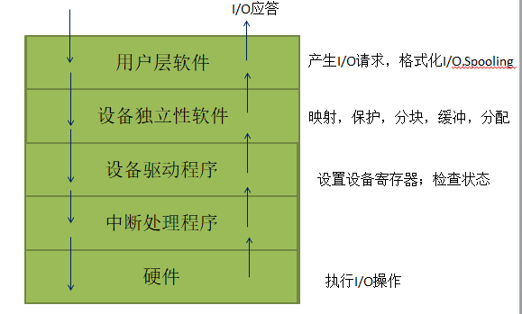

   2. $I/O$系统各种模块之间的层次示意图

      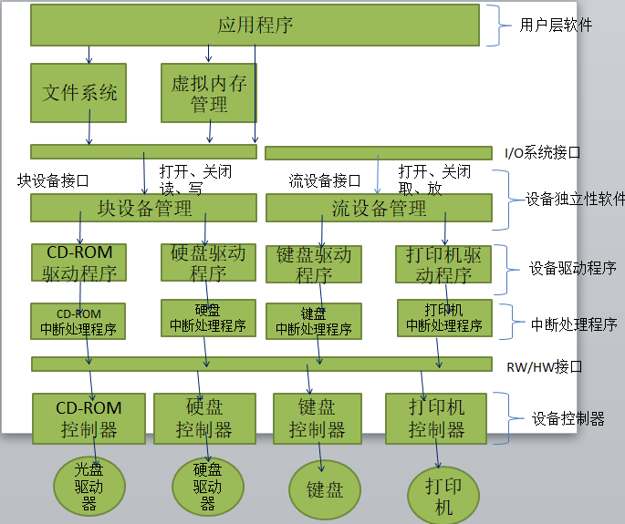

      1. $I/O$系统的上下接口

         1. $I/O$系统接口。它是$I/O$系统与上层系统之间的接口，向上层提供对设备进操作的抽象$I/O$命令，方便高层对设备的使用。在上层系统中由文件系统、虚拟存储器系统以及用户进程等。
         2. 软件/硬件$(RW/HW)$接口。下面一个接口是软件/硬件接口，在它的上面是中断处理程序和用于不同设备的设备驱动程序。在它下面是各种设备的控制器。

         上下两个接口之间的是$I/O$系统。

      2. $I/O$系统的分层

         1. 中断处理程序，$I/O$系统的底层，与硬件直接交互。
         2. 设备驱动程序，$I/O$系统的次底层，是进程和设备控制器之间的通信程序。
         3. 设备独立性软件

3. $I/O$系统的接口

   根据设备类型的不同，进一步分为若干个接口：块设备接口、流设备接口以及网络接口。

   1. 块设备接口

      是块设备管理程序与高层之间的接口。

      - 块设备。指数据的存取和传输都是以数据块为单位的设备。该设备的基本特征是传输速率加高，**可寻址**，即能指定数据的输入源地址及输出的目标地址，可随机读写磁盘的任一块；磁盘设备通常采用$DMA$方式。
      - 隐藏了磁盘的二维结构。块设备接口将磁盘上的扇区从0到n-1依次编号，n是磁盘中的扇区总数。这样编号，把磁盘的二维结构改变为一种线性序列。在二维结构中，每个扇区的地址需要用磁道号和扇区号来表示。
      - 将抽象命令映射为低层操作。将上层发来的抽象命令中的逻辑块号转变为磁盘的盘面、磁道和扇区等。

   2. 流设备接口

      是流设备管理程序与高层之间的接口。该接口又称字符设备接口，用于控制字符设备的输入输出。

      - 字符设备。指数据的存取和传输都是以字符为单位的设备。如键盘，打印机。特征是传输速率低，和**不可寻址**。字符设备在输入输出时，采用中断驱动方式。
      - $get$和$put$操作。由于不可寻址，只能采用顺序存取方式。通常为字符设备建立一个字符缓冲区(队列)，设备的$I/O$字符流顺序进入缓冲区，或从字符缓冲区顺序地送出到设备。用户程序通过$get$和$put$操作从缓冲区取到和输出。
      - $in-control$指令。字符设备类型多，差异大，为了统一处理它们，流设备通常提供一种$in-control$指令。

      大多数流设备属于独占设备，必须采取互斥方式实现共享。为此，流设备提供了打开和关闭操作。

      在使用这类设备，必须先用打开操作来打开设备。如果已经打开，表示它正在被其他进程使用。

   3. 网络通信接口

### $I/O$设备和设备控制器

- $I/O$设备一般由执行$I/O$操作的机械部分和执行控制$I/O$的电子部件组成。

通常把这两部分分开

- 执行$I/O$操作的机械部分就是一般的$I/O$设备
- 执行控制$I/O$的电子部件则称为设备控制器或适配器$(adapter)$
- 在微型机和小型机中的控制器常做成印刷电路卡的形式，因而常称为控制卡、接口卡或网卡，可以插入计算机的扩展槽。
- 在大、中型计算机系统中，还配置了$I/O$通道或$I/O$处理机。

1. $I/O$设备

   1. $I/O$设备的类型

      除了分为块设备和字符设备、独占设备和共享设备

      1. 按使用特性分类
         - 存储设备。也称外存、辅存，用以存储信息的主要设备。特点是存取速度慢，但容量大，价格便宜。
         - $I/O$设备。
           - 输入设备。接受外部信息，如键盘、鼠标、扫描仪、视频摄像等。
           - 输出设备。将计算机处理后的信息送向处理机外部的设备，如打印机、绘图仪等。
           - 交互式设备。指集成上述两类设备，主要是显示器，同步显示用户命令以及命令执行的结果。
      2. 按传输速率分类
         - 低速设备。传输速率仅为每秒几个字节至数百个字节。如键盘、鼠标器。
         - 中速设备。传输速率为每秒钟数千个字节至十万个字节。如打印机，激光打印机等。
         - 高速设备。传输速率为数十万个字节至千兆字节。如磁带机、磁盘机、光盘机等。

   2. 设备和控制器之间的接口

      设备不会直接和CPU通信，而是和设备控制器通信。所以在$I/O$设备中应含有和设备控制器间的接口，在这个接口中含有三种类型的信号，各对应一条信号线。

      - 数据信号线。用于设备和设备控制器传送数据信号。
      - 控制信号线。作为设备控制器向$I/O$设备发送控制信号的通路。
      - 状态信号线。用于指示设备当前状态的信号。设备的当前状态有正在读(写)；设备已读(写)完成，并准备好新的数据传送。

      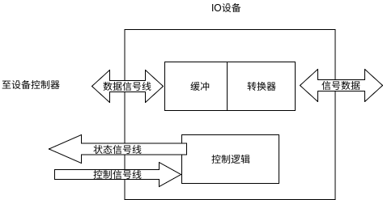

2. 设备控制器

   设备控制器的主要功能：控制一个或多个$I/O$设备，实现$I/O$设备和计算机之间的数据交换。

   - 设备控制器是CPU和$I/O$设备之间的接口，接受从CPU发来的命令，去控制$I/O$设备工作，将处理机从繁杂的设备控制事务解脱出来。
   - 设备控制器是一个可编址的设备，仅控制一个设备，它只有一个唯一的设备地址；若控制多个设备，则含有多个设备地址，每个设备地址对应一个设备。
   - 设备控制器可分为两类：用于控制字符设备的控制器，和用于控制块设备的控制器。

   1. 设备控制器的基本功能

      - 接受和识别命令。接受和识别处理机发来的命令，对接受的命令进行译码。配有命令译码器。
      - 数据交换。配有数据寄存器。
      - 标识和报告设备的状态
      - 地址识别。能够识别其控制的每个设备的地址。还能识别CPU写入和读取的寄存器的地址。因此配有地址译码器。
      - 数据缓冲区
      - 差错控制。对设备传送的数据，进行差错检测。

   2. 设备控制器的组成

      1. 设备控制器与处理机的接口

         实现CPU和设备控制器之间的通信，在这个接口中有三类信号线：数据线、地址线、控制线。

         数据线和两类寄存器有关：

         - 数据寄存器：存放设备的输入数据和CPU的输出。
         - 控制/状态寄存器：存放CPU送来的控制信息或设备的状态信息。

      2. 设备控制器和设备的接口

         和设备的每个接口都存在数据、控制和状态是那种类型的信号。

      3. $I/O$逻辑

         用于实现对设备的控制

    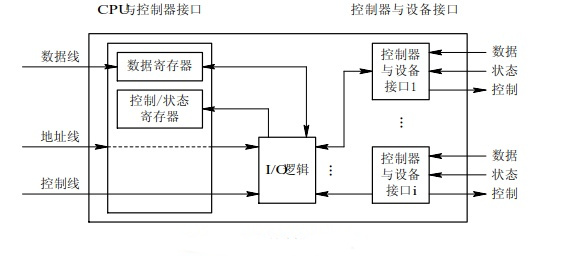

3. 内存映像$I/O$

   驱动程序将抽象的$I/O$命令转换为一系列具体的命令、参数等数据装入设备控制器的相应的寄存器，由控制器执行这些命令，实现对$I/O$设备的控制。

   可采用如下两种方法完成：

   1. 利用特定的$I/O$命令

      早期的计算机，为了实现CPU和设备控制器的通信，为每个控制寄存器分配一个$I/O$端口，还配置一些$I/O$指令。

      例如，为了将CPU寄存器中的内容复制到控制寄存器中，可用特定的$I/O$指令表示如下：

      `io-store cpu-reg,dev-no,dev-reg`

      其中`cpu-reg`是CPU的某个寄存器；`dev-no`是指定的设备，即控制器地址；`dev-reg`指定控制器中的寄存器。

      主要缺点：访问内存和访问设备需要两种不同的指令。

   2. 内存映像$I/O$

      在编址上不区分内存和单元地址和控制器中的寄存器地址，都采用k，当k值处于0-n-1认为是内存地址，若k大于等于n时，认为是某个控制器的寄存器地址。

      内存影响$I/O$方式统一了对内存和控制器的访问方式，简化了$I/O$编程。

4. $I/O$通道

   虽然在CPU和$I/O$设备之间增加了设备控制器，当外设达到一定数目，对CPU的负担还是很重。为此增设了$I/O$通道$(I/O\;Channel)$。

   主要目的：建立独立的$I/O$操作，不仅数据的传送独立于CPU，对$I/O$操作的组织、管理及其结束处理尽量独立，保证CPU更多的处理数据；或者说让$I/O$通道承担原来CPU处理的$I/O$任务交给通道。

   $I/O$通道是一种特殊的处理机，具有执行$I/O$指令的能力，并通过执行通道程序控制$I/O$操作。

   但$I/O$通道和一般的处理机不同：

   - 指令类型单一，局限于与$I/O$操作有关的指令。
   - 没有自己的内存，执行的通道程序放在主机的内存中，即和CPU共享内存。

   通道的类型：根居信息交换方式不同

   1. 字节多路通道$(Byte\;Multiplexor\;Channel)$

      按字节交叉方式工作的通道。不适合连接高速设备。

   2. 数组选择通道$(Block\;Selector\;Channel)$

      按数组方式进行的数据传送，虽然支持连接多台高速设备，但只能执行一次通道程序，控制一台设备进行数据传送，即某台设备使用该通道，就由它独占。

   3. 数组多路通道$(Block\;Multiplexor\;Channel)$

      将数组选择通道传输速率高和字节多路通道使各子通道分时并行操作的优点结合形成的。

   "瓶颈"问题：通道价格昂贵，导致机器所设置的通道数量较少，往往它成了$I/O$瓶颈。

   解决”瓶颈“问题的有效方法：增加设备到主机之间的通路而不增加通道。即将一个设备连接到多个控制器上，一个控制器又连接到多个通道上，不仅解决了”瓶颈“问题，还提高了系统的可靠性，不会因为个别通道或控制器的故障导致设备和存储器之间没有通路。

### 中断机构和中断处理程序

1. 中断简介

   1. 中断和陷入

      - 中断：指对$I/O$设备发来的中断信号的一种响应。

        CPU暂停正在执行的程序，保留CPU环境后，自动地转去执行该$I/O$设备的中断处理程序。执行完毕后，在回到断点，继续执行原来的程序。

        由于中断是由外部设备引起的，故又称外中断。

      - 陷入：由CPU内部事件引起的中断，例如进程在运算中发生的下溢或上溢，如程序出错，如非法指令、地址越界以及电源故障等，也称为内中断或陷入。

      中断和陷入的区别：信号的来源，是CPU的内部还是外部。

   2. 中断向量表和中断优先级

      - 中断向量表

        中断向量表用于保存对设备进行处理的中断处理程序的入口地址。

        当$I/O$设备发来中断请求信号时，由中断控制器确定该请求的中断号，根据中断号去查找中断向量表 ，从中取得该设备中断处理程序的入口地址，这样就可以转入中断处理程序执行。

      - 中断优先级

        通常会有多个中断信号源，需要根据中断源对服务的紧急程度不同。系统需要为它们分别规定不同的优先级。

   3. 对多中断源的处理方式

      即当处理机正在处理一个中断源，又来了一个新的中断请求，这个时候该如何处理。

      - 屏蔽(禁止)中断

        处理机对任何新到的中断请求，都暂时不予理睬，而让它们等待。直到处理机完成本次中断的处理后，处理机再去检查是否有中断发生，若有，再继续处理。

        在该方法中，所有中断都按顺序处理。优点是简单，但不能用于实时性要求较高的中断请求。

      - 嵌套中断

        设置了优先级的系统中，根据如下的规则进行中断控制：

        1. 当同时有多个不同的优先级的中断请求时，CPU优先响应最高优先级的中断请求。
        2. 高优先级的中断请求可以抢占正在运行的低优先级中断的处理机，类似于基于优先级的抢占式进程调度。

2. 中断处理程序

   当一个进程发出请求$I/O$操作时，该进程将被挂起，直到$I/O$设备完成$I/O$操作后，设备控制器便向CPU发送一个中断请求，CPU响应后便转向中断处理程序，中断处理程序执行相应的处理，处理完后解除响应进程的阻塞状态。

   中断处理程序的处理过程

   1. 测定是否有未响应的中断信号。
   2. 保护被中断进程的CPU环境。
   3. 转入相应的设备处理程序。
   4. 中断处理。
   5. 恢复CPU的现场并退出中断。
      - 如果采用了屏蔽中断的方式，返回被中断的进程。
      - 采用了中断嵌套方式，如果没有优先级更高的中断请求$I/O$，完成后返回被中断的进程，否则处理优先级更高的中断请求。


### 设备驱动程序

设备处理程序又被称为设备驱动程序，是$I/O$系统的高层与设备控制器之间的通信程序，主要任务是接受上层软件发来的抽象$I/O$请求，转为具体的要求后，发送给设备控制器，启动设备执行；反之接受设备控制器发来的信号送给上层软件。

1. 概述
   1. 设备驱动程序的功能
      - 接受与设备无关的软件发来的命令和参数，并将命令中的抽象要求转换为与设备相关的低层操作序列。
      - 检查用户$I/O$请求的合法性，了解$I/O$ 设备的工作状态，传递与$I/O$设备操作相关的参数，设置设备的工作方式。
      - 发送$I/O$命令，如果设备空闲，便立即启动$I/O$设备，完成指定的$I/O$操作；如果设备忙碌，则将请求者的请求块挂在设备队列上等待。
      - 及时响应设备控制器发来的中断请求，并根据其中断类型，调用相应的中断处理程序进行处理。
   2. 设备驱动程序的特点
      - 驱动程序是实现在与设备无关的软件和设备控制器之间通信和转换的程序
      - 驱动程序与设备控制器以及$I/O$设备的硬件特性紧密相关，对不同类型的设备，应该配置不同的驱动程序。但可以为相同的多个终端设置一个终端驱动程序。
      - 驱动程序与$I/O$设备所采用的$I/O$控制方式紧密相关，常用的$I/O$控制方式是中断驱动和DMA方式。
      - 驱动程序和硬件紧密相关，其中一部分必须用汇编语言书写。目前很多驱动程序基本以及固化在ROM中。
      - 驱动程序应允许可重入。一个正在允许的驱动程序常会在一次调用完成前被再次调用。
   3. 设备处理方式
      - 为每类设备设置一个进程，专门用于执行这类设备的$I/O$操作。
      - 在整个系统中设置一个$I/O$进程，专门用于执行系统中所有各类设备的$I/O$操作。
      - 不设置专门的设备处理进程，而只为各类设备设置相应的设备驱动程序，供用户或系统进程调用。这种方式目前用的最多。
2. 设备驱动程序的处理过程
   1. 将抽象要求转换为具体要求。
   2. 对服务请求进行校验。
   3. 检查设备的状态。
   4. 传送必要的参数。
   5. 启动$I/O$设备
3. 对$I/O$设备的控制方式
   1. 采用轮询的可编程的$I/O$方式
   2. 采用可中断的可编程$I/O$方式
   3. 直接存储器访问
   4. $I/O$通道控制方式

### 与设备无关的$I/O$软件

设备无关性：应用程序中所用的设备，不局限于使用某个具体的物理设备。

为了实现设备独立性，必须在设备驱动程序之上设置一层软件，称为与设备无关的$I/O$软件，或设备独立性软件。

1. 与设备无关软件的基本概念
   - 以物理名使用设备：应用程序使用$I/O$设备时，使用设备的物理名称，使得应用程序与系统中的物理设备直接相关。
   - 逻辑设备：抽象的设备名。如`/dev/printer`，指说明用户需要使用打印机输出，不指定具体打印机。
   - $I/O$重定向：指用于$I/O$操作的设备可以更换(即重定向)，而不必改变应用程序。
   - 逻辑设备名称和物理设备的名称的转换：逻辑设备名称方便了用户，但是系统只识别物理设备名称，为了实现这个，在系统中需要配置一张逻辑设备表。

2. 与设备无关的软件

   与设备无关的软件是$I/O$系统的最高层软件。在它下面是设备驱动程序，其间的界限，因操作系统和设备的不同而有所差异。这种差异出于对操作系统、设备独立性和设备驱动程序运行效率等多方面综合考虑。

   与设备无关的软件中，包括执行所有设备公有操作的软件，具体如下。

   1. 设备驱动程序的统一接口

   2. 缓冲管理：缓和CPU和$I/O$设备之间的矛盾，提高CPU的利用率。

      缓冲区多种形式：单缓冲区、双缓冲区、循环缓冲区、公用缓冲池等。

   3. 差错控制

      设备中的机械部分和电气部分，比较容易出故障，导致$I/O$操作的绝大部分操作和设备有关。可分为两类。

      - 暂时性错误，可通过重试操作纠正。
      - 持久性错误

   4. 对独立设备的分配和回收

      避免进程们对独占设备的争夺，必须由系统统一分配，不允许进程自行使用。

   5. 独立于设备的逻辑数据块

      不同类型的设备，数据交换数据是不同的，读取和传输速率是不同的，即使同一类型的设备，其数据交换的速率可能不同。设备独立性软件应该能隐藏这些差异，向高层软件提供大小统一的逻辑数据块。

3. 设备分配

   1. 设备分配中的数据结构

      1. 设备控制表$DCT(Device\;Control\;Table)$

         - 设备类型：$type$
         - 设备标识符：$deviceid$
         - 设备状态：等待/不等待   忙/闲
         - 指向控制器的指针
         - 重复执行次数或时间
         - 设备队列的队首指针

      2. 控制器控制表、通道控制表和系统设备表

         - 控制器控制表$(COCT)$：用于记录控制器情况

           控制器标识符：$controllerid$；控制器状态：忙/闲；与控制器连接的通道表指针；控制器队列的队首指针；控制器队列的队尾指针

         - 通道控制表$(CHCT)$：每个通道都有一张通道控制表

           通道标识符：$channelid$；通道状态：忙/闲；与通道连接的控制器表首址；通道队列的队首指针；通道队列的队尾指针

         - 系统设备表$(SDT)$：记录系统全部设备的情况，每个设备占一个条目

           设备类；设备标识符；$DCT$；驱动程序入口

   2. 设备分配时应考虑的因素

      1. 设备的固有属性

         按照设备的固有属性分类的不同分配策略

         - 独占设备的分配策略
         - 共享设备的分配策略
         - 虚拟设备的分配策略

      2. 设备分配算法

         - 先来先算法
         - 优先级高者优先算法

      3. 设备分配中的安全性

         从进程运行的安全性上考虑，设备分配分为两种方式：

         - 安全分配方式：进程发出$I/O$操作请求后，便进入阻塞状态
         - 不安全分配方式：进程发出$I/O$操作请求后，进程继续运行

   3. 独占设备的分配程序

      1. 基本设备分配程序

         当进程提出$I/O$请求后，系统的设备分配程序按如下步骤分配：

         1. 分配设备
         2. 分配控制器
         3. 分配通道

      2. 设备分配程序的改进

4. 逻辑设备名到物理设备名映射的实现

   1. 逻辑设备表$LUT(Logical\;Unit\;Table)$

      每个表项包括：逻辑设备名；物理设备名；驱动程序入口地址

   2. 逻辑设备表的设置问题

      - 整个系统只设置一张$LUT$
      - 为每个用户设置一张$LUT$

### 用户层的$I/O$软件

1. 系统调用和库函数

   - 系统调用

     不允许用户态的应用进程直接调用运行在核心态的$OS$过程。但是应用进程必须取得$OS$提供的服务，为了解决这个问题，在用户层引入了一个中介过程，即系统调用，应用程序通过它简介调用$OS$中的$I/O$过程，对$I/O$设备进程操作。

     系统调用的过程：

     1. 应用程序执行某种$I/O$操作，调用相应的系统调用
     2. 将CPU的状态从用户态转到核心态，然后转向操作系统中的相应过程，完成所需的$I/O$操作
     3. 执行完成后，系统将CPU的状态从核心态转为用户态
     4. 返回到应用程序继续执行

     系统调用是应用程序取得系统所有服务的**唯一途径**。

     早期的操作系统是汇编语言形式提供的，所以当时只有用汇编语言编写的程序，才能直接使用系统调用，后来在C语言中，提供了和系统调用相对应的库函数。

   - 库函数

     在C语言以及UNIX系统中，系统调用与各系统调用所使用的库函数之间几乎是一一对应的。

     而微软定义的一套过程，称为$Win32\;API$的应用程序接口，和实际系统调用并不一一对应。

     用户程序通过调用对应的库函数使用系统调用，库函数和调用程序连接在一起，被嵌入在运行时装入内存的二进制程序中。

2. 假脱机$(SPOOLing)$系统

   多道程序技术：将一台物理CPU虚拟为多台逻辑的CPU，从而多个用户共享一台主机。

   假脱机技术：将一台物理$I/O$设备虚拟为多台逻辑$I/O$设备，允许多个用户共享一台物理$I/O$设备。

   1. $SPOOLing$的组成

      $SPOOLing$技术是对脱机输入/输出系统的模拟。建立在通道技术和多道程序技术的基础上，以高速随机外存作为后援存储器。

      - 输入井和输出井
      - 输入缓冲区和输出缓冲区
      - 输入进程和输出进程
      - 井管理程序

   2. $SPOOLing$的特点

      - 提高了$I/O$的速度
      - 将独占设备改造为共享设备
      - 实现了虚拟设备功能

### 缓冲区管理

1. 引入缓冲区的原因

   - 缓和CPU和$I/O$设备间速度不匹配的矛盾
   - 减少对CPU的中断频率，放宽对CPU中断响应时间的限制
   - 解决数据粒度不匹配的问题
   - 提高CPU和$I/O$设备之间的并行性

2. 单缓冲区和双缓冲区

   - 单缓冲区$(Single\;Buffer)$

     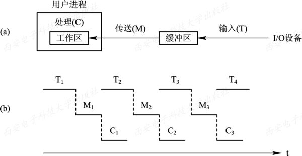

   - 双缓冲区

     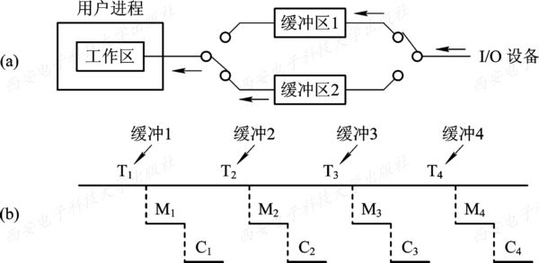

   如果在实现两台机器之间的通信时仅为它们配置了单缓冲，那么，它们之间在任一时刻都只能实现单方向的数据传输。例如，只允许把数据从A传送到B，或者从B传送到A，而绝不允许双方同时向对方发送数据。为了实现双向数据传输，必须在两台机器中都设置两个缓冲区，一个用作发送缓冲区，另一个用作接收缓冲区。

   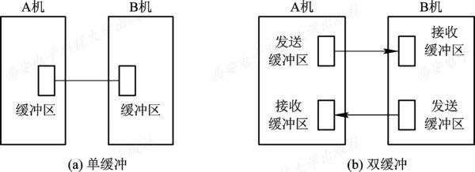

3. 环形缓冲区

   1. 环形缓冲区的组成

      - 多个缓冲区。在环形缓冲中包括多个缓冲区，其每个缓冲区的大小相同。作为输入的多缓冲区可分为三种类型：用于装输入数据的空缓冲区R、已装满数据的缓冲区G以及计算进程正在使用的现行工作缓冲区C
      - 多个指针。作为输入的缓冲区可设置三个指针：用于指示计算进程下一个可用缓冲区G的指针$Nextg$、指示输入进程下次可用的空缓冲区R的指针$Nexti$，以及用于指示计算进程正在使用的缓冲区C的指针$Current$。

      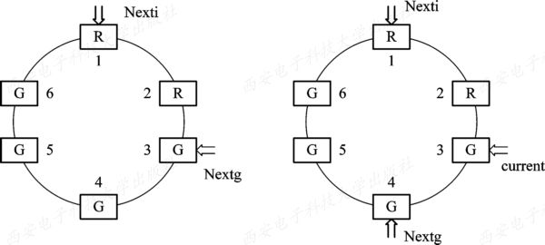

   2. 环形缓冲区的使用

      计算进程和输入进程可利用下述两个过程来使用形环缓冲区。

      - $Getbuf$过程。
      - $Releasebuf$过程。

   3. 进程之间的同步问题

      使用输入循环缓冲，可使输入进程和计算进程并行执行。相应地，指针$Nexti$和指针$Nextg$将不断地沿着顺时针方向移动，这样就可能出现下述两种情况：

      - $Nexti$指针追赶上$Nextg$指针。
      - $Nextg$指针追赶上$Nexti$指针。

4. 缓冲池$(Buffer\;Pool) $

   1. 缓冲池的组成

      缓冲池管理着多个缓冲区，每个缓冲区由用于标识和管理的缓冲首部以及用于存放数据的缓冲体两部分组成。
      缓冲首部一般包括缓冲区号、设备号、设备上的数据块号、同步信号量以及队列链接指针等。
      为了管理上的方便，一般将缓冲池中具有相同类型的缓冲区链接成一个队列，于是可形成以下三个队列：

      - 空白缓冲队列emq。
      - 输入队列inq。
      - 输出队列outq

   2. 缓冲区的工作方式

      

### 磁盘存储器的性能和调度

1. 磁盘性能简述

   1. 数据的组织和格式

      磁盘设备可包括一个或多个物理盘片，每个磁盘片分一个或两个存储面$(Surface)$，每个盘面上有若干个磁道$(Track)$，磁道之间留有必要的间隙$(Gap)$。为使处理简单起见，在每条磁道上可存储**相同数目的二进制位**。

      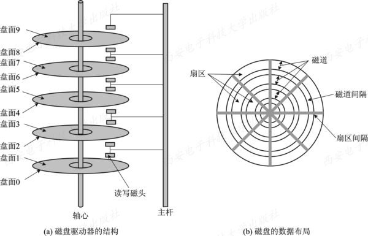

      为了在磁盘上存储数据，必须对磁盘进行低级格式化。如下图显示一种温盘(温切斯特盘)中一条磁道格式化的情况。

      每条磁道$(Track)$含有30个固定大小的扇区$(Sectors)$，每个扇区容量为600字节，其中512个字节存放数据，其余存放控制信息。

      每个扇区包括两个字段：

      - 标识符字段$(ID\;Field)$，其中一个字节的$SYNCH$具有特定的位图像，作为该字段的定界符，利用磁道号$(Track)$、磁头号$(Head\;\#)$及扇区号$(Sectors\;\#)$三者来标识一个扇区；$CRC$字段用于段校验；
      - 数据字段$(Data\;Field)$，存放512个字节的数据。

      在磁盘的一个盘面的不同磁道$(Track)$、每个磁道的不同扇区$(Sector)$，以及每个扇区的不同字段$(Field)$之间，为了简化和方便磁头的辨识，都设置了一个到若干个不同长度的间距$(Gap)$；

      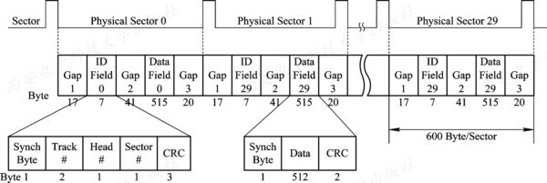

      磁盘格式化完成后，一般要对磁盘进行分区。

      在逻辑上，每个分区就是一个独立的逻辑磁盘。每个分区的起始扇区的大小都记录在磁盘0扇区的主引导记录分区表中所包含的分区表中。在这个分区表中必须有一个分区被标记为活动的(即引导块)，保证能够引导系统。

      在真正使用磁盘前，需要对磁盘进行一次高级格式化，即设置一个引导块、空间存储管理、根目录和一个空文件系统，同时在分区表中标记该分区所使用的文件系统。

   2. 磁盘的类型

      对于磁盘，可以从不同的角度进行分类。最常见的有：将磁盘分成硬盘和软盘、单片盘和多片盘、固定头磁盘和活动头(移动头)磁盘等。

   3. 磁盘访问时间

      磁盘设备在工作时以恒定速率旋转。为了读或写，磁头必须能移动到所指定的磁道上，并等待所指定的扇区的开始位置旋转到磁头下，然后再开始读或写数据。

      磁盘的访问时间分为三部分：寻道时间$T_s$；旋转延迟时间$T_{\tau}$；传输时间$T_t$。

      - 寻道时间：$T_s=m*n+s$；启动磁臂的时间s与磁头移动n条磁道花费的时间，m是常数，和磁盘驱动器的速度有关。
      - 旋转延迟时间$T_{\tau}$：指定扇区移动到磁头下面所经历的时间。
      - 传输时间$T_t$：把数据从磁盘读出或向磁盘吸入数据经历的时间。$T_t=\frac{b}{rN}$，大小与每次读写的字节数b和旋转速度有关。r为磁盘每秒钟的转数；N为一条磁道上的字节数，当一次读写的字节数相当于半条磁道上的字节数时，$T_t$与$T_\tau$相同，此时访问时间$T_a=T_s+\frac{1}{2r}+\frac{b}{rN}$。

2. 早期磁盘调度算法

   - 先来先服务$(FCFS)$：这是最简单的磁盘调度算法。它根据进程请求访问磁盘的先后次序进行调度。

   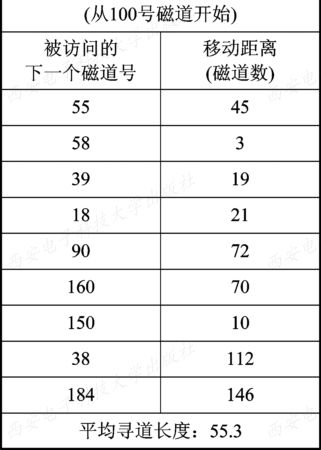

   - 最短寻道时间优先$(SSTF)$：该算法选择这样的进程，其要求访问的磁道与当前磁头所在的磁道距离最近，以使每次的寻道时间最短，但这种算法不能保证平均寻道时间最短。

   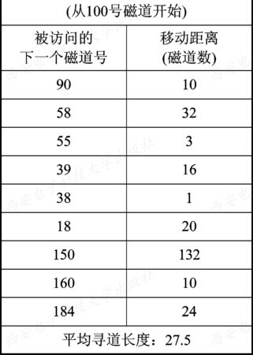

3. 基于扫描的磁盘调度算法

   - 扫描$(SCAN)$算法

     $SSTF$算法的实质是基于优先级的调度算法，因此就可能导致优先级低的进程发生“饥饿”$(Starvation)$现象。因为只要不断有新进程的请求到达，且其所要访问的磁道与磁头当前所在磁道的距离较近，这种新进程的$I/O$请求必然优先满足。在对$SSTF$算法略加修改后，则可防止低优先级进程出现“饥饿”现象。

     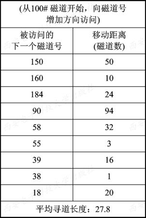

   - 循环扫描$(CSCAN)$算法

     $CSCAN$算法既能获得较好的寻道性能，又能防止“饥饿”现象，故被广泛用于大、中、小型机器和网络中的磁盘调度。
     但也存在这样的问题：当磁头刚从里向外移动而越过了某一磁道时，恰好又有一进程请求访问此磁道，
     这时，该进程必须等待，待磁头继续从里向外，然后再从外向里扫描完处于外面的所有要访问的磁道后，才处理该进程的请求，致使该进程的请求被大大地推迟。

     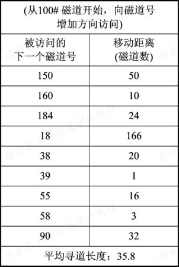

   - $NStepSCAN$和$FSCAN$调度算法

     - $NStepSCAN$算法

       在$SSTF、SCAN$及$CSCAN$几种调度算法中，都可能出现磁臂停留在某处不动的情况，例如，有一个或几个进程对某一磁道有较高的访问频率，即这个(些)进程反复请求对某一磁道的$I/O$操作，从而垄断了整个磁盘设备。我们把这一现象称为“磁臂粘着”$(Armstickiness)$。在高密度磁盘上容易出现此情况

     - $FSCAN$算法

       $FSCAN$算法实质上是N步$SCAN$算法的简化，即$FSCAN$只将磁盘请求队列分成两个子队列。一个是由当前所有请求磁盘$I/O$的进程形成的队列，由磁盘调度按$SCAN$算法进行处理。另一个是在扫描期间，将新出现的所有请求磁盘$I/O$的进程放入等待处理的请求队列。这样，所有的新请求都将被推迟到下一次扫描时处理。

## 第七章 文件管理

### 文件和文件系统

文件系统的管理功能是将其管理的程序和数据通过组织为一系列文件的方式实现的。而文件则是指具有文件名的若干相关元素的集合。元素通常是记录，而记录又是一组有意义的数据项的集合。可见，基于文件系统的概念，可以把数据组成分为数据项、记录和文件三级。

1. 数据项、记录和文件

   1. 数据项

      在文件系统中，数据项是最低级的数据组织形式，可把它分成以下两种类型：

      - 基本数据项。描述一个对象的某种属性的字符集，是数据组织中可以命名的最小逻辑数据单位，又称字段。
      - 组合数据项。由若干个基本数据项组成，简称组项。如工资是组项，可由基本工资、工龄工资和奖励工资等基本项组成。

   2. 记录

      记录是一组相关数据项的集合，用于描述一个对象在某方面的属性。一个记录应包含哪些数据项，取决于需要描述对象的哪个方面。由于对象所处的环境不同可把他作为不同的对象。

      为了唯一的标识一个记录，必须在一个记录的各个数据项中确定出一个或几个数据项，把它们的集合称为关键字。

   3. 文件

      文件是指由创建者所定义的、具有文件名的一组相关元素的集合，可分为有结构文件和无结构文件两种。

      文件是文件系统中最大的数据单位，描述了一个对象集。例如，可以将一个班的学生记录作为一个文件。

      文件的属性：

      - 文件类型。可从不同角度规定。如源文件，目标文件和可执行文件等。
      - 文件长度。指文件的当前长度。可以以字节、字或块为单位，也可能是最大允许长度。
      - 文件的物理位置
      - 文件的建立时间。指最后一次修改的时间

   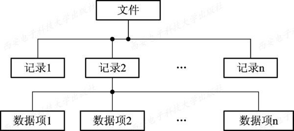

2. 文件名和类型

   1. 文件名和扩展名

      - 文件名。不同系统对文件名的规定是不同的。
      - 扩展名。添加在文件名后面的若干个附加字符，又称为后缀名，用于指示文件的类型。拓展名长度一般为1--4个字符。

   2. 文件类型

      1. 按用途分类

         根据文件的性质和用途的不同，可将文件分为三类：

         - ​系统文件，这是指由系统软件构成的文件。大多数的系统文件只允许用户调用，但不允许用户去读，更不允许修改；有的系统文件不直接对用户开放。
         - 用户文件，指由用户的源代码、目标文件、可执行文件或数据等所构成的文件。用户将这些文件委托给系统保管。
         - 库文件，这是由标准子例程及常用的例程等所构成的文件。这类文件允许用户调用，但不允许修改。

         按文件中数据的形式分类，按这种方式分类，也可把文件分为三类：

         - 源文件，这是指由源程序和数据构成的文件。通常，由终端或输入设备输入的源程序和数据所形成的文件都属于源文件。它通常是由$ASCII$码或汉字所组成的。
         - 目标文件，这是指把源程序经过编译程序编译过，但尚未经过链接程序链接的目标代码所构成的文件。目标文件所使用的后缀名是“.obj”。
         - 可执行文件，这是指把编译后所产生的目标代码经过链接程序链接后所形成的文件。其后缀名是 .exe。

         按存取控制属性分类。根据系统管理员或用户所规定的存取控制属性，可将文件分为三类：

         - 只执行文件，该类文件只允许被核准的用户调用执行，不允许读和写。
         - 只读文件，该类文件只允许文件主及被核准的用户去读，不允许写。
         - 读写文件，这是指允许文件主和被核准的用户去读或写的文件。

         按组织形式和处理方式分类。根据文件的组织形式和系统对其处理方式的不同，可将文件分为三类：

         - 普通文件。
         - 目录文件。
         - 特殊文件。

   3. 文件系统的层次结构

      文件系统的模型可分为三个层次：最底层是对象及其属性，中间层是对对象进行操纵和管理的软件集合，最高层是文件系统提供给用户的接口。

      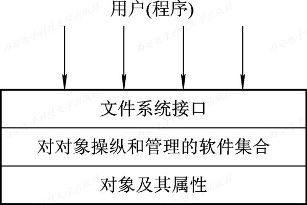

      1. 对象及其属性

         文件管理系统管理的对象如下：

         - 文件。文件系统中各种不同类型的文件，都作为文件系统的管理的直接对象。
         - 目录。方便对文件的存取和检索。对目录的组合和管理，是方便用户和提高对文件存取速度的关键。
         - 磁盘(磁带)存储空间。文件和目录必定占用存储空间，对存储空间的有效管理，能提高外存的利用率和对文件的存取速度。

      2. 对对象操纵和管理软件的集合

         该层是文件管理系统的核心部分。文件系统的功能大多是在这一层实现的，其中包括有：
         ① 对文件存储空间的管理；
         ② 对文件目录的管理；
         ③ 用于将文件的逻辑地址转换为物理地址的机制；
         ④ 对文件读和写的管理；
         ⑤ 对文件的共享与保护等功能。
         在实现这些功能时，OS通常都采取了层次组织结构，即在每一层中都包含了一定的功能，处于某个层次的软件，只能调用同层或更低层次中的功能模块。

      3. 文件系统的接口

         为方便用户的使用，文件系统以接口的形式提供了一组对文件和记录操作的方法和手段。通常是下面两种类型的接口：

         - 命令接口，是指作为用户与文件系统直接交互的接口，用户可通过键盘终端键入命令取得文件系统的服务。

         - 程序接口，是指作为用户程序与文件系统的接口，用户程序可通过系统调用取得文件系统的服务，例如，用于创建文件的系统调用Creat，用于打开一个文件的系统调用Open等。

   4. 文件操作

      1. 最基本的文件操作

         最基本的文件操作包含下述内容：

         - 创建文件。创建新文件，需要为新文件分配必要的外存空间，并在文件目录中为之建立目录项；目录项中应记录新文件的文件名及其在外存的地址等属性。
         - 删除文件。删除文件需要现在目录中找到删除文件的目录项，置为空项，在回收文件占用的存储空间。
         - 读文件。根据用户给出的文件名去查找目录，从中得到被读文件在外存中的为之；在目录项中，还有一个指针用于对文件的读写。
         - 写文件。根据文件名查找目录，找到指定文件的目录项，再利用目录项中的写指针进行写操作。
         - 设置文件的读/写位置。前面的读写文件，都只是提供了对文件顺序存取的手段，即每次都是从文件的始端进行读或写；设置文件读写指针的位置，便于不需要每次都从其始端开始，从设置的位置开始读写，改顺序存取变为随机存取。

      2. 文件的“打开”和“关闭”操作

         当用户要求对一个文件实施多次读/写或其它操作时，每次都要从检索目录开始。
         为了避免多次重复地检索目录，在大多数OS中都引入了“打开”(open)这一文件系统调用，当用户第一次请求对某文件进行操作时，须先利用open系统调用将该文件打开。

         “打开”：将文件从外存拷贝到内存在打开文件表的一个表目中，将该表目即索引号返回给用户。

         “关闭”：断开用户和文件的连接，将文件从打开文件表的表目上删除。

      3. 其它文件操作

         OS为用户都提供了一系列文件操作的系统调用，

         其中最常用的一类是有关对文件属性的操作，即允许用户直接设置和获得文件的属性，如改变已存文件的文件名、改变文件的拥有者(文件主)、改变对文件的访问权，以及查询文件的状态(包括文件类型、大小和拥有者以及对文件的访问权等)。

         另一类是有关目录的操作，如创建一个目录，删除一个目录，改变当前目录和工作目录等。

         此外，还有用于实现文件共享的系统调用，以及用于对文件系统进行操作的系统调用等。

### 文件的逻辑结构

在系统中的所有文件都存在一下两种形式的文件结构：

- 文件的逻辑结构$(File\;Logical\;Structure)$。文件由一系列的逻辑记录组成，是用户可以直接处理的数据及其结构，独立于文件的文件特性，又称为文件组织$(File\;Organization)$

- 文件的物理结构，又称为文件的存储结构。指系统将文件存储在外存上的一种存储组织形式，用户是不能看见的。

----------

1. 文件逻辑结构的类型

   1. 对文件逻辑结构所提出的基本要求，

      - 首先是有助于提高对文件的检索速度，即在将大批记录组成文件时，应采用一种有利于提高检索记录速度和效率的逻辑结构形式。

      - 其次是该结构应方便对文件进行修改，即便于在文件中增加、删除和修改一个或多个记录。

      - 第三是降低文件存放在外存上的存储费用，即尽量减少文件占用的存储空间，不要求大片的连续存储空间。

   2. 按文件是否有结构分类

      - 有结构文件

        在记录式文件中，每个记录都用于描述实体集中的一个实体，各记录有着相同或不同数目的数据项。记录的长度可分为定长和不定长两类。

        - 定长记录。文件的所有记录的长度都是相同的，所有记录的各数据项处于记录中相同的位置，具有相同的顺序和长度，文件的长度用记录数目表示。当前常用的记录格式，广泛用于数据处理中。

        - 变长记录。文件的各记录长度不相同。产生变长记录的原因是一个记录中所包含的数据项数目并不相同，也可能是数据项本身的长度不定。广泛用于商业领域。

      - 无结构文件

        如果说在大量的信息管理系统和数据库系统中，广泛采用了有结构的文件形式的话(即文件是由定长或变长记录构成的)，那么在系统中运行的大量的源程序、可执行文件、库函数等，所采用的就是无结构的文件形式，即**流式文件**。其文件的长度是以字节为单位的。对流式文件的访问，则是利用读、写指针来指出下一个要访问的字符。可以把流式文件看做是记录式文件的一个特例：一个记录仅有一个字节。

   3. 按文件的组织方式分类

      根据文件的组织方式，可把有结构文件分为三类：

      - 顺序文件。一系列记录按照某种顺序排列而成的文件，其中记录可以是变长记录或可变长记录。
      - 索引文件。为可变长记录文件建立一张索引表，为每个记录建立一个表项，加快对记录的检索速度。
      - 索引顺序文件。 在每个文件建立一张索引表时，为一组记录中的第一个记录建立一个索引表项。

2. 顺序文件$(Sequential\;File)$

   1. 顺序文件的排列方式

      在顺序文件中的记录，可以按照各种不同的顺序进行排列。一般地，可分为两种情况：

      - 串结构。按存入时间的先后排序，顺序和关键字无关。检索需要逐个检索，比较费时。
      - 顺序结构。按照文件关键字排序。可以采用这半查找、插值查找法、跳步查找法等方法提高检索效率。

   2. 顺序文件的优缺点

      顺序文件的最佳应用场合是在对文件中的记录进行批量存取时(即每次要读或写一大批记录)。所有逻辑文件中顺序文件的存取效率是最高的。此外，对于顺序存储设备(如磁带)，也只有顺序文件才能被存储并能有效地工作。

      缺点：

      - 查找和修改单个记录，需要逐个查找，导致性能很差。
      - 增加和删除比较困难。

3. 记录寻址

   为了访问顺序文件的第一条记录，首先应该找到该记录的地址。

   1. 隐式寻址方式

      对于定长记录的顺序文件，如果已知当前记录的逻辑地址，便很容易确定下一个记录的逻辑地址。

      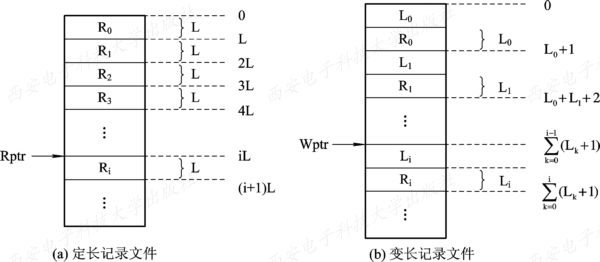

   2. 显式寻址方式

      该方式可用于对定长记录的文件实现直接或随机访问。因为任何记录的位置都很容易通过记录长度计算出来。而对于可变长度记录的文件则不能利用显式寻址方式实现直接或随机访问，必须增加适当的支持机构方能实现。下面我们通过两种方式对定长记录实现随机访问：

      - 通过文件中记录的位置。
      - 利用关键字。

4. 索引文件$(Index\;File)$

   1. 按关键字建立索引

      定长记录的文件可以通过简单的计算，很容易地实现随机查找。但变长记录文件查找一个记录必须从第一个记录查起，一直顺序查找到目标记录为止，耗时很长。

      为变长记录文件建立一张索引表，为主文件中的每个记录在索引表中设置一个表项，记录指向记录的指针即记录在逻辑地址空间的首址和记录的长度，索引表按关键字排序，这样索引表本身是一个定长记录的顺序文件，将对变长记录的顺序检索转变为对定长记录索引文件的随机检索，实现直接存取。

   2. 具有多个索引表的索引文件

      使用按关键字建立索引表的索引文件与顺序文件一样，都只能按该关键字进行检索。
      而实际应用情况往往是：不同的用户，为了不同的目的，希望能按不同的属性(或不同的关键字)来检索一条记录。
      为实现此要求，需要为顺序文件建立多个索引表，即为每一种可能成为检索条件的域(属性或关键字)都配置一张索引表。在每一个索引表中，都按相应的一种属性或关键字进行排序。

      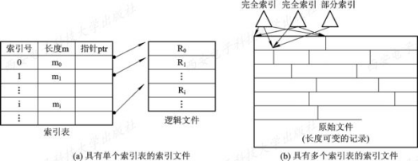

   索引顺序文件 $(Index\;Sequential\;File)$

   1. 索引顺序文件的特征

      索引顺序文件是对顺序文件的一种改进，它基本上克服了变长记录的顺序文件不能随机访问，以及不便于记录的删除和插入的缺点。但它仍保留了顺序文件的关键特征，即记录是按关键字的顺序组织起来的。它又增加了两个新特征：

      - 一个是引入了文件索引表，通过该表可以实现对索引顺序文件的随机访问；
      - 另一个是增加了溢出$(overflow)$文件，用它来记录新增加的、删除的和修改的记录。

   2. 一级索引顺序文件

      最简单的索引顺序文件只使用了一级索引。

      其具体的建立方法是，首先将变长记录顺序文件中的所有记录分为若干个组，如50个记录为一个组。然后为顺序文件建立一张索引表，并为每组中的第一个记录在索引表中建立一个索引项，其中含有该记录的关键字和指向该记录的指针。索引顺序文件是最常见的一种逻辑文件形式。

      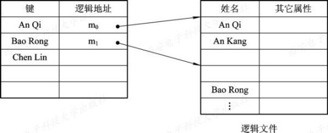

   3. 两级索引顺序文件

      对于一个非常大的文件，为找到一个记录而须查找的记录数目仍然很多，例如，对于一个含有106个记录的顺序文件，当把它作为索引顺序文件时，为找到一个记录，平均须查找1000个记录。为了进一步提高检索效率，可以为顺序文件建立多级索引，即为索引文件再建立一张索引表，从而形成两级索引表。

5. 直接文件和哈希文件

   1. 直接文件

      采用前述几种文件结构对记录进行存取时，都须利用给定的记录键值，先对线性表或链表进行检索，以找到指定记录的物理地址。然而对于直接文件，则可根据给定的关键字直接获得指定记录的物理地址。换而言之，关键字本身就决定了记录的物理地址。

   2. 哈希$(Hash)$文件

      这是目前应用最为广泛的一种直接文件。它利用$Hash$函数(或称散列函数)可将关键字转换为相应记录的地址。但为了能实现文件存储空间的动态分配，通常由$Hash$函数所求得的并非是相应记录的地址，而是指向某一目录表相应表目的指针，该表目的内容指向相应记录所在的物理块。

      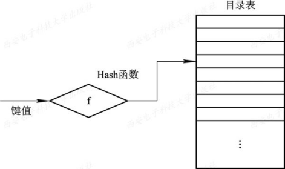

### 文件目录

文件目录是一种数据结构，用于标识系统中的文件及其物理地址，供检索使用。

对文件目录的要求如下：

- 实现“按名存取”。用户只需提供所要访问的文件名。
- 提高对目录的检索速度。合理组织目录结构加快目录的检索速度。
- 文件共享。运行多个用户共享同一文件。
- 允许文件重名。 允许不同用户对不同文件采用相同的文件名。

----------

1. 文件控制块和索引结点

   1. 文件控制块$FCB(File\;Control\;Block)$

      为了能对系统中的大量文件施以有效的管理，在文件控制块中，通常应含有三类信息，即基本信息、存取控制信息及使用信息。

      - 基本信息类

        基本信息类包括：

        - 文件名。
        - 文件物理位置。指示文件在外存的存储位置，包括存放文件的设备名、文件在外存上的起始盘块号、指示文件占用的盘块数或字节数的文件长度。
        - 文件逻辑结构。指示文件是流式文件还是记录式文件、记录数，文件是定长记录还是变长记录。
        - 文件的物理结构。指示文件是顺序文件还是链接式文件还是索引文件。

      - 存取控制信息类

        存取控制信息类包括文件主的存取权限、核准用户的存取权限以及一般用户的存取权限。

      - 使用信息类

        使用信息类包括文件的建立日期和时间、文件上一次修改的日期和时间，以及当前使用信息。这些信息包括当前已打开该文件的进程数，是否被其它进程锁住，文件在内存中是否已被修改但尚未拷贝到盘上等。应该说明，对于不同OS的文件系统，由于功能不同，可能只含有上述信息中的某些部分。

      

   2. 索引结点

      - 索引结点的引入

        文件目录通常是存放在磁盘上的，当文件很多时，文件目录可能要占用大量的盘块。在查找目录的过程中，必须先将存放目录文件的第一个盘块中的目录调入内存，然后将用户所给定的文件名，与目录项中的文件名逐一比较。若未找到指定文件，还需要将下一盘块的目录项调入内存。

        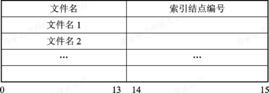

      - 磁盘索引结点

        这是存放在磁盘上的索引结点。

        每个文件有唯一的一个磁盘索引结点，它主要包括以下内容：

        - 文件主标识符，即拥有该文件的个人或小组的标识符；
        - 文件类型，包括正规文件、目录文件或特别文件；
        - 文件存取权限，指各类用户对该文件的存取权限；
        - 文件物理地址，每一个索引结点中含有13个地址项，即$iaddr(0)～iaddr(12)$，它们以直接或间接方式给出数据文件所在盘块的编号；
        - 文件长度，指以字节为单位的文件长度；
        - 文件连接计数，表明在本文件系统中所有指向该(文件的)文件名的指针计数；
        - 文件存取时间，指出本文件最近被进程存取的时间、最近被修改的时间及索引结点最近被修改的时间。

      - 内存索引结点

        这是存放在内存中的索引结点。

        当文件被打开时，要将磁盘索引结点拷贝到内存的索引结点中，便于以后使用。在内存索引结点中又增加了以下内容：

        - 索引结点编号，用于标识内存索引结点；
        - 状态，指示i结点是否上锁或被修改；
        - 访问计数，每当有一进程要访问此i结点时，将该访问计数加1，访问完再减1；
        - 文件所属文件系统的逻辑设备号；
        - 链接指针，设置有分别指向空闲链表和散列队列的指针。

2. 简单的文件目录

   1. 单级文件目录

      这是最简单的文件目录。在整个文件系统中只建立一张目录表，每个文件占一个目录项，目录项中含文件名、文件扩展名、文件长度、文件类型、文件物理地址以及其它文件属性。此外，为表明每个目录项是否空闲，又设置了一个状态位。

      

   2. 两级文件目录

      为了克服单级文件目录所存在的缺点，可以为每一个用户再建立一个单独的用户文件目录$UFD(User\;File\;Directory)$。这些文件目录具有相似的结构，它由用户所有文件的文件控制块组成。此外，在系统中再建立一个主文件目录$MFD(Master\;File\;Directory)$；在主文件目录中，每个用户目录文件都占有一个目录项，其目录项中包括用户名和指向该用户目录文件的指针。

      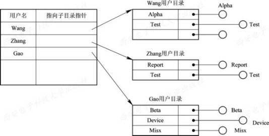

3. 树形结构目录$(Tree-Structured\;Directory)$

   1. 树形目录

      在现代OS中，最通用且实用的文件目录无疑是树形结构目录。它可以明显地提高对目录的检索速度和文件系统的性能。主目录在这里被称为根目录，在每个文件目录中，只能有一个根目录，每个文件和每个目录都只能有一个父目录。把数据文件称为树叶，其它的目录均作为树的结点，或称为子目录。

      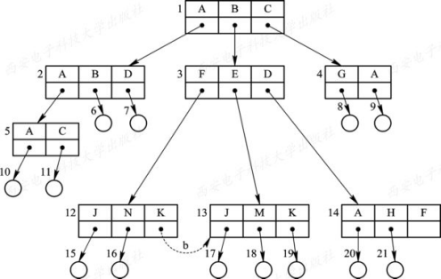

      其中，用方框代表目录文件，圆圈代表数据文件。

   2. 路径名和当前目录

      - 路径名$(path\;name)$

        在树形结构目录中，从根目录到任何数据文件都只有一条唯一的通路。在该路径上，从树的根(即主目录)开始，把全部目录文件名与数据文件名依次地用“/”连接起来，即构成该数据文件唯一的路径名。

      - 当前目录$(Current\;Directory)$

        当一个文件系统含有许多级时，每访问一个文件，都要使用从树根开始，直到树叶(数据文件)为止的、包括各中间节点(目录)名的全路径名。这样非常麻烦，基于和这个，可为每个进程设置一个“当前目录”，又称为“**工作空间**”。进程对各文件的访问基于“当前目录”进行。

        - 相对路径名：当前目录开始直到数据文件为止构成的路径。
        - 绝对路径名：从树根开始的路径名称。

   3. 目录操作

      - 创建目录。
      - 删除目录。
        - ① 不删除非空目录。
        - ② 可删除非空目录。
      - 改变目录。指定目录的绝对或相对路径名设置当前目录。
      - 移动目录。
      - 链接$(Link)$操作。通过链接操作让指定文件具有多个父目录，方便了文件共享。
      - 查找。支持多种方式查找。从根目录或当前目录查找。在搜索时，支持精确匹配或局部匹配。

4. 目录查询技术

   1. 线性检索法

      线性检索法又称为顺序检索法。

      在单级目录中，利用用户提供的文件名，用顺序查找法直接从文件目录中找到指名文件的目录项。

      在树形目录中，用户提供的文件名是由多个文件分量名组成的路径名，此时需对多级目录进行查找。
      假定用户给定的文件路径名是 `/usr/ast/mbox`，则查找 `/usr/ast/mbox`文件的过程下图所示。

      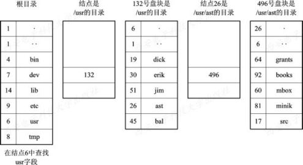

   2. $Hash$方法

      如果我们建立了一张$Hash$索引文件目录，便可利用$Hash$方法进行查询，即系统利用用户提供的文件名，并将它变换为文件目录的索引值，再利用该索引值到目录中去查找，这样将显著地提高检索速度。

### 文件共享

在现代计算机系统中，必须提供文件共享手段，即指系统应允许多个用户(进程)共享同一份文件。这样，在系统中只需保留该共享文件的一份副本。如果系统不能提供文件共享功能，就意味着凡是需要该文件的用户，都须各自备有此文件的副本，显然这会造成对存储空间的极大浪费。

1. 基于有向无循环图实现文件共享

   1. 有向无循环图$DAG(Directed\;Acyclic\;Graph)$

      在严格的树形结构目录中，每个文件只允许有一个父目录，父目录可以有效地拥有该文件，其它用户要想访问它，必须经过其属主目录来访问该文件。这就是说，对文件的共享是不对称的，或者说，树形结构目录是不适合文件共享的。如果允许一个文件可以有多个父目录，即有多个属于不同用户的多个目录，同时指向同一个文件，这样虽会破坏树的特性，但这些用户可用对称的方式实现文件共享，而不必再通过其属主目录来访问。

      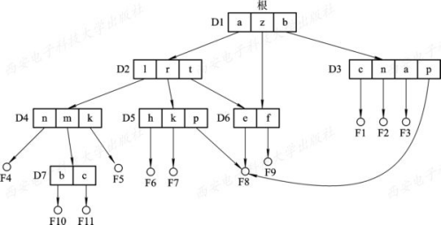

   2. 利用索引结点

      为了解决这个问题，可以引用索引结点，即诸如文件的物理地址及其它的文件属性等信息，不再是放在目录项中，而是放在索引结点中。在文件目录中只设置文件名及指向相应索引结点的指针

      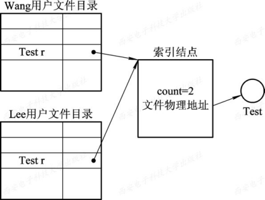

      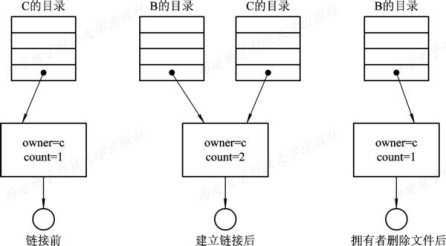

2. 利用符号链接实现文件共享

   1. 利用符号链接$(SymbolicLinking)$的基本思想

      利用符号链接实现文件共享的基本思想，是允许一个文件或子目录有多个父目录，但其中仅有一个作为主(属主)父目录，其它的几个父目录都是通过符号链接方式与之相链接的(简称链接父目录)。

      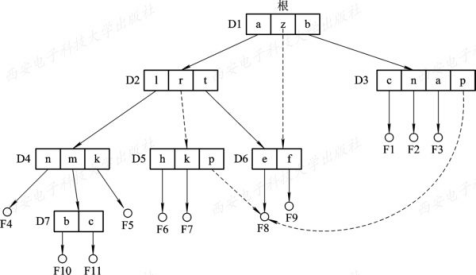

   2. 如何利用符号链实现共享

      为使链接父目录D5能共享文件F，可以由系统创建一个LINK类型的新文件，也取名为F，并将F写入链接父目录D5中，以实现D5与文件F8的链接。在新文件F中只包含被链接文件F8的路径名。这样的链接方法被称为符号链接。新文件F中的路径名则只被看做是符号链。当用户通过D5访问被链接的文件F8，且正要读LINK类新文件时，此要求将被OS截获，OS根据新文件中的路径名去找到文件F8，然后对它进行读(写)，这样就实现了用户B对文件F的共享。

   3. 利用符号链实现共享的优点　　在利用符号链方式实现文件共享时，只是文件主才拥有指向其索引结点的指针；而共享该文件的其他用户则只有该文件的路径名，并不拥有指向其索引结点的指针。这样，也就不会发生在文件主删除一共享文件后留下一悬空指针的情况。当文件的拥有者把一个共享文件删除后，如果其他用户又试图通过符号链去访问一个已被删除的共享文件，则会因系统找不到该文件而使访问失败，于是再将符号链删除，此时不会产生任何影响。

   4. 利用符号链的共享方式存在的问题　　利用符号链的共享方式也存在着一些问题：当其他用户去读共享文件时，系统是根据给定的文件路径名逐个分量(名)地去查找目录，直至找到该文件的索引结点。因此，在每次访问共享文件时，都可能要多次地读盘。这使每次访问文件的开销甚大，且增加了启动磁盘的频率。此外，要为每个共享用户建立一条符号链，而由于链本身实际上是一个文件，尽管该文件非常简单，却仍要为它配置一个索引结点，这也要耗费一定的磁盘空间。

### 文件保护

在现代计算机系统中，存放了越来越多的宝贵信息供用户使用，给人们带来了极大的好处和方便，但同时也有着潜在的不安全性。影响文件安全性的主要因素有：

- 人为因素。人为的有意无意的破坏文件系统的数据。
- 系统因素。系统某部分出现异常情况。
- 自然因素。随着时间的推移，磁盘的数据会逐渐消失。

为了确保文件系统的安全性，可针对上述原因而采取三方面的措施：

- 通过存取控制机制，防止由人为因素所造成的文件不安全性。
- 采取系统容错技术，防止系统部分的故障所造成的文件的不安全性。
- 建立后备系统，防止由自然因素所造成的不安全性。

----------

1. 保护域$(Protection\;Domain)$

   1. 访问权

      为了对系统中的对象加以保护，应由系统来控制进程对对象的访问。对象可以是硬件对象，如磁盘驱动器、打印机；也可以是软件对象，如文件、程序。对对象所施加的操作也有所不同，如对文件可以是读，也可以是写或执行操作。我们把一个进程能对某对象执行操作的权力，称为访问权$(Access\;right)$。

   2. 保护域

      为了对系统中的资源进行保护而引入了保护域的概念，保护域简称为“域”。“域”是进程对一组对象访问权的集合，进程只能在指定域内执行操作。这样，“域”也就规定了进程所能访问的对象和能执行的操作。

      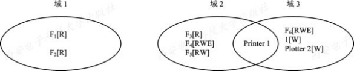

   3. 进程和域间的静态联系

      在进程和域之间可以一一对应，即一个进程只联系着一个域。这意味着，在进程的整个生命期中，其可用资源是固定的，我们把这种域称为“静态域”。在这种情况下，进程运行的全过程都是受限于同一个域，这将会使赋予进程的访问权超过了实际需要。

   4. 进程和域间的动态联系方式

      在进程和域之间，也可以是一对多的关系，即一个进程可以联系着多个域。在此情况下，可将进程的运行分为若干个阶段，其每个阶段联系着一个域，这样便可根据运行的实际需要来规定在进程运行的每个阶段中所能访问的对象。

2. 访问矩阵

   1. 基本的访问矩阵

      我们可以利用一个矩阵来描述系统的访问控制，并把该矩阵称为访问矩阵$(Access\;Matrix)$。

      访问矩阵中的行代表域，列代表对象，矩阵中的每一项是由一组访问权组成的。

      因为对象已由列显式地定义，故可以只写出访问权而不必写出是对哪个对象的访问权，每一项访问权$access(i, j)$定义了在域$D_i$中执行的进程能对对象$Q_j$所施加的操作集。

      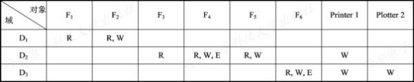

   2. 具有域切换权的访问矩阵

      为了实现在进程和域之间的动态联系，应能够将进程从一个保护域切换到另一个保护域。

      为了能对进程进行控制，同样应将切换作为一种权力，仅当进程有切换权时，才能进行这种切换。

      为此，在访问矩阵中又增加了几个对象，分别把它们作为访问矩阵中的几个域；当且仅当$switch\in access(i, j)$时，才允许进程从域i切换到域j。

      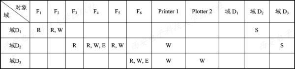

3. 访问矩阵的修改

   1. 拷贝权$(Copy\;Right)$

      我们可利用拷贝权将在某个域中所拥有的访问权$(access(i, j))$扩展到同一列的其它域中，
      亦即为进程在其它的域中也赋予对同一对象的访问权$(access(k, j))$。

      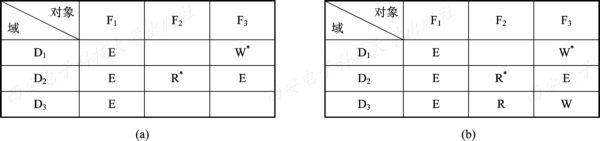

   2. 所有权$(Owner\;Right)$

      人们不仅要求能将已有的访问权进行有控制的扩散，而且同样需要能增加某种访问权，或者能删除某种访问权。此时，可利用所有权(O)来实现这些操作。

      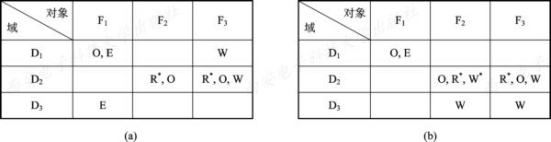

   3. 控制权$(Control\;Right)$

      拷贝权和所有权都是用于改变矩阵内同一列的各项访问权的，或者说，是用于改变在不同域中运行的进程对同一对象的访问权的。控制权则可用于改变矩阵内同一行中(域中)的各项访问权，亦即，用于改变在某个域中运行的进程对不同对象的访问权的。如果在$access(i，j)$中包含了控制权，则在域$Di$中运行的进程可以删除在域$D_j$中运行的进程对各对象的任何访问权。

      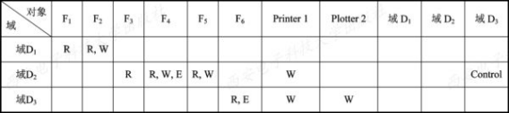

4. 访问矩阵的实现

   1. 访问控制表$(Access\;Control\;List)$

      这是指对访问矩阵按列(对象)划分，为每一列建立一张访问控制表ACL。

      在该表中，已把矩阵中属于该列的所有空项删除，此时的访问控制表是由一有序对(域，权集)所组成的。

      由于在大多数情况下，矩阵中的空项远多于非空项，因而使用访问控制表可以显著地减少所占用的存储空间，并能提高查找速度。

   2. 访问权限$(Capabilities)$表

      如果把访问矩阵按行(即域)划分，便可由每一行构成一张访问权限表。换言之，这是由一个域对每一个对象可以执行的一组操作所构成的表。

      表中的每一项即为该域对某对象的访问权限。

      当域为用户(进程)、对象为文件时，访问权限表便可用来描述一个用户(进程)对每一个文件所能执行的一组操作。

      |      | 类型   | 权力 | 对象             |
      | ---- | ------ | ---- | ---------------- |
      | 0    | 文件   | R--  | 指向文件3的指针  |
      | 1    | 文件   | RWE  | 指向文件4的指针  |
      | 2    | 文件   | RW-  | 指向文件5的指针  |
      | 3    | 打印机 | -W-  | 指向打印机的指针 |

## 第八章 磁盘存储器的管理

### 外存的组织方式

文件的物理结构直接与外存的组织方式有关。对于不同的外存组织方式，将形成不同的文件物理结构。目前常用的外存组织方式有：

- 连续组织方式。对每个文件分配一片连续的磁盘空间，这样文件的物理结构是顺序式的文件结构。
- 链接组织方式。为每个文件分配不连续的磁盘空间，通过链接指针将一个文件的所有盘块链接在一起，形成链接式文件结构。
- 索引组织方式。对文件采用索引式组织方式，形成索引式文件结构。

----------

1. 连续组织方式

   连续组织方式又称连续分配方式，要求为每一个文件分配一组相邻接的盘块。例如，第一个盘块的地址为$b$，则第二个盘块的地址为$b+1$，第三个盘块的地址为$b+2,\cdots$。通常，它们都位于一条磁道上，在进行读/写时，不必移动磁头。在采用连续组织方式时，可把逻辑文件中的记录顺序地存储到邻接的各物理盘块中，这样所形成的文件结构称为顺序文件结构，此时的物理文件称为顺序文件。

   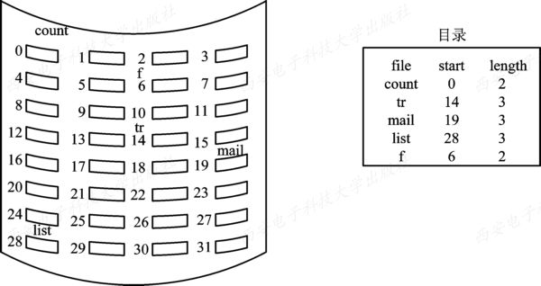

   连续组织方式的主要优点有：顺序访问容易;；顺序访问速度快。

   连续组织方式的主要缺点如下：要求为一个文件分配连续的存储空间；必须事先知道文件的长度；不能灵活地删除和插入记录；对于那些动态增长的文件，不知道最终大小，很难分配空间。

2. 链接组织方式

   如果可以将文件装到多个离散的盘块中，就可消除连续组织方式的上述缺点。在采用链接组织方式时，可为文件分配多个不连续的盘块，再通过每个盘块上的链接指针，将同属于一个文件的多个离散的盘块链接成一个链表，由此所形成的物理文件称为链接文件。

   链接组织方式的主要优点是：消除了磁盘的外部碎片，提高了外存的利用率；对插入、删除和修改记录都非常容易；能适应文件的动态增长，无需事先知道文件的大小。

   1. 隐式链接

      在采用隐式链接组织方式时，在文件目录的每个目录项中，都须含有指向链接文件第一个盘块和最后一个盘块的指针。

      

   2. 显式链接

      这是指把用于链接文件各物理块的指针显式地存放在内存的一张链接表中。该表在整个磁盘中仅设置一张。

      

3. FAT技术

   1. FAT12

      - 早期的FAT12文件系统

        FAT12是以盘块为基本分配单位的。

        由于FAT是文件系统中最重要的数据结构，为了安全起见，在每个分区中都配有两张相同的文件分配表FAT1和FAT2。

        在FAT的每个表项中存放下一个盘块号，它实际上是用于盘块之间的链接的指针，通过它可以将一个文件的所有的盘块链接起来，而将文件的第一个盘块号放在自己的FCB中。

        

      - 以簇为单位的FAT12文件系统

        稍加分析便可看出，如果把每个盘块(扇区)的容量增大n倍，则磁盘的最大容量便可增加n倍。但要增加盘块的容量是不方便和不灵活的。为此，引入了簇$(cluster)$的概念。

   2. FAT16

      FAT12对磁盘容量限制的原因在于， FAT12表中的表项有限制，亦即最多只允许4096个。这样，随着磁盘容量的增加，必定会引起簇的大小和簇内碎片也随之增加。

      要增加FAT表项位数增至16位，最大表项将$2^{16}$，一个磁盘分区分为$2^{16}簇$。

   3. FAT32

      由于FAT16表的长度只有65 535项，随着磁盘容量的增加，簇的大小也必然会随之增加，为了减少簇内零，也就应当增加FAT表的长度，为此需要再增加FAT表的宽度，这样也就由FAT16演变为FAT32。

   

4. $NTFS$的文件组织方式

   1. $NTFS$新特征

      $NTFS(New\;Technology\;File\;System)$是一个专门为$Windows\;NT$开发的、全新的文件系统，并适用于$Windows2000/XP$及后续的$WindowsOS$。

   2. 磁盘组织

      $NTFS$是以簇作为磁盘空间分配和回收的基本单位的。一个文件占用若干个簇，一个簇只属于一个文件。这样，在为文件分配磁盘空间时，就无须知道盘块的大小，只要根据不同的磁盘容量，选择相应大小的簇，即使$NTFS$具有了与磁盘物理块大小无关的独立性。

   3. 文件的组织

      在$NTFS$中，以卷为单位，将一个卷中的所有文件信息、目录信息以及可用的未分配空间信息，都以文件记录的方式记录在一张主控文件表$MFT(Master\;File\;Table)$中，该表是$NTFS$卷结构的中心，从逻辑上讲，卷中的每个文件作为一条记录，在$MFT$表中占有一行，其中还包括$MFT$自己的这一行。每行大小固定为1KB，每行称为该行所对应文件的元数据$(metadata)$，也称为文件控制字。

5. 索引组织方式

   1. 单级索引组织方式

      链接组织方式虽然解决了连续组织方式所存在的问题(即不便于随机访问)，但又出现了另外两个问题，即：

      ① 不能支持高效的直接存取，要对一个较大的文件进行存取，须在FAT中顺序地查找许多盘块号；

      ② FAT需占用较大的内存空间，由于一个文件所占用盘块的盘块号是随机地分布在FAT中的，因而只有将整个FAT调入内存，才能保证在FAT中找到一个文件的所有盘块号。

      

      索引组织方式的主要有优点是支持直接访问。

      索引组织方式的主要问题是对小文件采用索引组织方式，利用率将是极低的。每当建立一个索引文件，都要为该文件分配一个索引块。

   2. 多级索引组织方式

      在为一个大文件分配磁盘空间时，如果所分配出去的盘块的盘块号已经装满一个索引块时，OS须再为该文件分配另一个索引块，用于将以后继续为之分配的盘块号记录于其中。依此类推，再通过链指针将各索引块按序链接起来。

      

      主要优点：大大加快了对大型文件的查找速度。

      主要缺点：访问一个盘块时，其所需要启动磁盘的次数随着索引级数的增加而增多。

   3. 增量式索引组织方式

      - 增量式索引组织方式的基本思想

        为了能较全面地照顾到小、中、大及特大型作业，可以采取多种组织方式来构成文件的物理结构。如果盘块的大小为1 KB或4 KB，对于小文件(如1KB～10KB或4KB～40KB)而言，最多只会占用10个盘块，为了能提高对数量众多的小型作业的访问速度，最好能将它们的每一个盘块地址都直接放入文件控制块FCB(或索引结点)中，这样就可以直接从FCB中获得该文件的盘块地址。

      - UNIX System V的组织方式

        在UNIX System V的索引结点中设有13个地址项，即i.addr(0)～i.addr(12)。直接地址；一次间接地址；多次间接地址。

        

### 文件存储空间的管理

1. 空闲表法和空闲链表法

   1. 空闲表法

      - 空闲表

        空闲表法属于连续分配方式，它与内存的动态分配方式雷同，它为每个文件分配一块连续的存储空间。即系统也为外存上的所有空闲区建立一张空闲表，每个空闲区对应于一个空闲表项，其中包括表项序号、该空闲区的第一个盘块号、该区的空闲盘块数等信息。再将所有空闲区按其起始盘块号递增的次序排列，形成空闲盘块表。

        

      - 存储空间的分配与回收

        空闲盘区的分配与内存的分区(动态)分配类似，同样是采用首次适应算法和最佳适应算法等，它们对存储空间的利用率大体相当，都优于最坏适应算法。在系统为某新创建的文件分配空闲盘块时，先顺序地检索空闲表的各表项，直至找到第一个其大小能满足要求的空闲区，再将该盘区分配给用户(进程)，同时修改空闲表。

   2. 空闲链表法

      - 空闲盘块链

        这是将磁盘上的所有空闲空间以盘块为单位拉成一条链，其中的每一个盘块都有指向后继盘块的指针。

      - 空闲盘区链

        这是将磁盘上的所有空闲盘区(每个盘区可包含若干个盘块)拉成一条链。在每个盘区上除含有用于指示下一个空闲盘区的指针外，还应有能指明本盘区大小(盘块数)的信息。

2. 位示图法

   1. 位示图

      位示图是利用二进制的一位来表示磁盘中一个盘块的使用情况。当其值为“0”时，表示对应的盘块空闲；为“1”时，表示已分配。有的系统把“0”作为盘块已分配的标志，把“1”作为空闲标志。(它们在本质上是相同的，都是用一位的两种状态来标志空闲和已分配两种情况。)磁盘上的所有盘块都有一个二进制位与之对应，这样，由所有盘块所对应的位构成一个集合，称为位示图。

      

   2. 盘块的分配

      根据位示图进行盘块分配时，可分三步进行：

      1. 顺序扫描位示图，从中找出一个或一组其值为“0”的二进制位(“0”表示空闲时)。
      2. 将所找到的一个或一组二进制位转换成与之相应的盘块号。假定找到的其值为“0”的二进制位位于位示图的第i行、第j列，则其相应的盘块号应按下式计算：$b=n(i-1)+j$式中，n代表每行的位数。
      3. 修改位示图，令$map[i,j]=1$。

   3. 盘块的回收

      盘块的回收分两步：

      1. 将回收盘块的盘块号转换成位示图中的行号和列号。转换公式为：

         $$
         i = (b - 1)DIV  n + 1\\j = (b - 1)MOD  n + 1
         $$

      2. 修改位示图。令map[i, j] = 0。

3. 成组链接法

   1. 空闲盘块的组织

      - 空闲盘块号栈，用来存放当前可用的一组空闲盘块的盘块号(最多含100个号)，以及栈中尚有的空闲盘块(号)数N。顺便指出，N还兼作栈顶指针用。

        

      - 文件区中的所有空闲盘块被分成若干个组，比如，将每100个盘块作为一组。假定盘上共有10000个盘块，每块大小为1 KB，其中第201～7999号盘块用于存放文件，即作为文件区，这样，该区的最末一组盘块号应为7901～7999；次末组为7801～7900，…，倒数第二组的盘块号为301～400；第一组为201～300。

      - 将每一组含有的盘块总数N和该组所有的盘块号记入其前一组的第一个盘块的S.free(0)～S.free(99)中。这样，由各组的第一个盘块可链成一条链。

      - 将第一组的盘块总数和所有的盘块号记入空闲盘块号栈中，作为当前可供分配的空闲盘块号。

      - 最末一组只有99个盘块，其盘块号分别记入其前一组的S.free(1)～S.free(99)中，而在S.free(0)中则存放“0”，作为空闲盘块链的结束标志。(注：最后一组的盘块数应为99，不应是100，因为这是指可供使用的空闲盘块。其编号应为(1～99)，0号中放空闲盘块链的结尾标志。)

   2. 空闲盘块的分配与回收

      当系统要为用户分配文件所需的盘块时，须调用盘块分配过程来完成。该过程首先检查空闲盘块号栈是否上锁，如未上锁，便从栈顶取出一空闲盘块号，将与之对应的盘块分配给用户，然后将栈顶指针下移一格。若该盘块号已是栈底，即S.free(0)，这是当前栈中最后一个可分配的盘块号。

### 提高磁盘$I/O$速度的途径

- 改进文件的目录结构以及检索目录的方法来减少对目录的查找时间；
- 选取好的文件存储结构，以提高对文件的访问速度；
- 提高磁盘的I/O速度，能将文件中的数据快速地从磁盘传送到内存中，或者相反。

----------

1. 磁盘高速缓存(Disk Cache)

   在设计磁盘高速缓存时需要考虑的问题有：

   - 如何将磁盘高速缓存中的数据传送给请求进程；
   - 采用什么样的置换策略；
   - 已修改的盘块数据在何时被写回磁盘。

   1. 数据交付(Data Delivery)方式

      如果I/O请求所需要的数据能从磁盘高速缓存中获取，此时就需要将磁盘高速缓存中的数据传送给请求进程。所谓的数据交付就是指将磁盘高速缓存中的数据传送给请求者进程。系统可以采取两种方式将数据交付给请求进程：

      - 数据交付：直接将高速缓存中的数据传送到请求者进程的内存空间；
      - 指针交付：指向高速缓存中某区域的指针交付给请求者进程。

   2. 置换算法

      现在不少系统在设计其高速缓存的置换算法时，除了考虑到最近最久未使用这一原则外，还考虑了以下几点：

      - 访问频率。
      - 可预见性。
      - 数据的一致性。

   3. 周期性地写回磁盘

   4. 还有一种情况值得注意，那就是根据LRU算法，那些经常要被访问的盘块数据可能会一直保留在高速缓存中，长期不会被写回磁盘。

2. 提高磁盘I/O速度的其它方法

   能有效地提高磁盘I/O速度的方法还有许多，如提前读、延迟写等，现介绍如下：

   - 提前读

   - 延迟写

   - 优化物理块的分布

   - 虚拟盘

     由于访问内存的速度远高于访问磁盘的速度，于是有人试图利用内存空间去仿真磁盘，形成所谓虚拟盘，又称为RAM盘。该盘的设备驱动程序也可以接受所有标准的磁盘操作，但这些操作的执行不是在磁盘上而是在内存中。这对用户都是透明的。

3. 廉价磁盘冗余阵列(RAID)

   1. 并行交叉存取

      这是把在大、中型机中，用于提高访问内存速度的并行交叉存取技术应用到磁盘存储系统中，以提高对磁盘的I/O速度。在该系统中，有多台磁盘驱动器，系统将每一盘块中的数据分为若干个子盘块数据，再把每一个子盘块的数据分别存储到各个不同磁盘中的相同位置上。以后当要将一个盘块的数据传送到内存时，采取并行传输方式，将各个盘块中的子盘块数据同时向内存中传输，从而使传输时间大大减少。

      

   2. RAID的分级

      RAID在刚被推出时，是分成6级的，后来又增加了RAID 6级和RAID 7级。

      - RAID 0级。提供交叉存取。优点：实现高效的传输，和高速的$I/O$请求。缺点：无冗余校验功能，磁盘可靠性不高。一个磁盘损坏，便会造成不可挽回的数据丢失。
      - RAID 1级。具有磁盘镜像功能。如磁盘阵列中具有8个磁盘，其中四个作为数据盘，另外四个作为镜像盘。优点：可靠性好，故障中恢复简单。缺点：磁盘的利用率只有50%。
      - RAID 3级。并行传输的磁盘阵列。只利用一台奇偶校验盘来完成数据的校验。当有7个盘，一个作为校验盘，利用率只有$\frac{6}{7}$。
      - RAID 5级。具有独立传送功能的磁盘阵列。每个驱动器各有自己独立的数据通路，独立地进行读写，无专门的校验盘。用来纠错的校验信息以螺旋方式散布在所有数据盘上。
      - RAID 6级和RAID 7级。强化了的RAID。在RAID6级中，设置了一个专用的、可快速访问的异步校验盘。具有独立的数据访问通路，比3级和5级更好的性能，但性能有限，且价格昂贵。RAID7级是对RAID6级的改进，在这个阵列的所有磁盘都具有较高的传输速率和优异的性能，是目前最高档次的磁盘阵列，但价格也较高。

   3. RAID的优点

      - 可靠性高，除了RAID 0级外，其余各级都采用了容错技术。当阵列中某一磁盘损坏时，并不会造成数据的丢失。此时可根据其它未损坏磁盘中的信息来恢复已损坏的盘中的信息。其可靠性比单台磁盘机高出一个数量级。
      - 磁盘I/O速度高，由于采取了并行交叉存取方式，可使磁盘I/O速度提高N-1倍。
      - 性能/价格比高，RAID的体积与具有相同容量和速度的大型磁盘系统相比，只是后者的1/3，价格也只是后者的1/3，且可靠性高。换言之，它仅以牺牲1/N的容量为代价，换取了高可靠性。

### 提高磁盘可靠性的技术

1. 第一级容错技术SFT-Ⅰ

   第一级容错技术(SFT-Ⅰ)是最基本的一种磁盘容错技术，主要用于防止因磁盘表面缺陷所造成的数据丢失。它包含双份目录、双份文件分配表及写后读校验等措施。

   1. 双份目录和双份文件分配表

      在磁盘上存放的文件目录和文件分配表FAT，是文件管理所用的重要数据结构。为了防止这些表格被破坏，可在不同的磁盘上或在磁盘的不同区域中分别建立(双份)目录表和FAT。其中一份为主目录及主FAT，另一份为备份目录及备份FAT。一旦由于磁盘表面缺陷而造成主文件目录或主FAT的损坏时，系统便自动启用备份文件目录及备份FAT，从而可以保证磁盘上的数据仍是可访问的。

   2. 热修复重定向和写后读校验

      由于磁盘价格昂贵，在磁盘表面有少量缺陷的情况下，则可采取某种补救措施后继续使用。一般主要采取以下两个补救措施：

      - 热修复重定向。将磁盘很小的一部分作为热修复重定向区，用于存放当发现磁盘有缺陷时的待写数据，并对写入该去的所有数据进行登记，以便以后对数据进行访问。
      - 写后读校验方式。每写入一个数据块后，又立即读出，送至另一缓冲区，再将缓冲区和内存缓冲区中在写后仍保留的数据进行比较。

2. 第二级容错技术SFT-Ⅱ

   1. 磁盘镜像(Disk Mirroring)

      为了避免磁盘驱动器发生故障而丢失数据，便增设了磁盘镜像功能。为实现该功能，须在同一磁盘控制器下，再增设一个完全相同的磁盘驱动器。

      

   2. 磁盘双工(Disk Duplexing)

      如果控制这两台磁盘驱动器的磁盘控制器发生故障，或主机到磁盘控制器之间的通道发生故障，磁盘镜像功能便起不到数据保护的作用。因此，在第二级容错技术中，又增加了磁盘双工功能，即将两台磁盘驱动器分别接到两个磁盘控制器上，同样使这两台磁盘机镜像成对。

      

3. 基于集群技术的容错功能

   1. 双机热备份模式

      在这种模式的系统中，备有两台服务器，两者的处理能力通常是完全相同的，一台作为主服务器，另一台作为备份服务器。

      

   2. 双机互为备份模式

      在双机互为备份模式中，平时，两台服务器均为在线服务器，它们各自完成自己的任务，例如，一台作为数据库服务器，另一台作为电子邮件服务器。为了实现两者互为备份的功能，在两台服务器之间，应通过某种专线将其连接起来。如果希望两台服务器之间能相距较远，最好利用FDDI单模光纤来连接两台服务器。在此情况下，最好再通过路由器将两台服务器互连起来，作为备份通信线路。

      

   3. 公用磁盘模式

      为了减少信息复制的开销，可以将多台计算机连接到一台公共的磁盘系统上去。该公共磁盘被划分为若干个卷。每台计算机使用一个卷。如果某台计算机发生故障，此时系统将重新进行配置，根据某种调度策略来选择另一台替代机器，后者对发生故障的机器的卷拥有所有权，从而可接替故障计算机所承担的任务。这种模式的优点是消除了信息的复制时间，因而减少了网络和服务器的开销。

4. 后备系统

   1. 磁带机

      它是最早作为计算机系统的外存储器。但由于它只适合存储顺序文件，故现在主要把它作为后备设备。磁盘机的主要优点是容量大，一般可达数GB至数十GB，且价格便宜，故在许多大、中型系统中都配置了磁带机。其缺点是只能顺序存取且速度也较慢，为数百KB到数MB，为了将一个大容量磁盘上的数据拷贝到磁带上，需要花费很多时间。

   2. 硬盘

      - 移动磁盘。
      - 固定硬盘驱动器。

      

   3. 光盘驱动器

      可将它们分为如下两类：

      - 只读光盘驱动器CD-ROM和DVD-ROM。
      - 可读写光盘驱动器。

### 数据一致性控制

在实际应用中，经常会在多个文件中都含有同一个数据。所谓数据一致性问题是指，保存在多个文件中的同一数据，在任何情况下都必需能保证相同。

1. 事务

   1. 事务的定义

      事务是用于访问和修改各种数据项的一个程序单位。事务也可以被看做是一系列相关读和写操作。

   2. 事务记录(Transaction Record)

      为了实现上述的原子修改，通常须借助于称为事务记录的数据结构来实现。这些数据结构被放在一个非常可靠的存储器(又称稳定存储器)中，用来记录在事务运行时数据项修改的全部信息，故又称为运行记录(Log)

   3. 恢复算法

      由于一组被事务Ti修改的数据以及它们被修改前和修改后的值都能在事务记录表中找到，因此，利用事务记录表系统能处理任何故障而不致使故障造成非易失性存储器中信息的丢失。恢复算法可利用以下两个过程：

      - undo〈Ti〉。该过程把所有被事务Ti修改过的数据恢复为修改前的值。
      - redo〈Ti〉。该过程能把所有被事务Ti修改过的数据设置为新值。

2. 检查点

   1. 检查点(Check Points)的作用

      如前所述，当系统发生故障时，必须去检查整个Log表，以确定哪些事务需要利用redo〈Ti〉过程去设置新值，而哪些事务又需要利用undo〈Ti〉过程去恢复数据的旧值。由于在系统中可能存在着许多并发执行的事务，因而在事务记录表中就会有许多事务执行操作的记录。随着时间的推移，记录的数据也会愈来愈多。因此，一旦系统发生故障，在事务记录表中的记录清理起来就非常费时。

      引入检查点的目的：使事务记录表中事务记录的清理工作经常化。

   2. 新的恢复算法

      在引入检查点后，可以大大减少恢复处理的开销。因为在发生故障后，并不需要对事务记录表中的所有事务记录进行处理，而只需对最后一个检查点之后的事务记录进行处理。因此，恢复例程首先查找事务记录表，确定在最近检查点以前开始执行的最后的事务Ti。在找到这样的事务后，再返回去搜索事务记录表，便可找到第一个检查点记录，恢复例程便从该检查点开始返回搜索各个事务的记录，并利用redo和undo过程对它们进行处理。

3. 并发控制(Concurrent Control)

   1. 利用互斥锁实现“顺序性”

      实现顺序性的一种最简单的方法，是设置一种用于实现互斥的锁，简称为互斥锁(Exclusive Lock)。在利用互斥锁实现顺序性时，应为每一个共享对象设置一把互斥锁。当某一事务Ti要去访问某对象时，应先获得该对象的互斥锁。若成功，便用该锁将该对象锁住，于是事务T便可对该对象执行读或写操作；而其它事务由于未能获得该锁，因而不能访问该对象。如果Ti需要对一批对象进行访问，则为了保证事务操作的原子性，Ti应先获得这一批对象的互斥锁，以将这些对象全部锁住。

   2. 利用互斥锁和共享锁实现顺序性

      利用互斥锁实现顺序性的方法简单易行。目前有不少系统都是采用这种方法来保证事务操作的顺序性，但这却存在着效率不高的问题。因为一个共享文件虽然只允许一个事务去写，但却允许多个事务同时去读；而在利用互斥锁来锁住文件后，则只允许一个事务去读。为了提高运行效率而又引入了另一种形式的锁——共享锁$(Shared\;Lock)$。共享锁与互斥锁的区别在于：互斥锁仅允许一个事务对相应对象执行读或写操作，而共享锁则允许多个事务对相应对象执行读操作，但不允许其中任何一个事务对对象执行写操作。

4. 重复数据的数据一致性问题

   1. 重复文件的一致性

      我们以UNIX类型的文件系统为例来说明如何保证重复文件的一致性问题。对于通常的UNIX文件目录，其每个目录项中含有一个ASCII码的文件名和一个索引结点号，后者指向一个索引结点。当有重复文件时，一个目录项可由一个文件名和若干个索引结点号组成，每个索引结点号都是指向各自的索引结点。

      

   2. 链接数一致性检查

      在UNIX类型的文件目录中，其每个目录项内都含有一个索引结点号，用于指向该文件的索引结点。对于一个共享文件，其索引结点号会在目录中出现多次。

## 第九章 操作系统接口

### 用户接口

1. 字符显示式联机用户接口

   不同的OS，其联机用户接口是不同的，即它们的命令形式和用法各不相同，甚至在同一系统中，命令的不同形式构成了不同的用户界面，一般可分为字符显示式联机用户接口和图形化联机用户接口两类。

   1. 命令行方式

      该方式是以行为单位，输入和显示不同的命令。每行长度一般不超过256个字符，一般情况下，以回车符作为一个命令的结束标记。通常，命令的执行采用的是间断式的串行执行方式，即后一个命令的输入一般需等到前一个命令执行结束，如用户键入的一条命令处理完成后系统发出新的命令输入提示符，用户才可以继续输入下一条命令。

   2. 批命令方式

      在操作命令的实际使用过程中，经常遇到需要对多条命令的连续使用、或对若干条命令的重复使用、或对不同命令进行选择性使用的情况，如果用户每次都采用命令行方式将命令一条条由键盘输入，既浪费时间，又容易出错。因此，操作系统都支持一种称为批命令的特别命令方式，允许用户预先把一系列命令组织在一种称为批命令文件的文件中，一次建立，多次执行。使用这种方式可减少用户输入命令的次数，既节省了时间，减少了出错概率，又方便了用户。

2. 图形化联机用户接口

   1. 图形用户接口$GUI(Graphics\;User\;Interface)$的引入

      虽然用户可以通过命令行方式和批命令方式，取得操作系统的服务，并控制自己的作业运行，但却要牢记各种命令的动词和参数，必须严格按规定的格式输入命令，而且不同操作系统所提供的命令语言的词法、语法、语义及表达形式是不一样的，这样既不方便又花费时间。于是，图形化用户接口$GUI(Graphics\;User\;Interface)$便应运而生。

   2. 使用WIMP技术

      GUI采用了图形化的操作界面，使用WIMP 技术，该技术将窗口(Window)、图标(Icon)、菜单(Menu)、鼠标(Pointing device)和面向对象技术等集成在一起，引入形象的各种图标，将系统的各项功能、各种应用程序和文件直观、逼真地表示出来，形成一个图文并茂的视窗操作环境。

   3. Windows的GUI简介

      以Microsoft公司的Windows 操作系统为例，在系统初始化后，OS为终端用户生成了一个运行explorer.exe的进程，它运行一个具有窗口界面的命令解释程序，该窗口是一个特殊的窗口，即桌面。

3. 联机命令的类型

   1. 系统访问类

      在多用户系统中，为了保证系统的安全性，都毫无例外地设置注册命令Login。凡要在多用户系统的终端上上机的用户，都必须先在系统管理员处获得一合法的注册名和口令。以后，每当用户在接通其所用终端的电源后，便由系统直接调用，并在屏幕上显示出以下的注册命令：

      Login:　　　　/提示用户键入自己的注册名

      当用户键入正确的注册名并按下回车键后，屏幕上又会出:

      Password:　　　　/提示用户键入自己的口令

   2. 文件操作命令

      - 显示文件命令type，用于将指定文件内容显示在屏幕上。
      - 拷贝文件命令copy，用于实现文件的拷贝。
      - 文件比较命令comp，该命令用于对两个指定文件进行比较，两文件可以在同一个或不同的驱动器上。
      - 重新命名命令Rename，该命令用于将以第一参数命名的文件改成用第二参数给定的名字。
      - 删除文件命令erase，该命令用于删除一个或一组文件，例如，当参数路径名为*.BAK时，表示删除指定目录下的所有其扩展名为 .Bak的文件。

   3. 目录操作命令

      - 建立子目录命令mkdir，用于建立指定名字的新目录。
      - 显示目录命令dir，显示指定磁盘中的目录项。
      - 删除子目录命令rmdir，用于删除指定的子目录文件，但不能删除普通文件，而且一次只能删除一个空目录(其中仅含“.”和“..”两个文件)，不能删除根及当前目录。
      - 显示目录结构命令tree，显示指定盘上的所有目录路径及其层次关系。
      - 改变当前目录命令chdir，将当前目录改变为由路径名参数给定的目录。用“..”作参数时，表示应返回到上一级目录下。

   4. 其它命令

      - 输入输出重定向命令。
      - 管道连接。
      - 过滤命令。
      - 批命令。

### Shell命令语言

1. 简单命令简介

   在Shell命令语言中提供了许多不同形式的命令，并允许在一条命令行中有多个命令。如果在一条命令行中仅有一个命令，就把它称为简单命令。实际上，一条简单命令便是一个能完成某种功能的目标程序的名字。

   1. 简单命令的格式

      简单命令的格式比较自由，包括命令名字符的个数及用于分隔命令名、选项、各参数间的空格数等，都是任意的。在UNIX和Linux系统中都规定，命令由小写字母构成，命令可带有参数表，用于给出执行命令时的附加信息，每个参数是一个单词。命令名与参数表之间还可使用一种称为选项的自变量，用减号开始，后跟一个或多个字母、数字。一条命令可有多个选项，用于改变命令执行动作的类型。

   2. 简单命令的分类

      在Linux或UNIX系统中，一般把简单命令分为两类：

      - 系统提供的标准命令，包括调用各种语言处理程序、实用程序等，其数量随系统版本的不同而有所差异，系统管理员可以增添新的系统标准命令。
      - 用户自定义的命令。系统管理员和用户自行定义的命令的执行方式与系统标准命令的执行方式相同。

      对于简单命令，还可根据命令是否包含在Shell内部，即是否常驻内存，而分为内部命令和外部命令两类：

      - 内部命令。Shell中少数标准命令，如改变工作目录命令cd等，是包含在Shell内部的，作为内部命令常驻内存。
      - 外部命令。Shell中大多数的命令如拷贝命令cp和移动命令rm等，均保存于外存(盘)上，即每个命令是存在于文件系统中某个目录下的单独程序。这样做的好处在于，可以很大程度地节省内存空间。

   3. Shell的种类

      现在流行的Shell有多种类型，下面简单介绍几种流行的Shell：

      - Bourne Shell。
      - C Shell。C Shell是一种比B Shell更适于编程的Shell，是标准$BSD(Berkeley\;System\;Distribution)$命令解释。
      - Korn Shell。Korn Shell集合了C Shell和B Shell的优点，并且和B Shell完全兼容，它的名字是K Sh。

2. 简单命令的类型

   根据简单命令功能的不同，可将它们分成如下五大类：

   1. 进入与退出系统
      - 进入系统，也称为注册。
      - 退出系统。
   2. 文件操作命令
      - 显示文件内容命令cat。
      - 复制文件副本的命令cp。
      - 对已有文件改名的命令mv。
      - 撤消文件的命令rm。
      - 确定文件类型的命令file。
   3. 目录操作命令
      - 建立目录的命令mkdir(简称md)。
      - 撤消目录的命令rmdir(简称rd)。
      - 改变工作目录的命令cd。
   4. 系统询问命令
      - 访问当前日期和时间命令date。
      - 询问系统当前用户的命令who。
      - 显示当前目录路径名的命令pwd。

3. 重定向与管道命令

   1. 重定向命令

      在Linux系统中，由系统定义了三个文件。其中，有两个分别称为标准输入和标准输出的文件，各对应于终端键盘输入和终端屏幕输出。它们是在用户注册时，由Login程序打开的。这样，在用户程序执行时，隐含的标准输入是键盘输入，标准输出即屏幕(输出)显示。但用户程序中可能不要求从键盘输入，而是从某个指定文件上读取信息供程序使用；同样，用户可能希望把程序执行时所产生的结果数据写到某个指定文件中而非屏幕上。

   2. 管道命令

      人们又进一步把重定向思想加以扩充，用符号“|”来连接两条命令，使其前一条命令的输出作为后一条命令的输入

4. 通信命令

   1. 信箱通信命令mail

      信箱通信是作为在UNIX的各用户之间进行非交互式通信的工具。发信者把要发送的消息写成信件，“邮寄”到对方的信箱中。

   2. 对话通信命令write

      用这条命令可以使用户与当前在系统中的其他用户直接进行联机通信。

   3. 允许或拒绝接收消息的mesg命令

      其格式为：`mesg[-n][-y]`

5. 后台命令

   有些命令需要执行很长的时间，这样，当用户键入该命令后，便会发现自己已无事可做，要一直等到该命令执行完毕，方可再键入下一条命令。这时用户自然会想到应该利用这段时间去做些别的事。UNIX系统提供了这种机制，用户可以在这种命令后面再加上“&”号，以告诉Shell将该命令放在后台执行，以便用户能在前台继续键入其它命令，完成其它工作。

### 联机命令接口的实现

1. 键盘终端处理程序

   在微机或终端上所配置的键盘终端处理程序应具有下述几方面的功能：

   ① 接收用户从终端上打入的字符；

   ② 字符缓冲，用于暂存所接收的字符；

   ③ 回送显示；

   ④ 屏幕编辑；

   ⑤ 特殊字符处理。

   1. 字符接收功能

      为了实现人机交互，键盘终端处理程序必须能够接收从终端输入的字符，并将之传送给用户程序。有两种方式可实现字符接收功能：

      - 面向字符方式。
      - 面向行方式。

   2. 字符缓冲功能

      为了能暂存从终端键入的字符，以降低中断处理器的频率，在终端处理程序中，还必须具有字符缓冲功能。字符缓冲可采用以下两种方式之一：

      - 专用缓冲方式。
      - 公用缓冲方式。

      

   3. 回送显示

      回送显示(回显)是指每当用户从键盘输入一个字符后，终端处理程序便将该字符送往屏幕显示。有些终端的回显由硬件实现，其速度较快，但往往会引起麻烦。如当用户键入口令时，为防止口令被盗用，显然不该有回显。此外，用硬件实现回显也缺乏灵活性，因而近年来多改用软件来实现回显，这样可以做到在用户需要时才回显。

   4. 屏幕编辑

      用户经常希望能对从键盘打入的数据(字符)进行修改，如删除(插入)一个或多个字符。为此，在终端处理程序中，还应能实现屏幕编辑功能，包括能提供若干个编辑键。常用的编辑键有：

      - 删除字符键。
      - 删除一行键。
      - 插入键。
      - 移动光标键。
      - 屏幕上卷或下移键等。

   5. 特殊字符处理终端处理程序必须能对若干特殊字符进行及时处理，这些字符是：

      - 中断字符。
      - 停止上卷字符。
      - 恢复上卷字符。

2. MS-DOS解释程序

   1. 命令解释程序的作用

      在联机操作方式下，终端处理程序把用户键入的信息送键盘缓冲区中保存。一旦用户键入回车符，便立即把控制权交给命令解释程序。显然，对于不同的命令，应有能完成特定功能的命令处理程序与之对应。可见，命令解释程序的主要作用是在屏幕上给出提示符，请用户键入命令，然后读入该命令，识别命令，再转到相应命令处理程序的入口地址，把控制权交给该处理程序去执行，并将处理结果送屏幕上显示。若用户键入的命令有错，而命令解释程序未能予以识别，或在执行中间出现问题时，则应显示出某一出错信息。

   2. 命令解释程序的组成

      MS-DOS是1981年由Microsoft公司开发的、 配置在微机上的OS。随着微机的发展，MS-DOS的版本也在不断升级，由开始时的1.0版本升级到1994年的6.X版本。在此期间，它已是事实上的16位微机OS的标准。我们以MS-DOS操作系统中的COMMAND.COM处理程序为例来说明命令解释程序的组成。它包括以下三部分：

      - 常驻部分。
      - 初始化部分。
      - 暂存部分。

   3. 命令解释程序的工作流程

      系统在接通电源或复位后，初始化部分获得控制权，对整个系统完成初始化工作，并自动执行AUTOEXEC.BAT文件，之后便把控制权交给暂存部分。暂存部分首先读入键盘缓冲区中的命令，判别其文件名、扩展名及驱动器名是否正确。若发现有错，在给出出错信息后返回；若无错，再识别该命令。

   

3. Shell解释程序

   1. Shell命令的特点

      前面我们介绍了MS-DOS的命令解释程序，它非常简单。而Shell命令解释程序就复杂得多，这主要是因为Shell命令的类型多而复杂所致。主要表现如下：

      - 一条命令行中含有多个命令。
      - 具有不同的分隔符。

   2. 二叉树结构的命令行树

      1. 命令表型结点

         Shell命令解释程序按命令行语句的结构顺序进行检查，每当遇到“；”及“&”分隔符时便为之建立一个命令表型结点，将分隔符左面部分构成该结点的左子树，右面部分构成右子树。例如下面的命令行所构成的命令树如下图所示:`Command1；Command2；&Command3`

         

      2. 管道文件型结点

         当Shell命令解释程序遇到管道算符“Ι”时，先为之建立一个管道文件型结点，再将分隔符左面部分构成该结点的左子树，右面部分构成右子树。例如对下面的命令行所构成的命令树如下图所示：`Command1|Command2|Command3`

         

      3. 简单命令型结点

         对于简单命令，在命令行中仅有一条命令，它是属于可以立即执行的命令，系统无需为它建立二叉树结构的命令行树。当命令解释程序读入键盘缓冲区中的命令后，若判定它是简单命令，再进一步确定是否是内部命令。

   3. Linux命令解释程序的工作流程

      在Linux系统中，系统初启后，内核为每个终端用户建立一个进程，去执行Shell解释程序。

      

### 系统调用的概念和类型

1. 系统调用的基本概念

   在计算机系统中，通常运行着两类程序：系统程序和应用程序。为了防止应用程序对OS的破坏，应用程序和OS的内核是运行在不同的状态，即OS的内核是运行在系统态，而应用程序是运行在用户态。

   1. 系统态和用户态

      在计算机系统中设置了两种状态：系统态(或称为核心态)和用户态。在实际运行过程中，处理机会在系统态和用户态间切换。相应地，现代多数OS将CPU的指令集分为特权指令和非特权指令两类。

      - 特权指令。指在系统态运行的指令，对内存空间的访问范围基本不受限制，不仅能访问用户空间，也可以访问系统空间。特权指令只允许OS使用。
      - 非特权指令。指在用户态运行的指令。完成一般性的操作和任务。

   2. 系统调用

      在OS中提供系统调用的目的，是使应用程序可以通过它间接调用OS中的相关过程，取得相应的服务。系统调用在本质上是应用程序请求OS内核完成某功能时的一种过程调用，但它是一种特殊的过程调用，它与一般的过程调用有下述几方面的明显差别：

      - 运行在不同的系统状态。
      - 状态的转换。
      - 返回问题。
      - 嵌套调用。

      

   3. 中断机制

      系统调用是通过中断机制实现的，并且一个操作系统的所有系统调用，都通过同一个中断入口来实现。如MS-DOS提供了INT 21H，应用程序通过该中断获取操作系统的服务。

2. 系统调用的类型

   1. 进程控制类系统调用

      主要用于对进程控制的系统调用有：

      - 创建和终止进程的系统调用。
      - 获得和设置进程属性的系统调用。
      - 等待某事件出现的系统调用。

   2. 文件操纵类系统调用

      对文件进行操纵的主要系统调用如下：

      - 创建和删除文件。
      - 打开和关闭文件的系统调用。
      - 读和写文件的系统调用。

   3. 进程通信类系统调用

      在单处理机系统中，OS经常采用消息传递方式和共享存储区方式。当采用消息传递方式时，在通信前需先打开一个连接。为此，应由源进程发出一条打开连接的系统调用，而目标进程则应利用接受连接的系统调用表示同意进行通信；然后，在源和目标进程之间便可开始通信。可以利用发送消息的系统调用或者用接收消息的系统调用来交换信息。通信结束后，还须再利用关闭连接的系统调用结束通信。

3. POSIX标准

   目前许多操作系统都提供了上面所介绍的各种类型的系统调用，实现的功能也相类似，但在实现的细节和形式方面却相差很大，这种差异给实现应用程序与操作系统平台的无关性带来了很大的困难。为解决这一问题，国际标准化组织ISO给出的有关系统调用的国际标准$POSIX1003.1(Portable\;Operating\;System\;IX)$，也称为“基于UNIX的可移植操作系统接口”


### UNIX系统调用

1. 进程控制

   该类系统调用包括创建进程的系统调用fork、终止进程的系统调用exit、等待子进程结束的系统调用wait等十多条。

   1. 进程的创建和终止
      - 创建进程(fork)。
      - 终止进程(exit)。
   2. 改变进程映像和等待
      - 执行一个文件(exec)。
      - 等待子进程结束(wait)。
   3. 其它进程调用
      - 获得进程ID。
      - 获得用户ID。
      - 进程暂停(pause)。

2. 文件操纵

   用于对文件进行操纵的系统调用是数量最多的一类系统调用，其中包括创建文件、 打开文件、关闭文件、读文件及写文件等二十多条。

   1. 文件的创建和删除

      - 创建文件(creat)。
      - 删除文件。

   2. 文件的打开和关闭

      - 打开文件(open)。
      - 关闭文件(close)。

   3. 文件的读和写

      读和写文件的系统调用是read和write。仅当用户利用open打开指定文件后，方可调用read或write对文件执行读或写操作。两个系统调用都要求用户提供三个输入参数：

      ① 文件描述符fd。

      ② buf缓冲区首址。对读而言，这是用户所要求的信息传送的目标地址；对写而言，则是信息传送的源地址。

      ③ 用户要求传送的字节数nbyte。

   4. 建立与文件的连接和去连接

      - 连接(link)。
      - 去连接(unlink)。

3. 进程通信和信息保护

   1. 进程通信

      - 消息机制。
      - 共享存储器机制。
      - 信号量机制。

   2. 信息维护

      在UNIX系统中，设置了许多条用于系统维护的系统调用，下面介绍常用的几条。

      - 设置和获得时间。
      - 获得进程和子进程时间(times)。
      - 设置文件访问和修改时间(utime)。
      - 获得当前UNIX系统的名称(uname)。

### 系统调用的实现

系统调用的实现与一般过程调用的实现相比，两者间有很大差异。对于系统调用，控制是由原来的用户态转换为系统态，这是借助于陷入机制来完成的，在该机制中包括陷入硬件机构及陷入处理程序两部分。

1. 系统调用的实现方法

   1. 系统调用号和参数的设置

      往往在一个系统中设置了许多条系统调用，并赋予每条系统调用一个唯一的系统调用号。在系统调用命令(陷入指令)中把相应的系统调用号传递给中断和陷入机制的方法有很多，在有的系统中，直接把系统调用号放在系统调用命令(陷入指令)中，如IBM370和早期的UNIX系统，是把系统调用命令的低8位用于存放系统调用号；在另一些系统中，则将系统调用号装入某指定寄存器或内存单元中，如MS-DOS是将系统调用号放在AH寄存器中，Linux则是利用EAX寄存器来存放应用程序传递的系统调用号。

      每一条系统调用都含有若干个参数，在执行系统调用时，如何设置系统调用所需的参数，即如何将这些参数传递给陷入处理机构和系统内部的子程序(过程)，常用的实现方式有以下几种：

      - 陷入指令自带方式。
      - 直接将参数送入相应的寄存器中。
      - 参数表方式。

      

   2. 系统调用的处理步骤

      在设置了系统调用号和参数后，便可执行一条系统调用命令。不同的系统可采用不同的执行方式。在UNIX系统中，是执行CHMK命令；而在MS-DOS中则是执行INT21软中断。可分成三步。

      1. 将处理机状态由用户态转为系统态；由硬件和内核程序进行系统调用的一般性处理，即首先保护被中断进程的CPU环境，将处理机状态字PSW、程序计数器PC、系统调用号、用户栈指针以及通用寄存器内容等压入堆栈；然后将用户定义的参数传送到指定的地址保存起来。
      2. 分析系统调用类型，转入相应的系统调用处理子程序。为了方便转向相应的系统调用处理子程序，在系统中配置了一张系统调用入口表。
      3. 在系统调用处理子程序执行完后，恢复被中断的或设置新进程的CPU现场，然后返回被中断进程或新进程，继续往下执行。

   3. 系统调用处理子程序的处理过程

      系统调用的功能主要是由系统调用子程序来完成的。对于不同的系统调用，其处理程序将执行不同的功能。

2. UNIX系统调用的实现

   1. CPU环境保护

      当用户程序处在用户态，且在执行系统调用命令(即CHMK命令)之前，应在用户空间提供系统调用所需的参数表，并将该参数表的地址送入R0寄存器。在执行CHMK命令后，处理机将由用户态转为核心态，并由硬件自动地将处理机状态长字(PSL)、程序计数器(PC)和代码操作数(code)压入用户核心栈，继而从中断和陷入向量表中取出trap.S的入口地址，然后便转入中断和陷入总控程序trap.S中执行。

   2. AP和FP指针

      为了实现系统调用的嵌套使用，在系统中还设置了两个指针，其一是系统调用参数表指针AP，用于指示正在执行的系统调用所需参数表的地址，通常是把该地址放在某个寄存器中，例如放在R12中；再者，还须设置一个调用栈帧指针。所谓调用栈帧(或简称栈帧)，是指每个系统调用需要保存而被压入用户核心栈的所有数据项；而栈帧指针FP则是用于指示本次系统调用所保存的数据项。每当出现新的系统调用时，还须将AP和FP303压入栈中，下图示出了在trap.S总控程序执行后用户核心栈的情况。

      

   3. 确定系统调用号

      上所述得知，在中断和陷入发生后，应先经硬件陷入机构予以处理，再进入中断和陷入总控程序trap.S，在保护好CPU现场后再调用trap.C继续处理。

   4. 参数传送

      参数传送是指由trap.C程序将系统调用参数表中的内容从用户区传送到User结构的U.U-arg中，供系统调用处理程序使用。

   5. 利用系统调用定义表转入相应的处理程序

      在UNIX系统中，对于不同(编号)的系统调用，都设置了与之相应的处理子程序。为使不同的系统调用能方便地转入其相应的处理子程序，也将各处理子程序的入口地址放入了系统调用定义表即Sysent[]中。

   6. 系统调用返回前的公共处理

      在UNIX系统中，进程调度的主要依据是进程的动态优先级。随着进程执行时间的加长，其优先级将逐步降低。每当执行了系统调用命令并由系统调用处理子程序返回到trap.C后，都将重新计算该进程的优先级；另外，在系统调用执行过程中，若发生了错误使进程无法继续运行时，系统会设置再调度标志。处理子程序在计算了进程的优先级后，又去检查该再调度标志是否已又被设置。若已设置，便调用switch调度程序，再去从所有的就绪进程中选择优先级最高的进程，把处理机让给该进程去运行。

3. Linux系统调用

   与UNIX相似，Linux采用类似技术实现系统调用。Linux系统在CPU的保护模式下提供了四个特权级别，目前内核都只用到了其中的两个特权级别，分别为“特权级0”(即内核态)和“特权级3”(即用户态)。用户对系统调用不能任意拦截和修改，以保证内核的安全性。Linux最多可以有190个系统调用。应用程序和Shell需要通过系统调用机制访问Linux内核(功能)。

4. Win32的应用程序接口

   首先需要说明的是应用程序接口(API)与系统调用的区别和联系。API是一个函数的定义，说明如何获得一个给定的服务，而系统调用是通过中断向内核发出的一个请求。一个API函数可能不与任何系统调用相对应，也可以调用若干个系统调用，不同的API函数可能封装了相同的系统调用。

## 第十章 多处理机系统

### 多处理机系统的基本概念

1. 多处理机系统的引入

   进入70年代后，已采用多处理机的系统结构从提高运行速度方面来增强系统性能。实际上，多处理机系统MPS就是采用并行技术，令多个单CPU同时运行，使总体的计算能力比单CPU计算机系统的强大得多。

   1. CPU的时钟频率问题

      在早期，人们首先是采用提高CPU时钟频率的方法提高计算速度。CPU的时钟频率已从早期的每秒钟嘀嗒数十次，发展到现在的数兆赫兹(GHz)，这主要得益于芯片制造工艺水平的提高。

   2. 增加系统吞吐量

      随着系统中处理机数目的增加，系统的处理能力也相应增强，显然，这可使系统在单位时间内完成更多的工作，即增加系统吞吐量。当然，为了能使多个处理机协调地工作，系统也必须为此付出一定的开销。因此，利用n台处理机运行时所获得的加速比，并不能达到一台处理机时的n倍。

   3. 节省投资

      在达到相同处理能力的情况下，与n台独立的计算机相比，采用具有n个处理机的系统，可以更节省费用。这是因为，此时的n个处理机可以做在同一个机箱中，使用同一个电源和共享一部分资源，如外设、内存等。

   4. 提高系统可靠性

      在MPS中，通常都具有系统重构的功能，即当其中任何一个处理机发生故障时，系统可以进行重构，然后继续运行。亦即可以立即将故障处理机上所处理的任务迁移到其它的一个或多个处理机上继续处理，保证整个系统仍能正常运行，其影响仅仅表现为系统性能上的少许降低。例如，对于一个含有10个CPU的系统，如果其中某一个CPU出现故障，整个系统性能大约降低10%。

2. 多处理机系统的类型

   1. 紧密耦合MPS和松弛耦合MPS

      从多处理机之间耦合的紧密程度上，可把MPS分为两类：

      - 紧密耦合$(Tightly\;Coupled)MPS$。 　　(2) 松散耦合$(Loosely\;Coupled)MPS$。

   2. 对称多处理器系统和非对称多处理器系统

      根据系统中所用处理器的相同与否，可将MPS分为如下两类：

      - 对称多处理器系统$SMPS(Symmetric\;Multiprocessor\;System)$。
      - 非对称多处理器系统$ASMPS (Asymmetric\;Multiprocessor\;System)$。

### 多处理机系统的结构

1. UMA多处理机系统的结构

   所谓$UMA(Uniform\;Memory\;Access)$，即统一内存访问(也称一致性内存访问)。在这种结构的多处理机系统中，各处理器单元(CPU)在功能和结构上都是相同的，在处理上没有主从之分(即属于SMP系统)，每个处理机可以访问不同模块中的存储器单元，并且对于每个存储器单元的读写速度是相同的。
   1. 基于单总线的SMP结构

      在这种结构的系统中，把多个处理器与一个集中的存储器相连，所有处理器都通过公用总线访问同一个系统的物理存储器，每个处理机可以访问不同存储器模块中的单元，以及与其它处理机进行通信。这就意味着该系统只需要运行操作系统的一个拷贝，因此，为单处理器系统编写的应用程序可以直接移植到这种系统中运行。

      

   2. 使用多层总线的SMP结构

      对于单总线结构中存在的总线瓶颈问题的另一个解决方法，就是使用多层总线结构。在这种结构中，系统中所有的CPU不仅共享一个高速缓存，还有一个本地私有的存储器。

   3. 使用单级交叉开关的系统结构

      在这种结构中，利用电话交换系统中使用交叉开关$(crossbar\;switch)$的方法，如下图所示，将系统中所有的CPU与存储器结点，通过交叉开关阵列相互连接。每个交叉开关均为其中两个结点(CPU与存储器模块)之间提供一条专用连接通路，从而避免了在多个CPU之间因为要访问存储器模块所形成的对链路的争夺。而且，在任意两个结点(CPU与CPU)之间也都能找到一个交叉开关，在它们之间建立专用连接通路，方便CPU之间的通信。

      

   4. 使用多级交换网络的系统结构

      下图是一个最简单的2 × 2交叉开关，它有两个输入和两个输出。送入任一输入的信息可以交换到任一输出线上。可以将这样的多级小交换开关分级连接起来，形成多级交叉开关网络，如图10-3(b)所示，图中的1A、2A、…、1B、…、3C等都是一个交叉开关级，在相邻级别的交叉开关之间设置固定的物理连接。处理机和存储器模块分别位于网络的两侧，每台处理机通过网络访问存储器模块，而且所有处理机的访问方式都是一样的，机会均等。

      

2. NUMA多处理机系统结构

   1. NUMA结构和特点

      所谓$NUMA(Nonuniform-Memory- Access)$，即非统一内存访问(也称非一致存储访问)。在这种结构的多处理机系统中，其访问时间随存储字的位置不同而变化，系统中的公共存储期和分布在所有处理机的本地存储器共同构成了系统的全局地址空间，可被所有的处理机访问。

      

   2. CC-NUMA构造方法

      目前，对于构造大型的CC-NUMA多处理机系统，最常用的方法是采用基于目录的多处理机。其基本思想是：对于系统中每一个CPU所拥有的若干高速缓存单元，都以一定数量的单元为一组，构成一个高速缓存块，为每个CPU配置一张高速缓存块目录表(下简称目录表)，对每一个高速缓存块的位置和状态进行记录和维护。每个CPU的每条访问存储器单元的指令都必须首先查询这张表，从中判断该存储器单元是否在目录表中，即其内容是否已存在于某个高速缓存块中，并进行相应的操作。

      

### 多处理机操作系统的特征与分类

1. 多处理机操作系统的特征

   多处理机操作系统是在单机多道程序系统的基础上发展起来的，它们之间有许多相似之处，但也存在着较大的差异。归纳起来，多处理机操作系统具有以下几方面的新特征：

   1. 并行性

      单机多道程序系统的主要目标是，为用户建立多个虚拟处理机以及模拟多处理机环境，使程序能并发执行，从而改善资源利用率并提高系统的吞吐量。而在多处理机系统中，由于存在着多个实处理机，已经可使多个进程并行执行，因此，多处理机操作系统的主要目标应是进一步增强程序执行的并行性程度，以获得更高的系统吞吐量及提高系统的运算速度。

   2. 分布性

      在单处理机系统中，所有的任务都是在同一台处理机上执行的，所有的文件和资源也都处于操作系统的统一管理之下。然而对于多处理机系统而言，无论其结构如何，在任务、资源和对它们的控制等方面，都呈现出一定的分布性。这种情况，在松散耦合系统中表现尤其明显：

      - 任务的分布
      - 资源的分布
      - 控制的分布

   3. 机间的通信和同步性

      在多处理机系统中，不仅在同一处理机上并发执行的诸进程之间，由于资源共享和相互合作的需要，须实现同步和通信，而且在不同处理机上运行的不同进程之间，也需要进行同步和通信，除了它们之间也需要资源共享和相互合作外，这对于提高程序执行的并行性、改善系统的性能至关重要。

   4. 可重构性

      为提高系统的可靠性，在多处理机系统中，应使操作系统具有这样的能力：当系统中某个处理机或存储模块等资源发生故障时，系统能够自动切除故障资源，换上备份资源，并对系统进行重构，保证其能继续工作。

2. 多处理机操作系统的功能

   1. 进程管理

      对于多处理机系统中的进程管理，主要体现在进程同步和进程通信几个方面：

      - 进程同步
      - 进程通信
      - 进程调度

   2. 存储器管理

      在多处理机环境下，通常每个处理机都有属于自己局部的(本地)存储器，也有可供多个处理机所共享的(系统)存储器。每个处理机在访问本地存储器模块时，与访问系统存储器或其它处理机的局部存储器模块(统称远地存储器)时相比，所花费的时间也可能是不同的。

      因此，在多处理机系统中，存储器系统的结构十分复杂，致使对存储器系统的管理也变得非常复杂：除了需要具有单机多道程序系统中的地址变换机构和虚拟存储器功能外，还应增强和增加下面的功能和机制：

      - 地址变换机构。
      - 访问冲突仲裁机构。
      - 数据一致性机制。

   3. 文件管理

      在单处理机系统中，通常只有一个文件系统，所有的文件都存放在磁盘上，采用集中统一管理方式，也称为集中式文件系统。而在多处理机系统中，则可能采用以下三种文件系统管理方式：

      - 集中式。
      - 分散式。
      - 分布式。

   4. 系统重构

      在单处理机系统中，一旦处理机发生故障，将引发整个系统的崩溃。但在多处理机系统中，尤其是在对称多处理机系统中，由于各处理机的结构和功能相同，为了提高系统的可靠性，应使操作系统具有重构能力，即当系统中某个处理机或存储块等资源发生故障时，系统能够自动切除故障资源并换上备份资源，使之继续工作。如果没有备份资源，则重构系统使之降级运行。如果在故障的处理机上有进程亟待执行，操作系统应能安全地把它迁移到其它处理机上继续运行，对处于故障处的其它可利用资源同样也予以安全转移。

3. 多处理机操作系统的类型

   1. 主从式$(master-slave)$

      在这种类型的操作系统中，有一台特定的处理机被称为主处理机$(Master\;Processor)$，其它处理机则称为从处理机。操作系统始终运行在主处理机上，负责保持和记录系统中所有处理机的属性、状态等信息，而将其它从处理机视做为可调度和分配的资源，负责为它们分配任务。从处理机不具有调度功能，只能运行主处理机分配给它的任务。

      主从式操作系统具有如下优缺点：

      - 易于实现。
      - 资源利用率低。
      - 安全性较差。

   2. 独立监督式$(separate\;supervisor\;System)$

      也称独立管理程序系统，每个处理机都有自己的管理程序即操作系统内核，并拥有各自的专用资源。

      独立监督式操作系统具有如下的优缺点：

      - 自主性强。
      - 可靠性高。
      - 实现复杂。
      - 存储空间开销大。
      - 处理机负载不平衡。

   3. 浮动监督式$(floating\;supervisor\;Control\;Mode)$

      ​浮动监督式，也称为浮动管理程序控制方式，这是最复杂的，但也是最有效、最灵活的一种多处理机操作系统方式，常用于紧密耦合式的对称多处理机系统中。

      所有的处理机组成一个处理机池，每台处理机都可以对整个系统中的任何一个$I/O$设备进行控制，以及对任何一个存储器模块进行访问，这些处理机由操作系统统一进行管理，在某段时间内可以指定一台或多台处理机作为系统的控制处理机，即主处理机或组，由它或它们运行操作系统程序，负责全面管理功能。

      浮动监督式操作系统具有如下的优缺点：

      - 高灵活性。
      - 高可靠性。
      - 负责均衡。
      - 实现复杂。

### 多处理机操作系统的进程同步

在多处理机系统中，进程间的同步显得更加重要和复杂。在紧密耦合多处理机中，多个处理机是共享存储的，因此各处理机上的诸进程之间可通过该共享存储来实现同步，进程间的同步实现相对也比较简单。但对于松散耦合的多处理机，进程之间的同步可能采取的方式较多且复杂，可分为集中式和分布式两大类同步方式。

1. 集中式与分布式同步方式

   1. 中心同步实体

      为实现进程之间的同步，系统中必须有相应的同步实体(Synchronizing Entity)，如硬件锁、信号量以及进程等。如果该同步实体满足下述两个条件，则称之为中心同步实体：

      - 具有唯一的名字，并且为彼此必须同步的所有进程所知道。
      - 在任何时刻，这些进程中的任何一个都可以访问该同步实体。

   2. 集中式同步机构

      基于中心同步实体所构成的所有同步机构被称为集中式同步机构。相应的，其它同步机构则称为非集中式同步机构。

   3. 集中式与分布式同步算法

      在多处理机系统中，为实现进程同步，往往还需要有相应的同步算法支持同步机构，一般分为以下两种：

      - 集中式同步算法。
      - 分布式同步算法。

   4. 中心进程方式

      该方式是在系统中设置一个中心进程(或称为协调进程)，该进程保存了所有用户的存取权限、冲突图$(conflict\;graph)$等信息。

2. 自旋锁$(spin\;lock)$

   1. 自旋锁的引入

      如前所述，在单CPU系统中，CPU在执行读—修改—写原语操作时，是具有原子性的，即在执行这些操作时不会被中断。保证原子性的基本方法是，在执行原语之前关中断，完成后再开中断。

   2. 实现对总线互斥访问的方法

      利用自旋锁实现对总线互斥访问的方法是：在总线上设置一个自旋锁，该锁最多只能被一个内核进程持有。

   3. 自旋锁与信号量的主要差别

      自旋锁与信号量的主要差别在于：自旋锁可避免调用进程阻塞。

      由于自旋锁使用者一般保持锁时间非常短，调用进程用“旋转”来取代进程切换。而我们知道进程切换需要花费一定开销，并且会使高速缓存失效，直接影响系统的性能，因此将自旋锁应用于对总线资源的竞争，其效率远高于信号量机制，且在多处理器环境中非常方便。

   4. 自旋锁的类型

      使用自旋锁的基本形式为：

      ```c
      spin_lock(&lock);
      /*临界区代码；*/
      ……
      spin_unlock(&lock)；
      ```

3. 读—拷贝—修改锁和二进制指数补偿算法

   1. 读—拷贝—修改锁(RCU)的引入

      不论是第二章中的读写问题，还是前面所介绍的读写自旋锁，都是允许多个进程同时读，但只要有一个写进程在写，便禁止所有读进程去读，使读者进入阻塞状态。如果写的时间非常长，将严重影响到多个读进程的工作。是否能改善这一情况呢?即使有写进程在写，读进程仍可以去读，不会引起读进程的阻塞。回答是肯定的，其解决方法是改变写进程对文件(共享数据结构)进行修改(写)的方式。

   2. RCU(Read-Copy-Update)锁

      RCU锁用来解决读者—写者问题。对于被RCU保护的共享文件(数据结构)，无论读者和写者，都是以读的方式对其进行访问的，对于读者而言，不需要获得任何锁就可以访问它，对于写者而言，在访问它时，先制作该文件的一个副本，只对副本上的内容进行修改，然后使用一个回调$callback$机制，即向系统中一个称为垃圾收集器的机构注册一个回调函数。最后，在适当的时机，由垃圾收集器调用写者注册的回调函数，把指向原来数据的指针重新指向新的被修改的数据，完成最后的数据释放或修改操作。

   3. 写回时机

      在RCU锁机构中，如何确定将修改后的内容写回的时机? 显然，最好是在所有读者都已完成自己的读任务后再将修改后的文件写回。

   4. RCU锁的优点

      RCU实际上是一种改进的读写自旋锁。它的主要优点表现为如下两方面：

      - 读者不会被阻塞。
      - 无需为共享文件(数据)设置同步机构。

4. 二进制指数补偿算法和待锁CPU等待队列机构

   1. 二进制指数补偿算法

      多个CPU在对共享数据结构互斥访问时，如果该数据结构已被占用，就需要不断地对锁进行测试，造成总线流量的增大。

   2. 待锁CPU等待队列机构

      如何及时发现锁空闲，另一种同步机构——锁等待队列机构很好地解决了这一问题。这种机构的核心思想是：为每一个CPU配置一个用于测试的私有锁变量和一个记录待锁CPU的待锁清单，存放在其私有的高速缓存中。

5. 定序机构

   1. 时间邮戳定序机构$(Timestamp\;Ordering\;Mechanism)$

      对时间邮戳定序机构最基本的要求是，在系统中应具有唯一的、由单一物理时钟驱动的物理时钟体系，确保各处理机时钟间的严格同步。该定序机构的基本功能是：

      - 对所有的特殊事件，如资源请求、通信等，加印上时间邮戳；
      - 对每一种特殊事件，只能使用唯一的时间邮戳；
      - 根据事件上的时间邮戳，定义所有事件的全序。

   2. 事件计数$Event\;Counts)$同步机构

      - $await(E，V)$

        每当进程要进入临界区之前，先执行$await$操作，如果$E < V$，将执行进程插入到$EQ$队列，并重新调度；否则进程继续执行。

      - $advance(E)$

        每当进程退出临界区时，应执行$advance(E)$操作，使E值增1。如果$EQ$队列不空，则进一步检查队首进程的$V$值；若$E=V$，则唤醒该进程。

6. 面包房算法

   该算法是最早的分布式进程同步算法，是利用事件排序的方法对要求访问临界资源的全部事件进行排序，按照FCFS 次序对事件进行处理。

7. 令牌环算法

   该算法属于分布式同步算法，是将所有进程组成一个逻辑环$(Logical\;Ring)$，系统中设置一个象征存取权力的令牌$(Token)$，它是一种特定格式的报文，在进程所组成的逻辑环中，不断地循环传递，获得令牌的进程，才有权力进入临界区，访问共享资源。

### 多处理机系统的进程调度

在多处理机系统中，进程的调度与系统结构有关。例如，在同构型系统中，由于所有的处理机都是相同的，因而可将进程分配到任一处理机上运行； 但对于非对称多处理机系统，则只能把进程分配到适合于它运行的处理机上去执行。

1. 评价调度性能的若干因素

   1. 任务流时间

      把完成任务所需要的时间定义为任务流时间，例如，如下图所示，图中有三台处理机P1～P3和五个任务T1～T5，调度从时间0开始，共运行了7个时间单位，在处理机P1上运行任务T1和T2，分别需要5个和1.5个时间单位；在处理机P2上运行任务T2和T1，分别用了5个和2个时间单位；在处理机P3上运行任务T3、T4和T5，每一个都需要2个时间单位。因此，完成任务T1共需要5+2=7个时间单位，而完成任务T2共需要5+1.5=6.5个时间单位。

      

   2. 调度流时间

      在多处理机系统中，任务可以被分配到多个处理机上去运行。一个调度流时间是系统中所有处理机上的任务流时间的总和。在上图中，在三台处理机上，调度流时间=T1流+T2流+T3流+T4流+T5流=7+6.5+2+2+2=19.5(个时间单位)。

   3. 平均流

      平均流等于调度流时间除以任务数。平均流时间越小，表示任务占用处理机与存储器等资源的时间越短，这不仅反应了系统资源利用率高，而且还可以降低任务的机时费用。更为重要的是，还可使系统有更充裕的时间处理其它任务，有效地提高了系统的吞吐量。因此，最少平均流时间就是系统吞吐率的一个间接度量参数。

   4. 处理机利用率

      处理机的利用率等于该处理机上任务流之和除以最大有效时间单位。在如下图所示的例子中，最大有效时间单位为7.0，三台处理机P1、P2、P3的空闲时间分别为0.5、0.0和1.0，忙时间分别为6.5、7.0、6.0，它们为各处理机上的任务流之和。由此可以得到P1、P2、P3的处理机利用率分别为0.93、1.00和0.86。处理机平均利用率=(0.93+1.00+0.86)÷3=0.93。

   5. 加速比

      加速比等于各处理机忙时间之和除以并行工作时间，其中，各处理机忙时间之和，相当于单机工作时间，在上例中为19.5个时间单位；并行工作时间，则相当于从第一个任务开始到最后一个任务结束所用的时间，在上例中为7个时间单位。由此得到加速比为19.5个时间单位/7个时间单位。

   6. 吞吐率

      吞吐率是单位时间(例如每小时)内系统完成的任务数。可以用任务流的最小完成时间来度量系统的吞吐率。吞吐率的高低与调度算法有着十分密切的关系，通常具有多项式复杂性的调度算法是一个高效的算法。而具有指数复杂性的调度算法则是一个低效算法。

2. 进程分配方式

   1. 对称多处理机系统中的进程分配方式

      在SMP系统中，所有的处理机都是相同的，因而可把所有的处理机作为一个处理机池$(Processor\;pool)$，由调度程序或基于处理器的请求，将任何一个进程分配给池中的任何一个处理机去处理。对于这种进程分配，可采用以下两种方式之一：

      - 静态分配$(Static\;Assigenment)$方式
      - 动态分配$(Dynamic\;Assgement)$方式

   2. 非对称MPS中的进程分配方式

      对于非对称MPS，其OS大多采用主—从$(MasterSlave)$式OS，即OS的核心部分驻留在一台主机上$(Master)$，而从机$(Slave)$上只是用户程序，进程调度只由主机执行。每当从机空闲时，便向主机发送一索求进程的信号，然后，便等待主机为它分配进程。在主机中保持有一个就绪队列，只要就绪队列不空，主机便从其队首摘下一进程分配给请求的从机。从机接收到分配的进程后便运行该进程，该进程结束后从机又向主机发出请求。

   3. 进程(线程)调度方式

      1. 自调度$(Self-Scheduling)$方式

         - 自调度机制

           在多处理器系统中，自调度方式是最简单的一种调度方式。它是直接由单处理机环境下的调度方式演变而来的。在系统中设置有一个公共的进程或线程就绪队列，所有的处理器在空闲时，都可自己到该队列中取得一进程(或线程)来运行。

         - 自调度方式的优点

           自调度方式的主要优点表现为：首先，系统中的公共就绪队列可按照单处理机系统中所采用的各种方式加以组织；其调度算法也可沿用单处理机系统所用的算法，亦即，很容易将单处理机环境下的调度机制移植到多处理机系统中，故它仍然是当前多处理机系统中较常用的调度方式。其次，只要系统中有任务，或者说只要公共就绪队列不空，就不会出现处理机空闲的情况，也不会发生处理机忙闲不均的现象，因而有利于提高处理机的利用率。

         - 自调度方式的缺点

           自调度方式的缺点不容忽视，主要表现如下：

           - 瓶颈问题。
           - 低效性。
           - 线程切换频繁。

      2. 成组调度$(Gang\;Scheduling)$方式

         - 面向所有应用程序平均分配处理器时间

           假定系统中有N个处理机和M个应用程序，每个应用程序中至多含有N个线程，则每个应用程序至多可有1/M的时间去占有N个处理机。例如，有4台处理器及两个应用程序，其中，应用程序A中有4个线程，应用程序B中有一个线程。这样，每个应用程序可占用4台处理机一半(1/2)的时间。

         

         - 面向所有线程平均分配处理机时间

           由于应用程序A中有4个线程，应用程序B中只有1个线程，因此，应为应用程序A分配4/5的时间，只为应用程序B分配1/5的时间，如图(b)所示。此时，将只有15%的处理机时间被浪费。可见，按线程平均分配处理机时间的方法更有效

      3. 专用处理机分配$(Dedicated\;Processor\;Assigement)$方式

         1989年Tucker提出了专用处理机分配方式。该方式是指在一个应用程序的执行期间，专门为该应用程序分配一组处理机，每一个线程一个处理机。这组处理机仅供该应用程序专用，直至该应用程序完成。很明显，这会造成处理机的严重浪费。

         

      4. 动态调度

         该调度方式允许进程在执行期间动态地改变其线程的数目。这样，操作系统和应用程序能够共同地进行调度决策。操作系统负责把处理机分配给作业，而每个作业负责将分配到的处理机再分配给自己的某一部分可运行任务。

         在这种方法中，操作系统的调度责任主要限于处理机的分配，并遵循以下的原则：

         - 空闲则分配。
         - 新作业绝对优先。
         - 保持等待。
         - 释放即分配。

3. 死锁

   1. 死锁的类型

      在多处理机系统中，死锁可以分成资源死锁和通信死锁。前者是因为竞争系统中可重复使用的资源(如打印机、磁带机、存储器等)时，由于进程的推进顺序不当引起的。

   2. 死锁的检测和解除

      - 集中式检测

        在每台处理机上都有一张进程资源图，用于描述进程及其占有资源的状况，在负责控制的中心处理机上，配置一张整个系统的进程资源图，并设置一个检测进程，负责整个系统的死锁检测。当检测进程检测到环路时，就选择中止环路中的一个进程，以解决死锁。

      - 分布式检测

        分布式检测是通过系统中竞争资源的各个进程间的相互协作，实现对死锁的检测，无需设置一个检测进程，专门用于对全局资源使用情况进行检测。

### 网络操作系统

计算机网络是指通过数据通信系统把地理上分散的自主计算机系统连接起来，以达到数据通信和资源共享目的的一种计算机系统。自主计算机是指具有独立处理能力的计算机。可见，计算机网络是在计算机技术和通信技术高度发展的基础上相结合的产物，是多个处理机通过通信线路互连而构成的松散耦合系统，通信系统为计算机之间的数据传送提供最重要的支持。

1. 网络及网络体系结构

   1. 计算机网络的组成

      计算机网络从构造的物理结构而言，是通过包括星形、树形、公用总线形、环形和网状形等不同的拓扑结构，将地理上分散的计算机连接起来的网络。而从逻辑结构而言，计算机网络是由三个部分组成：

      - 通信子网：由分布在不同地点的、负责数据通信处理的通信控制处理机与通信线路互连构成，是计算机网络的基础部分，主要负责数据的传输和交换。
      - 资源子网：由负责数据处理的主计算机与终端构成，作为计算机网络中的信源和信宿，都连接在通信子网的一个交换设备上，构成了建立在通信子网上的资源子网，负责进行数据处理
      - 网络协议：为了实现计算机网络中数据交换而建立的规则、标准或约定的集合，为了保证网络中源主机系统和目标主机系统保持高度一致的协同。

   2. 网络协议

      网络协议是一组控制数据交互过程的通信规则，规定了通信双方所交换数据(控制信息)的格式和时序。网络协议的三要素分别是：

      - 语义，解释控制信息的每个部分的意义，规定了通信双方要发出的控制信息、执行的动作和返回的应答等；
      - 语法，规定通信双发彼此应该如何操作，即确定协议元素的格式。
      - 时序，对事件发生顺序的详细说明。指出事件的顺序和速率匹配。

   3. 互连网协议IP v4和IP v6

      - IP v4协议

        IP v4是早期在Internet上使用的网络互连协议，可利用它来实现网络互连，为此，IP v4协议应解决三个问题：

        ① 寻址，在互连环境下唯一标识网络中每一个可寻址的实体。

        ② 分段和重新组装，不同网络中，规定的帧长度并不相同，例如X.25网和以太网就不一样，X.25最大长度为128字节，而以太网为1518字节，当信息从以太网传入X.25网，应先进性分段，在由WAN把信息传送到目标LAN后,对它们进行重新组装。

        ③ 源路由选择，为IP数据报的传输，选择最佳的传输路由。

      - IP v6协议

        IP v6协议继承了IP v4协议的一切优点，而针对其不足之处做了多方面的修改，使之能更好地满足当今Internet网络的需要。 如扩大了地址空间，从4个字节到16个字节；如增设了安全机制，引入了认证技术。

   4. 传输层协议 TCP和UDP

      - 传输控制协议TCP

        TCP提供了面向连接的、可靠的端-端通信机制。所谓可靠，是指即使网络层(通信子网)出现了差错，TCP协议仍能正确地控制连接的建立、数据的传输和连接的释放。此外，在进行正常的数据交换时也要有流量控制，即控制发方发送数据的速度不应超过接收方接收数据的能力。

      - 用户数据报协议UDP

        如果所传输的数据并不那么重要，可考虑利用UDP协议来传输数据。该协议是一种无连接的、不可靠的协议。它无需在数据传送之前先建立端-端之间的连接，也就不要拆除连接。在数据传送过程中，无需对传送的数据进行差错检测。换而言之，它是以一种比较简单的方式来传送数据，因而有效地提高了传输速率。

   5. 网络体系结构

      为了简化对复杂的计算机网络的研究、设计和分析工作，一般把计算机网络的功能分成若干层。层次结构就是指把一个复杂的系统设计问题分解成多个层次分明的局部问题，并规定每一层次所必须完成的功能。

      

2. 网络操作系统及其分类

   1. 网络操作系统及其特征

      网络操作系统$(Network\;Operating\;System)$是在计算机网络环境下，对网络资源进行管理和控制，实现数据通信及对网络资源的共享，为用户提供与网络资源之间接口的一组软件和规程的集合。网络操作系统建立在网络中计算机各自不同的单机操作系统之上，为用户提供使用网络系统资源的桥梁。

   2. 网络操作系统的分类

      - 对等模式$(peer-to-peer model)$

        在该模式的操作系统管理下，网络上的每台计算机处于平等的地位，系统中不设专用服务器，任何一台计算机和其它计算机之间没有从属关系。原则上网络中的任意两个节点之间都直接通信，系统中的每一台计算机都能访问计算机上的共享资源，每台联网计算机都分前台方式和后台方式工作，前台为本地服务，后台为其它结点的网络用户服务。

      - 工作站/服务器模式$(Workstation/Server model)$

        该模式将网络中的节点计算机分为两类：网络服务器(Server)和网络工作站(Workstation)。服务器以集中方式管理网络中的共享资源，为工作站提供服务，服务器不再作其它用途。工作站为本地用户访问本地资源和访问网络资源服务。

      - 客户/服务器模式$(Client/Server model)$

        在计算机网络中，从硬件角度看，客户/服务器模式是指，某项任务分配在两台或多台机器上，其中用于接受请求并提供各种资源、数据和服务的计算机称为服务器，而面向用户，提供用户接口和前端处理，并向服务器提出资源、数据和服务请求的计算机称为客户机。

      - 浏览器/服务器模式$(Browser/Server model)$

        客户/服务器模式可分为两层C/S模式和三层C/S模式两种。传统的小型局域网采用两层客户/服务器模式，在大型网络中通常采用三层C/S模式。三层C/S模式，即将客户机连接到一台Web服务器(并配上浏览器软件，用于实现客户与Web服务器之间的交互)上，即在客户机与服务器之间再增加一台Web服务器，它相当于前面所介绍的应用服务器。

3. 网络操作系统的功能

   1. 数据通信

      为了实现网络中计算机之间的数据通信，网络OS应具有如下基本功能：

      - 连接的建立与拆除。
      - 报文的分解与组装。
      - 传输控制。
      - 流量控制。
      - 差错的检测与纠正。

   2. 应用互操作

      为了实现多个网络之间的通信和资源共享，不仅需要将它们从物理上连接在一起，而且还应使不同网络的计算机系统之间能进行通信(信息互通)和实现资源共享(信息互用)。为此，在网络OS中必须提供应用互操作功能，以实现“信息互通性”及“信息互用性”。

      - 信息的互通性。避免在不同网络中，因采用了不同的协议而不能相互识别和通信，在互连网络的每一个网络都应配置同一类型的传输协议，实现网络之间的通信。
      - 信息的“互用性”。互用性指不同的网络中的站点之间能实现信息的互用，即一个网络中的用户能够访问另一个网络文件系统中的文件。由于不同网络中配置的网络文件系统使用了不同的结构和文件命名方式和存取文件的命令，导致不能在网络中访问成功。当前比较流行的是SUN推出的网络文件系统$(Network\;File\;System)$

   3. 网络管理

      - 网络管理的目标

        - 增强网络的可用性，如通过预测及时地检测出网络故障，为关键设备配置冗余的设备等；
        - 提高网络的运行质量，随时监测网络中的负荷及流量；
        - 提高网络的资源利用率，长期监测网络，对网络资源进行合理的调整；
        - 保障网络数据的安全性，采取多级安全保障机制；
        - 提高网络的社会和经济效益。

      - 网络管理的功能

        ISO为网络管理定义了差错、配置、性能、计费和安全五大管理功能：

        - 配置管理
        - 故障管理
        - 性能管理
        - 安全管理
        - 计费管理

### 分布式文件系统

分布式文件系统是配置在分布式系统上的。

1. 分布式系统

   1. 分布式系统的特征

      分布式系统$(distributed\;system)$，是基于软件实现的一种多处理机系统，是多个处理机通过通信线路互连而构成的松散耦合系统，系统的处理和控制功能分布在各个处理机上。换言之，是利用软件系统方式构建在计算机网络之上的一种多处理机系统。

      与前面所述的多种多处理机系统(包括多处理机和多计算机等)相比，分布式系统的不同在于：

      ① 分布式系统中的每个节点都是一台独立的计算机，并配置有完整的外部设备；

      ② 分布式系统中节点的耦合程度更为分散，地理分布区域更加广阔；

      ③ 分布式系统中的每个节点可以运行不同的操作系统，每个节点拥有自己的文件系统，除了本节点的管理外，还有其它多个机构对其实施管理。

      对分布式系统有很多不同的定义，比如：“一个分布式系统是一些独立的计算机集合，但是对这个系统的用户来说，系统就像一台计算机一样”，或者，“分布式系统是能为用户自动管理资源的网络操作系统，由它调用完成用户任务所需要的资源，而整个网络像一个大的计算机系统一样对用户是透明的。”等等，归纳起来，分布式系统应具有以下几个主要特征：

      - 分布性。
      - 透明性。
      - 同一性。
      - 全局性。

   2. 分布式系统的优点

      分布式系统与集中式系统相比具有以下一些优点：

      - 计算能力强。
      - 易于实现共享。
      - 方便通信。
      - 可靠性高。
      - 可扩充性好。

   3. 分布式操作系统

      分布式操作系统是配置在分布式系统上的公用操作系统，以全局的方式对分布式系统中的所有资源进行统一管理，可以直接对系统中地理位置分散的各种物理和逻辑资源进行动态的分配和调度，有效地协调和控制各个任务的并行执行，协调和保持系统内的各个计算机间的信息传输及协作运行，并向用户提供一个统一的、方便的、透明的使用系统的界面和标准接口。一个典型的例子是万维网$(World\;Wide\;Web)$，在万维网中，所有的操作只通过一种界面——Web页面。

      分布式操作系统除了涵盖单机操作系统的主要功能外，还应该包括：

      - 通信管理功能。
      - 资源管理功能。
      - 进程管理功能。

2. 分布式文件系统的实现方式和基本要求

   1. DFS的实现方式

      DFS有多种实现方式，一般分为以下两类：

      - 共享文件系统方式$(shared\;file\;system\;approach)$

        该方式也称专用服务器方式。类似于本地文件系统使用树形目录结构，管理本地计算机存储设备上的文件方式。共享文件系统方式也采用一个逻辑树的结构，对整个系统中的文件系统进行管理。

      - 共享磁盘方式$(shared\;disk\;approach)$

        该方式也称为无服务器方式。在这种方式中，系统中没有专门的文件服务器，而是配置了一个共享磁盘(一般为高速磁盘，如IBM SSA)，并将其与主机、客户机都连接在内部的高速网络(如光通道)上，主机和客户机都将共享磁盘作为它们的存储设备，直接以盘块方式读写磁盘上的文件，实现共享。

   2. 基本要求

      相对于LFS，DFS除了大容量的要求外，还有很多基本要求：

      - 透明性。
      - 高性能和高可靠性。
      - 容错性。
      - 安全性。
      - 一致性。

3. 命名及共享语义

   1. 命名

      对于OS管理的存储资源，文件系统通过抽象，屏蔽了对物理设备的操作以及资源管理的细节，并向用户提供统一的、对象化的访问接口。

      在DFS中，主要有三种命名方案：

      - 结合主机名和本地名对文件命名
      - 将若干服务器中的远程目录，加载到客户机的本地目录中。
      - 全局统一命名

   2. 共享语义

      对于DFS，需要保证多个客户机并发访问时的数据一致性，因此，当多个客户共享同一个文件时，必须对客户机和服务器之间的交互协议精确处理，即精确定义读和写的语义。

   3. 租赁协议

      租赁协议是一个比较具有代表性的一致性访问协议。当客户机向服务器发出一个读请求时，不仅收到所请求的数据，还会收到一个租赁凭据。该凭据附带一个有效期，保证服务器在该有效期内不会对客户机收到的数据进行更新。

4. 远程文件访问和缓存

   1. 缓存和远程服务的比较

      - 使用缓存时，大量的远程访问可转为对本地的缓存访问，因此而获得的服务速度与本地访问的一样快。
      - 使用缓存时，服务器的负载和网络通信量都减少了，扩充能力加强了。而在使用远程服务方法时，每次远程访问都是跨过网络处理的，明显增加了网络通信量和服务器负载，引起性能下降。
      - 缓存时，就网络总开销而言，与远程服务针对个别请求一系列应答的传输开销相比，缓存采用以整个文件或文件的若干个页面这样的大批数据传输方式时，开销还是要低很多。
      - 缓存的主要缺点是一致性问题。在针对不经常写入的访问模式中，缓存方法是优越的；但在频繁写的情况下，用于解决一致性问题的机制反而导致在性能、网络通信量和服务器负载等方面的大量开销。
      - 在用缓存作为远程访问方法的系统中，仿真集中式系统的共享语义是很困难的。使用远程服务时，服务器将所有访问串行化，因此能够实现任何集中的共享语义。
      - 机器间的接口不同，远程服务方式仅仅是本地文件系统接口在网络上的扩展，机器间的接口就是本地客户机和文件系统之间的接口。而缓存方式中，数据是在服务器和客户机之间整体传输，机器间的接口与上级的用户接口是不同的。

   2. 缓存的粒度和位置

      - 缓存的粒度

        在DFS中，缓存的数据粒度(即数据单元)可以是文件的若干块，也可以是若干个文件，乃至整个文件系统。

      - 缓存的位置

        在一个各自有主存和磁盘的客户-服务器系统中，有四个地方可以用来存储文件或存储部分文件：服务器磁盘、服务器主存、客户机磁盘或者客户机主存。

        存储所有文件最直接的位置是在服务器磁盘上，使用磁盘缓存最明显的优点就是可靠性不会因为系统的故障而丢失 。

   3. 缓存的更新

      对于缓存中更新的数据块，选择什么时间和方式将其写回服务器，对系统的性能和可靠性具有关键性的影响。目前存在下面几种写回策略：

      - 直接写，一旦数据写入缓存器中，就写入服务器磁盘。
      - 延迟写，等待一段时间写入服务器磁盘。
      - 驱逐时写，当被修改过的数据块将从缓存中换出时，将数据块发送到服务器。
      - 周期性写，周期性的扫描缓存，把上次已修改的块写入服务器。
      - 关闭时写，当文件关闭时把数据写入。

   4. 数据一致性

      对于本地缓存的数据副本与服务器中的主副本，客户机需要进行有效性检查，判断它们是否一致后才能使用。如果不一致，则表明本地缓存的数据已经过时，那么这些数据就不能为客户机提供数据访问服务，需要进行更新。两个检查办法：

      - 客户机发起
      - 服务器发起

5. 容错

   1. 无状态服务和有状态服务

      当客户机对远程文件进行访问时，有关被访问的文件、目录和客户机的信息等， 在服务器端是否需要进行跟踪、检查和保存等处理，存在着两种策略：

      - 有状态服务$(stateful\;file\;service)$：指一个服务器对某个客户机提供数据服务时，缓存了该客户机的有关信息，该服务器称为有状态服务器。
      - 无状态服务$(stateless\;file\;service)$：指一个服务器对某个客户机提供数据服务时，没有缓存了该客户机的有关信息，该服务器称为无状态服务器。

   2. 容错性

      有关DFS的容错性环境，定义了三种文件属性：

      - 可恢复性
      - 坚定性
      - 可用性

   3. 可用性与文件复制

      文件复制是保证可用性的一个冗余措施。这里的文件复制不是前面章节所讲的SFT三级容错技术中的磁盘镜像(同一台机器不同介质上的文件复制)，而是在DFS系统不同节点的主机磁盘上的复制。

## 第十一章 多媒体操作系统

### 多媒体系统简介

随着多媒体技术的发展，在传统OS中也相应增加了许多能处理音频和视频信息的多媒体功能。现在流行的操作系统，如Linux、 Windows 系列等，就已具有多媒体功能。

1. 多媒体的概念

   1. 数据、信息与媒体

      所谓数据，是反映客观事物及其运动状态的信号，如人体感觉器官或观测仪器的感知所形成的以文本、数字、事件或图像等形式保存的原始记录。数据与数据之间没有建立任何联系或关系，呈分散和孤立的特性。数据必须经过加工处理才能形成信息。

   2. 媒体的分类

      一般地，媒体可分为以下六类：

      - 感觉媒体：人的感觉器官所感觉到的信息的自然种类，如语音，音乐，图像等。
      - 表示媒体：说明交换信息的类型，定义信息的特征，一般以编码的形式描述，如声音编码和文本编码。
      - 呈现媒体：获取信息、再现信息的物理手段，一般包括九三级的输入输出设备，如显示器，打印机等输出设备，键盘鼠标等输入设备。
      - 存储媒体：存储数据的物理设备，如磁盘等。
      - 传输媒体：用于传输数据的物理设备介质，如电缆，光钎等。
      - 交换媒体：在系统间交换信息的手段和类型，可以是存储媒体也可以是传输媒体，如网络、电子邮件等。

   3. 多媒体

      所谓多媒体$(multimedia)$，目前没有统一的定义，一般是指多种方法、多种形态传输(传播)的信息介质、多种载体的表现形式以及多种存储、显示和传递方式。在计算机领域，多媒体往往是指多媒体技术，即是同时对多个感觉媒体信息进行获取、处理、编辑、存储和展示的理论、技术、设备、标准等规范的总称。

2. 超文本和超媒体

   1. 超文本$(hypertext)$

      超文本是一种文本信息的组织方式，相比传统的线性文本组织方式而言，超文本的组织方式是非线性的，与人的思维方式和工作方式更加接近。

   2. 超链接$(hyperlink)$

      超链接也称为超文本链接$(hypertextlink)$，是指文本中的词、短语、符号、图像、声音剪辑或影视剪辑之间的链接，或者是指它们与其它的文件、超文本文件之间的链接。

   3. 超媒体$(Hypermedia)$

      所谓超媒体，就是多媒体与超文本的结合，在多媒体技术的支持下，文本信息不仅可以包含文字，还可以包含诸如图形、图像、视频、音频等多媒体信息，这些信息按照超文本结构和超链接方式进行组织，是节点和链源类型更加多样化、链结构更加复杂的超文本。

3. 多媒体文件的特点

   1. 多样性

      所谓多样性，是指在一份多媒体文件中集成了多种媒体文件。例如在一部数字电影中，就可能包含有一个视频、多个音频、多个横向滚动的字幕等，相应地在一个多媒体文件中就有一个视频文件、多个音频文件以及多个包含多种语言的文本文件，因此一部数字电影往往是由多个不同类型的文件组成的。

   2. 极高的数据率

      为了保证有好的视觉和听觉感受，视频和音频都必须具有很高的数据率，相应的所需要的存储量就非常大。

   3. 实时性

      在对多媒体文件进行播放时，为保证播放质量，要求有很高的实时性。

   4. 集成性

      在多媒体中包含了文本、静止图像、音频、视频等各种类型的媒体，而实际需要的，则往往是将多种媒体集成在一起使用。因此集成性是多媒体的一个重要特征。多媒体的集成性包含了如下两方面的含义：

      - 将多媒体的硬件和软件进行集成。
      - 将多媒体信息进行集成。

   5. 交互性

      在多媒体系统中，多媒体文件还有一个非常重要的特点——使用时的交互性，即在多媒体系统中，信息以超媒体结构进行组织，可以方便地实现人机交互。换而言之，人可以按照自己的思维习惯，按照自己的意愿主动地选择和接受信息，拟定信息的使用路径。对于仅集成了多种媒体而不具有交互性的系统，通常不把它称为多媒体系统。

4. 多媒体硬件与软件系统

   1. ​多媒体硬件系统的组成

      多媒体硬件系统是在传统计算机系统的基础上，再增加某些能对多媒体信息进行处理的硬件。因此，它除了需要较高配置的常规计算机主机硬件，如处理机、内存、硬盘驱动器等外，还应增加用于对音频信号和视频信号进行处理的硬件，诸如音频、视频、视频处理设备，光盘驱动器，各种媒体输入/输出设备等。

   2. 声卡$(sound\;card)$

      声卡又称音频卡，用于处理音频信号。声卡可用来接受话筒、录音机、乐器等输入的音频(模拟)信号，通过模/数变换，将其转换为计算机能够识别和处理的数字信号。反之，声卡也能把计算机中存储的数据经数/模变换转换为声音信号，再通过连接在声卡上的音箱或耳机播放出来，也可用录音设备记录下来。声卡可根据其量化精度将其分为8位、16位和32位几档。位数越高，其量化精度也就越高，相应的，声音的音质就越好。

   3. 视频卡$(video\;card)$

      视频卡又称显示卡，用于处理视频信号。它除了用于对视频信号进行采集外，还可对所采集的信息进行编辑、特技处理，进而形成十分精美的画面。对于多媒体的应用，一般要求视频卡能提供800×600、1024×768、1280×1024或更高像素的分辨率，这样才有可能很好地观看高清晰电视和数字电影。

   4. 数码相机

      数码相机与传统相机相比，两者用于成像的光敏介质不同，传统相机采用的是分布在胶片上的感光化学介质，而数码相机是使用CCD作为光敏介质。CCD的作用是将所拍摄到的光信号转换为模拟电信号，再经过模/数转换变为二进制数字信号。这样便可将图像以数字形式存储在相机的内存中。为了节省内存，通常都采用JEPG方式存储。

   5. 数码摄像机

      1998年，第一部家用数码摄像机横空出世，由于它有着很高的清晰度、体积小巧、使用方便，并能利用计算机对影像进行处理，因而深受用户欢迎，因此它很快就取代了传统的模拟式摄像机。它也使用CCD作为光敏介质。

   6. 智能传感器

      智能传感器是一种具有采集、处理、交换信息功能，集成了传感器、微处理机、通信装置的嵌入式设备。智能传感器可与外界物理环境交互，将收集到的信息通过传感器网络传送给其它的计算设备，如传统的计算机等。智能传感器一般集成了低功耗的微控制器、若干存储器单元、无线电或光通信装置、传感器等组件，通过传感器、动臂机构以及通信装置，实现与外界物理环境交互。

   7. 多媒体软件系统

      多媒体软件系统也称为多媒体软件平台，是指多媒体系统运行、开发的各类软件和开发工具及多媒体应用软件的总和。硬件是多媒体系统的基础，软件是多媒体系统的灵魂。

### 多媒体文件中的各种媒体

　　在多媒体文件中包含了多种类型的媒体，它们具有完全不同的特性，并需要用不同的硬件和软件进行处理。

1. 音频信号

   1. 模拟音频和数字音频

      - 模拟音频
      - 数字音频
        - ① 采样。
        - ② 量化。
        - ③ 编码。

   2. 数字音频文件类型

      数字音频文件格式有多种：

      ① WAV文件

      ② MIDI文件

      ③ MPEG音频文件(MP3)

      ④ APE文件

2. 图像

   1. 图像的数字表示

      在计算机中，图像是通过矩阵表示的，矩阵中的每个元素值对应于图像的一个基本元素，称为像素。

   2. 图像的属性

      - 分辨率

        分辨率可分为两种：

        ① 图像分辨率

        ② 显示器分辨率

      - 色彩深度

        为了表现一幅彩色照片的色彩，每个像素需要用许多二进制位，所用二进制位的多少就是色彩深度。

      - 真/伪彩色

        由于任何一种颜色都可由三种基本颜色按不同比例合成，目前常用红、绿、蓝三色，因此，当色彩深度为24时，红色(R)占8位，绿色(G)占8位，蓝色(B)占8位，可以简单表示为RGB8∶8∶8。把用RGB8∶8∶8表示的色彩称为真彩色图像，或全彩色图像。

   3. 图像文件格式

      数字图像可采用多种文件格式存储在计算机中，四种最常用的图像文件格式为：

      - BMP格式。
      - GIP格式。
      - TIFF格式。
      - JPEG格式。

3. 视频信号

   1. 模拟视频

      当前流行的电视是模拟视频，电视信号通过光栅扫描的方法显示在屏幕上，从屏幕顶部开始逐行地向下扫描，直到最底部，由此形成一幅图像，称为一帧。水平扫描线所能分辨出的点数称为水平分辨率，一帧中垂直扫描的行数称为垂直分辨率。

      - 彩色电视的制式

        电视信号的标准也称为制式。目前世界上主要有三种制式：

        - NTSC制式，主要国家美国、加拿大等，该制式525条扫描线。每秒钟30帧。
        - PAL制式，主要国家德国、英国、中国等，该制式625条扫描线。每秒钟25帧。
        - SECAM制式，主要国家法国及东欧、中东各国，该制式625条扫描线。每秒钟25帧。

      - 隔行扫描和逐行扫描

        虽然每秒25帧已完全能够使人眼感觉图像是连续的，但有一部分人会感觉到图像闪烁，这是因为在新图像到来(亮)之前，原图像在视网膜上已逐渐减弱(暗)。如果增加帧频到每秒50帧，则由于视网膜上更多的是新图像，故而可以消除闪烁现象，但会导致对带宽提出更高的要求。一种巧妙的方法是，先利用半帧的时间从上到下地扫描奇数行，把半帧称为一个场，然后再利用半帧的时间从上到下地扫描偶数行。实际表明，每秒50场已完全感觉不到闪烁现象。这一技术被称为隔行扫描。而把依次扫描每一行的技术称为逐行扫描。

   2. 数字视频

      如同前面所介绍的数字图像一样，数字视频中的每一帧也是由大量的像素组成的，每个像素用若干二进制位来表示。对于彩色电视，一般用24位，红、绿、蓝各占用8位。为了消除电视中的闪烁现象，采用了隔行扫描技术。

   3. 视频文件格式

      - MPEG文件格式

        $MPEG(Motion\;Picture\;Experts\;Group)$是运动图像压缩算法，它于1993年成为国际标准。该算法是针对运动图像设计的，是基于相互连续的几帧相差甚微这样的事实来进行压缩的。因此在单位时间内先采集第一帧中的数据，并将它保存起来，对于以后几帧只存储其中与第一帧不同的部分。MPEG的平均压缩比为50∶1，最高压缩比可达200∶1。

      - GIF文件格式

        $GIF(Graphics\;Interchange\;Format)$是采用无损压缩方法所产生的一种高压缩比的彩色图像文件。为了减少对网络频带的要求，采用了隔行扫描方式。该格式被广泛应用于Internet上的大量彩色动画。

      - AVI文件格式

        这种文件格式又称为音频视频交错$(audio\;video\;interleaved)$格式，该格式允许音频和视频交错在一起同步播放，支持256色和压缩，但并未限定压缩标准，因此，也造成AVI的格式不具有兼容性，即用某种压缩标准产生AVI的文件，必须使用相应的解压缩算法，才能将它进行解压。该算法具有调用方便、图像质量好等优点，但文件体积过于庞大，主要用于在光盘上保存数字电影、电视等影像。

4. 多媒体数据压缩及其标准

   1. 数据压缩和解压缩

      所有数据压缩系统都要求有两个算法：

      - 一个是用于对数据进行压缩，
      - 另一个是用于对压缩数据进行解压缩。

      压缩与解压缩间允许存在不对称性。

   2. 静止图像的压缩标准

      联合图像专家小组$JPEG(Joint\;Photographic\;Exports\;Group)$研制出的数字压缩编码方法，被称为JPEG算法，它被确定为静止图像压缩的国际标准。JPEG专家组开发了两种基本的压缩算法：

      - 一种是无损压缩算法；
      - 另一种是有损压缩算法。

   3. 运动图像的压缩算法

      运动图像专家小组$MPEG(Motion\;Picture\;Exports\;Group)$研制出的运动图像压缩编码技术的标准化方法，被称为MPEG算法。该算法是基于对电影中存在的空间和时间冗余进行压缩的。

   4. 运动图像的压缩标准

      MPEG算法被确定为运动图像压缩的国际标准，已在全世界范围得到广泛的应用，下面是几种常用的MPEG标准：

      - MPEG-Ⅰ标准，同时采用帧内图像数据压缩和帧间图像数据压缩。
      - MPEG-Ⅱ标准
      - MPEG-Ⅳ标准

   5. 音频压缩标准

   6. 在多媒体应用中，最常用的音频压缩标准是MPEG的音频压缩算法。它是第一个高保真音频数据压缩国际标准，该算法提供了3个独立的压缩层次。

### 多媒体进程管理中的问题和接纳问题

1. 实时任务的处理需求和描述

   多媒体进程(线程)与通常的进程(线程)之间有许多相似之处，比如它们需要一定数量的资源，具有三个基本运行状态等。但它们也各有自己的特点，因此，在对多媒体进程进行管理时，必须考虑多媒体数据应遵循的时序需求。

   1. 实时任务的处理需求

      在通常的多媒体系统中，必须按照严格的时间间隔对实时任务进行处理。或者说，必须周期性地对数据进行处理，并在一规定的截止时间前完成。

   2. 软实时任务的时间特性描述

      在多媒体系统中，是对连续媒体数据流进行处理。在播放数字电影时，媒体服务器将周期性地(对于PAL制式为40 ms)逐帧送出数据。相应地，媒体服务器中的处理机必须在规定的时间内对它进行处理后送给用户。可见播放数字电影将联系着一个截止时间或称为最后时限。这说明数字电影是一个要求比较严格的周期性软实时任务。

      

2. 多媒体进程管理中必须解决的问题

   1. 同时运行不同类型的软实时任务

      通常媒体服务器可向众多的用户提供各种多媒体服务，如数字电影和电视服务。在系统中，每一部数字电影都是作为一个软实时任务运行的，彼此间相互独立。不同的软实时任务所需处理的数据量相差甚远，可能相差数十倍。每个任务的时间特性也各不相同，它们有不同的开始时间、截止时间、周期时间和CPU处理时间。简而言之，多媒体进程管理必须具有能支持多种不同类型的软实时任务同时运行的能力。

   2. 支持软实时任务和非实时任务同时运行

      一个具有多媒体功能的通用操作系统，它既应面向软实时任务的用户，又需面向非实时任务的用户，如交互型作业的用户。因此，在系统中，应当允许多种类型的SRT任务和不同类型的非实时任务并存。相应的进程管理应具备以下两方面的功能：一方面需要满足SRT任务对截止时间的需求；另一方面又应使非实时任务的用户满意，并能很好地协调多种任务的并发运行。

   3. 提供适当的进程接纳机制

      在多道程序环境下，如果在系统中同时运行的SRT任务太多，将难以保证实时任务的截止时间需求。反之，若在系统中的SRT任务太少，CPU又会得不到充分利用。为解决此矛盾而引入了对进程的接纳控制机制，目前常用的是基于预留的进程接纳机制。当新进入的SRT任务提出接纳请求时，接纳机制将计算是否有足够的CPU时间片(带宽)来接纳该进程，如果有足够的CPU带宽，便接纳它，并为每一个被接纳的SRT任务预留它在运行时所需要的CPU带宽，如果已无足够的带宽，便拒绝接纳。

   4. 采用实时调度算法

      实时调度在保证SRT任务的实时性方面起着至关重要的作用。在具有多媒体功能的操作系统中，一个好的实时调度算法应能向每个SRT任务提供可以接受的截止时间保证，即能满足每一个SRT任务绝大多数的截止时间需求。

3. 软实时任务的接纳控制

   1. SRT任务带宽和尽力而为任务带宽

      为了能确保SRT任务的实时性，并适当考虑非实时任务的运行，将CPU的带宽分为两部分：

      - SRT任务带宽。把CPU的一部分带宽分配给SRT任务运行。如果SRT任务被接纳了，它将获得(分配到)一部分SRT任务带宽，进程管理便会尽可能地保证它们的实时性。
      - 尽力而为任务带宽。

   2. 接纳控制

      SRT任务在进入系统后，必需向CPU代理给定其定时服务质量参数，其中包含SRT任务的运行周期(p)、每一周期中的运行时间(t)和CPU占有率u。当CPU代理收到请求后，首先执行接纳控制。它根据一定的调度策略计算，确定是否可以接纳该任务。如果在接纳后，不仅能够保证它所要求的截止时间需求，而且还不会影响到原有SRT任务的运行，则CPU代理便可以接纳该进程，将它插入到进程就绪队列中等待调度。如果不能保证，将拒绝接纳。

   3. CPU代理进程

      CPU代理的主要任务是，接收应用程序的接纳请求，根据接纳策略，做出是否接纳的决定，并将被接纳的进程放入就绪队列。至于应调度哪一个进程运行，则应由进程调度程序确定。

   4. 预留策略

      - 预留模式

        有两种预留模式：

        - 立即预留
        - 高级预留

      - 基于服务质量参数范围的预留

        通常服务质量是有一定范围的，由此形成三种预留策略：

        - 最小预留策略，基于最小的服务质量参数所产生的接纳控制，该策略比较适合于数据率比较稳定的进程，如动画。
        - 平均预留策略，基于平均的服务质量参数所产生的接纳控制，该策略比较适合于数据偶尔出现差错的多媒体任务。
        - 最大预留策略，基于最高的服务质量参数所产生的接纳控制，该策略可以保证所有实时任务的截止时间，即它可以获得最好的实时性保证。

      - 预留排序

        应如何确定对预留的排序。有两种预留排序策略：

        - 按先来先服务策略排序，先到达的请求进程优先获得服务。
        - 按优先级排序，根据进程的优先级大小依次为所有请求进程进行服务。

### 多媒体实时调度

1. 最简单的实时调度方法

   在多媒体服务器中，将为所播放的每一部数字电影建立一个进程。其主要任务是，不断接收从硬盘上传送来的帧，经适当处理后，便送往屏幕。最简单的实时调度方法是，假定所要播放的电影都具有相同的类型，如都是采用相同的制式、分辨率和压缩比的彩色数字电影。

2. 速率单调调度$(Rate\;Monotonic\;Scheduling，RMS)$算法

   RMS算法是一个静态的、优先级驱动的算法，适用于抢占式优先级调度方式以及实时任务是周期性的情况。在采用该算法时，系统中的进程应满足如下条件：

   - 在系统中允许同时存在周期性进程和非周期性进程，所有周期性任务具有固定的周期。
   - 所有的进程之间相互独立，互不依赖。
   - 对于周期性进程而言，所有进程在一个周期中，所需完成的工作量是相同的，而且任务还必须在周期内完成，不会影响到下一个周期的任务。

   1. 优先级的确定

      在利用速率单调调度算法进行实时调度的系统中，代理进程将根据各个进程的请求速率(周期时间的倒数)，分配给每一个进程一个静态优先级，在整个运行期间不变。该优先级的大小与它的重要程度无关，只取决于进程的请求速率，请求速率最高的任务将获得最高的优先级。实际上，进程的优先级大小就等于进程的运行频(速)率。

   2. 调度算法能否有效调度的衡量

      在一个实时系统中，需要对调度算法是否能有效调度进行衡量，该衡量标准是依据调度算法能否满足所有进程的截止时间要求。

      图示出了进程Pi一个周期性任务的时序图，其中$T_i$是进程$P_i$的周期时间，$C_i$是进程$P_i$所需的处理机时间总量，$U_i = \frac{C_i}{T_i}$是进程$P_i$的处理机使用率。显然，在实时系统中必须保持多个进程的处理机使用率的总和不能超过1，1对应于处理机的总使用率，也就是调度上限，只有这样才有可能成功地进行调度，亦即应保持下面的不等式成立：

      $$
      \frac{C_1}{T_1} + \frac{C_2}{T_2} + \cdots + \frac{C_n}{T_n} \le 1
      $$

      

      应当注意，上面的表达式忽略了处理机的调度和进程的切换时间，在实际应用中，调度上限应取比1小的数，且随着处理机数目的增加而减小。Lin and Layiand证明了对于任何周期性进程系统，如果能保持下面不等式成立，就可以保证RMS算法正确工作。

      $$
      \frac{C_1}{T_1} + \frac{C_2}{T_2} + \cdots + \frac{C_n}{T_n} \le n(2^{\frac{1}{n}}-1)
      $$

   3. RMS算法实例

      假如系统中有三个周期性进程，进程A每30 ms运行一次，每次执行10 ms；进程B每40 ms运行一次，每次执行15 ms；进程C每50 ms运行一次，每次执行5ms；下图中的上面三行分别示出了A、B、C三个进程的周期和执行时间。

      

3. EDF算法与RMS调度算法的比较

   1. 用RMS算法调度失败举例

      现在我们来看另外一个例子：现有三个进程A、B和C，它们的周期与前例相同，只是在此将进程A每次的运行时间由10 ms增加至15 ms，进程B和C每次的运行时间不变。对于RMS算法，由于优先级只与周期有关，而与进程每次运行的时间多少无关，因此这三个进程的优先级仍为33、25和20。调度程序先调度A运行，在t=15时调度B运行，在t=30时进程A再次就绪，故调度A运行，在t=45时B又再次就绪，由于它的优先级高于进程C，因此又调度B运行，等到t=60进程B结束时，进程C已错过其最后期限，RMS调度失败。

   2. 用EDF算法调度成功举例

      在采用EDF算法进行调度时，由图11-4可以看出，前30 ms时与RMS一样。在t=30时，A2和C1都处于就绪态，如果按RMS算法，由于进程A的优先级高于C，此时应调度A运行。但用EDF算法时，A的最后时限是60，而C的最后时限是50，所以应调度C运行。在t=35时，A才再次运行，t=50时调度B运行。当t=90时，A第四次就绪，A与正在运行的B最后时限同为120，基于不是必要就不抢占的原则，仍让B继续运行。在该例中，直到t=150，处理机一直处于忙碌状态。

   

   3.  RMS与EDF算法的比较
       - 处理机的利用率。RMS存在上限，而EDF没有这样严格的限制。
       - 算法复杂度。RMS简单，EDF开销较大。
       - 调度的稳定性。RMS易于保证调度的稳定性。

### 媒体服务器的特征和接纳控制

1. 媒体服务器的特征

   1. 多媒体文件的多种媒体性

      如前所述，一部数字电影是由多种媒体文件组成的。其中包含了一个视频文件、若干种语言的音频文件，以及不同国家文字的文本文件，下图示出了一部电影所包含的文件，而且在播放时，这些媒体数据流之间还必须保持同步。

      

   2. 拉型和推型文件服务器

      在传统的服务器中，进程要访问一个文件时，应先用open系统调用将文件打开，然后再用read系统调用把文件中的数据读出。如果把这种方式也用于多媒体文件系统中，则用户每发出一个read系统调用命令时，服务器便送出一帧数据，如下图(a)所示。该方式一方面要求用户必须以精确的时间间隔不断发出read命令，读出一帧数据；另一方面要求服务器每个周期都能及时地提供数据。

      

   3. 多媒体文件的存储空间分配方式

      在传统的文件系统中，文件组织的一个重要目标是通过减少内部和外部磁盘碎片，提高磁盘空间的利用率。为此，存储空间的分配主要采用基于盘块的离散分配方式。而在多媒体文件系统中，文件组织的一个重要目标是能提供恒定速率的数据流和能及时地检索数据。

   4. 人机交互性

      用户在通过媒体服务器观看节目时，可根据自己的爱好，任意点播喜欢看的节目。在观看节目时，还可选择自己所熟悉的语言音频和字幕，并且可以根据需要随时更换。此外，用户还可以随时停止(或暂停)正在观看的电视，或(让电视)从一集跳至下一集，或让电影快进或快退等，即媒体服务器需要具有人机交互的功能。

2. 存储器管理中的接纳控制

   1. 存储器页面锁定功能

      对于某个SRT任务来说，如果其某些页面未在物理内存，而在运行中又需要用到这些页面上的代码或数据，则将发生缺页中断，这意味着所需之页面必须从磁盘中读取。由于读盘所需的时间不仅较长，而且是不确定的，这无疑会给SRT任务带来极大的影响。为避免发生缺页中断情况，一个行之有效的方法是将SRT任务运行时所需之代码和数据锁定在物理内存中。只有这样才有可能保证SRT任务的截止时间。

   2. 存储器代理

      为了能保证每一个SRT任务的实时性，如同处理机预留CPU带宽一样，我们也引入了存储空间预留功能，为每一个SRT任务预留锁定的存储空间。为实现该功能，在存储器管理中增加了两个功能实体：存储器代理和存储器控制器。

   3. 存储器控制器

      存储器控制器的主要任务是，管理为SRT任务锁定的内存页面，以保证CPU能及时获得数据。在SRT任务执行时，将ID传送给存储器控制器。后者利用预留表检查该预留ID是否合法，如果合法，便为SRT任务分配并锁定存储器。存储器控制器还把存储器的钥匙传送给SRT任务，SRT收到后，便建立起存储段与自己的地址空间之间的映射关系。

3. 媒体服务器的接纳控制

   1. 媒体服务器的服务质量

      不同的SRT任务，所要求的服务质量并不完全相同。因此，一个媒体服务器应当能够提供几种服务质量，以满足不同用户的需要。通常，可以提供如下三种服务质量保证：

      - 确定型的保证。
      - 统计型的保证。
      - 尽力而为型保证。

   2. 接纳控制

### 多媒体存储器的分配方法

1. 交叉连续存放方式

   1. 多媒体文件存放中的问题

      多媒体文件存放最重要的要求是，存放在硬盘上的数据如何能快速地传送到输出设备上，不会发生因送出数据不及时而使屏幕上的画面发生颤动。在采用离散分配方式时，在磁盘传输速率足够高的情况下，送出数据不够及时最主要的原因是在传输一帧的过程中需要进行多次寻道，由于寻道和磁盘旋转延迟通常都需要数十毫秒，很难及时将数据送出。因此，多媒体文件都采用连续文件。

   2. 交叉连续存放方式在该方式中，不仅要求多媒体中的每个文件是连续文件，而且还需在不同文件间采取按帧交叉的方式存放。首先存放第一帧中的视频数据，紧靠着它存放第一帧中的各种音频数据，然后是存放第一帧中的多个文字数据，如下图所示。在从磁盘读出时，最简单的方法是将每一帧中所有数据全部读出到内存的缓冲区中，然后只将用户所需之部分传送给用户。

   

2. 帧索引存放方式

   为了克服交叉连续存放方式的缺点，即在每一部数字电影中所包含的视频文件、音频文件和多个文本文件都需要连续存放，而引入了索引存放方式。该方式又可分为两种：

   - 帧索引存放方式，又称为小盘块法。

   - 块索引存放方式，又称为大盘块法。

     1. 帧索引存放方式的基本原理

        在小盘块法中，所选定的盘块大小应远小于帧的大小。对于每秒30帧的MPEG-Ⅱ而言，帧的平均大小为16 KB，通常选定盘块大小仅为1 KB或2 KB，故将它又称为小盘块法。这样，电影中的每一帧信息需要存放在一连串的连续盘块中。和前面一样，在这一串连续的盘块中，仍是包含了一个视频、多个音频和多个文本文件的数据。

        

     2. 帧索引存放方式的性能分析

        - 支持随机访问。
        - 关于快进、快退问题。
        - 磁盘碎片较小。
        - 帧索引表大。
        - 缓冲管理简单。
        - 存储管理复杂。

3. 块索引存放方式

   1. 块索引存放方式的基本原理

      在块索引存放方式中所选定的盘块较大，其大小应远大于一帧的大小，如256 KB，以便在一个盘块中可以存放多个帧，故将它称为大盘块法。由于在大盘块法中每个数据块的大小是相同的，故把这种组织称为恒定数据长度。

   2. 块索引存放方式的性能分析

      - 支持随机访问。
      - 磁盘碎片较大。
      - 块索引表小。
      - 缓冲管理复杂。

4. 近似视频点播的文件存放

   1. 近似视频点播$(near\;video\;on\;demand)$

      近似视频点播是视频点播的一种近似，它是每隔一定时间开始一次播放。

      

   2. 近似视频点播的文件存放

      在近似视频点播中，即使电影文件是连续文件，但在它以24个数据流错时送出时，由于每两个相邻的数据流都相差9000帧，因此从一条数据流转至下一个数据流时就需要进行寻道。但如果能采用如下图所示的方法，则几乎可以完全消除寻道操作。

      

5. 多部电影的存储方法

   1. 单个磁盘的情况

      前面所考虑的只是在视频服务器上存储了单部电影，但实际情况往往是视频服务器上存储了多部电影。如果这些电影被随机地存放在磁盘的各个地方，那么当多个用户需要同时观看这些电影时，必然会造成磁头的频繁来回摆动。应如何在磁盘上存储多部电影呢?

      通常，每一部电影的点击率是不同的。我们在将这些电影存储在磁盘上时，应当将电影的流行因素考虑进去，使越流行的电影越容易被访问到。事实上，有许多流行的事物，如流行电影、流行音乐、访问Web网页等，大体上都遵循一种可预测模式，该模式又被称为Zipf定律。该定律可描述为：

      $$
      \frac{C}{1} + \frac{C}{2} + \frac{C}{3} + \frac{C}{4} + \cdots + \frac{C}{N}=1
      $$

      

   2. 多个磁盘情况

      为了满足众多用户的需要，配置在视频服务器上的磁盘系统通常都需要很大的存储容量，因此在视频服务器上的磁盘系统，大都采用许多个磁盘来扩大磁盘系统的容量，如采用RAID磁盘阵列。

      

### 高速缓存与磁盘调度

1. 高速缓存

   对于传统的OS，在内存中设置高速缓存的主要目的，是为了减少对磁盘的访问时间。所采取的方法是将那些在不久之后可能会被访问的盘块数据放入到高速缓存中，以便以后需要时，可直接从高速缓存中读取，这样就节省了对磁盘的访问时间。

   1. 块高速缓存

      虽说当一个用户在看一部电影时，刚放过的盘块不会被重用，但如果是有多个用户几乎同时在看一部电影，刚放过的盘块则可能会被多次重用。

   2. 将两条视频流合并

      如果两条视频流在时间上相差很少，我们可以对两条视频流进行合并。

      

   3. 文件高速缓冲

      在一个为公众服务的视频服务中心，通常都应当备有许多电影和电视剧节目。由于在DVD光碟中的电影或电视剧所占用的存储空间都非常大，一般都有数GB，因而不可能都装入视频服务器的磁盘上，而是仍然放在光盘或磁带上。在需要播放某部电影时，再将它们复制到磁盘上。但因光盘特别是磁带的低速性，要将这些电影从光盘复制到磁盘上需要花很多的时间。于是在大多数视频服务器中，都是将用户请求最频繁的电影文件放入内存的高速缓冲中，而把流行的整部电影文件放在磁盘上。

2. 静态磁盘调度

   在多媒体系统中对磁盘调度提出了比传统OS更为严格的要求。其主要原因是：

   - 多媒体文件的数据量特别大，相应地要求数据传输速率也非常高。
   - 为保证电影的播放质量，要求具有很高的实时性；
   - 对于一台视频服务器，可能要同时处理成百上千的用户请求。

   1. 可预测性

      在传统OS中，用户对磁盘的请求是难以预测的，因此一般只提供了预读一个盘块数据的功能。而在多媒体系统中，无论是电影还是电视剧都是连续播放的，即在播放了第i帧后，紧接着就会播放第i+1帧，这就大大提高了请求的可预测性。

   2. 按磁道顺序排序

      假如视频服务器中仅有一个磁盘，有10个用户在观看不同的电影，而这些电影又具有相同的帧频、分辨率。这时，系统可以为每一部电影建立一个进程，在进程调度时采用轮转法方式。首先让第一个进程运行，当它运行完后调度第二个进程运行，直至最后一个进程运行完毕。这里的关键问题是，所有进程运行一次的时间，应小于每帧之间的时间间隔40ms。

      

3. 动态磁盘调度

   为简单起见，在前面曾假设，所有的电影具有相同的分辨率和帧频。现在再来分析当多部电影具有不同的分辨率和帧频时，所播放的电影对磁盘的请求会带有一定随机性的情况。

   1. 动态磁盘调度算法应考虑的因素

      当第一个用户提出观看某部电影的要求时，由于此时尚无其他用户请求，故可立即获得服务。在此期间可能会有其他用户发来请求，它们都会被挂起。

   2. scan-EDF算法

      上述的性能因素和实时因素经常会发生矛盾。为了满足前者，往往会错过最终时限。反之，为了满足后者，则又会增加总寻道时间。scan-EDF算法同时考虑这两个因素，并将这两个因素结合起来，以达到既能基本上满足实时性要求，又可获得较好性能的目的。该算法的基本思想是，基于实时因素是硬性要求的这一特性，先考虑截止时间要求，将多个截止时间相近的磁盘请求放在一个组中，由此可以形成若干个组，在每一个组中再按照磁道序号进行排序。

      

## 保护和安全

### 安全环境

　由于社会的复杂性和某些事物的不可预知性，使得计算机系统的环境往往是不安全的。为此，必须对我们的工作环境采取“保护”措施，使之变成为一个“安全”环境。“保护”和“安全”是有不同含意的两个术语。可以把“保护”定义为：对攻击、入侵和损害系统等的行为进行防御或监视。“安全”是对系统完整性和数据安全性的可信度的衡量。

1. 实现“安全环境”的主要目标和面临的威胁

   1. 数据机密性$(data\;secrecy)$

      数据机密性是指将机密的数据置于保密状态，仅允许被授权用户访问系统中的信息，以避免数据暴露。更确切地说，系统必须保证用户的数据，仅供被授权用户阅读，而不允许未经授权的用户阅读，以保证数据的保密性。

   2. 数据完整性$(data\;integrity)$

      完整性是指对数据或资源的可信赖程度，包括数据的完整性(信息内容)和来源的完整性(数据来源)，通常用于表述防止不当或未经授权的修改。信息的来源可能会涉及信息的准确性和可信性，以及人们对此信息的信任程度，因此这种可信性也是系统正确运行的关键。此外，还必须能保持系统中数据的一致性。

   3. 系统可用性$(system\;availability)$

      可用性是指能保证计算机中的资源供授权用户随时访问，系统不会拒绝服务。更明确地说，授权用户的正常请求能及时、正确、安全地得到服务或响应。而攻击者为了达到使系统拒绝的目的，可能通过“修改”合法用户名字的方法，将他变为非法用户，使系统拒绝向该合法用户提供服务。此外，拒绝服务还可能由硬件故障引起，如磁盘故障、电源掉电等，也可能由软件故障引起。

2. 系统安全的特征

   1. 多面性

      在大型系统中通常存在着多个风险点，在这些风险点应从三方面采取措施加以防范：

      - 物理安全
      - 逻辑安全
      - 安全管理

   2. 动态性

      由于信息技术不断发展和攻击手段层出不穷，使系统的安全问题呈现出以下的动态性：

      - 信息的时效性。
      - 攻击手段的不断翻新。

   3. 层次性

      大型系统的安全问题是一个相当复杂的问题，因此必需采用系统工程的方法解决。为了简化系统安全的复杂性，系统安全通常采用层次-模块化结构方法：

      首先将系统安全问题划分为若干个安全主题(功能模块)，作为最高层；

      然后再将其中每一个安全主题功能模块分成若干个安全子功能模块，作为次高层；

      此后再进一步将一个安全子功能模块分为若干安全孙功能模块，作为第三层；

      其最低一层是一组最小可选择的安全功能模块，用多个层次的安全功能模块来覆盖整个系统安全的各个方面。

   4. 适度性

      当前几乎所有的单位在实现系统安全工程时，都遵循了适度安全准则，即根据实际需要提供适度的安全目标加以实现。这是因为：

      - 由于系统安全的多面性，使对安全问题的全面覆盖基本上不可能实现；
      - 实现全覆盖所需的成本也是难以令人接受的；
      - 由于系统安全的动态性，即使当时实现了安全问题的全覆盖，随着计算机技术的迅速发展，企业规模的不断扩大，必然很快就会出现新的问题。

3. 计算机安全的分类

   1. CC的由来

      对一个安全产品(系统)进行评估，是件十分复杂的事，需要有一个能被广泛接受的评估标准。

   2. 计算机安全的分类

      在“可信任计算机系统评价标准”中将计算机系统的安全程度划分为：D、C、B、A四类。共分为D、C1、C2、B1、B2、B3和A1七个等级。

      - D类。
      - C1级。
      - C2级。
      - B1级。
      - B2级。
      - B3级。
      - A1级。

### 数据加密技术

1. 数据加密原理

   加密是一种密写科学，用于把系统中的数据(称为明文)转换为密文。使攻击者即使截获到被加密的数据，也无法了解数据的内容，从而有效地保护了系统中信息的安全性。数据加密技术包括：数据加密、数据解密、数字签名、签名识别以及数字证明等。

   1. 数据加密模型

      早在几千年前，人类就已经有了通信保密的思想，并先后出现了易位法和置换法等加密方法。但直至进入20世纪60年代，由于科学技术的发展，才使密码学的研究进入了一个新的发展时期。计算机网络的发展，尤其是Internet广泛深入的应用，又推动了数据加密技术的迅速发展。

      

   2. 基本加密方法

      - 易位法

        易位法是按照一定的规则，重新安排明文中的比特或字符的顺序来形成密文，而字符本身保持不变。按易位单位的不同，又可分成比特易位和字符易位两种。

        

      - 置换法

        置换法是按照一定的规则，用一个字符去置换(替代)另一个字符来形成密文。最早由朱叶斯·凯撒$(Julius\;caeser)$提出的算法非常简单，它是将字母$a、b、c、\cdots、x、y、z$循环右移三位后，即利用$d$置换$a$，用$e$置换$b$等。凯撒算法的推广是移动$K$位。单纯移动$K位$的置换算法很容易被破译，比较好的置换算法是进行映像。
        

2. 对称加密算法与非对称加密算法

   1. 对称加密算法

      在对称加密算法中，在加密算法和解密算法之间存在着一定的相依关系，即加密和解密算法往往使用相同的密钥；或者在知道了加密密钥Ke后，就很容易推导出解密密钥Kd。最有代表性的对称加密算法是数据加密标准$DES(Data\;Eneryption\;Standard)$。ISO现在已将DES作为数据加密标准。

   2. 非对称加密算法

       非对称加密算法的加密密钥Ke和解密密钥Kd不同，而且难以从Ke推导出Kd来，故而可将其中的一个密钥公开而成为公开密钥，故该算法也可称为公开密钥算法。每个用户保存一对密钥，每个人的公开密钥都对外公开。假如某用户要与另一用户通信，他可用公开密钥对数据进行加密，而收信者则用自己的私用密钥进行解密。这样就可以保证信息不会外泄。

3. 数字签名和数字证明书

   1. 数字签名

      在金融和商业等系统中，许多业务都要求在单据上签名或加盖印章，以证实其真实性，备日后查验。在利用计算机网络传送报文时，可将公开密钥法用于电子(数字)签名，来代替传统的签名。而为使数字签名能代替传统的签名，必须满足下述三个条件：

      - 接收者能够核实发送者对报文的签名。
      - 发送者事后不能抵赖其对报文的签名。
      - 接收者无法伪造对报文的签名。

      1. 简单数字签名

         在这种数字签名方式中，发送者A可使用私用密钥Kda对明文P进行加密，形成DKda(P)后传送给接收者B。B可利用A的公开密钥Kea对DKda(P)进行解密，得到EKea(DKda(P))=P

         

      2. 保密数字签名

         为了实现在发送者A和接收者B之间的保密数字签名，要求A和B都具有密钥，再按照图12-4(b)所示的方法进行加密和解密：

         1. 发送者A可用自己的私用密钥Kda对明文P加密，得到密文DKda(P)。
         2. A再用B的公开密钥Keb对DKda(P)进行加密，得到EKeb(DKda(P))后送B。
         3. B收到后，先用私用密钥Kdb进行解密，即DKdb(EKeb(DKda(P)))=DKda(P)。
         4. B再用A的公开密钥Kea对DKda(P)进行解密，得到EKea(DKda(P)) = P。

   2. 数字证明书$(Certificate)$

      虽然可以利用公开密钥方法进行数字签名，但事实上又无法证明公开密钥的持有者是合法的持有者。为此，必须有一个大家都信得过的认证机构$CA(Certification\;Authority)$，由该机构为公开密钥发放一份公开密钥证明书，该公开密钥证明书又称为数字证明书，用于证明通信请求者的身份。

### 用户验证

验证又称为识别或认证。当用户要登录一台多用户计算机时，操作系统将对该用户进行验证$(Authentication)$，这一过程称为用户验证。用户验证的目的在于确定被验证的对象(包括人和事)是否真实，即确认“你是否是你所声称的你”，以防止入侵者进行假冒、篡改等。通常利用验证技术作为保障网络安全的第一道防线。

1. 使用口令验证

   1. 口令

      用户要上机时系统首先要求用户输入用户名。登录程序利用该名字去查找一张用户注册表，若从中找到匹配的用户名后，再要求用户输入口令，如果输入的口令也与注册表中的口令一致，系统便认为该用户是合法用户，允许该用户进入系统；否则将拒绝该用户登录。

   2.　提高口令安全性的方法

      攻击者可通过多种方式来获取用户登录名和口令，其中最常用的方式是直接猜出用户所使用的口令。为提高口令的安全性，必须能防止攻击者猜出口令。为此，口令机制通常应满足以下几点要求：

      - 口令应适当长。
      - 应采用多种字符。
      - 自动断开连接。
      - 回送显示的安全性。
      - 记录和报告。

   3.　一次性口令$(One\;time\;Password)$

      为了防止口令外泄，用户应当经常改变口令，一种极端的情况是采用一次性口令机制，即口令被使用一次后就换另一个口令。在采用该机制时，用户必须给系统提供一张口令表，其中记录有其使用的口令序列。系统为该表设置一指针，用于指示下次用户登录时所应使用的口令。

   4.　口令文件

      通常在口令机制中都配置有一份口令文件，用于保存合法用户的口令和与用户的特权。该文件的安全性至关重要，一旦攻击者访问了该文件，将使整个计算机系统无安全性可言。
      保证口令文件安全性最有效的方法是利用加密技术，其中一个行之有效的方法是选择一个函数来对口令进行加密。该函数f(x)具有这样的特性：在给定了x值后，很容易算出f(x)；然而，如果给定了f(x)值，却不能算出x的值。利用f(x)函数去加密所有的口令，再将加密后的口令存入口令文件中。

      

   5.　挑战—响应验证

      在该方法中，由用户自己选择一个算法，算法可以很简单也可较复杂，如X2，并将该算法告知服务器。每当用户登录时，服务器就给用户发来一个随机数，如12，用户收到后，按所选算法对该数据进行平方运算，得到144，并用它作为口令。服务器再将所收到的口令与自己计算(利用X2算法)的结果进行比较，如相同便允许用户上机，否则拒绝用户登录。由于该方法所使用的口令不是一个固定数据，而是基于服务器随机产生的数再经过计算得到的，因此令攻击难于猜测。如果再频繁地改变算法就更为安全。

2. 基于物理标志的验证技术

   1. 基于磁卡的验证技术

      目前广泛使用的银行现金卡、公交卡等，都普遍采用磁卡。这是一块其大小和名片相仿的塑料卡，在其上贴有含若干条磁道的磁条。一般在磁条上有三条磁道，每条磁道可用来记录不同数量的数据。如果在磁条上记录了用户名、用户密码、账号和金额，这就是银行卡；而如果在磁条上记录的是有关用户的信息，该卡便可作为识别用户身份的物理标志。

   2.　基于IC卡的验证技术

      在外观上IC卡与磁卡并无明显差异，但在IC卡中可装入CPU和存储器芯片，使该卡具有一定的智能，故又称智能卡。IC卡中的CPU用于对内部数据的访问和与外部数据进行交换，还可用加密算法对数据进行处理，这使IC卡比磁卡具有更强的防伪性和保密性，因而IC卡正在逐步取代磁卡。根据卡中装入芯片的不同，可把IC卡分为以下三种类型：

      - 存储器卡。
      - 微处理器卡。
      - 密码卡。

   3.　生物识别验证技术

      1.　常用于身份识别的生理标志

         被选用的生理标志应具有这样三个条件：

         ① 足够的可变性，系统可根据它来区别成千上万的不同用户；

         ② 应保持稳定，不会经常发生变化；

         ③ 不易被伪装。

         几种常用的生理标志：指纹；眼纹；声音；人脸。

      2.　生物识别系统的组成

         - 对生物识别系统的要求

           要设计出一个非常实用的生物识别系统必须满足三方面的要求：

           - 性能需求。
           - 易于被用户接受。
           - 成本合理。

         - 生物识别系统的组成

           生物识别系统通常是由如下三部分组成的：

           - 生物特征采集器。
           - 注册部分。
           - 识别部分。

      3.　指纹识别系统

         20世纪80年代指纹自动识别系统虽已在许多国家使用，但体积较大。直至90年代中期，随着VLSI的迅速发展，才使指纹识别系统小型化，使该技术进入了广泛应用的阶段。

         -  指纹采集传感器。
         - 指纹识别系统。

### 来自系统内部的攻击

攻击者对计算机系统进行攻击的方法有多种，可将之分为两大类：内部攻击和外部攻击。内部攻击一般是指攻击来自系统内部。它又可进一步分为两类：

- 以合法用户身份直接进行攻击。
- 通过代理功能进行间接攻击。

1. 早期常采用的攻击方式

   我们先介绍常用的内部攻击方式。在设计操作系统时必须了解这些攻击方式，并采取必要的防范措施。

   - 窃取尚未清除的有用信息。
   - 通过非法的系统调用搅乱系统。
   - 使系统自己封杀校验口令程序。
   - 尝试许多在明文规定中不允许做的操作。
   - 在OS中增添陷阱门。
   - 骗取口令。

2. 逻辑炸弹和陷阱门

   近年来更流行利用恶意软件进行攻击的攻击方式。所谓恶意软件(malware)，是指攻击者专门编制的一种程序，用来造成破坏。它们通常伪装成合法软件，或隐藏在合法软件中，使人们难以发现。有些恶意软件还可以通过各种方式传播到其它计算机中。依据恶意软件是否能独立运行可将它分为两类：

   - 独立运行类
   - 寄生类

   1. 逻辑炸弹$(logic\;bomb)$

      - 逻辑炸弹实例

        逻辑炸弹是较早出现的一种恶意软件，它最初出自于某公司的程序员，是为了应对他可能被突然解雇，而预先秘密放入OS中的一个破坏程序(逻辑炸弹)。只要程序员每天输入口令，该程序就不会发作。但如果程序员在事前未被警告，就突然被解雇时，在第二天(或第二周)由于得不到口令，逻辑炸弹就会引爆——执行一段带破坏性的程序，这段程序通常会使正常运行的程序中断，随机删除文件，或破坏硬盘上的所有文件，甚至于引发系统崩溃。

      - 逻辑炸弹爆炸的条件

        每当所寄生的应用程序运行时，就会运行逻辑炸弹程序，它会检查所设置的爆炸条件是否满足，如满足就引发爆炸；否则继续等待。触发逻辑炸弹爆炸的条件有很多，较常用的有：

        - 时间触发
        - 事件触发
        - 计数器触发

   2. 陷阱门$(trap\;door)$

      - 陷阱门的基本概念

        通常，当程序员在开发一个程序时，都要通过一个验证过程。为了方便对程序的调试，程序员希望获得特殊的权限，以避免必需的验证。陷阱门其实就是一段代码，是进入一个程序的隐蔽入口点。有此陷阱门，程序员可以不经过安全检查即可对程序进行访问，也就是说，程序员通过陷阱门可跳过正常的验证过程。长期以来，程序员一直利用陷阱门来调试程序并未出现什么问题。但如果被怀有恶意的人用于未授权的访问，陷阱门便构成了对系统安全的严重威胁。

      - 陷阱门实例

      - 我们通过一个简单的例子来说明陷阱门。正常的登录程序代码如图所示，该程序最后两句的含意是，仅当输入的用户名和口令都正确时，才算用户登录成功。但如果我们将该程序的最后一条语句稍作修改，得到如图12-6(b)所示的登录程序代码，此时最后两句的含意已改变为：当输入的用户名和口令都正确时，或者使用登录名为“zzzzz”时，无论用什么口令，都能成功登录上机。

        

3. 特洛伊木马和登录欺骗

   1. 特洛伊木马$(trojan\;horses)$的基本概念

      特洛伊木马是指一种恶意软件，它是一个嵌入到有用程序中的、隐蔽的、危害安全的程序。当该程序执行时会引发隐蔽代码执行，产生难以预期的后果。

   2. 特洛伊木马实例

      编写特洛伊木马程序的人，将其隐藏在一个新游戏程序中，并将该游戏程序送给某计算机系统的系统操作员。操作员在玩新游戏程序时，前台确实是在玩游戏，但隐藏在后台运行的特洛伊木马程序却将系统中的口令文件复制到该骇客的文件中。虽然口令文件是系统中非常保密的文件，但操作员在游戏时是在高特权模式下运行的，特洛伊木马就继承了系统操作员的高特权，因此它就能够访问口令文件。

   3. 登录欺骗$(login\;spoofing)$

      我们以UNIX系统为例来说明登录欺骗。攻击者为了进行登录欺骗，写了一个欺骗登录程序，该程序同样会在屏幕显示Login: ，用于欺骗其他用户进行登录。当有一用户输入登录名后，欺骗登录程序也要求它输入口令。然后却把刚输入的登录名和口令写入一份事先准备好的文件中，并发出信号以请求结束shell程序，于是欺骗登录程序退出登录，同时也去触发真正的登录程序。在屏幕上又显示出“Login:”，此时真正的登录程序开始工作。对用户而言，他自然以为是自己输入发生了错误，系统要求重新输入。

4. 缓冲区溢出

   由于C语言编译器存在着某些漏洞，如它对数组不进行边界检查。例如下面的代码是不合法的，数组范围是1024，而所包含的数字却有12 000个。然而在编译时却未对此检查，攻击者可以利用此漏洞来进行攻击。

   `int i;char C[1024];i=12000;c[i]=0;`

   

### 来自系统外部的攻击

1. 病毒、蠕虫和移动代码

   当前最严重的外来威胁是病毒、蠕虫和移动代码等。其中尤其是病毒和蠕虫，天天都在威胁着系统的安全，以致在广播、电视中，都不得不经常发布病毒和蠕虫的警告消息。

   1. 病毒$(viruses)$

      计算机病毒是一段程序，它能把自己附加在其它程序之中，并不断地自我复制，然后去感染其它程序，它能由被感染的程序和系统传播出去。一般的病毒程序并不长，用C语言编写的病毒程序通常不超过一页。称这段程序为病毒，是因为它非常像生物学上的病毒：它能自我生成成千上万的与原始病毒相同的复制品，并将它们传播到各处。计算机病毒也可在系统中复制出千千万万个与它自身一样的病毒，并把它传播到各个系统中去。

   2. 蠕虫$(worms)$

      蠕虫与病毒相似，也能进行自我复制，并可传染给其它程序，给系统带来有害的影响，都属于恶意软件。但它与病毒有所区别，其一是：蠕虫本身是一个完整的程序，能作为一个独立的进程运行，因而它不需要寄生在其它程序上。再者，蠕虫的传播性没有病毒的强。因为蠕虫必须先找到OS或其它软件的缺陷，作为“易于攻破的薄弱环节”，然后才能借助于它们进行传播，如果该缺陷已被修复，蠕虫自然会因“无从下手”而无法传播。

   3. 移动代码

      - 移动代码简述

        在因特网上，如果能在远程计算机上执行代码，便认为系统具有远程执行功能。如果一个程序在运行时，能在不同机器之间来回迁移，那么该程序就被称为移动代码。

      - 移动代码的安全运行

        如果在一个用户程序中包含了移动代码，当为该用户程序建立进程后，该移动代码将占用该进程的内存空间，并作为合法用户的一部分运行，拥有用户的访问权限。

      - 防范移动代码的方法——沙盒法

        沙盒法的基本思想是采用隔离方法。具体做法是把虚拟地址空间，分为若干个相同大小的区域，每个区域称为一个沙盒。

      - 防范移动代码的方法——解释法

        解释法是对移动代码的运行采取解释执行方式。解释执行的好处是，每一条语句在执行前都经解释器检查，特别是对移动代码所发出的系统调用进行检查。若移动代码是可信的(来自本地硬盘)，就按正常情况进行处理；否则(如来自因特网)，就将它放入沙盒中来限制它的运行。

2. 计算机病毒特征和类型

   1. 计算机病毒的特征

      计算机病毒与一般的程序相比，显现出以下四个明显的特征：

      - 寄生性。
      - 传染性。
      - 隐蔽性。
      - 破坏性。

   2. 计算机病毒的类型

      - 文件型病毒。

      - 内存驻留病毒。

      - 引导扇区病毒。

      - 宏病毒。

      - 电子邮件病毒。

        

3. 病毒的隐藏方式

   1. 伪装

      当病毒附加到正常文件后会使被感染文件发生变化，为了逃避检测，病毒将把自己伪装起来，使被感染过的文件与原有文件一样。常见的伪装方式有两种：

      - 通过压缩法伪装。
      - 通过修改日期或时间来伪装。

      

   2. 隐藏

      为了逃避反病毒软件的检测，病毒自然应隐藏在一个不易检查到的地方。当前常采用的隐藏方法有以下几种：

      - 隐藏于目录和注册表空间
      - 隐藏于程序的页内零头里
      - 更改用于磁盘分配的数据结构
      - 更改坏扇区列表。

   3. 多形态

      多形态病毒在进行病毒复制时采用了较为复杂的技术，使所产生的病毒在功能上是相同的，但形态各异，病毒的形态少者数十种，多则成千上万，然后将这些病毒附加到其它尚未感染的文件上。常用的产生多态病毒的方法有：

      - 插入多余的指令。
      - 对病毒程序进行加密。

4. 病毒的预防和检测

   1. 病毒的预防

      用户可用哪些方法来预防病毒呢? 下面列出若干方法和建议供参考。

      - 对于重要的软件和数据，应当定期备份到外部存储介质上，这是确保数据不丢失的最佳方法，当发现病毒后可用该备份来取代被感染的文件。
      - 使用具有高安全性的OS，这样的OS具有许多安全保护措施来保障系统的安全，使病毒不能感染到系统代码。
      - 使用正版软件，应当知道，从网上Web站点下载软件的做法是十分冒险的，即使是必须下载的，也要使用最新的防病毒软件，防范病毒的入侵。
      - 购买性能优良的反病毒软件，按照规定要求使用，并定期升级。
      - 对于来历不明的电子邮件不要轻易打开。
      - 要定期检查硬盘及U盘，用反病毒软件来清除其中的病毒。

   2. 基于病毒数据库的病毒检测方法

      通过被感染文件的长度或者日期和时间的改变来发现病毒的方法在早期还可奏效，而现在这种检测方法虽然很难再有效，但伪装病毒还是难于逃避基于病毒数据库的病毒检测方法的检查，该方法描述如下：

      - 建立病毒数据库。
      - 扫描硬盘上的可执行文件。

   3. 完整性检测方法

      完整性检测程序首先扫描硬盘，检查是否有病毒，当确信硬盘“干净”时，才正式工作。这种方法首先计算每个文件的检查和，然后再计算目录中所有相关文件的检查和，将所有检查和写入一个检查和文件中。在检测病毒时，完整性检测程序将重新计算所有文件的检查和，并分别与原来文件的检查和进行比较，若不匹配，就表明该文件已被感染上病毒。当病毒制造者了解该方法后，它也可以计算已感染病毒文件的检查和，用它来代替检查和文件中的正常值。

### 可信系统$(Trusted\;System)$

1. 访问矩阵模型和信息流控制模型

   建立可信系统的最佳途径是保持系统的简单性。然而系统设计者认为，用户总是希望系统具有强大的功能和优良的性能。这样，致使所设计出的OS存在许多安全隐患。有些组织特别是军事部门，他们因为更重视系统的安全性，决心要建立一个可信系统，为此应在OS核心中构建一个安全模型，模型要非常简单以确保模型的安全性。
   1. 安全策略

      对系统安全而言，安全策略是根据系统对安全的需求所定义的一组规则及相应的描述。该规则决定了对系统中数据进行保护的规则和规定每一个用户权限的规则，如哪些数据只允许系统管理员阅读和修改；又如哪些数据只允许财务部门人员访问等。安全机制是指用于执行安全策略时所必须遵循的规定和方法。

   2. 安全模型

      安全模型用于精确描述系统的安全需求和策略。因此安全模型首先应当是精确的、同时也应当是简单和容易理解的，而且不涉及安全功能的具体实现细节。安全模型能精确地描述系统功能，这样就能帮助人们尽可能地堵住所有的安全漏洞。通常在OS设计时，系统的功能描述用于指导系统功能的实现，而安全模型则指导与系统安全有关的功能实现。现在已有几种安全模型，其中比较实用的是访问矩阵模型和信息流控制模型。

   3. 访问矩阵模型

      访问矩阵模型也称为保护矩阵，系统中的每一个主体(用户)都拥有矩阵中的一行，每一个客体都拥有矩阵中的一列。客体可以是程序、文件或设备。矩阵中的交叉项用于表示某主体对某客体的存取权限集。保护矩阵决定在任何域中的进程可以执行的操作，它是由系统强制执行的，而不是被管理者授权的操作。

   4. 信息流控制$(information\;flow\;control)$模型

      许多信息的泄密并非源于访问控制自身的问题，而是因为未对系统中的信息流动进行限制。为此在一个完善的保护系统中，还增加了一个信息流控制模型。它是对访问矩阵模型的补充，用于监管信息在系统中流通的有效路径，控制信息流从一个实体沿着安全途径流向另一实体。

      在该模型中对信息的流动做出如下两项规定：

      - 不能上读。
      - 不能下写。

      

2. 可信计算基$TCB(Trusted\;Computing\;Base)$

   1. 可信计算基的功能

      一个典型的可信计算基在硬件方面与一般计算机系统相似，只是少了些不影响安全性的I/O设备；在TCB中应配置OS最核心的功能，如进程创建、进程切换、内存映射以及部分文件管理和设备管理功能。

      

   2. 安全核心数据库

      为了对用户的访问进行安全控制，在TCB中配置了一个安全核心数据库。在数据库内放入许多与安全有关的信息。其中最主要的是如下两个控制模型：

      - 访问控制模型，用于实现对用户访问文件的控制，其中列出了每个主体的访问权限和每个对象的保护属性。
      - 信息流控制模型，用于控制信息流从一个实体沿着安全的途经流向另一个实体。

   3. 访问监视器

      访问监视器是TCB中的一个重要组成部分，它基于主体和被访问对象的安全参数来控制主体对该对象的访问，实现有效的安全接入控制。访问监视器与安全核心数据库相连接。访问监视器具有以下特性：

      - 完全仲裁。
      - 隔离。
      - 可证实性。

3. 设计安全操作系统的原则

   1. 微内核原则

      我们这里所说的微内核(通常将它们称为安全内核)，与前面所说的微内核有着某些相似之处，主要表现为：首先它们都非常小，易于保证它们的正确性；其次它们都采用了策略与机制分离原则，即仅将机制部分放入安全内核中，而将策略部分放在内核的外面。

   2. 策略与机制分离原则

      前面提到了策略与机制的分离原则。在设计安全内核时同样应当采用策略与机制分离原则，以减小安全内核的大小和增加系统的灵活性。安全策略规定系统要达到的特定安全目标是由设计者或管理员来确定的，应将它放在安全内核外部。机制是完成特定安全策略的方法，由一组具体实现保护功能的软件或硬件实现，应将它放入安全内核中。

   3. 安全入口原则

      在通常的微内核中，都采用了C/S模式，微内核与所有的服务器之间都存在着接口，因此可以通过多种途径进入微内核，这也就为保障OS的安全增加了困难。而在安全系统中为确保安全内核的安全，在安全内核与其它部分之间，如与其它的硬件、系统和用户软件等之间，只提供唯一的安全接口，凡是要进入安全内核进行访问者，都必须接受严格的安全检查，任何逃避检查的企图都是不能得逞的。

   4. 分离原则

      可用多种方法来将一个用户进程与其他用户进程进行隔离，主要分离方法有：

      - 物理分离
      - 时间分离
      - 密码分离
      - 逻辑分离

   5. 部分硬件实现原则

      在安全内核中有一部分须用硬件实现，其原因可归结如下：

      - 提高处理速度。
      - 确保系统的安全性。

   6. 分层设计原则

      一个安全的计算机系统至少由四层组成：最低层是硬件，次低层是安全内核，第三层是OS，最高层是用户。其中每一层又都可分为若干个层次。安全保护机制在满足要求的情况下，应力求简单一致，并将它的一部分放入到系统的安全内核中，把整个安全内核作为OS的底层，使其最接近硬件。